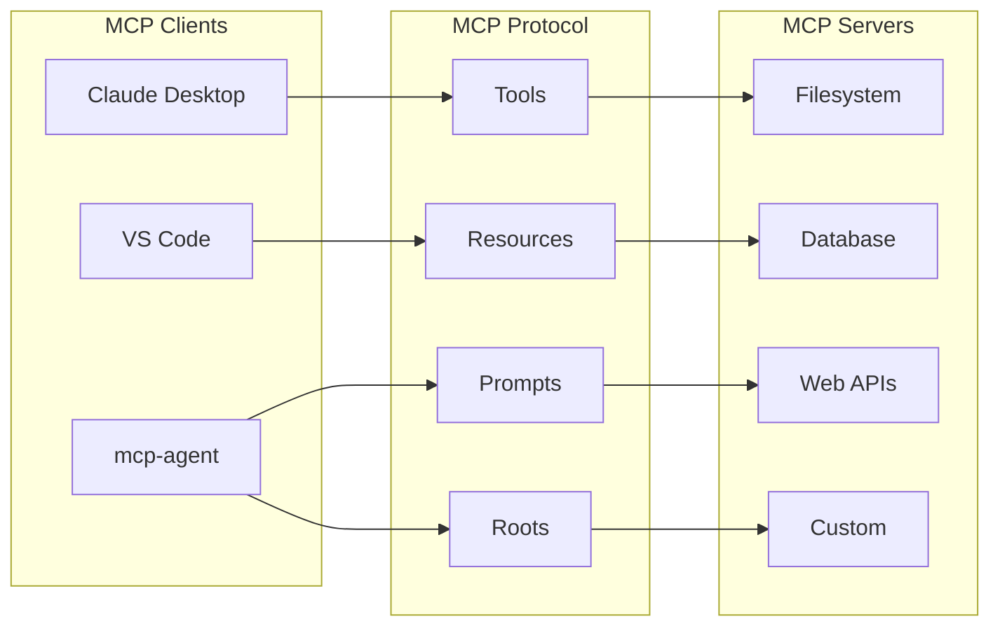

<Info>
  mcp-agent provides first-class support for all MCP primitives: tools, resources, prompts, and roots. This enables seamless integration with any MCP server and client.
</Info>

## Full MCP Protocol Support

mcp-agent is the only agent framework built specifically for the Model Context Protocol, supporting:

<CardGroup cols={2}>
  <Card title="Tools" icon="wrench" href="/concepts/mcp-primitives#tools">
    Execute functions and commands from MCP servers
  </Card>
  <Card title="Resources" icon="database" href="/concepts/mcp-primitives#resources">
    Access structured data and files via URIs
  </Card>
  <Card title="Prompts" icon="message" href="/concepts/mcp-primitives#prompts">
    Use and compose prompt templates from servers
  </Card>
  <Card title="Roots" icon="folder-tree" href="/concepts/mcp-primitives#roots-support">
    Browse and access file system directories
  </Card>
  <Card title="Transports" icon="plug" href="/concepts/mcp-primitives#transport-types">
    Support for stdio, SSE, WebSocket, and HTTP
  </Card>
  <Card title="Sampling" icon="sparkles" href="/concepts/mcp-primitives#primitive-support-matrix">
    Direct LLM sampling through MCP servers
  </Card>
</CardGroup>

## What is MCP?

The Model Context Protocol (MCP) is an open standard that enables seamless communication between:
- **MCP Clients**: Applications that use AI capabilities (Claude Desktop, VS Code, etc.)
- **MCP Servers**: Services that provide tools, data, and resources
- **AI Models**: LLMs that leverage MCP capabilities to perform tasks

### MCP Transport Examples

#### Server-Sent Events (SSE)


#### WebSocket Transport


#### SSE with Authentication Headers


<Frame>

</Frame>

## Using MCP in mcp-agent

### Connecting to MCP Servers

Configure MCP servers in your `mcp_agent.config.yaml`:

```yaml
mcp:
  servers:
    # Standard MCP server via stdio
    filesystem:
      command: "npx"
      args: ["-y", "@modelcontextprotocol/server-filesystem", "/data"]
    
    # Python MCP server
    database:
      command: "python"
      args: ["database_server.py"]
      env:
        DATABASE_URL: "postgresql://localhost/mydb"
    
    # Remote MCP server via HTTP
    api:
      transport: "http"
      url: "https://api.example.com/mcp"
      headers:
        Authorization: "Bearer ${API_TOKEN}"
```

### Accessing MCP Capabilities

Agents automatically get access to all MCP capabilities from connected servers:

```python
from mcp_agent.app import MCPApp
from mcp_agent.agents.agent import Agent

app = MCPApp(name="mcp_demo")

async def demonstrate_mcp():
    async with app.run():
        # Create agent with access to MCP servers
        agent = Agent(
            name="mcp_agent",
            instruction="Use all available MCP capabilities.",
            server_names=["filesystem", "database", "api"]
        )
        
        async with agent:
            # List available tools
            tools = await agent.list_tools()
            print(f"Available tools: {[t.name for t in tools.tools]}")
            
            # List available resources
            resources = await agent.list_resources()
            print(f"Available resources: {[r.uri for r in resources.resources]}")
            
            # List available prompts
            prompts = await agent.list_prompts()
            print(f"Available prompts: {[p.name for p in prompts.prompts]}")
            
            # List available roots
            roots = await agent.list_roots()
            print(f"Available roots: {[r.uri for r in roots.roots]}")
```

## MCP Primitives

### Tools

Tools are functions that agents can execute:

```python
# Call a tool from an MCP server
result = await agent.call_tool(
    "read_file",
    arguments={"path": "/data/config.json"}
)
print(f"File content: {result.content}")

# Tools are automatically available to LLMs
llm = await agent.attach_llm(OpenAIAugmentedLLM)
response = await llm.generate_str(
    "Read the config file and summarize its settings"
)
```

### Resources

Resources are structured data accessible via URIs:

```python
# Read a resource
resource = await agent.read_resource("file:///data/report.pdf")
print(f"Resource type: {resource.mimeType}")
print(f"Content: {resource.content}")

# Use resources as context
prompt_with_resource = await agent.create_prompt(
    prompt_name="analyze",
    arguments={"topic": "quarterly results"},
    resource_uri="file:///data/q3_report.pdf"
)
```

### Prompts

Prompts are reusable templates from MCP servers:

```python
# Get a prompt template
prompt = await agent.get_prompt(
    "code_review",
    arguments={"language": "python", "file": "main.py"}
)

# Use with LLM
llm = await agent.attach_llm(OpenAIAugmentedLLM)
response = await llm.generate_str(prompt.content)
```

### Roots

Roots provide file system access with proper permissions:

```python
# List files in a root
files = await agent.list_root_contents("workspace://project")

# Read file from root
content = await agent.read_root_file(
    "workspace://project/src/main.py"
)
```

## Transport Options

mcp-agent supports all MCP transport protocols:

### stdio (Standard I/O)

Default for local MCP servers:

```yaml
mcp:
  servers:
    local_server:
      command: "python"
      args: ["server.py"]
```

### Server-Sent Events (SSE)

For streaming connections:

```yaml
mcp:
  servers:
    sse_server:
      transport: "sse"
      url: "https://api.example.com/sse"
      headers:
        Authorization: "Bearer ${TOKEN}"
```

```python
# Connect to SSE server
from mcp_agent.mcp.sse_client import SSEServerParameters

server = SSEServerParameters(
    url="https://api.example.com/sse",
    headers={"Authorization": f"Bearer {token}"}
)
```

### WebSocket

For bidirectional streaming:

```yaml
mcp:
  servers:
    ws_server:
      transport: "websocket"
      url: "wss://api.example.com/mcp"
```

```python
# Connect to WebSocket server
from mcp_agent.mcp.websocket_client import WebSocketServerParameters

server = WebSocketServerParameters(
    url="wss://api.example.com/mcp",
    additional_headers={"X-API-Key": api_key}
)
```

### HTTP (RESTful)

For request-response communication:

```yaml
mcp:
  servers:
    http_server:
      transport: "http"
      url: "https://api.example.com/mcp"
      method: "POST"
      headers:
        Content-Type: "application/json"
```

```python
# Connect to HTTP server
from mcp_agent.mcp.http_client import HTTPServerParameters

server = HTTPServerParameters(
    url="https://api.example.com/mcp",
    method="POST",
    headers={"Authorization": f"Bearer {token}"}
)
```

## Real-World Examples

### Example: Document Analysis with Multiple MCP Servers

```python
from mcp_agent.app import MCPApp
from mcp_agent.agents.agent import Agent
from mcp_agent.workflows.llm.augmented_llm_openai import OpenAIAugmentedLLM

app = MCPApp(name="document_analyzer")

async def analyze_documents():
    async with app.run():
        # Create agent with access to multiple MCP servers
        agent = Agent(
            name="analyst",
            instruction="""You are a document analyst. 
            Use filesystem to read documents, 
            database to store findings, 
            and web APIs to enrich data.""",
            server_names=["filesystem", "postgres", "web_search"]
        )
        
        async with agent:
            llm = await agent.attach_llm(OpenAIAugmentedLLM)
            
            # Complex multi-step analysis using various MCP capabilities
            result = await llm.generate_str("""
                1. Read all PDF files in /documents folder
                2. Extract key metrics from each document
                3. Store findings in the analysis_results table
                4. Search web for industry benchmarks
                5. Generate comparative analysis report
            """)
            
            print(result)
```

### Example: Using Resources and Prompts Together

```python
async def combined_mcp_features():
    async with app.run():
        agent = Agent(
            name="researcher",
            server_names=["research_server"]
        )
        
        async with agent:
            # Get prompt template with embedded resource
            analysis = await agent.create_prompt(
                prompt_name="analyze_with_context",
                arguments={"style": "detailed"},
                resource_uri="research://papers/latest.pdf"
            )
            
            # The prompt now includes the resource content
            llm = await agent.attach_llm(OpenAIAugmentedLLM)
            result = await llm.generate_str(analysis)
            
            return result
```

### Example: Multi-Transport Setup

```python
# Configure multiple transports
app = MCPApp(
    name="multi_transport",
    settings=Settings(
        mcp=MCPSettings(
            servers={
                # Local stdio server
                "local": MCPServerSettings(
                    command="python",
                    args=["local_server.py"]
                ),
                # Remote SSE server
                "cloud": SSEServerParameters(
                    url="https://cloud.example.com/sse",
                    headers={"Authorization": "Bearer token"}
                ),
                # WebSocket server
                "realtime": WebSocketServerParameters(
                    url="wss://realtime.example.com/mcp"
                )
            }
        )
    )
)

async def use_all_transports():
    async with app.run():
        agent = Agent(
            name="multi",
            server_names=["local", "cloud", "realtime"]
        )
        
        async with agent:
            # All servers work seamlessly together
            tools = await agent.list_tools()
            print(f"Tools from all servers: {len(tools.tools)}")
```

## Advanced MCP Features

### Dynamic Server Connection

Connect to MCP servers at runtime:

```python
from mcp_agent.mcp.gen_client import gen_client

async def connect_dynamically():
    # Connect to server not in config
    async with gen_client("dynamic_server", {
        "command": "npx",
        "args": ["@modelcontextprotocol/server-everything"]
    }) as server:
        tools = await server.list_tools()
        result = await server.call_tool(
            "example_tool",
            arguments={"param": "value"}
        )
```

### Custom MCP Server Implementation

Create your own MCP server:

```python
from mcp.server import Server
from mcp.server.stdio import stdio_server

app = Server("custom_server")

@app.tool()
async def custom_tool(query: str) -> str:
    """A custom tool for your agent."""
    return f"Processed: {query}"

@app.resource("custom://data/{id}")
async def get_data(uri: str) -> dict:
    """Provide custom resources."""
    return {"uri": uri, "content": "data"}

@app.prompt()
async def custom_prompt(topic: str) -> str:
    """Generate custom prompts."""
    return f"Analyze the following topic thoroughly: {topic}"

# Run server
if __name__ == "__main__":
    stdio_server(app).run()
```

### MCP Server Discovery

Discover and connect to MCP servers dynamically:

```python
async def discover_servers():
    # Scan for available MCP servers
    servers = await scan_for_mcp_servers(
        port_range=(5000, 6000),
        timeout=5
    )
    
    for server_info in servers:
        print(f"Found: {server_info.name} at {server_info.url}")
        
        # Connect and explore
        async with gen_client(server_info.name, server_info.params) as server:
            tools = await server.list_tools()
            print(f"  Tools: {[t.name for t in tools.tools]}")
```

## Best Practices

<AccordionGroup>
  <Accordion title="Server Configuration">
    - Use environment variables for sensitive data
    - Set appropriate timeouts for remote servers
    - Group related servers logically
    - Document server requirements clearly
  </Accordion>
  
  <Accordion title="Error Handling">
    Always handle MCP connection failures gracefully:
    ```python
    try:
        async with agent:
            result = await agent.call_tool("risky_tool", {})
    except MCPConnectionError as e:
        logger.error(f"MCP server unavailable: {e}")
        # Fallback logic
    except MCPToolError as e:
        logger.error(f"Tool execution failed: {e}")
        # Recovery logic
    ```
  </Accordion>
  
  <Accordion title="Performance">
    - Use connection pooling for HTTP/WebSocket transports
    - Cache frequently accessed resources
    - Batch tool calls when possible
    - Monitor server response times
  </Accordion>
  
  <Accordion title="Security">
    - Always use authentication for remote servers
    - Validate server certificates for HTTPS/WSS
    - Restrict file system access with roots
    - Audit tool usage and access patterns
  </Accordion>
</AccordionGroup>

## Ecosystem Integration

mcp-agent works with the entire MCP ecosystem:

<CardGroup cols={2}>
  <Card 
    title="Official MCP Servers" 
    icon="server"
    href="https://github.com/modelcontextprotocol/servers"
  >
    Filesystem, Git, Postgres, and more
  </Card>
  <Card 
    title="Community Servers" 
    icon="users"
    href="https://github.com/punkpeye/awesome-mcp-servers"
  >
    100+ community MCP servers
  </Card>
  <Card 
    title="Build Your Own" 
    icon="hammer"
    href="https://modelcontextprotocol.io/docs/server"
  >
    Create custom MCP servers
  </Card>
  <Card 
    title="MCP Inspector" 
    icon="magnifying-glass"
    href="https://github.com/modelcontextprotocol/inspector"
  >
    Debug and test MCP servers
  </Card>
</CardGroup>

## Next Steps

<CardGroup cols={2}>
  <Card title="MCP Primitives" icon="cube" href="/concepts/mcp-primitives">
    Deep dive into all MCP primitives
  </Card>
  <Card title="Configuration" icon="gear" href="/configuration">
    Configure MCP servers in your agent
  </Card>
  <Card title="Agent Server" icon="server" href="/cloud/agent-server">
    Deploy agents as MCP servers
  </Card>
  <Card title="Examples" icon="code" href="https://github.com/lastmile-ai/mcp-agent/tree/main/examples/mcp">
    Complete MCP examples
  </Card>
</CardGroup>