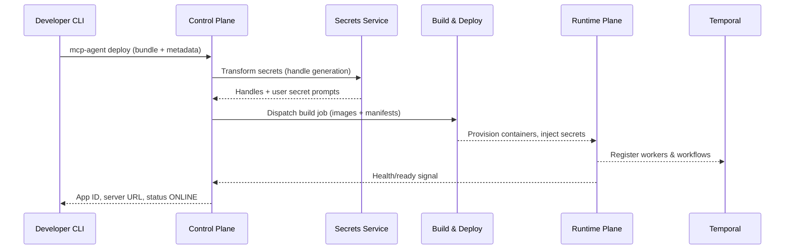

This page expands on the managed architecture that powers `mcp-agent cloud`. Use it to understand deployment flows, security boundaries, and the runtime environment your code executes inside.

## High-level layout

The environment is split into three planes:

| Plane | Responsibilities |
| --- | --- |
| **Control plane** | CLI/API ingress, bundle processing, secrets management, permission checks, deployment orchestration. |
| **Runtime (userspace)** | Dedicated container instance per deployment hosting the MCPApp and any declared stdio MCP servers. Connects to Temporal and logging/metrics pipelines. |
| **Temporal plane** | Multi-role Temporal cluster (frontend, history, matching) backed by RDS for durability. Handles workflow scheduling, state persistence, and task queues. |

### Control plane

- **Deployment service** – receives bundles from `mcp-agent deploy`, validates manifests, resolves dependencies, and produces container images.
- **Secrets service** – encrypts deployment secrets and stores handles returned to your app via `mcp_agent.deployed.secrets.yaml`. `mcp-agent cloud configure` interacts with the same service to capture user-provided secrets.
- **Auth service** – issues API keys (`mcp-agent login`) and will host the OAuth 2.1 authorization server described in the [Authentication design](https://github.com/lastmile-ai/lm/docs-revamp/blob/main/mcp-agent9/docs/cloud/authentication/overview.mdx) (Beta).
- **Artifact store** – versioned bundles and metadata (git commit, description, ignore patterns). The same bundle can be replayed to recreate deployments.

### Runtime plane

- **MCP application container** – runs your `main.py` and exposes the MCP transport (SSE + HTTP). The container boots the `MCPApp`, loads secrets, and registers workflows/tool definitions with FastMCP.
- **Stdio MCP server containers** – every entry in `mcp_agent.config.yaml -> mcp.servers` becomes a sidecar container. We currently support Python (`uvx`), Node (`npx`), and any binary accessible via command/args.
- **Envoy router** – mediates outbound requests to Temporal, logging services, and other managed APIs. This allows features like environment-wide header injection and future policy enforcement.
- **Temporal worker** – the MCPApp process hosts the Temporal worker; it polls the shared task queue defined in `mcp_agent.config.yaml` (`temporal.task_queue`) and executes workflows.
- **Observability agents** – Fluent Bit forwards structured logs; OTEL collectors batch traces. You can override endpoints via `mcp-agent cloud logger configure`.

### Temporal plane

- **Multi-role cluster** – uses ECS (or Kubernetes) to run Temporal frontend, history, matching, and worker services with service discovery.
- **RDS** – stores workflow state, task queues, and visibility history. Backups and retention policies are managed centrally.
- **Internal auth** – the Temporal frontend is behind an auth proxy. Runtime containers use short-lived credentials issued by the control plane when deployments start.
- **Notifications** – Temporal emits events for workflow state changes; these feed into future dashboard features and CLI improvements.

## Request flow (MCP client → deployed app)

1. An MCP client (Claude Desktop, Cursor, ChatGPT Apps, custom SSE) connects to `https://<app>.deployments.mcp-agent.com/<transport>` with the configured auth mode.
2. Edge services terminate TLS, validate bearer tokens or OAuth claims, and route traffic to the user runtime.
3. FastMCP inside your container invokes the requested tool or workflow. `@app.tool` handlers return immediately; `@app.async_tool` handlers start a Temporal workflow.
4. The runtime interacts with stdio MCP servers or external APIs as defined in your config. Secrets are available via environment variables or the config object.
5. Results stream back to the client through SSE or HTTP responses. Long-running workflows return `run_id`s which clients poll via `workflows-get_status`.

## Deployment flow (CLI → control plane)

### Bundling specifics

- Uses git metadata when available (`branch`, `commit`, optional `--git-tag`).
- Honors `.mcpacignore` (gitignore syntax). Precedence: `--ignore-file`, then `<config-dir>/.mcpacignore`, then `cwd/.mcpacignore`.
- Embeds `mcp_agent.deployed.secrets.yaml` instead of the raw secrets file.
- Includes `pyproject.toml`, `requirements.txt`, and any other files referenced at runtime (static assets, prompts, etc.).

## Security considerations

- **Network isolation** – runtime containers run in per-tenant subnets; inter-deployment access is blocked by default.
- **Secrets at rest** – encrypted using envelope encryption; only decrypted inside the runtime at startup.
- **Auditability** – all CLI and API calls are logged (coming soon to the user-facing console).
- **Future OAuth** – the upcoming OAuth implementation follows the MCP Authorization spec (RFC 9728) with dynamic client registration and token introspection (`/.well-known/oauth-authorization-server`, `/oauth2/authorize`, `/token`).

## Roadmap highlights

- Web console for deployment management (list, metrics, publish to marketplace).
- Native Temporal trace viewer and workflow search.
- First-class support for publishing public MCP servers with usage analytics.
- Expanded deployment regions and VPC peering for enterprise integrations.

## Related pages

- [Cloud overview →](/cloud/mcp-agent-cloud/overview)
- [Secrets & credential management →](/cloud/mcp-agent-cloud/manage-secrets)
- [Long-running tools & workflows →](/cloud/mcp-agent-cloud/long-running-tools)
- [Authentication modes →](/cloud/authentication/overview)
