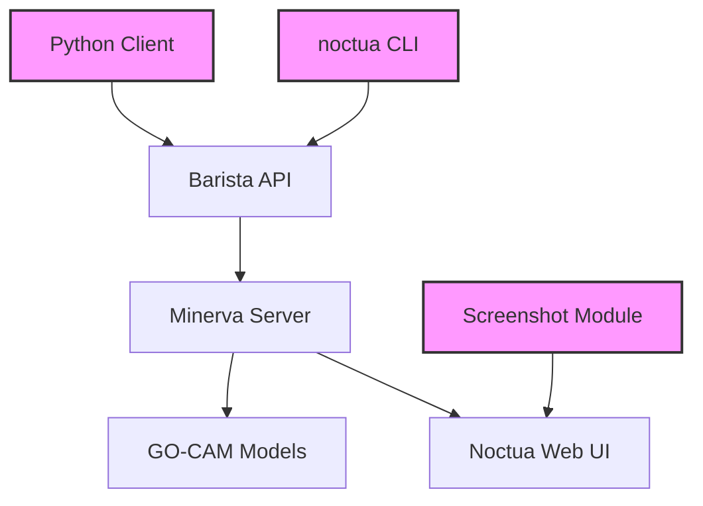

# noctua-py

**Python tools for programmatically manipulating GO-CAM models**

[](https://pypi.org/project/noctua-py/)
[](https://opensource.org/licenses/Apache-2.0)
[](https://geneontology.github.io/noctua-py)

## Overview

`noctua-py` provides a Python library and command-line interface for programmatically creating, modifying, and exporting Gene Ontology Causal Activity Models (GO-CAMs) via the Noctua/Minerva/Barista API stack.

### Key Features

- 🔧 **Full CRUD Operations** - Create, read, update, and delete GO-CAM models
- 🐍 **Python API** - Clean, type-hinted Python interface
- 💻 **CLI Tools** - Command-line interface for all operations
- 📸 **Visual Documentation** - Automatic screenshot capture of Noctua UI
- 📊 **Multiple Export Formats** - Native Minerva JSON, GO-CAM JSON, and YAML
- 🔒 **Safe Defaults** - Uses development server by default to prevent accidental production changes
- 🏷️ **Variable Tracking** - Use simple variable names instead of complex IDs when building models

## What is GO-CAM?

GO-CAM (Gene Ontology Causal Activity Model) is a framework for representing biological pathways and systems. Models consist of:

- **Molecular Activities** - What molecules do (molecular functions)
- **Biological Processes** - Larger biological programs activities contribute to
- **Causal Relationships** - How activities influence each other
- **Evidence** - Supporting data from experiments and literature

## Quick Example

```python
from noctua import BaristaClient

# Create a client (uses dev server by default)
client = BaristaClient()

# Create a new model
response = client.create_model(title="My Pathway Model")
model_id = response.model_id

# Add molecular activities with variable names
client.add_individual(model_id, "GO:0003924", assign_var="gtpase")
client.add_individual(model_id, "GO:0004674", assign_var="kinase")

# Create causal relationship using variable names!
client.add_fact(model_id, "gtpase", "kinase", "RO:0002413")  # directly activates

# Export the model
model = client.get_model(model_id)
print(f"Created model with {len(model.individuals)} individuals")
```

## Installation

```bash
pip install noctua-py
```

Or with [uv](https://github.com/astral-sh/uv):

```bash
uv add noctua-py
```

## Documentation

- [Getting Started](getting-started/installation.md) - Installation and setup
- [User Guide](guide/python-api.md) - Detailed usage instructions
- [API Reference](api/barista.md) - Complete API documentation
- [Examples](examples/noctua_demo.ipynb) - Jupyter notebooks with working examples

## Architecture



## Project Status

This project is actively maintained by the Gene Ontology Consortium. It serves as a programmatic interface to the same backend used by the Noctua web editor.

## Links

- [GitHub Repository](https://github.com/geneontology/noctua-py)
- [PyPI Package](https://pypi.org/project/noctua-py/)
- [Gene Ontology](http://geneontology.org)
- [Noctua Editor](http://noctua.geneontology.org)
- [GO-CAM Documentation](http://geneontology.org/docs/gocam-overview/)

