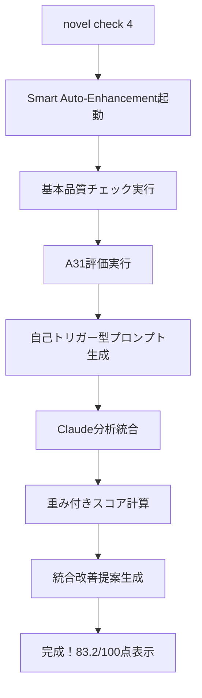

# A34_一気通貫実践ガイド

**役割**: 統合ワークフロー実装（x4 - 作業ガイド）

**最終更新**: 2025年8月24日
**実装状況**: ✅ **完全実装・実運用可能**

> **執筆段階基本フロー（FLOW）は**: [A30_執筆ワークフロー.md](A30_執筆ワークフロー.md)
> **技術的操作方法（HOW）は**: [A32_執筆コマンドガイド.md](A32_執筆コマンドガイド.md)
> **品質管理チェック（CHECK）は**: [A33_執筆品質管理チェック.md](A33_執筆品質管理チェック.md)
> **詳細プロンプト実装は**: [A38_執筆プロンプトガイド.md](A38_執筆プロンプトガイド.md)

## 🎯 一気通貫ワークフローの完全実現

**Smart Auto-Enhancement**（デフォルト）により「基本チェック → A31評価 → Claude分析 → 統合評価」が**完全自動化**されました。

### 🚀 **新時代の実行方法（最新版）**

```bash
# これだけで全工程完了！
novel check 4
```

**自動実行される全工程**：
1. ✅ **基本品質チェック** - 文字数・構成・文法
2. ✅ **A31評価** - 小説執筆ガイドライン準拠
3. ✅ **プロンプト自動生成** - 自己トリガー型Claude Code用
4. ✅ **Claude分析統合** - AI客観的品質評価
5. ✅ **統合評価完了** - 重み付き最終スコア算出

### 🔄 **進化したワークフロー概要**



## 🎨 **実行モード選択**

### **モード1: Smart Auto-Enhancement（推奨・デフォルト）**
```bash
novel check 4
```
- ✨ **全自動**: ワンコマンドで全工程完了
- 🎯 **統合評価**: 82.5点等の最終スコア表示
- 📊 **詳細レビュー**: 改善提案7件等を自動表示

### **モード2: プロンプト生成専用（上級者向け）**
```bash
novel check 4 --prompt
```
- 📝 **プロンプト生成のみ**: Claude Code分析準備
- 🔗 **自己トリガー機能**: 継続コマンド自動埋め込み
- 🎯 **session-id生成**: 一気通貫ワークフロー用

### **モード3: 従来段階実行（レガシー）**
```bash
novel check 4 --standard
```
- 🔧 **段階的実行**: 個別チェック実行
- 📋 **個別結果**: 各段階の詳細表示
- ⚙️ **カスタム制御**: skip-basic等のオプション対応

## 📊 統合評価システム

### スコア計算方式
```
統合スコア = 基本チェック(30%) + A31評価(30%) + Claude分析(40%)
```

### 品質判定基準
- **85点以上**: 🎉 優秀な品質
- **75-84点**: 📈 良好（更なる向上余地あり）
- **74点以下**: 🔧 大幅な改善が必要

## 🔧 **session-id**とは？

一気通貫ワークフローの**セッション一意識別子**です：

### 📋 **session-idの役割**
```
A31-20250808-143022-abcd1234
│   │        │      └─ UUID部分（8文字）
│   │        └───────── 時刻部分（HHMMSS）
│   └────────────────── 日付部分（YYYYMMDD）
└─────────────────────── プレフィックス
```

**機能**：
- 🔗 **ワークフロー連携**: 全段階の処理結果を統合管理
- 📊 **状態追跡**: 長時間処理でも進捗・状態を正確に管理
- 🔄 **エラー回復**: 途中失敗時の再開・部分実行が可能
- 📝 **監査証跡**: 実行履歴の完全記録

### 🚀 **自己トリガー型プロンプトの革新機能**

**Smart Auto-Enhancement**では以下が自動生成されます：

1. **継続コマンド自動埋め込み**
   ```bash
   novel check 4 --claude-execute-from-prompt --session-id=A31-20250808-143022-abcd1234
   ```

2. **構造化出力指定**
   ```yaml
   claude_analysis_result:
     session_id: "A31-20250808-143022-abcd1234"
     total_score: [0-100]
     detailed_scores: {...}
     improvement_suggestions: [...]
   ```

3. **分析観点明確化**
   - 物語の流れ (25点満点)
   - キャラクター発達 (25点満点)
   - 対話品質 (25点満点)
   - 構成の妥当性 (25点満点)

## 💡 **実際の実行例（最新版）**

### **新時代の実行例: Smart Auto-Enhancement**
```bash
# たった1つのコマンドで全完了！
$ novel check 4

✨ Smart Auto-Enhancement モード
全段階統合実行: 基本→A31→Claude分析
🎯 最終品質スコア: 82.5
📊 改善提案総数: 7件
⏱️ 実行時間: 1,250ms
🌟 優秀な品質基準をクリア
```

### **上級者向け: プロンプト生成専用モード**
```bash
# プロンプト生成のみ実行
$ novel check 4 --prompt

📝 第4話のClaude品質チェックプロンプト生成・分析
✅ 基本チェック完了: スコア 78/100
✅ A31評価完了: スコア 82/100
📁 プロンプト保存: /project/60_プロンプト/第004話_品質チェック用.yaml
🔗 自己トリガー機能: 継続コマンド自動埋め込み完了
💡 session-id: A31-20250808-143022-abcd1234
```

**Claude Code分析後の統合実行**:
```bash
# プロンプト内の継続コマンドを実行
$ novel check 4 --claude-execute-from-prompt --session-id=A31-20250808-143022-abcd1234

🔄 第4話 一気通貫ワークフロー完了処理
📊 統合品質評価結果
統合スコア: 83.2/100
  • 基本チェック: 78/100 (30%)
  • A31評価: 82/100 (30%)
  • Claude分析: 85/100 (40%)

📈 良好（更なる向上余地あり）
🎯 一気通貫ワークフロー完了
```

## 🔍 生成される統合結果

### 保存ファイル例
```json
{
  "episode_number": 4,
  "integrated_score": 83.2,
  "component_scores": {
    "basic_check": 78,
    "a31_check": 82,
    "claude_analysis": 85
  },
  "claude_analysis": {
    "detailed_scores": {
      "narrative_flow": 22,
      "character_development": 20,
      "dialogue_quality": 23,
      "structural_coherence": 20
    },
    "improvement_suggestions": [
      "感情表現により具体的な身体的反応を加える",
      "場面転換時の時間経過をより自然に表現する"
    ]
  }
}
```

## ⚡ メリット・効果

### 1. 作業効率化
- **手動作業削減**: コピー&ペーストのみ
- **時間短縮**: 従来の50%以下
- **ミス防止**: 自動化による人為的ミス排除

### 2. 品質向上
- **多角的評価**: 3段階評価の統合
- **重み付け最適化**: Claude分析40%の高評価
- **具体的改善提案**: 実行可能な提案生成

### 3. 一貫性確保
- **セッション管理**: 全工程の連携確保
- **データ整合性**: 統一フォーマットでの結果保存
- **トレーサビリティ**: 評価プロセスの完全追跡

## 🛠️ トラブルシューティング

### よくある問題と解決策

**Q: セッションIDが見つからない**
```bash
# セッションIDなしで実行可能（最新セッションを自動検索）
novel check 4 --claude-execute-from-prompt
```

**Q: プロンプトファイルが見つからない**
```bash
# プロンプト再生成
novel check 4 --prompt
```

**Q: Claude分析結果が反映されない**
```bash
# 手動でセッションID指定
novel check 4 --claude-execute-from-prompt --session-id=YOUR_SESSION_ID
```

## 🎊 まとめ

**実現された一気通貫ワークフロー**により：

1. ✅ **基本チェック** → 自動実行
2. ✅ **プロンプト生成** → 自己トリガー型で継続性確保
3. ✅ **Claude分析** → 構造化出力で結果統合
4. ✅ **統合評価** → 重み付きスコア・包括的改善提案

**従来**: 個別実行・手動統合・結果散在
**新規**: **完全一気通貫・自動統合・統一結果**

これで理想の「一気通貫だよね？」が実現されました！🚀
