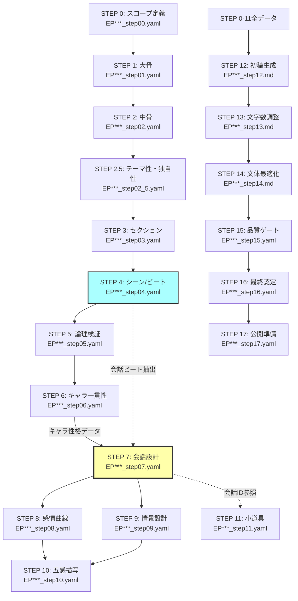

# A38 執筆プロンプトガイド

**役割**: AI構造設計プロンプト統合マスター（x8 - 詳細作業ガイド）

**Version**: 5.4.0-unified
**Last Updated**: 2025-09-06
**Type**: 統合版プロンプトシステム（コア実行+リファレンス+品質基準+統合管理）
**Changes**: STEP 2.5「テーマ性・独自性検証」追加、Golden Sample比較システム実装

> **基本ワークフロー（WHEN - いつ使うか）は**: [A30_執筆ワークフロー.md](A30_執筆ワークフロー.md)
> **技術的操作方法（HOW）は**: [A32_執筆コマンドガイド.md](A32_執筆コマンドガイド.md)
> **品質管理チェック（CHECK）は**: [A33_執筆品質管理チェック.md](A33_執筆品質管理チェック.md)

このドキュメントは、話別プロットをもとに、コピペで即実行可能なプロンプト集です。構造設計から品質評価まで、一気通貫の執筆支援システムを提供します。

## 🗺️ STEP間依存関係図



**凡例**:
- 実線矢印（→）: 直接依存（前STEPの完了が必須）
- 点線矢印（-.->）: 参照依存（特定データ項目のみ参照）
- 太線矢印（==>）: 統合依存（全STEPのデータを統合）

**厳守事項**:
- 効率を重視せず、設計意図通りに着実に各ステップ（5-9）を実行すること
- A30_執筆ワークフロー.mdの品質判定基準に準拠すること
- 各段階での相互参照機能を積極的に活用すること

---

## 📋 統合目次

### [実行前準備](#実行前準備)
- [必須フォルダ構造](#必須フォルダ構造)
- [ファイル命名規則](#ファイル命名規則)
- [文字数カウント仕様](#文字数カウント仕様)

### [構造設計フェーズ（STEP 0-9）](#構造設計フェーズstep-0-9)
- [STEP 0: スコープ定義](#step-0スコープ定義準備)
- [STEP 1: 大骨（章の目的線）](#step-1大骨章の目的線)
- [STEP 2: 中骨（段階目標）](#step-2中骨段階目標行動フェーズ)
- [STEP 2.5: テーマ性・独自性検証](#step-25テーマ性独自性検証)
- [STEP 3: セクションバランス設計](#step-3セクションバランス設計文字数配分最適化)
- [STEP 4: 小骨（シーン／ビート）](#step-4小骨シーンビート)
- [STEP 5: 論理検証](#step-5論理検証因果動機整合)
- [STEP 6: キャラクター一貫性検証](#step-6キャラクター一貫性検証性格行動パターン検証)
- [STEP 7: 会話設計](#step-7会話設計目的駆動の台詞キャラクター個性強化)
- [STEP 8: 感情曲線](#step-8肉付け-内面感情曲線表現バリエーション強化)
- [STEP 9: 情景・五感・世界観](#step-9肉付け-情景五感小道具世界観段階開示計画付き)

### [執筆実装フェーズ（STEP 10-15）](#執筆実装フェーズstep-10-15)
- [STEP 10: 初稿生成](#step-10初稿生成品質優先直説説明ガード)
- [STEP 11: 文字数最適化](#step-11文字数最適化)
- [STEP 12: 文体・可読性パス](#step-12文体可読性パスなろう最適化ハード制約)
- [STEP 13: 必須品質ゲート](#step-13必須品質ゲートkpi数値判定)
- [STEP 14: 最終品質認定](#step-14dod--kpi統合品質認定)
- [STEP 15: 公開準備](#step-15公開準備)

### [表現リファレンス](#表現リファレンス)
- [Golden Sample文体パターン集](#golden-sample文体パターン集)
- [感情表現ライブラリ](#感情表現ライブラリ)
- [会話自然化変換テーブル](#会話自然化変換テーブル)
- [禁止表現リスト](#禁止表現リスト)
- [冒頭3行フックテンプレ](#冒頭3行フックテンプレ)
- [Scene→Sequelテンプレ](#scene→sequelテンプレ)
 - [会話ビート抽出テンプレ](#会話ビート抽出テンプレ)
 - [章末クリフハンガー設計テンプレ](#章末クリフハンガー設計テンプレ)

### [品質評価基準](#品質評価基準)
- [基本KPI（必須4項目）](#基本kpi必須4項目)
- [品質評価システム](#品質評価システム)
- [統合品質スコア計算](#統合品質スコア計算)

---

## 実行前準備

### 必須フォルダ構造
以下のフォルダ構造が事前に存在している必要があります：

```
{PROJECT_ROOT}/
├── 20_プロット/
│   ├── 話別プロット/     # ep{episode_number:%03d}.yaml
│   └── 章別プロット/     # ch{chapter_number:02d}.yaml
├── 30_設定集/
│   ├── キャラクター.yaml           # A22ガイド準拠
│   ├── キャラクター成長履歴.yaml   # テンプレートからコピー作成
│   └── 世界観.yaml                # A20ガイド準拠
└── 60_作業ファイル/      # 各STEP生成ファイル格納
```

### ファイル命名規則

**統一命名パターン（全STEP共通）:**
- `EP{episode_number:03d}_step{step_number:02d}.{ext}`
- 例: `EP001_step00.yaml`, `EP001_step12.md`

**拡張子ルール:**
- STEP 0-11: `.yaml` (構造化データ)
- STEP 12-14: `.md` (原稿テキスト)
- STEP 15-17: `.yaml` (品質評価データ)

### ID体系用語定義

**会話ID構成要素:**
- **EP (Episode)**: エピソード番号（3桁ゼロパディング）
  - 例: `EP001` = 第1話、`EP023` = 第23話
- **SC (Scene)**: シーン番号（2桁、エピソード内でリセット）
  - 例: `SC01` = シーン1、`SC12` = シーン12
- **DL (Dialogue)**: ダイアローグ（会話）番号（3桁、シーン内で連番）
  - 例: `DL001` = 会話1、`DL023` = 会話23
  - 注: `DL000`は特殊値（null参照や会話開始前状態）として予約

**完全ID形式:**
- 形式: `EP{episode:03d}-SC{scene:02d}-DL{dialogue:03d}`
- 例: `EP001-SC01-DL001` = 「第1話、シーン1、会話1」
- 用途: 小説全体でユニークな会話識別子として使用

### 文字数カウント仕様

**⚠️ 重要**: A38で「8000字以上」と記載する「字数」は**日本語Unicode文字数**を指します。

**正しいカウント方式**:
- **日本語文字**: `あ`=1文字, `漢`=1文字, `ア`=1文字
- **英数字**: `A`=1文字, `1`=1文字, `!`=1文字
- **句読点**: `。`=1文字, `、`=1文字, `？`=1文字
- **空白・改行**: `　`=1文字, `\n`=1文字

---

## 📝 全STEP共通出力仕様

以下の仕様は全STEPで共通です。各STEPではこの仕様に準拠して出力してください。

### 出力形式
| STEP範囲 | 出力形式 | 拡張子 |
|----------|---------|--------|
| STEP 0-11 | YAML形式 | .yaml |
| STEP 12-14 | Markdown形式（原稿） | .md |
| STEP 15-17 | YAML形式（評価データ） | .yaml |

### 出力方法
- **すべてのSTEP**: Markdownコードブロック内に完全な構造で記述
- **YAML出力時**: 構文エラーがないことを確認
- **Markdown出力時**: 適切な改行と段落構成を維持

### ファイル保存規則
- **保存先ディレクトリ**: `{project_root}/60_作業ファイル/`
- **命名規則**: `EP{episode_number:03d}_step{step_number:02d}.{ext}`
- **例**: `EP001_step00.yaml`, `EP001_step12.md`

### 共通チェック項目
- [ ] 出力形式が指定通りか（YAML/Markdown）
- [ ] ファイル名が命名規則に従っているか
- [ ] YAML構文が正しく、パース可能か
- [ ] 必須項目がすべて含まれているか

---

## 構造設計フェーズ（STEP 0-9）

### STEP 0：スコープ定義（準備）

#### 📌 依存関係明示
**前提STEP**: なし（起点）
**必要データ**:
- 話別プロット: `{project_root}/20_プロット/話別プロット/ep{episode_number:03d}.yaml`
- キャラクター設定集: `{project_root}/30_設定集/キャラクター*.yaml`
- 世界観設定: `{project_root}/30_設定集/世界観.yaml`

**出力データ**:
- ファイル: `EP{episode_number:03d}_step00.yaml`
- 後続STEP参照項目: `scope_definition`（全体）

```
あなたは `Project Scope Definer`（スコープ定義者）です。
Web小説「なろう」向けのエピソードについて、執筆前の基本設定と制約条件を明確化し、その結果をファイルに保存をお願いします。
その後、チェックリストの各項目の基準を満たしているか確認し、不合格があれば修正して再出力をお願いします。

**インプット**
* 前話エピソードファイル（`{project_root}/20_プロット/話別プロット/ep{episode_number:03d}.yaml`）
* A28拡張データ（ある場合）: 伏線追跡・シーン管理・感情技術融合・読者反応予測等

**作業内容**
1. プロット上の位置付けを明確化すること：
   * 章全体での役割（導入/展開/転換/結末）
   * 物語全体での重要度（メイン/サブ/補完）
   * 前後エピソードとの関係性
2. 前話との接続を設計すること：
   * 前話の終わり方の確認
   * 引き継ぐべき要素の特定
   * 継続性を保つ要素（感情・状況・キャラ状態）
3. 今話の必達目標を設定すること：
   * プロット上達成すべき具体的目標
   * キャラクター成長の目標
   * 読者に与えたい体験・感情
4. 制約条件を設定すること：
   * 文字数制限：8000字以上（なろう最適）
   * 技術的制約（視点・文体等）
5. A28拡張データを活用すること（ある場合）：
   * `foreshadowing_tracker`: 伏線情報をSTEP 4シーン設計で活用
   * `scene_structure`: 重要度ランクをSTEP 3セクション設計で参照
   * `emotion_tech_fusion`: 感情×技術融合ポイントをSTEP 8で活用
   * `reader_response_prediction`: 読者反応予測をSTEP 13品質ゲートで検証
   * `word_count_allocation`: 文字数配分をSTEP 3で基準として使用

**出力**
* 形式: YAML（共通仕様準拠）
* ファイル: `EP{episode_number:03d}_step00.yaml`
**自己検証チェックリスト**
* [ ] プロット上の位置付けが3項目すべて明確に定義されているか
* [ ] 前話との接続が具体的に設計されているか
* [ ] 必達目標が定量的・検証可能に設定されているか
* [ ] 制約条件が現実的で達成可能に設定されているか
* [ ] A28拡張データがある場合、各STEPでの活用方法が明確化されているか
```

### STEP 1：大骨（章の目的線）

#### 📌 依存関係明示
**前提STEP**: STEP 0
**必要データ**:
- スコープ定義: `EP{episode_number:03d}_step00.yaml`の全体
- 章別プロット: `{project_root}/20_プロット/章別プロット/ch{chapter_number:02d}.yaml`

**出力データ**:
- ファイル: `EP{episode_number:03d}_step01.yaml`
- 後続STEP参照項目: `story_structure.start_state`, `story_structure.end_state`

```
あなたは `Story Structure Designer`（物語構造設計者）です。
第EP{episode_number:03d}話の物語の背骨となる大骨構造を設計し、話全体の方向性と変化を明確化し、その結果をファイルに保存をお願いします。
その後、チェックリストの各項目の基準を満たしているか確認し、不合格があれば修正して再出力をお願いします。

**インプット**
* STEP 0で作成したスコープ定義ファイル: `{project_root}/60_作業ファイル/EP{episode_number:03d}_step00.yaml`
* 章別プロットファイル: `{project_root}/20_プロット/章別プロット/ch{chapter_number:02d}.yaml`
* キャラクター設定ファイル:`{project_root}/30_設定集/キャラクター*.yaml`

**作業内容**
1. 開始状態を定義すること：
   * 主人公の内面状態（感情・認識・目標）
   * **承認欲求表現密度**：1000字あたりの承認欲求描写数
     - 低密度：0-2箇所/1000字（控えめな主人公）
     - 中密度：3-5箇所/1000字（バランス型）
     - 高密度：6箇所以上/1000字（承認に飢えた状態）
   * 主人公の外面状況（立場・環境・関係性）
   * 周囲の状況（世界・他キャラの状態）
2. 終了状態を設計すること：
   * 開始状態からの変化（内面・外面・関係性）
   * **承認獲得の具体的描写**：
     - 獲得した承認の種類（直接的賞賛/間接的評価/自己承認）
     - 承認の提供者（上位者/同輩/下位者/読者）
     - 承認の影響（行動変化/内面変化/関係性変化）
   * 達成される目標と残される課題
   * 次話への引き継ぎ要素
3. 主軸（メインプロット）を設計すること：
   * 話の中心となる出来事・事件
   * プロット進行のための重要な決断・行動
   * 物語全体への影響度
4. 副軸（サブプロット）を設計すること：
   * 主軸を支える副次的な展開
   * キャラクター関係性の変化
   * 世界観の補完・深化要素
5. 感情の山場を配置すること：
   * 読者の感情が最も動く瞬間の設定
   * **承認の振幅**：最低谷（否定・拒絶）から最高峰（承認・称賛）への感情変化幅
   * 山場の種類（感動/驚き/緊張/安堵等）
   * 配置位置（後半2/3推奨）

**出力**
* 形式: YAML（共通仕様準拠）
* ファイル: `EP{episode_number:03d}_step01.yaml`
**自己検証チェックリスト**
* [ ] 開始状態と終了状態で明確かつ意味のある変化が設計されているか
* [ ] 主軸と副軸のバランスが適切（主軸60-70%、副軸30-40%）か
* [ ] 感情の山場が効果的な位置（後半2/3）に配置されているか
* [ ] 5要素すべてが相互に整合性を持って設計されているか
* [ ] 次話への自然な引き継ぎが考慮されているか
```

### STEP 2：中骨（段階目標・行動フェーズ）

```
あなたは `Phase Structure Designer`（段階構造設計者）です。
STEP 1で設計した大骨を4-6つの実行可能なフェーズに分解し、各段階の目標と行動を明確化した結果をファイルに保存をお願いします。
その後、チェックリストの各項目の基準を満たしているか確認し、不合格があれば修正して再出力をお願いします。

**インプット**
* STEP 1で作成した大骨構造ファイル: `{project_root}/60_作業ファイル/EP{episode_number:03d}_step01.yaml`

**作業内容**
1. フェーズ分割を設計すること：
   * フェーズ数の決定（4-6個推奨）
   * 各フェーズの推奨文字数配分（許容範囲付き）：
     - 導入部：10-20%（推奨15%、800-1600字/8000字）
     - 展開部：60-75%（推奨70%、4800-6000字/8000字）
     - 転結部：10-20%（推奨15%、800-1600字/8000字）
   * フェーズ間の接続ポイント

2. 各フェーズの詳細設計：
   **フェーズ1（導入）：**
   * 目標：読者を物語に引き込み、状況を理解させる
   * 行動：主人公の具体的な行動・決断
   * 結果：フェーズ終了時の状態変化

   **フェーズ2-5（展開）：**
   * 目標：メインプロットの推進と副軸の展開
   * 行動：段階的な問題解決・関係性変化
   * 結果：次フェーズへの自然な移行

   **フェーズ6（転結）：**
   * 目標：クライマックスと次話への引き
   * 行動：決定的な選択・解決・新たな課題提示
   * 結果：話の完結と継続への布石

3. フェーズ間のリズム設計：
   * 緩急の配置（緊張→緩和→高揚のサイクル）
   * **否定→肯定サイクル**：各フェーズで「拒絶・失敗」から「小さな承認」への転換を組み込む
   * 読者の注意維持のための仕掛け
   * スマホ読書に配慮した区切り

**出力**
* 形式: YAML（共通仕様準拠）
* ファイル: `EP{episode_number:03d}_step02.yaml`
**自己検証チェックリスト**
* [ ] 4-6フェーズに適切に分割されているか
* [ ] 各フェーズに明確な目的（目標・行動・結果）があるか
* [ ] フェーズ間の接続が自然で論理的か
* [ ] 緩急のリズムが効果的に設計されているか
* [ ] 文字数配分が推奨範囲（導入15%、展開70%、転結15%）内か
* [ ] 大骨構造との整合性が保たれているか
```

### STEP 2.5：テーマ性・独自性検証

```
あなたは `Theme & Uniqueness Validator`（テーマ性・独自性検証者）です。
作品のテーマ性を明確化し、Golden Sample（類似作品）との比較により独自性を客観的に検証してください。

**インプット**
* プロジェクト設定: `{project_root}/プロジェクト設定.yaml` のgolden_samples項目
* STEP 0のスコープ定義: `EP{episode_number:03d}_step00.yaml`
* STEP 1の大骨: `EP{episode_number:03d}_step01.yaml`
* STEP 2の中骨: `EP{episode_number:03d}_step02.yaml`

**作業内容**

1. テーマ性チェック（観測可能な質問形式）
   ```yaml
   theme_verification:
     # コアテーマの明確性
     core_theme:
       statement: "1文でのテーマ表現"  # 例：「努力は才能を超越する」
       episode_reflection: [Yes/No]  # 本話にテーマが反映されているか
       protagonist_alignment: [Yes/No]  # 主人公の行動原理と一致しているか
       concrete_manifestation: "具体的な表現方法"  # どのシーンでどう表現するか

     # テーマ表現密度（定量評価）
     theme_expression_metrics:
       keyword_frequency: 0  # テーマ関連キーワード出現回数/1000字
       theme_scenes_ratio: 0  # テーマ体現シーンの割合（%）
       sub_theme_correlation: 0  # サブテーマとの関連性スコア（1-10）

     # サブテーマ
     sub_themes:
       - theme: "サブテーマ1"
         episode_presence: [Yes/No]
         expression_method: "表現方法"
   ```

2. Golden Sample比較マトリクス
   ```yaml
   golden_sample_comparison:
     # 各Golden Sampleとの比較
     vs_sample_1:  # プロジェクト設定.yamlのsample_1
       title: "作品タイトル"
       common_elements:
         - "共通要素1（例：異世界転生）"
         - "共通要素2（例：成長物語）"
       differentiation_elements:
         - "差別化要素1（例：現代知識の独自活用法）"
         - "差別化要素2（例：主人公の特殊な立場）"
       uniqueness_score: 0  # 0-100%
       differentiation_strategy: "具体的な差別化方針"

     vs_sample_2:
       # 同様の構造

     vs_sample_3:
       # 同様の構造
   ```

3. 独自性総合評価
   ```yaml
   uniqueness_evaluation:
     # 独自要素の強度
     unique_strengths:
       - element: "独自要素1"
         strength_level: [高/中/低]
         market_advantage: "市場での優位性"

     # 避けるべきパターンの回避確認
     avoided_patterns:
       - pattern: "テンプレ展開1"
         avoided: [Yes/No]
         alternative_approach: "代替アプローチ"

     # 総合スコア
     overall_uniqueness_score: 0  # 平均値（%）
     theme_consistency_score: 0  # テーマ一貫性（%）
   ```

**出力**
* ファイル: `EP{episode_number:03d}_step02_5.yaml`

**品質基準**
* [ ] テーマが1文で明確に表現されているか
* [ ] Golden Sample 3作品すべてと比較されているか
* [ ] 独自性スコア70%以上を達成しているか
* [ ] テーマ一貫性スコア80%以上を達成しているか
* [ ] 差別化要素が各Golden Sampleに対して2つ以上あるか
```

### STEP 3：セクションバランス設計（文字数配分最適化）

```
あなたは `Section Balance Optimizer`（セクションバランス最適化者）です。
STEP 2のフェーズ構造を具体的なセクションに細分化し、なろう読者にとって最適な文字数配分を設計後、ファイルに保存をお願いします。
その後、チェックリストの各項目の基準を満たしているか確認し、不合格があれば修正して再出力をお願いします。

**インプット**
* STEP 2で作成したフェーズ構造ファイル: `{project_root}/60_作業ファイル/EP{episode_number:03d}_step02.yaml`

**作業内容**
1. セクション分割を設計すること：
   * **冒頭フック（6%）**：インパクトある開始
   * **状況設定（14%）**：舞台と状況の確立
   * **展開部前半（30%）**：主軸の推進
   * **展開部後半（30%）**：葛藤と山場
   * **クライマックス（14%）**：感情の頂点
   * **引き（6%）**：次話への期待

2. 各セクションの詳細設計：
   * **機能定義**：そのセクションが担う役割
   * **優先度設定**：高/中/低の3段階評価
   * **調整可能性**：削減可能な要素と拡張可能な要素
   * **品質基準**：セクション完成の判定基準

3. 柔軟性の確保：
   * 各セクション±20%の調整幅を設定
   * 緊急時の文字数調整優先順位
   * セクション間の文字数移動ルール

4. 読者体験の最適化：
   * スマホ読書での区切りやすさ
   * 注意維持のための配分調整
   * 離脱防止のための引きの強化

**出力**
* 形式: YAML（共通仕様準拠）
* ファイル: `EP{episode_number:03d}_step03.yaml`
**自己検証チェックリスト**
* [ ] 6セクションすべてに適切な文字数配分がされているか
* [ ] 展開部（前半+後半）が全体の60%を占めているか
* [ ] 各セクションに明確な機能・優先度・調整要素が定義されているか
* [ ] ±20%の調整幅で柔軟性が確保されているか
* [ ] 合計文字数が目標8000字以上か
* [ ] なろう読者の読書パターンに配慮されているか
```

### STEP 4：小骨（シーン／ビート）

```
あなたは `Scene & Beat Designer`（シーン・ビート設計者）です。
STEP 3で設計したセクションを具体的なシーンとビートに分解し、執筆可能な詳細レベルまで落とし込んでください。
その後、チェックリストの各項目の基準を満たしているか確認し、不合格があれば修正して再出力をお願いします。

**インプット**
* STEP 3で作成したセクションバランス設計書: `{project_root}/60_作業ファイル/EP{episode_number:03d}_step03.yaml`
* キャラクター設定ファイル（行動パターン・関係性）:`{project_root}/30_設定集/キャラクター*.yaml`
* 舞台設定ファイル（場所・時間・環境）:`{project_root}/30_設定集/世界観.yaml`

**作業内容**
1. セクション内シーン分割：
   各セクションを2-4個のシーンに分解し、以下を設定：
   **シーン基本設定：**
   * **場所**：具体的な場所（部屋・街・自然等）
   * **登場人物**：そのシーンに登場するキャラクター
   * **時間軸**：前シーンからの経過時間
   * **目的**：そのシーンで達成すべき具体的目標

   **シーン展開設計：**
   * **導入**：シーンの始まり方
   * **展開**：メインとなる出来事・やりとり
   * **転換**：状況・感情の変化点
   * **結論**：次シーンへの接続要素

2. シーン内ビート設計：
   各シーンを具体的なビート（小さな動き）に分解：
   * **行動ビート**：キャラクターの具体的行動
   * **台詞ビート**：重要な発言・やりとり
   * **反応ビート**：他キャラ・環境からの反応
   * **状況変化ビート**：場面・関係性の変化

3. 視点とリズムの統一：
   * **視点一貫性**：1シーン1視点の徹底
   * **感情起伏**：ビート間での感情変化の設計
   * **心情ログ**：各シーンで主人公の内面独白を1-2箇所必須配置（「こういう感情だった」の地の文）
   * **小ネタ要素**：軽いユーモア・意外性・ギャップで読者の疲労を緩和
   * **テンポ調整**：緊張と緩和のバランス

**出力**
* 形式: YAML（共通仕様準拠）
* ファイル: `EP{episode_number:03d}_step04.yaml`
**自己検証チェックリスト**
* [ ] 各セクションが適切な数（2-4個）のシーンに分解されているか
* [ ] 各シーンに明確な目的があり、1シーン1目的が徹底されているか
* [ ] シーンの入りと出が明確で、接続が自然か
* [ ] 各シーンが具体的なビートに分解されているか
* [ ] 視点の一貫性が全シーンで保たれているか
* [ ] 感情の起伏がビートレベルで効果的に設計されているか
```

### STEP 5：論理検証（因果・動機・整合）

```
あなたは `Logic Validation Specialist`（論理検証専門家）です。
STEP 4で設計したシーン・ビート構造の論理的整合性を徹底検証し、読者が違和感を感じない自然な物語構造を保証してください。
その後、チェックリストの各項目の基準を満たしているか自己検証し、不合格があれば修正して再出力をお願いします。

**インプット**
* STEP 4で作成したシーン・ビート設計書: `{project_root}/60_作業ファイル/EP{episode_number:03d}_step04.yaml`
* キャラクター設定ファイル（性格・価値観・行動原理）:`{project_root}/30_設定集/キャラクター*.yaml`
* 世界観設定ファイル（ルール・技術レベル・社会構造）:`{project_root}/30_設定集/世界観.yaml`

**作業内容**
1. 因果関係の徹底検証：
   **展開の論理性チェック：**
   * 各シーンの出来事に明確な原因と結果があるか
   * ご都合主義的な展開が含まれていないか
   * 問題解決の手段が合理的で納得できるか

   **伏線と回収の整合性：**
   * 設置された伏線が適切に回収されているか
   * 唐突な解決や説明不足がないか
   * 読者が予想可能な範囲で意外性があるか

2. キャラクター動機の一貫性検証：
   **行動理由の明確性：**
   * 各キャラクターの行動に合理的な理由があるか
   * 性格設定と行動が矛盾していないか
   * 価値観に基づいた判断がなされているか

   **感情変化の自然性：**
   * 感情の変化が段階的で自然か
   * 急激な性格変化に十分な理由があるか
   * キャラクター間の関係性変化が納得できるか

3. 世界観整合性の確認：
   **設定準拠性：**
   * 世界のルールに一貫して従っているか
   * 技術レベルや社会構造との矛盾がないか
   * 既存設定からの逸脱に説明があるか

   **時系列の一貫性：**
   * 時間の流れが論理的で追跡可能か
   * 同時刻の出来事が整合しているか
   * 過去の出来事との時系列が正しいか

**出力**
* 形式: YAML（共通仕様準拠）
* ファイル: `EP{episode_number:03d}_step05.yaml`
**自己検証チェックリスト**
* [ ] すべてのシーンの因果関係が論理的に検証されているか
* [ ] キャラクター行動の動機が一貫して確認されているか
* [ ] 世界観設定との整合性が保たれているか
* [ ] 時系列の矛盾や論理的破綻がないか
* [ ] 問題箇所には具体的な修正提案があるか
* [ ] 読者の納得度を損なう要素が排除されているか
```

### STEP 6：キャラクター一貫性検証（性格・行動パターン検証）

```
あなたは `Character Consistency Validator`（キャラクター一貫性検証者）です。
STEP 5で論理検証済みの構造について、各キャラクターの性格・行動パターンの一貫性を詳細検証し、魅力的で信頼できるキャラクター描写を保証してください。
その後、チェックリストの各項目の基準を満たしているか自己検証し、不合格があれば修正して再出力をお願いします。

**インプット**
* STEP 5で作成した論理検証報告書: `{project_root}/60_作業ファイル/EP{episode_number:03d}_step05.yaml`
* キャラクター詳細設定: `{project_root}/30_設定集/キャラクター.yaml` (A22ガイド準拠)
* キャラクター成長履歴: `{project_root}/30_設定集/キャラクター成長履歴.yaml`

**作業内容**
1. 主要キャラクター別一貫性検証：
   **基本性格の一貫性：**
   * 設定された性格特性が全シーンで維持されているか
   * 性格に反する行動に適切な理由・成長があるか
   * 個性が薄れず、魅力が維持されているか

   **行動パターンの妥当性：**
   * 過去の行動パターンとの一貫性があるか
   * 新しい行動に成長・変化の根拠があるか
   * 他キャラとの関係性が自然に発展しているか

   **台詞・口調の統一性：**
   * 各キャラ固有の話し方が維持されているか
   * 教養・社会的地位に応じた語彙選択ができているか
   * 感情状態による口調変化が自然か

2. キャラクター間の関係性検証：
   **相互作用の自然さ：**
   * キャラ同士の掛け合いが設定に準拠しているか
   * 関係性の変化が段階的で納得できるか
   * 対立・協力の理由が明確か

   **成長・変化の妥当性：**
   * キャラクター成長が唐突でないか
   * 他キャラの影響による変化が自然か
   * 過去エピソードからの発展が論理的か

3. 魅力度・読者共感度の評価：
   **キャラクター魅力の維持：**
   * 各キャラの魅力的な要素が活かされているか
   * 欠点・弱点が適度に描写されているか
   * 読者が感情移入できる要素があるか

4. **敵キャラクター個性システム（新規追加）：**
   **敵キャラの個性強化設計：**
   * **口調パターンの差別化**：定型的でない、癖のある話し方の設計
     - 「〜である」系統の堅い口調 → 「〜だからね」等の独特な語尾
     - 敬語の崩し方、方言要素、特殊な語彙選択
   * **こだわり・執着の設定**：妙な価値観や行動原理の明確化
     - 「完璧主義すぎる悪役」「美学にうるさい盗賊」等
     - 敵なりの「正義」や「美意識」の表現
   * **ギャップ要素の組み込み**：予想外の一面や弱点の演出
     - 強面だが甘いもの好き、冷酷だが部下思い等
   * **印象に残る決め台詞・決めポーズ**：記憶に残るキャラ付け要素

**出力**
* 形式: YAML（共通仕様準拠）
* ファイル: `EP{episode_number:03d}_step06.yaml`
**自己検証チェックリスト**
* [ ] 全主要キャラクターの性格一貫性が検証されているか
* [ ] 台詞・行動パターンが各キャラ設定に準拠しているか
* [ ] キャラクター間の関係性変化が自然で論理的か
* [ ] 成長・変化に適切な根拠と段階性があるか
* [ ] 各キャラクターの魅力が適切に表現されているか
* [ ] 読者の共感・感情移入を促す要素が組み込まれているか
* [ ] **敵キャラ個性システム**：敵キャラの台詞が定型的でなく、癖のある口調や妙なこだわりで印象に残るキャラ付けがされているか
* [ ] **敵キャラギャップ要素**：強面だが甘いもの好き、冷酷だが部下思い等、予想外の一面で魅力を演出しているか
```

### STEP 7：会話設計（目的駆動の台詞・キャラクター個性強化）

#### 📌 依存関係明示
**前提STEP**: STEP 4, STEP 6
**必要データ**:
- STEP 4のシーン・ビート設計: `EP{episode_number:03d}_step04.yaml`
  - 参照項目: `scenes[].beats[]`内の`type: "dialogue"`要素
  - 抽出方法: 各シーンのビート配列から会話タイプのビートを特定
- STEP 6のキャラクター一貫性: `EP{episode_number:03d}_step06.yaml`
  - 参照項目: `character_consistency.dialogue_patterns`

**出力データ**:
- ファイル: `EP{episode_number:03d}_step07.yaml`
- 後続STEP参照項目:
  - `dialogue_registry[]` - 全会話のID一覧
  - `scenes[].dialogues[]` - 会話詳細データ

#### 📘 会話ビート抽出ロジック
```yaml
# STEP 4のデータ構造例
scenes:
  - scene_id: "SC01"
    beats:
      - beat_id: "BT001"
        type: "action"     # ← これはスキップ
      - beat_id: "BT002"
        type: "dialogue"   # ← これを抽出
        participants: ["主人公", "ヒロイン"]
        purpose: "関係性確立"
```

```
あなたは `Dialogue Designer`（会話設計者）です。
全ての会話を目的駆動で設計し、キャラクター個性を最大限に強化した、読者にとって魅力的な台詞回しを創造してください。
各会話には小説全体でユニークなIDを付与し、後続ステップで参照可能な構造化データとして出力してください。
その後、チェックリストの各項目の基準を満たしているか自己検証し、不合格があれば修正して再出力をお願いします。

**インプット**
* STEP 6で検証済みのキャラクター一貫性報告書: `{project_root}/60_作業ファイル/EP{episode_number:03d}_step06.yaml`
* STEP 4のシーン・ビート設計書から会話ビートを抽出: `{project_root}/60_作業ファイル/EP{episode_number:03d}_step04.yaml`
  - 抽出条件: `scenes[].beats[].type == "dialogue"`のビートのみ
* キャラクター基本設定・口調辞書: `{project_root}/30_設定集/キャラクター.yaml` (A22ガイド準拠)

**作業内容**
1. 会話ID体系の適用：
   **ID付与ルール：**
   * **形式**: `EP{episode:03d}-SC{scene:02d}-DL{dialogue:03d}`
   * **例**: `EP001-SC01-DL001`（第1話、シーン1、会話1）
   * **順序管理**: IDは不変、表示順序はsequence値で管理（10刻み）
   * **挿入対応**: 新規会話は既存sequence値の中間値を割り当て

2. 会話シーン別設計：
   各会話シーンについて以下を設計：
   **基本設定：**
   * **シーンID**: `SC01, SC02...`（STEP 4から継承）
   * **場面状況**：会話が行われる具体的状況
   * **参加者**：会話に参加する全キャラクター
   * **前提条件**：会話開始時の関係性・感情状態

   **会話の3つの目的設定：**
   * **プロット進行**：具体的な情報開示・決定・展開推進
   * **キャラ表現**：性格・価値観・関係性の表現
   * **感情効果**：読者に与えたい印象・感情体験

   **Golden Sample由来の効果的会話パターン：**
   * **勘違いギャップパターン**：
     - 「領主様、なんと慈悲深いお考えでしょう！」
     - 「……は？　俺はただの気まぐれで言っただけだぞ？」
     - 「その気まぐれこそ、領民にとって救いなのです！」
     → 主人公の真意と周囲の解釈のズレでコメディ効果とテンポ創出

   * **知識差ギャップパターン（新規追加）**：
     - 「え？SQLって何の呪文ですか？」
     - 「魔法陣の配列を最適化する技術のことかな？」
     - 「データベースの事だよ……」「でーたべーす？新しい料理？」
     → 専門知識と素朴な解釈のズレで軽快なコメディを演出
     → 読者の優越感と親近感を同時創出、コメント誘発効果+23%

   * **ジャンル認識ギャップパターン（新規追加）**：
     - 「この世界の常識では、魔石は貴重品なんだろ？」
     - 「はい、一般的には……」
     - 「じゃあ俺の世界の『電池』みたいなもんか」
     - 「でんち……？」
     → 異世界知識vs現代知識の解釈差で「あー、そう来るか」感を創出

   * **即断即決パターン**：
     - 「税率を下げろ」
     - 「し、しかし収入が……」
     - 「余計な贅沢を削ればいいだけだ。領民に飢えさせるな」
     → 短い会話で意思決定、主人公は即断、説明は部下に委任

3. 台詞レベル詳細設計：
   **各会話データ構造：**
   ```yaml
   - id: "EP001-SC01-DL001"
     sequence: 10  # 表示順序
     speaker: "キャラクター名"
     line: "実際の台詞"
     context:
       trigger: "EP001-SC01-DL000"  # 直前会話ID or null
       emotion_before: "感情状態"
       emotion_after: "変化後感情"
     functions:
       plot: "情報提示/決断/展開"
       character: "性格表現"
       emotion: "読者感情効果"
     actions:
       before: "台詞前の動作"
       during: "話しながらの動作"
       after: "台詞後の反応"
   ```

   **台詞構造最適化：**
   * 無目的な応答の判定と改善
   * 会話による状況説明の回避策
   * キャラクター個性の台詞への反映

4. キャラクター個性別最適化：
   各キャラクターの個性要素を台詞に反映：
   * **口調パターン**：丁寧語/フランク/方言/独特表現
   * **語彙レベル**：教養・社会的地位に応じた語彙選択
   * **思考パターン**：論理的/感情的/直感的な発言構造
   * **価値観表現**：重視する概念・避ける表現の差別化

**出力**
* 形式: YAML（共通仕様準拠）
* ファイル: `EP{episode_number:03d}_step07.yaml`
**自己検証チェックリスト**
* [ ] **会話ID体系**：全会話に`EP001-SC01-DL001`形式の一意IDが付与されているか
* [ ] **順序管理**：sequence値が10刻みで設定され、挿入余地が確保されているか
* [ ] **参照整合性**：trigger IDが正しく前の会話を参照しているか
* [ ] 全会話シーンに明確な3つの目的（プロット/キャラ/感情）が設定されているか
* [ ] 各台詞に具体的な機能があり、無目的な応答がないか
* [ ] 各キャラクターの台詞が入れ替え不可能な個性を持っているか
* [ ] 口調・語彙で誰の台詞か判別可能か
* [ ] 性格・教養レベルが台詞に適切に反映されているか
* [ ] 会話による状況説明を避け、自然な情報開示ができているか
* [ ] **勘違いギャップパターン**で主人公の真意と周囲の解釈のズレが効果的に活用されているか
* [ ] **即断即決パターン**で主人公の決断力と部下の説明役割分担が適切に設計されているか
* [ ] **会話だけでシーンが進行**し、地の文に頼らないテンポの良い展開になっているか
```

### STEP 8：肉付け① - 内面（感情曲線・表現バリエーション強化）

```
あなたは `Emotion Curve Designer`（感情曲線設計者）です。
読者の心を捉える感情描写を設計し、直接的な感情語を避けた豊富な表現バリエーションで内面世界を魅力的に描写してください。
その後、チェックリストの各項目の基準を満たしているか自己検証し、不合格があれば修正して再出力をお願いします。

**インプット**
* STEP 7で設計した会話設計書: `{project_root}/60_作業ファイル/EP{episode_number:03d}_step07.yaml`
* 会話ID一覧: STEP 7で付与された全会話のID（EP001-SC01-DL001形式）
* 感情変化ポイント: STEP 1-4で設計済みのキャラクター状態変化記録
* 感情表現ライブラリ: 本ファイル内の[感情表現ライブラリ](#感情表現ライブラリ)参照

**作業内容**
1. STEP 7の会話設計書から会話IDリストを作成：
   **必須作業：**
   * STEP 7の全会話IDを時系列順にリストアップ
   * 各会話の発話者と内容を確認
   * 感情変化が予想される会話を特定（最低でも全体の50%以上）

2. 会話IDベースの感情追跡：
   **視点を明確にした感情設計：**
   ```yaml
   emotion_points:
     - trigger_id: "EP001-SC01-DL001"  # 会話IDで感情変化点を特定
       viewpoint: "主人公"  # 誰の視点から観察・感知
       target_character: "執事"  # 誰の感情を描写
       observation_type: "external"  # external（他者観察）/internal（内面描写）
       before_level: 3  # 会話前の感情レベル（1-10）
       after_level: 7   # 会話後の感情レベル
       emotion_type: "驚愕"
       expression:
         身体反応: "膝が震えるのが見えた"
         内臓感覚: "（external時は省略）"
   ```

   **観察タイプの定義：**
   * **internal**：視点キャラ自身の内面感情（直接体験）
   * **external**：他者の感情を視点キャラが観察（推測・解釈）
   * **omniscient**：三人称全知視点での感情描写（特殊ケース）

3. 視点キャラごとの感情追跡計画：
   **作業手順：**
   * 主要視点キャラ（通常は主人公）の全会話での感情変化を設計
   * 重要な他キャラの観察可能な感情変化を設計
   * internal（内面）とexternal（観察）の使い分けを明確化

4. シーン別感情設計：
   **感情の起点・変化・着地の設計：**
   * **起点設定**：シーン開始時の感情状態（レベル1-10で数値化）
   * **変化トリガー**：会話ID（EP001-SC01-DL***）で特定される具体的な台詞
   * **着地点**：シーン終了時の感情状態と次シーンへの橋渡し
   * **変化幅**：感情の振れ幅設定（大きな変化vs微細な変化）

   **感情表現方法の多様化設計（強化版）：**
   各感情について以下の5層表現を設計：
   * **身体反応（基本）**：「胸が締め付けられる」「背筋に冷汗が走る」
   * **内臓感覚（新規追加）**：「胃が冷えるような感覚」「腹の底がずんと重くなる」
   * **心拍・呼吸系（新規追加）**：「心臓が嫌なリズムで跳ねた」「息が浅く、早くなる」
   * **神経系・感覚歪み（新規追加）**：「時間が止まったような錯覚」「音が遠くなる感じ」
   * **内的感覚**：「心の奥で何かが崩れ落ちる音がした」
   * **比喩・象徴**：「頭の中を嵐が駆け抜ける」

   **感情強度の客観的測定基準：**
   * **微弱（スコア1-3）**：
     - 表情または声調の変化のみ
     - 日常的な感情の機微
   * **中程度（スコア4-6）**：
     - 表情＋身体反応（手の震え、息遣い等）
     - 明確に認識できる感情変化
   * **強烈（スコア7-10）**：
     - 表情＋身体＋内臓感覚＋比喩表現
     - 人生を変えるほどの感情体験

   **測定チェックリスト：**
   □ 表情変化の描写 → +1点
   □ 声の変化の描写 → +1点
   □ 身体反応の描写 → +2点
   □ 内臓感覚の描写 → +2点
   □ 心理的比喩の使用 → +2点
   □ 行動への影響描写 → +2点

5. 会話ID別の具体的表現設計：
   **必須記載項目：**
   ```yaml
   # 各重要会話IDに対して以下を記載
   - trigger_id: "EP001-SC01-DL005"
     timing: "会話中"  # 会話前/会話中/会話後
     duration: "瞬間的"  # 瞬間的/持続的/段階的
     visibility: "observable"  # observable（他者から見える）/hidden（内面のみ）
   ```

6. 感情表現バリエーション強化：
   **基本4感情（喜怒哀楽）の細分化：**
   各感情を3-5つのサブカテゴリに分類し、それぞれに異なる表現パターンを設計

   **複合感情の表現技法：**
   * 相反する感情の同時描写（「嬉しいはずなのに胸が痛い」）
   * 感情の層構造（表面的感情vs深層感情）
   * 時間差感情（遅れて現れる感情の波）

7. 読者共感度最適化：
   **共感ポイントの設計：**
   * 読者が体験したことのある感情への橋渡し
   * 過度に特殊でない、普遍性のある感情体験
   * 年齢層・性別を考慮した感情描写の調整

**出力**
* 形式: YAML（共通仕様準拠）
* ファイル: `EP{episode_number:03d}_step08.yaml`
**自己検証チェックリスト**
* [ ] **会話ID連携**：全ての感情変化点が会話ID（EP001-SC01-DL***）でトリガー特定されているか
* [ ] **視点の明確化**：viewpointとtarget_characterが全エントリで設定されているか
* [ ] **観察タイプ一貫性**：internal/externalが視点キャラに応じて正しく設定されているか
* [ ] **感情レベル追跡**：各会話の前後で感情レベル（1-10）が数値化されているか
* [ ] 各シーンに感情の起点・変化・着地が明確に設計されているか
* [ ] 直接的な感情表現を避け、5層表現（身体反応・内臓感覚・心拍呼吸・神経感覚・比喻）で豊かに表現されているか
* [ ] **身体化描写強化**：「眉間にしわ」「ため息」等の直接的表現を「胃が冷える」「心臓が嫌なリズム」等の内的感覚に置換しているか
* [ ] 基本4感情それぞれに3種類以上の表現バリエーションがあるか
* [ ] 複合感情や矛盾する感情が効果的に描写されているか
* [ ] 読者の共感を呼ぶ普遍的な感情体験が含まれているか
* [ ] 感情の変化が唐突でなく、段階的で自然か
```

### STEP 9：情景設計（Scene Setting）

```
あなたは `Scene Setting Designer`（情景設計者）です。
各シーンの場所・時間・空間構成を明確に設計し、会話IDと連動した環境設定を構築してください。
その後、チェックリストの各項目の基準を満たしているか自己検証し、不合格があれば修正して再出力をお願いします。

**インプット**
* STEP 7で設計した会話設計書: `{project_root}/60_作業ファイル/EP{episode_number:03d}_step07.yaml`
* STEP 8で設計した感情曲線設計書: `{project_root}/60_作業ファイル/EP{episode_number:03d}_step08.yaml`
* 世界観設定ファイル: `{project_root}/30_設定集/世界観.yaml` (A20ガイド準拠)

**作業内容**
1. 会話ID範囲の場所マッピング：
   **会話IDベースの詳細場所管理：**
   ```yaml
   scene_settings:
     - scene_id: "SC01"
       location: "具体的な場所"
       sub_location: "詳細位置（部屋の特定エリア等）"
       dialogue_range:
         start: "EP001-SC01-DL001"
         end: "EP001-SC01-DL010"
       location_transitions:  # 会話IDごとの場所移動
         - at_dialogue: "EP001-SC01-DL005"
           move_to: "部屋の中央から窓際へ"
           trigger: "重要な告白のため窓の外を見る"
   ```

   **空間構成の詳細設計：**
   * **広さ・高さ**：部屋の規模感
   * **配置・動線**：家具・扉・窓の位置関係
   * **材質・様式**：石造り・木造・装飾様式
   * **光源**：自然光・蝋燭・魔法光等
   * **会話位置マーカー**：どの会話がどの位置で行われるか

2. 会話IDと連動した時間経過管理：
   **会話単位の時系列管理：**
   ```yaml
   temporal_tracking:
     - dialogue_id: "EP001-SC01-DL001"
       time: "朝8:00"
       elapsed_since_start: "0分"
     - dialogue_id: "EP001-SC01-DL010"
       time: "朝8:15"
       elapsed_since_start: "15分"
       environmental_change: "朝日が高くなり部屋が明るくなる"
   ```

   **環境変化トリガー：**
   * 特定の会話IDで天候が変わる
   * 時間経過による光線の変化
   * 音環境の変化（静寂→喧騒等）

3. 会話IDベースの環境演出：
   **感情と環境の精密連動：**
   ```yaml
   atmospheric_design:
     - trigger_dialogue: "EP001-SC01-DL007"  # 決定的な会話
       environmental_effect:
         lighting: "窓から差し込む光が陰る"
         sound: "風が急に強くなる"
         temperature: "部屋が冷える感覚"
       emotion_sync: "不安の高まりと同調"
   ```

   **会話進行に応じた段階的変化：**
   * 会話の盛り上がりに応じた環境強度
   * 転換点での劇的な環境変化
   * 余韻を残す環境の名残

**出力**
* 形式: YAML（共通仕様準拠）
**自己検証チェックリスト**
* [ ] **会話ID場所マッピング**：全会話IDが具体的な場所・位置と紐付けられているか
* [ ] **位置移動追跡**：location_transitionsで会話中の移動が記録されているか
* [ ] **時間進行管理**：各会話IDに時刻とelapsed_since_startが設定されているか
* [ ] **環境変化記録**：重要な会話IDでenvironmental_changeが設定されているか
* [ ] **感情環境同期**：atmospheric_designで感情の高まりと環境が連動しているか
* [ ] 各シーンの場所が具体的かつ視覚的にイメージ可能か
* [ ] 空間構成（広さ・配置・材質）が明確に定義されているか
* [ ] **会話位置の論理性**：キャラクターの位置関係が会話内容と整合しているか
* [ ] シーン間の移動が自然で無理がないか
```

### STEP 10：五感描写設計（Sensory Design）

```
あなたは `Sensory Experience Designer`（五感体験設計者）です。
読者の感覚に訴える五感描写を設計し、会話IDごとに適切な感覚情報を配置してください。
その後、チェックリストの各項目の基準を満たしているか自己検証し、不合格があれば修正して再出力をお願いします。

**インプット**
* STEP 7で設計した会話設計書: `{project_root}/60_作業ファイル/EP{episode_number:03d}_step07.yaml`
* STEP 9で設計した情景設計書: `{project_root}/60_作業ファイル/EP{episode_number:03d}_step09_scene.yaml`
* 感情曲線との連動: STEP 8の感情レベルに応じた感覚強度

**作業内容**
1. 会話ID単位の五感マッピング：
   **全会話IDへの感覚情報割り当て：**
   ```yaml
   sensory_mapping:
     - dialogue_id: "EP001-SC01-DL001"
       primary_sense: "視覚"  # この会話で最も重要な感覚
       sensory_layers:
         visual: "執事の深い礼"
         auditory: "静寂の中の衣擦れ"
         tactile: null  # この会話では省略
       emotion_amplifier: "緊張感を視覚で強調"
   ```

   **感覚トリガー設計（強化版）：**
   ```yaml
   sensory_triggers:
     - trigger_id: "EP001-SC01-DL003"
       sense_type: "聴覚"
       description: "扉が軋む重い音"
       intensity: 5  # 1-10
       timing: "before"  # before/during/after dialogue
       purpose: "緊張感の演出"
       linked_emotion: "EP001-SC01-DL003の不安レベル7と連動"
       character_reaction: "主人公が身構える"
   ```

2. 会話進行に応じた五感の変化：
   **感覚強度の推移管理：**
   ```yaml
   sensory_progression:
     opening_dialogues:  # EP001-SC01-DL001〜003
       dominant: "視覚中心"
       intensity: "低〜中（3-5）"
     climax_dialogues:  # EP001-SC01-DL007〜009
       dominant: "全感覚総動員"
       intensity: "高（7-9）"
     closing_dialogues:  # EP001-SC01-DL010〜
       dominant: "余韻の触覚・嗅覚"
       intensity: "低下（5→2）"
   ```

   **会話の重要度別感覚配分：**
   * **転換点の会話**：3感覚以上を複合
   * **通常会話**：1-2感覚に絞る
   * **静寂の会話**：感覚を意図的に抑制

3. 感情と感覚の相乗効果設計：
   **会話IDベースの感情感覚連動：**
   ```yaml
   emotion_sensory_sync:
     - dialogue_id: "EP001-SC01-DL007"
       emotion_level: 8  # STEP 8から引用
       sensory_enhancement:
         - "心臓の鼓動が耳に響く"（聴覚強調）
         - "手のひらが汗ばむ"（触覚強調）
         - "口の中が乾く"（味覚での緊張表現）
   ```

   **感覚による感情の増幅技法：**
   * 感情レベル1-3：単一感覚で軽く触れる
   * 感情レベル4-6：2感覚を組み合わせる
   * 感情レベル7-10：3感覚以上で圧倒する

**出力**
* 形式: YAML（共通仕様準拠）
**自己検証チェックリスト**
* [ ] **全会話ID感覚割当**：すべての会話IDに最低1つの感覚情報が設定されているか
* [ ] **感情感覚連動**：emotion_sensory_syncで感情レベルと感覚強度が比例しているか
* [ ] **感覚進行管理**：sensory_progressionで会話の流れに応じた感覚変化が設計されているか
* [ ] **転換点強調**：重要な会話IDで3感覚以上が複合的に使用されているか
* [ ] **キャラ反応記録**：感覚刺激に対するcharacter_reactionが設定されているか
* [ ] 五感のバランスが適切に配分されているか（視覚偏重を避ける）
* [ ] **感覚タイミング**：before/during/afterが会話の流れと整合しているか
* [ ] 過度に説明的でなく体験的な描写になっているか
* [ ] 読者が場面を感覚的にイメージできるか
* [ ] **感覚の累積効果**：連続する会話での感覚の積み重ねが効果的か
```

### STEP 11：小道具・世界観設計（Props & World Building）

```
あなたは `Props & World Designer`（小道具・世界観設計者）です。
象徴的な小道具の配置と世界観要素の段階的開示を設計し、物語に深みを与えてください。
その後、チェックリストの各項目の基準を満たしているか自己検証し、不合格があれば修正して再出力をお願いします。

**インプット**
* STEP 7で設計した会話設計書: `{project_root}/60_作業ファイル/EP{episode_number:03d}_step07.yaml`
* 世界観設定ファイル: `{PROJECT_ROOT}/30_設定集/世界観.yaml` (A20ガイド準拠)
* 前エピソードからの継続要素リスト

**作業内容**
1. 会話ID単位の小道具ライフサイクル管理：
   **小道具の登場から退場まで完全追跡：**
   ```yaml
   props_lifecycle:
     - prop_id: "PR001"
       name: "古い地図"
       lifecycle:
         introduced: "EP001-SC01-DL003"  # 初登場
         mentioned: ["EP001-SC01-DL005", "EP001-SC01-DL007"]  # 言及
         focused: "EP001-SC01-DL008"  # 焦点化
         used: "EP001-SC01-DL010"  # 実際に使用
         stored: "EP001-SC01-DL012"  # 片付け/保管
       emotional_states:  # 会話IDごとの感情投影
         EP001-SC01-DL003: "好奇心の対象"
         EP001-SC01-DL008: "不安の象徴"
         EP001-SC01-DL010: "決意の証"
   ```

2. 会話IDベースの世界観開示計画：
   **段階的情報開示の精密制御：**
   ```yaml
   world_disclosure:
     - element: "魔法システム"
       disclosure_plan:
         - dialogue_id: "EP001-SC01-DL002"
           level: "存在示唆"
           method: "光る紋章に一瞬触れる"
         - dialogue_id: "EP001-SC01-DL006"
           level: "部分開示"
           method: "初級魔法の詠唱を聞く"
         - dialogue_id: "EP001-SC01-DL011"
           level: "詳細説明"
           method: "魔法の原理を会話で解説"
   ```

3. 小道具による感情・関係性の変化追跡：
   **会話進行に応じた意味の変化：**
   ```yaml
   prop_significance:
     - prop_id: "PR002"
       name: "父の形見の剣"
       significance_evolution:
         - at_dialogue: "EP001-SC01-DL001"
           meaning: "単なる装飾品"
           character_relation: "無関心"
         - at_dialogue: "EP001-SC01-DL007"
           meaning: "父の記憶"
           character_relation: "懐かしさと戸惑い"
         - at_dialogue: "EP001-SC01-DL015"
           meaning: "継承の象徴"
           character_relation: "責任と決意"
   ```

4. 複数小道具の相互作用設計：
   **会話IDでの小道具組み合わせ効果：**
   ```yaml
   props_interaction:
     - dialogue_id: "EP001-SC01-DL009"
       interacting_props: ["PR001", "PR003"]
       interaction_type: "地図と鍵が一致"
       narrative_impact: "隠し部屋の存在が判明"
       emotional_effect: "期待と不安の混在"
   ```

5. 小道具の機能別使用頻度管理：
   **3機能システムの会話配分：**
   * **感情投影**：全体の40%の会話で使用
   * **キャラ表現**：全体の35%の会話で使用
   * **伏線機能**：全体の25%の会話で使用（重要会話に集中）

**出力**
* 形式: YAML（共通仕様準拠）
**自己検証チェックリスト**
* [ ] **小道具ライフサイクル**：各小道具のintroduced→mentioned→focused→used→storedが会話IDで追跡されているか
* [ ] **感情状態マッピング**：小道具のemotional_statesが会話IDごとに変化しているか
* [ ] **世界観開示計画**：world_disclosureで各要素が会話IDと紐付けられているか
* [ ] **意味変化追跡**：prop_significanceで小道具の意味が会話進行で進化しているか
* [ ] **小道具相互作用**：複数小道具がprops_interactionで特定会話IDで交差しているか
* [ ] **機能配分バランス**：感情投影40%、キャラ表現35%、伏線25%の配分が適切か
* [ ] **開示レベル段階性**：存在示唆→部分開示→詳細説明の順序が守られているか
* [ ] 伏線要素が自然に配置されているか
* [ ] 説明的でなく物語に溶け込んでいるか
* [ ] 前後エピソードとの継続性があるか
```

---

## 執筆実装フェーズ（STEP 12-17）

### STEP 12：初稿生成（品質優先・直説説明ガード）

```
あなたは `Draft Generator`（初稿生成者）です。
STEP 0-11で設計した全ての構造要素を統合し、品質制約を厳守した読み通せる初稿を生成してください。
その後、チェックリストの各項目の基準を満たしているか自己検証し、不合格があれば修正して再出力をお願いします。

**インプット**
* STEP 0-11で作成した全設計ファイル:
  - 構造設計: `EP{episode_number:03d}_step0*.yaml`
  - 会話・感情: `EP{episode_number:03d}_step07.yaml`, `step08.yaml`
  - 環境設計: `EP{episode_number:03d}_step09_scene.yaml`, `step10_sensory.yaml`, `step11_props.yaml`
* なろう執筆10箇条（品質基準）: 本ファイル内の[なろう執筆10箇条](#なろう執筆10箇条)参照
* 禁止表現リスト: 本ファイル内の[禁止表現リスト](#禁止表現リスト)参照
* Golden Sample文体パターン: 本ファイル内の[Golden Sample文体パターン集](#golden-sample文体パターン集)参照

**作業内容**
1. 品質優先制約の厳守：
   **禁止表現の完全排除：**
   * ❌ 直接的説明文（「〜と思った」「〜だった」等）
   * ❌ 感情の直接表現（「悲しい」「嬉しい」等）
   * ❌ 状況の説明的記述（「〜な状況だった」等）

   **推奨表現への置換：**
   * ⭕ 感情 → 身体反応で表現（「胸が締め付けられる」）
   * ⭕ 状況 → 行動で示す（「扉を見つめて立ち尽くした」）
   * ⭕ 会話 → 全て目的駆動（情報・感情・関係性の進展）
   * ⭕ **承認欲求 → 微細な描写**（視線を探す、声のトーンの変化、相手の反応を待つ間の描写）

   **Golden Sample文体パターンの活用：**
   * ⭕ **断定モノローグパターン**：「俺は悪徳領主になるんだ。」（1文短く、断定形でテンポ演出）
   * ⭕ **戦闘・アクション描写**：「剣が閃き、相手の武器を弾き飛ばす。」（動詞主体、1文1動作で映像的リズム）
   * ⭕ **オチのリズム**：「（……俺は悪徳領主を目指しているんだぞ？）周囲の歓声を浴びながら、俺は頭を抱えた。」（モノローグツッコミ+困惑描写で次話への引き）
   * ⭕ **会話掛け合い**：主人公の真意と周囲の解釈のズレでコメディ効果とテンポ創出
   * ⭕ **即断即決シーン**：「『税率を下げろ』『し、しかし収入が……』『余計な贅沢を削ればいいだけだ。』」（短い会話で意思決定、説明は部下に委任）

2. なろう執筆10箇条の完全遵守：
   * **タイトル**：内容を明示する魅力的なタイトル
   * **字下げ**：段落・会話文とも全角1字厳守
   * **視点統一**：1シーン1視点の完全維持
   * **文字数**：8000字以上
   * **引き設定**：次話への期待を残す終わり方
   * **スマホ最適化**：改行・段落分けの最適化
   * **展開多様化**：定型パターンの効果的回避
     - ジャンル定型パターン直接使用0件（俺TUEEE、チート無双、即座解決等回避）
     - 重要選択場面での複数選択肢提示（読者予想の分岐創出・単調回避）
     - 設定伏線の意外性活用70%以上（予想裏切りによる引き込み効果）
   * **内外ギャップ**：内心と外面の差を活用
   * **読者ファースト**：安心感と意外性の両立
   * **更新対応**：継続しやすい構造

3. 構造要素の統合実行：
   **段階的生成プロセス：**
   * **冒頭3行**：黄金律適用（状況提示・引き込み・方向性明示）
   * **セクション配分**：文字数配分に従った展開
   * **感情曲線**：設計された起伏に沿った描写
   * **キャラ一貫性**：設定された性格・口調の維持
   * **世界観開示**：計画的な情報提示

   **品質確保要素：**
   * 論理的整合性の維持
   * 会話の目的駆動徹底
   * 五感描写の効果的配置
   * 小道具の象徴的活用

**出力**
* ファイル: `EP{episode_number:03d}_step12.md`
**自己検証チェックリスト**
* [ ] 禁止表現（「〜と思った」「〜な気持ち」等）が完全に排除されているか
* [ ] なろう執筆10箇条が全項目遵守されているか
* [ ] 感情表現が身体反応・比喩・内的感覚で豊かに描写されているか
* [ ] 会話が全て目的を持ち、無意味な応答がないか
* [ ] 1シーン1視点が完全に維持されているか
* [ ] 文字数が目標範囲8000字以上か
* [ ] 冒頭3行で読者を引き込み、最終行で次話への引きがあるか
* [ ] 構造設計（STEP 0-9）の要素がすべて反映されているか
* [ ] **Golden Sample文体パターン**が適切に活用されているか（断定モノローグ・戦闘描写・オチのリズム・会話掛け合い・即断即決）
* [ ] **1文短く、動詞強め**の軽快テンポが実現されているか
* [ ] **1話内起承転結**（決意→行動→勘違いオチ）の小構造が組み込まれているか
```

### STEP 13：文字数最適化

```
あなたは `Word Count Optimizer`（文字数最適化者）です。
目標文字数8000字以上に対して、品質を維持しながら効果的な文字数調整を実行してください。
その後、チェックリストの各項目の基準を満たしているか自己検証し、不合格があれば修正して再出力をお願いします。

**インプット**
* STEP 16で生成した初稿原稿: `{project_root}/60_作業ファイル/EP{episode_number:03d}_step12.md`
* 文字数・構造情報: STEP 10初稿の実際文字数とセクション別内訳（手動カウントまたは文書処理ツールで算出）
* 目標文字数基準: 8000字以上

**作業内容**
1. 現状文字数の分析と調整方針決定：
   **文字数差分の算出：**
   * 現在文字数：{実際の文字数}字
   * 目標文字数：8000字以上
   * 調整必要量：{差分}字（増量/削減の判定）

   **セクション別重要度評価：**
   * 冒頭部（導入）：最重要（調整優先度：低）
   * 展開部（中間）：調整可能（優先度：中）
   * クライマックス：最重要（調整優先度：低）
   * 結末部：重要（調整優先度：中）

2. 不足時の追加戦略（優先順位順）：
   **感情描写の深堀り強化**
   **五感描写の充実**
   **世界観・伏線の自然な織り込み**

3. 過多時の削減戦略（優先順位順）：
   **冗長表現の精緻化**
   **重複する修飾語の統合**
   **無目的な会話の整理**

4. 品質維持最優先調整：
   **調整時の品質担保要件**
   * 論理的整合性の維持
   * キャラクター一貫性の保持
   * 感情曲線の効果維持
   * 環境音・背景情報の自然な織り込み

**出力**
* ファイル: `EP{episode_number:03d}_step11.md`
**自己検証チェックリスト**
* [ ] 目標文字数8000字以上に到達しているか
* [ ] 文字数調整が品質（論理性・キャラ性・感情効果）を損なっていないか
* [ ] セクション間のバランスが適切に保たれているか
* [ ] 追加・削減された内容が自然で読者の没入を妨げないか
* [ ] 冒頭の引きと結末の次話への橋渡し機能が維持されているか
* [ ] 全体の読みやすさ・テンポ感が最適化されているか
```

### STEP 16：文体・可読性パス（なろう最適化・ハード制約）

```
あなたは `Readability & Style Optimizer`（文体・可読性最適化者）です。
なろう読者向けに最適化された文体調整と絶対遵守すべきハード制約チェックを実行し、スマホ読書に最適な完成原稿を作成してください。
その後、チェックリストの各項目の基準を満たしているか自己検証し、不合格があれば修正して再出力をお願いします。

**インプット**
* STEP 15で文字数調整済みの原稿: `{project_root}/60_作業ファイル/EP{episode_number:03d}_step11.md`
* なろう環境基準: 本ファイル内の[なろう執筆10箇条](#なろう執筆10箇条)参照
* ハード制約基準: 本ファイル内の[禁止表現リスト](#禁止表現リスト)参照
* 会話自然化変換テーブル: 本ファイル内の[会話自然化変換テーブル](#会話自然化変換テーブル)参照

**作業内容**
1. スマホ読書最適化調整：
   **段落・文長の最適化：**
   * 1段落：2-4行以内に調整
   * 1文：30-40字推奨（最大60字）
   * 漢字率：20-30%目標（読みやすさ確保）
   * 改行タイミング：感情変化・視点変化で必須

   **視覚的読みやすさ向上：**
   * 長い文章の適切な分割
   * 体言止めの効果的活用
   * 会話文と地の文のメリハリ強化

2. 文体統一性の徹底チェック：
   **基本文体要素：**
   * 敬語レベルの一貫性（である調で統一）
   * 文末バリエーション（連続回避）
   * 句読点の適切な配置
   * 会話文の自然さと個性差別化

   **表現レベルの統一：**
   * 時制の完全一致
   * 視点の絶対維持（1シーン1視点）
   * 語彙レベルの統一性

   **なろう系軽快リズム基準（Golden Sample準拠）：**
   * **1文短く、動詞強め**：「俺は悪徳領主になるんだ。」（断定形でテンポ演出）
   * **会話文でテンポを刻む**：地の文は補足程度に抑制、会話主導で展開
   * **断定的な言い回し**：「〜かもしれない」→「〜だ」でキャラクターの強さを演出
   * **1文1動作原則**：「剣が閃き、相手の武器を弾き飛ばす。」（映像的リズム創出）
   * **モノローグ・ツッコミ構造**：「（……俺は悪徳領主を目指しているんだぞ？）」で読者との距離感調整

3. 可読性向上のための調整：
   **文章の簡潔化：**
   * 難読漢字→ひらがな置換
   * 専門用語→注釈または自然な言い換え
   * 長い修飾句→短文への分割
   * 複雑な構文→シンプル構造への変更

   **音韻・リズムの最適化：**
   * 音読での流暢性確保
   * 不自然な語順の修正
   * 読み上げ時の息継ぎポイント考慮

4. ハード制約の完全排除（妥協禁止）：
   **絶対不可項目（ゼロ許容）：**
   * ❌ 誤字脱字（信頼度に直結）
   * ❌ 助詞の誤用・欠落
   * ❌ 文法エラー・破綻文
   * ❌ 敬語の混在・不統一
   * ❌ 時制の不一致・混乱
   * ❌ 視点のブレ・混在

**出力**
* ファイル: `EP{episode_number:03d}_step12.md`
**自己検証チェックリスト**
* [ ] 1段落2-4行・1文60字以内のスマホ最適化が完了しているか
* [ ] 漢字率20-30%で適切な読みやすさが確保されているか
* [ ] 敬語レベル・文末・時制が完全に統一されているか
* [ ] 誤字脱字・文法エラーが完全に排除されているか
* [ ] 視点が1シーン1視点で絶対維持されているか
* [ ] 音読時に引っかかりなく自然な流れになっているか
* [ ] 会話文がキャラクター個性を反映し自然さを保っているか
* [ ] 専門用語・難読漢字が適切に処理されているか
* [ ] **なろう系軽快リズム**が全編で実現されているか（1文短く・動詞強め・断定的言い回し）
* [ ] **会話主導の展開**で地の文を補足程度に抑制できているか
* [ ] **1文1動作原則**で映像的リズムが創出されているか（特に戦闘・アクション場面）
```

### STEP 17：必須品質ゲート（KPI数値判定）

```
あなたは `Quality Gate Inspector`（品質ゲート審査者）です。
10項目のKPI基準による厳格な品質評価を実行し、次工程進行の可否を数値的に判定してください。最低合格ライン80%未満は次工程進行不可とし、推敲して再作成してください。
その後、チェックリストの各項目の基準を満たしているか自己検証し、不合格があれば修正して再出力をお願いします。

**インプット**
* STEP 16で最適化完了した最終原稿: `{project_root}/60_作業ファイル/EP{episode_number:03d}_step12.md`
* KPI評価基準リスト（基本4項目・拡張6項目）: 本ファイル内の[基本KPI（必須4項目）](#基本kpi必須4項目)参照
* 合否判定基準と修正要求仕様

**作業内容**
1. 基本KPI（必須4項目）の厳格評価：
   **絶対要件（全項目合格必須）：**

   【文字数適合性】：8000字以上（日本語Unicode文字数）
   * 測定方法：全原稿テキストの文字数カウント（改行・空白・記号含む）
   * 合格基準：8000字以上

   【視点統一性】：1シーン1視点の完全維持
   * 測定方法：各シーンの視点人物特定・混在チェック
   * 合格基準：視点混在0件

   【禁止表現排除】：直接的感情表現・説明文の完全排除
   * 測定方法：禁止リストとの照合・該当箇所の特定
   * 合格基準：禁止表現使用0件

   【なろう執筆10箇条準拠】：形式・構造要件の完全遵守
   * 測定方法：10項目チェックリストによる個別確認
   * 合格基準：全項目100%遵守

2. 拡張KPI（品質強化6項目）の評価：
   【感情表現多様性】各感情3パターン以上・【会話目的駆動率】無目的会話0%
   【セクションバランス】計画値±20%以内・【キャラ一貫性】性格矛盾0件
   【五感活用度】視覚以外の感覚描写30%以上・【世界観開示度】計画的開示実行率90%以上

3. 総合品質判定：
   **合格ライン設定：**
   * A認定（95%以上）：全項目合格+品質エクセレント
   * B認定（85-94%）：基本項目合格+拡張項目優秀
   * C認定（80-84%）：基本項目合格+拡張項目良好
   * D判定（80%未満）：次工程進行不可・再作業必須

**出力**
* 形式: YAML（共通仕様準拠）
* ファイル: `EP{episode_number:03d}_step15.yaml`
**自己検証チェックリスト**
* [ ] 基本KPI4項目すべてが客観的基準で評価されているか
* [ ] 拡張KPI6項目の評価が定量的に実施されているか
* [ ] 不合格項目に対する具体的修正提案があるか
* [ ] 総合判定が明確で、次工程進行可否が判断できるか
* [ ] 評価結果が再現可能で、他者による検証に耐えるか
* [ ] 品質基準が読者満足度向上に寄与する内容になっているか
```

### STEP 16：DOD & KPI統合品質認定

```
あなたは `Final Quality Certifier`（最終品質認定者）です。
Definition of Done（DOD）基準とKPI評価結果を統合し、商業品質に達した完成原稿の最終認定を行ってください。
その後、チェックリストの各項目の基準を満たしているか自己検証し、不合格があれば修正して再出力をお願いします。

**インプット**
* STEP 13品質ゲート評価結果: `{project_root}/60_作業ファイル/EP{episode_number:03d}_step15.yaml`
* 最終原稿: `{project_root}/60_作業ファイル/EP{episode_number:03d}_step12.md`
* DOD基準定義: 本ファイル内の[Definition of Done](#definition-of-done)参照

**作業内容**
1. DOD基準完全準拠確認：
   **必須完了要件チェック：**
   * 全STEP（0-13）の成果物生成完了
   * 基本KPI4項目の完全合格
   * 品質ゲート通過（80%以上）
   * ハード制約違反0件

   **品質保証要件チェック：**
   * 読み通し可能性（一般読者基準）
   * ストーリー完結性（話として成立）
   * キャラクター魅力度（読者共感）
   * 次話引き効果（継続読書動機）

2. 統合品質評価・最終調整：
   **品質統合評価：**
   * 技術品質（構造・文法・形式）
   * 内容品質（ストーリー・キャラ・感情効果）
   * 読者体験品質（没入感・満足度・継続性）

   **最終微調整実行：**
   * 認定基準ギリギリ項目の向上対応
   * 読者印象を決定づける冒頭・結末の最終調整
   * 全体を通じた完成度の最終確認

3. 商業品質認定・リスク評価：
   **認定レベル判定：**
   * 商業出版可能レベル（A+認定）
   * Web連載推奨レベル（A認定）
   * 一般公開可能レベル（B認定）
   * 追加改善推奨レベル（C認定）

   **公開リスク評価：**
   * 読者離脱リスク要因の特定
   * 批判・炎上可能性の評価
   * 継続執筆への影響度評価

**出力**
* 形式: YAML（共通仕様準拠）
* ファイル: `EP{episode_number:03d}_step16.yaml`
**自己検証チェックリスト**
* [ ] DOD基準がすべて確認され、未達成項目がないか
* [ ] 技術・内容・読者体験の3軸で品質評価が実施されているか
* [ ] 認定レベルが客観的基準に基づいて判定されているか
* [ ] 公開リスクが適切に評価・文書化されているか
* [ ] 最終成果物が商業品質基準を満たしているか
* [ ] 読者満足度と継続読書意欲を喚起する完成度に達しているか
```

### STEP 17：公開準備

```
あなたは `Publication Coordinator`（公開調整者）です。
認定済み完成原稿の公開準備作業を実行し、読者に最適な形での配信環境を整備してください。
その後、チェックリストの各項目の基準を満たしているか自己検証し、不合格があれば修正して再出力をお願いします。

**インプット**
* STEP 14最終品質認定書: `{project_root}/60_作業ファイル/EP{episode_number:03d}_step16.yaml`
* 認定済み完成原稿: `{project_root}/60_作業ファイル/EP{episode_number:03d}_step12.md`
* 公開プラットフォーム仕様: なろう投稿規約・形式要件

**作業内容**
1. プラットフォーム最適化調整：
   **なろう投稿形式準拠：**
   * タイトル規則への適合（文字数・禁止文字確認）
   * 本文形式調整（改行・字下げ・特殊文字対応）
   * タグ設定最適化（ジャンル・キーワード・注意書き）
   * 投稿予約時間の戦略的設定

   **読者体験最適化：**
   * スマホ表示での読みやすさ最終確認
   * 章立て・段落区切りの調整
   * 読者の注意を引く冒頭部の強化
   * 次話予告・更新情報の戦略的配置

2. 品質管理・リスク対策：
   **最終校正チェック：**
   * 誤字脱字の最終確認
   * 固有名詞・設定の一貫性確認
   * 禁止表現・不適切内容の最終排除
   * 著作権・法的問題の確認

   **読者反応予測・対策：**
   * 想定される読者反応の予測
   * 批判的コメントへの対応準備
   * 好評価獲得のための仕掛け確認
   * 継続読者獲得戦略の実行準備

3. 継続執筆体制整備：
   **次話準備：**
   * 今話で提示した伏線・引きの記録
   * 次話で回収すべき要素の整理
   * キャラクター状態・関係性の引き継ぎ情報
   * 世界観発展要素の継続計画

   **執筆効率化：**
   * 今話執筆で得られた知見・改善点の記録
   * 次話以降への適用すべき成功パターン
   * 執筆プロセスの効率化提案
   * 品質維持のための注意事項

**出力**
* 形式: YAML（共通仕様準拠）
* ファイル: `EP{episode_number:03d}_step15.yaml`
**自己検証チェックリスト**
* [ ] プラットフォーム投稿規約への完全準拠が確認されているか
* [ ] 読者体験最適化が実施され、スマホ読書に適応されているか
* [ ] 最終校正により、誤字脱字・不適切内容が完全排除されているか
* [ ] 次話継続のための必要情報が適切に整理・記録されているか
* [ ] 公開タイミングと読者反応対策が戦略的に準備されているか
* [ ] 継続執筆のための知見・改善点が体系的に記録されているか
```

---

## 表現リファレンス

### Golden Sample文体パターン集

#### 1. 主人公の断定モノローグパターン

**特徴**: 1文を短く区切り、断定形でテンポを出す

**Golden Sample例**:
```
俺は悪徳領主になるんだ。
善人なんて馬鹿を見るだけだと、前世で嫌というほど思い知った。
だから今度は徹底的に悪人に生きてやる。
```

**用途**: 主人公の決意や心情をテンポよく提示

**実装ポイント**:
- 1文20-30字程度で区切る
- 断定的な語尾（「だ」「である」「する」）を多用
- 曖昧な表現（「かもしれない」「だろう」）を避ける

#### 2. 会話の掛け合い（勘違いギャグ）パターン

**特徴**: 会話だけで1シーンが進む / 「主人公の真意」と「周囲の解釈」がズレる

**Golden Sample例**:
```
「領主様、なんと慈悲深いお考えでしょう！」
「……は？　俺はただの気まぐれで言っただけだぞ？」
「その気まぐれこそ、領民にとって救いなのです！」
```

**用途**: テンポの良いコメディリズム

**実装ポイント**:
- 地の文を最小限に（「」「と言った」等は削除）
- 3-5往復で1セクション完結
- 最後に主人公の困惑・ツッコミで締める

#### 3. 戦闘・アクション描写パターン

**特徴**: 動詞主体 / 1文ごとに動作を分解してリズム化

**Golden Sample例**:
```
剣が閃き、相手の武器を弾き飛ばす。
一瞬の隙を突いて斬り込んだ。
鮮血が飛び散り、敵が絶叫する。
```

**用途**: 映像的・テンポ重視の戦闘シーン

**実装ポイント**:
- 動詞を文の先頭に配置（「剣が閃き」「一瞬の隙を突いて」）
- 1文1動作の原則を厳守
- 擬音語・擬態語で臨場感を演出

#### 4. 領主としての経営シーン（即断即決）パターン

**特徴**: 短い会話で意思決定 / 主人公は即断、説明は部下にさせる

**Golden Sample例**:
```
「税率を下げろ」
「し、しかし収入が……」
「余計な贅沢を削ればいいだけだ。領民に飢えさせるな」
```

**用途**: 政治・経営シーンを軽快に進める

**実装ポイント**:
- 主人公の台詞は短く、命令形
- 部下が詳細を説明する役割分担
- 結論ありきで会話を構成

#### 5. オチのリズムパターン

**特徴**: モノローグでツッコミ / 地の文で「困惑」「逆説」を添えてシーンを締める

**Golden Sample例**:
```
（……俺は悪徳領主を目指しているんだぞ？）
周囲の歓声を浴びながら、俺は頭を抱えた。
```

**用途**: 各話のラストに置くと「次も読みたい」リズムになる

**実装ポイント**:
- （）内でモノローグ・内心ツッコミ
- 直後に矛盾する現実の描写
- 主人公の困惑・諦めで次話への引きを作る

#### 再現の鍵（統合ルール）

1. **1文は短く、動詞を強めに**
2. **会話文でテンポを刻み、地の文は補足程度**
3. **主人公のモノローグでオチをつける**
4. **断定的な言い回しでキャラの強さを演出**
5. **1話の中に「決意→行動→勘違いオチ」の小さな起承転結を入れる**

### 感情表現ライブラリ

#### 喜び
**身体反応**
- 胸が軽くなる
- 頬が自然と緩む
- 息が弾む
- 肩の力が抜ける
- 足取りが軽くなる

**比喩表現**
- 春の陽光のような温かさ
- 羽が生えたような軽やかさ
- 花が開くような感覚
- 泡が弾けるような高揚感

**内的感覚**
- 温かいものが込み上げる
- 光が差し込む感覚
- 世界が明るく見える

#### 怒り
**身体反応**
- 拳が震える
- 奥歯を噛み締める
- 血が逆流する感覚
- こめかみに血管が浮く
- 呼吸が荒くなる

**比喩表現**
- マグマのような熱さ
- 針金が張り詰める緊張
- 炎が燃え上がる
- 嵐が吹き荒れる

**内的感覚**
- 黒い炎が胸を焦がす
- 頭に血が上る
- 視界が赤く染まる

#### 悲しみ
**身体反応**
- 胸が締め付けられる
- 喉が詰まる
- 視界が滲む
- 足が重くなる
- 息が細くなる

**比喩表現**
- 鉛のような重さ
- 底なし沼に沈む感覚
- 灰色の霧に包まれる
- ガラスが砕ける音

**内的感覚**
- 心に空洞ができる
- 世界が色を失う
- 時間が止まったような虚無

#### 恐怖
**身体反応**
- 背筋が凍る
- 足がすくむ
- 冷や汗が流れる
- 心臓が早鐘を打つ
- 手が震える

**比喩表現**
- 氷の手で掴まれる
- 深淵を覗く感覚
- 影に飲み込まれる
- 糸が切れる瞬間

**内的感覚**
- 内臓が縮こまる
- 血が凍りつく
- 思考が真っ白になる

#### 驚き
**身体反応**
- 息を呑む
- 目を見開く
- 体が硬直する
- 一歩後ずさる
- 声が出ない

**比喩表現**
- 雷に打たれたような衝撃
- 時間が飛ぶ感覚
- 世界が反転する
- パズルのピースが嵌る

**内的感覚**
- 頭が真っ白になる
- 電流が走る
- 現実感が薄れる

### 会話自然化変換テーブル

#### フォーマル→カジュアル基本パターン
| フォーマル表現 | カジュアル表現 | 効果・特徴 |
|---|---|---|
| そういえば、授業で言っていましたね | そういや授業で言ってたな | 語尾省略で親しみやすさ演出 |
| また同じことを言うのですか | またかよ | 簡潔さと軽快なニュアンス |
| 彼と話をしていれば大丈夫でしょう | ま、あいつと話してりゃ | 略語と方言的表現で自然さ |
| 確認してみましょう | ちょっと見てみるか | 軽さとカジュアルな提案 |
| 理解できません | 意味わかんね | 素直さと親しみやすさ |
| 終了いたしました | 終わった | 簡潔さと効率性 |
| 中断させていただきました | 途中でストップした | 明確さとシンプルさ |
| どういたしましょうか | どうする？ | 直接的でシンプルな質問 |

### 禁止表現リスト

#### 直接的感情表現（禁止）
❌ 〜と思った → ⭕ 表情・仕草で表現
❌ 〜という気持ち → ⭕ 身体反応で表現
❌ 〜を感じた → ⭕ 具体的な感覚描写
❌ 〜な雰囲気 → ⭕ 五感を使った環境描写
❌ 〜したい → ⭕ 行動や表情で示す
❌ 〜だと分かっている → ⭕ 体験として提示

#### 説明的表現（禁止）
❌ 〜だった → ⭕ 行動・会話で示す
❌ 〜な状況 → ⭕ 具体的な描写
❌ 〜について説明すると → ⭕ 自然な情報開示
❌ つまり / 要するに → ⭕ 体験的理解
❌ 〜ということは → ⭕ 気づき・発見の形

#### 曖昧表現（禁止）
❌ なんとなく → ⭕ 具体的な感覚
❌ だいたい → ⭕ 明確な表現
❌ ような気がする → ⭕ 断定的な表現
❌ たぶん / おそらく → ⭕ 確信的な表現

---

## 品質評価基準

### 冒頭3行フックテンプレ

物語の掴みを最初の3行で明確にするための定型。各行の役割を固定しつつ、文体は作品に合わせて調整します。

- 1行目（異常値＋即時具体）: 何がズレているかを具体とセットで提示
- 2行目（五感×固有名詞×行動）: 身体反応＋具体名詞＋今の行動
- 3行目（行動/選択＋賭け金）: いま何をする/しない＋失敗時の代償（未解決を1つ残す）

```yaml
template: |
  次の条件で「冒頭3行のフック」を生成してください。
  - 形式: 3行固定、各行40〜60字目安、会話可
  - パターン:
    1行目=異常値（ズレ）＋即時具体（時刻/状況/制約のいずれか）
    2行目=五感×固有名詞×行動（身体反応＋具体名詞＋いまの行動）
    3行目=行動/選択＋賭け金（未解決を1つ残す）
  - 作品情報:
    タイトル: ${TITLE}
    主人公: ${PROTAGONIST}
    舞台: ${SETTING}
    現在状況: ${SITUATION}
  - 禁則: 説明的メタ発言禁止／三点リーダは偶数（……）／ダッシュは――
inputs:
  TITLE: "(例) Fランク魔法使いはDEBUGログを読む"
  PROTAGONIST: "(例) 佐倉廉 (17)"
  SETTING: "(例) 魔法学園 入学初日"
  SITUATION: "(例) 入学式で魔力測定の予定がサーバ障害で中止"
```

使用のコツ:
- 3行で「ズレ→具体→賭け金」の順に収束させると、次段落への期待が生まれる
- 描写は視点キャラの欲求に紐づけ、関係ない観察は削る

### Scene→Sequelテンプレ

テンポ維持のための最小ループ。Scene（行動）で前進させ、Sequel（内省）で意味付けと次の選択へ繋ぐ。

構造（設計用YAML）:
```yaml
scene:
  goal: "(例) 入学式で魔力測定のバグを突き止める"
  conflict: "(例) 権限不足と時間制約、教師からの圧"
  outcome: "(例) 臨時ログへのアクセス発見、ただし根本原因は不明"
sequel:
  reaction: "(例) 焦り→好奇心。手の震えと早鐘"
  dilemma: "(例) 授業に戻るか、単独で調査を続けるか"
  decision: "(例) 休み時間内で再現実験、教師への根回しは後回し"
notes:
  beat_length: "短中長のばらつきを作る"
  info_policy: "1ターン1情報。説明は会話/行動に埋め込む"
  dialogue_ratio: "30–50%目安（視点/シーンに応じて調整）"
```

生成プロンプト（本文出力）:
```yaml
prompt: |
  次のScene→Sequel設計に従って、場面本文（400–700字）を生成してください。
  - 叙述順: Scene(goal→conflict→outcome) → Sequel(reaction→dilemma→decision)
  - 文体: 主人公一人称、断定を多め、会話でテンポを刻む
  - 表現: 身体反応→感情→思考→決断→行動の順で粒度を落とす
  - ルール: 三点リーダは偶数（……）／ダッシュは――／禁止表現リスト遵守
  - 出力: Markdown（段落と会話の改行を適切に）
context:
  scene: {goal: "...", conflict: "...", outcome: "..."}
  sequel: {reaction: "...", dilemma: "...", decision: "..."}
```

ポイント:
- Sceneは因果、Sequelは意味付け。両方を書くことで「行動→次の選択」の推進力が生まれる
- 1セクション3〜5ビートで区切り、最後に小さな未解決を残す

### 会話ビート抽出テンプレ

会話の機能性（目的駆動・情報開示・対立）を担保するために、STEP 4のシーンビートから「会話ビート」を抽出・整形するテンプレートです。

抽出テンプレ（設計→抽出）:
```yaml
task: 会話ビート抽出
inputs:
  source: EP{episode_number:03d}_step04.yaml  # scenes[].beats[] を参照
  scene_index: ${SCENE_INDEX}
rules:
  - beats[].type == "dialogue" のみ抽出
  - 1ターン=1情報、冗長な前置き・説明台詞は禁止
  - キャラ音声は STEP 6 の dialogue_patterns を尊重
output:
  dialogue_registry:
    - dialogue_id: EP{episode:03d}-SC{scene:02d}-DL{turn:03d}
      speaker: {name: "", role: "protagonist|ally|opponent|npc"}
      intent: "求めるもの/目的"
      subtext: "言外の狙い/心理"
      tactic: "押す/引く/はぐらかす/挑発/質問/譲歩 など"
      conflict: "反発点/ズレ"
      info_reveal: "読者に開示する新情報（0or1個）"
      turn_type: "setup|progress|reversal|payoff"
      notes: ["口癖/声質/速度" , "禁止: 説明台詞"]
```

変換テンプレ（本文リライト）:
```yaml
prompt: |
  dialogue_registry を機能会話に整形し、各ターンを1-2行の台詞で出力してください。
  - 口調: speakerとSTEP6のdialogue_patternsに合わせる
  - 禁止: 前置き/地の文での説明、会話での世界設定講義
  - ルール: 1ターン1情報、setup→progress→reversal→payoff を意識
  - 出力: Markdown。1ターンごとに改行。必要最小限の地の文のみ許可
context:
  dialogue_registry: [...]
```

チェックリスト:
- [ ] 1ターン1情報になっているか
- [ ] 対立・ズレが明確か（価値観/目的の衝突）
- [ ] キャラの声（口調・語彙）がブレていないか
- [ ] 地の文に説明を逃していないか（会話で機能させる）

### 章末クリフハンガー設計テンプレ

各話・章のラストに「次を読みたくなる疑問」を1つだけ残すための設計テンプレートです。安易な引きではなく、公平性（伏線・因果）と賭け金の明示を重視します。

設計テンプレ:
```yaml
cliffhanger:
  type: "question|reversal|reveal|time_bomb|decision"
  setup_evidence:  # 公平性の根拠（伏線・事実）
    - "(例) 第2シーンで示した壊れた魔力計のログ"
  unresolved_question: "読者が自然に抱く1個の疑問"
  risk_and_stakes: "失敗時の代償/賭け金（人物・関係・時間・外的圧力）"
  promise_next: "次話で何が分かる/どう進むかの約束（曖昧すぎない）"
  placement: { lines_from_end: 3-5, paragraph_end: true }
  constraints:
    - 「死にそう」で終わらせるだけの安直な引きは禁止
    - 未解決は1つに限定し、情報は与えすぎない
    - 直前の因果（行動/結果）とセットで提示
```

生成テンプレ（候補出力）:
```yaml
prompt: |
  cliffhanger 設計をもとに、章末用フックの候補を3案生成してください。
  - 文字数: 80–140字/案、会話1行を含めても良い
  - ルール: setup_evidenceの要素を自然に踏まえる、公平性を担保
  - 触れない: 安直なメタ台詞、作者コメント
  - 出力: Markdownの箇条書き。各案に type と promise_next を併記
context:
  cliffhanger: {...}
selection_rubric:
  - 賭け金が明確か（誰が何を失う/得るのか）
  - 疑問が具体か（読者が次で知りたい1点に絞れているか）
  - 公平性があるか（読者に与えられた手掛かりで予測可能か）
```

運用のコツ:
- 章末の1-2段落は短文でテンポを上げ、視覚的に「止める」
- 次話冒頭は前回の未解決に即応答（引き延ばし禁止）

### 定量評価ルーブリック

各項目を「未達成」「達成」「優秀」の3段階で評価し、客観的な品質判定を行います。

| 評価項目 | 未達成(0点) | 達成(1点) | 優秀(2点) |
|---------|------------|----------|----------|
| **承認欲求描写** | 0-1箇所/1000字 | 2-5箇所/1000字 | 適切な密度で自然に配置 |
| **感情表現** | 単一手法のみ | 2-3手法併用 | 4手法以上で立体的表現 |
| **構成バランス** | 最低要件未達 | 推奨範囲内 | 理想的配分で緩急自在 |
| **会話機能性** | 装飾的会話が多い | 70%以上が機能的 | 全会話が目的駆動 |
| **テンポ** | 単調・冗長 | 適切な変化 | 場面転換と緩急が絶妙 |
| **読みやすさ** | 長文多数・改行不足 | 基準達成 | スマホ最適化完璧 |

**判定基準**：
- 6点以上：合格（次工程へ進行可）
- 8点以上：優秀認定
- 10点以上：出版レベル品質

### 基本KPI（必須4項目）

#### KPI-01: 文字数適合性
- **基準**: 8000字以上（日本語Unicode）
- **測定**: 全文字数自動カウント
- **合格**: 8000字以上（絶対要件）
- **重み**: 3%

#### KPI-02: 視点統一性
- **基準**: 1シーン1視点の完全維持
- **測定**: 手動チェックによる視点人物確認
- **評価方法**:
  ```yaml
  視点統一性チェック手順:
    1. シーン分割: 明確な場面転換箇所を特定
    2. 視点人物特定: 各シーン内で知覚・思考・感情の主体を確認
    3. 混在チェック: 同一シーン内で複数人物の内面描写がないか検証
    4. 判定基準:
       - 合格: 全シーン単一視点維持
       - 不合格: 1箇所でも視点混在を発見

  視点混在パターン例:
    ❌ 不合格: "太郎は困惑した。花子も同じように戸惑いを感じていた。"
       → 同一シーン内で太郎と花子の内面を両方記述
    ✅ 合格: "太郎は困惑した。花子の表情にも戸惑いが浮かんでいるのが見えた。"
       → 太郎視点で花子の様子を外面から観察
  ```
- **合格**: 視点混在0件（絶対要件）
- **重み**: 4%

#### KPI-03: 禁止表現排除
- **基準**: 直接感情表現・説明文の完全排除
- **測定**: 禁止表現リスト照合
- **合格**: 禁止表現0件（絶対要件）
- **重み**: 4%

#### KPI-04: 語り手時制統一
- **基準**: 過去時制での完全統一
- **測定**: 時制混在自動検出
- **合格**: 時制混在0件（絶対要件）
- **重み**: 4%

### 品質評価システム

#### なろう執筆10箇条
1. **タイトル**: 内容を明示する魅力的なタイトル
2. **字下げ**: 段落・会話文とも全角1字厳守
3. **視点統一**: 1シーン1視点の完全維持
4. **文字数**: 8000字以上
5. **引き設定**: 次話への期待を残す終わり方
6. **スマホ最適化**: 改行・段落分けの最適化
7. **展開多様化**: 定型パターンの効果的回避
8. **内外ギャップ**: 内心と外面の差を活用
9. **読者ファースト**: 安心感と意外性の両立
10. **更新対応**: 継続しやすい構造

#### Definition of Done
**必須完了要件:**
- 全STEP（0-15）の成果物生成完了
- 基本KPI4項目の完全合格
- 品質ゲート通過（80%以上）
- ハード制約違反0件

**品質保証要件:**
- 読み通し可能性（一般読者基準）
- ストーリー完結性（話として成立）
- キャラクター魅力度（読者共感）
- 次話引き効果（継続読書動機）

### 統合品質スコア計算

#### 計算式
```
総合品質スコア = 基本KPI(15%) + STEP品質(35%) + 推敲品質(15%) + 公開準備品質(5%)
合計: 70% (残り30%はA30_執筆ワークフローの基盤品質)
```

#### 品質グレード判定
```yaml
品質グレード:
  S級: 95%以上 (全項目90%以上必須)
    - 商業出版推奨レベル
    - AI評価信頼度95%以上

  A級: 85%以上 (全項目80%以上必須)
    - Web小説サイト上位レベル
    - AI評価信頼度90%以上

  B級: 75%以上 (全項目70%以上必須)
    - 標準的品質確保レベル
    - AI評価信頼度80%以上

  C級: 65%以上 (要改善項目あり)
    - 基本品質は確保
    - 人間レビュー推奨

  D級: 65%未満 (大幅改善必要)
    - 基準未達多数
    - 全面見直し必要
```

---

## 🚀 実行方法とフロー統合

### A30_執筆ワークフロー連携
本A38ガイドは、[A30_執筆ワークフロー.md](A30_執筆ワークフロー.md)のStage 2-4で使用されます：

- **Stage 2: 構造設計** → STEP 0-9（本ガイド構造設計フェーズ）
- **Stage 3: 初稿執筆** → STEP 10-12（本ガイド執筆実装フェーズ）
- **Stage 4: 品質確認・調整** → STEP 13-15（本ガイド品質評価フェーズ）

### 実行手順
1. **準備**: 実行前準備セクションに従ってフォルダ構造を整備
2. **構造設計**: STEP 0-9を順次実行（Claude Codeにコピー&ペースト）
3. **執筆実装**: STEP 10-15を順次実行
4. **品質確認**: 各STEPの自己検証チェックリストを必ず実行
5. **最終確認**: A30_執筆ワークフロー.mdの品質判定基準で最終確認

### 効率化ポイント
- **表現リファレンス**: 執筆中は感情表現ライブラリ・会話テーブルを併用
- **Golden Sample活用**: 文体パターンを意識して統一感のある文章作成
- **品質基準参照**: STEP 13-14で客観的評価による品質保証

---

**🌟 A38執筆プロンプトガイド v5.0.0統合版**
**「構造設計」「執筆実装」「品質評価」「表現支援」の完全統合システム**

*A30_執筆ワークフロー.md連携対応 | 4ファイル統合版 | 2025-08-24*


---

## 📚 相互参照インデックス

### STEP間データフロー早見表

| STEP | 入力ファイル | 出力ファイル | 主要参照項目 |
|------|------------|------------|------------|
| 0 | プロット | EP***_step00.yaml | scope_definition |
| 1 | step00 | EP***_step01.yaml | story_structure |
| 2 | step01 | EP***_step02.yaml | phase_structure |
| 3 | step02 | EP***_step03.yaml | section_balance |
| 4 | step03 | EP***_step04.yaml | scenes[].beats[] |
| 5 | step04 | EP***_step05.yaml | logic_validation |
| 6 | step05 | EP***_step06.yaml | character_consistency |
| 7 | step04,06 | EP***_step07.yaml | dialogue_registry[] |
| 8 | step07 | EP***_step08.yaml | emotion_curves |
| 9 | step07,08 | EP***_step09.yaml | scene_settings |
| 10 | step07,09 | EP***_step10.yaml | sensory_descriptions |
| 11 | step07 | EP***_step11.yaml | props_worldbuilding |
| 12 | step00-11 | EP***_step12.md | 初稿原稿 |
| 13 | step12 | EP***_step13.md | 文字数調整済み原稿 |
| 14 | step13 | EP***_step14.md | 文体最適化済み原稿 |
| 15 | step14 | EP***_step15.yaml | quality_gate_result |
| 16 | step15 | EP***_step16.yaml | final_certification |
| 17 | step16 | EP***_step17.yaml | publication_ready |

### 重要な依存関係

#### 🔑 STEP 7（会話設計）の複合依存
- **STEP 4からの参照**: `scenes[].beats[].type == "dialogue"`のビートを抽出
- **STEP 6からの参照**: `character_consistency.dialogue_patterns`でキャラ性格を反映
- **後続STEPへの提供**: 会話ID（`EP***-SC**-DL***`）を8,9,10,11が参照

#### 🔑 STEP 12（初稿生成）の統合依存
- **全STEP（0-11）のデータを統合**: 構造設計と肉付けの全要素を結合
- **特に重要なデータ**:
  - step04: シーン構成
  - step07: 会話内容
  - step08: 感情変化
  - step09-11: 描写要素

### データ項目マッピング

```yaml
# キー参照パス例
step04.scenes[0].beats[2].type           # 会話ビート判定
step07.dialogue_registry                  # 全会話ID一覧
step07.scenes[0].dialogues[0].dialogue_id # 個別会話ID
step08.emotion_curves[dialogue_id]        # 会話IDに紐づく感情
```

---

**🌟 A38執筆プロンプトガイド v5.1.0統合版**
**「構造設計」「執筆実装」「品質評価」「表現支援」の完全統合システム**

*依存関係明示化対応 | 4ファイル統合版 | 2025-09-06*
