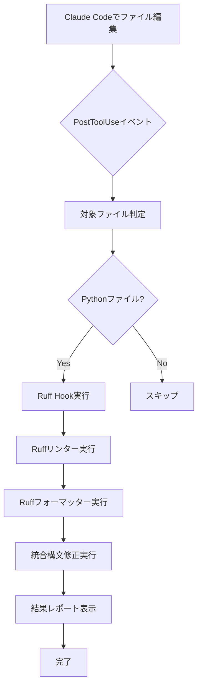

# Claude Code自動Ruff統合リンター設定ガイド

> **作成日**: 2025-08-31
> **バージョン**: v1.0.0
> **対応Claude Code**: latest

## 🎯 概要

Claude Codeのhooks機能を活用して、Pythonファイル編集時に自動的にRuff統合リンター・フォーマッターを実行する仕組みです。ファイル保存時に品質チェック・自動修正が自動実行され、コード品質が向上します。

## ✨ 機能

### 自動実行される処理
1. **Ruffリンター**: 構文エラー・コーディング規約チェック（自動修正付き）
2. **Ruffフォーマッター**: コードフォーマット統一（Black互換）
3. **統合構文修正**: プロジェクト固有の構文エラー修正
4. **インポート管理**: import文の整理・最適化
5. **品質通知**: 処理結果の視覚的フィードバック

### 対応ファイル
- **対象**: `src/noveler/**/*.py` 配下の全Pythonファイル
- **除外**: テストファイル、一時ファイル、キャッシュファイル

## 📦 実装ファイル構成

```
プロジェクトルート/
├── claude_code_config.json          # Claude Code設定（JSON形式）
├── .claude/hooks.toml               # Claude Code設定（TOML形式・高機能）
├── scripts/tools/ruff_hook.sh       # Ruff実行スクリプト
└── docs/claude_code/hooks_setup.md  # この設定ガイド
```

## ⚙️ 設定詳細

### 1. メイン設定（claude_code_config.json）

```json
{
  "hooks": {
    "PostToolUse": [
      {
        "description": "Pythonファイル自動Ruff統合リンター実行",
        "matcher": {
          "tool_names": ["Edit", "MultiEdit", "Write"],
          "file_paths": ["src/noveler/**/*.py"]
        },
        "command": "bash scripts/tools/ruff_hook.sh",
        "run_in_background": false,
        "continue_on_error": true
      }
    ]
  }
}
```

### 2. 高機能設定（.claude/hooks.toml）

```toml
[[hooks]]
event = "PostToolUse"
description = "Pythonファイル自動Ruff統合リンター"
priority = 1

[hooks.matcher]
tool_names = ["Edit", "MultiEdit", "Write"]
file_paths = ["src/noveler/**/*.py"]

[hooks.action]
command = "bash scripts/tools/ruff_hook.sh"
run_in_background = false
continue_on_error = true
timeout_seconds = 30
```

## 🚀 使用方法

### 基本的な使用手順

1. **Claude Code起動**
   ```bash
   # プロジェクトルートでClaude Code起動
   claude-code
   ```

2. **Pythonファイル編集**
   - Claude CodeでPythonファイルを編集・保存
   - 自動的にhooksが発動してRuff処理実行

3. **結果確認**
   - ターミナルに処理結果が表示
   - エラーがある場合は自動修正実施

### 手動実行

```bash
# 個別ファイルのテスト
./scripts/tools/ruff_hook.sh src/noveler/example.py

# 複数ファイルのテスト
./scripts/tools/ruff_hook.sh src/noveler/*.py

# 環境変数でのファイル指定
export CLAUDE_FILE_PATHS="src/noveler/test.py"
./scripts/tools/ruff_hook.sh
```

## 📊 処理フロー



## 🎛️ 設定カスタマイズ

### タイムアウト設定
```toml
[hooks.action]
timeout_seconds = 30  # デフォルト30秒
```

### 並列実行（高速化）
```toml
[settings]
parallel_execution = true  # 複数ファイル並列処理
```

### エラー時継続
```toml
[hooks.action]
continue_on_error = true  # エラー時も継続実行
```

### 通知の有効/無効
```toml
[settings.notifications]
success_messages = true
warning_messages = true
error_messages = true
```

## 🔧 トラブルシューティング

### よくある問題

1. **Ruffコマンド未発見**
   ```bash
   pip install ruff  # Ruffインストール
   ```

2. **権限エラー**
   ```bash
   chmod +x scripts/tools/ruff_hook.sh  # 実行権限付与
   ```

3. **設定ファイル未発見**
   ```bash
   ls -la claude_code_config.json  # 設定ファイル確認
   ```

4. **処理が重い**
   ```toml
   # .claude/hooks.tomlで軽量化設定
   [hooks.action]
   run_in_background = true  # バックグラウンド実行
   ```

### デバッグモード

```bash
# 詳細ログ出力でのデバッグ実行
DEBUG=1 ./scripts/tools/ruff_hook.sh test.py
```

## 📈 パフォーマンス

### 実行時間目安
- **単一ファイル**: 0.5-2秒
- **複数ファイル（5件）**: 2-5秒
- **大規模変更（20件+）**: 10-30秒

### 最適化機能
- ✅ インクリメンタルチェック（変更部分のみ）
- ✅ キャッシュ活用（`.ruff_cache`）
- ✅ タイムアウト制御
- ✅ リトライ機能（最大3回）

## 🔒 セキュリティ注意事項

⚠️ **重要**: Claude Code hooksは任意のシェルコマンドを自動実行します。

- 信頼できるコマンドのみ設定
- 定期的な設定ファイルの監査
- 本番環境での慎重な運用

## 📚 関連ドキュメント

- [Claude Code公式ドキュメント](https://docs.anthropic.com/en/docs/claude-code/)
- [Ruff公式ドキュメント](https://docs.astral.sh/ruff/)
- [プロジェクトのpyproject.toml設定](../pyproject.toml)

## 🛠️ 追加機能実装予定

- [ ] TypeScript/JavaScript対応
- [ ] カスタムリンタールール設定
- [ ] 品質メトリクス収集
- [ ] 統計レポート生成
- [ ] CI/CD統合

---

**📞 サポート**: 問題が発生した場合は、プロジェクトのIssueトラッカーで報告してください。
