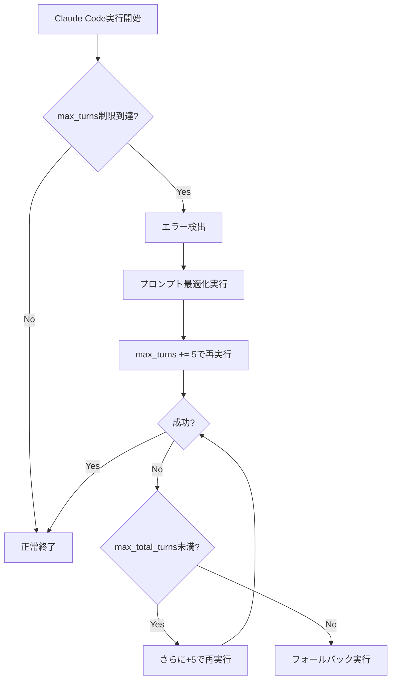

# Claude Code統合設定ガイド

> **最終更新**: 2025年8月9日（v2.0対応版）
> **対象**: Claude Code実行エラー解決システム（v2.0）の詳細設定

## 🎯 このガイドの目的

Claude Code統合機能の**設定管理**と**エラー解決システム**について、実際の設定方法と動作原理を詳しく解説します。

## 🚀 Claude Code統合機能（v2.0）概要

### 主要改善点
- **error_max_turns自動回復**: 3ターン制限問題を根本解決
- **段階的ターン数拡張**: 10→15→20ターンの自動拡張
- **タイムアウト延長**: 600秒（10分）まで自動延長
- **プロンプト最適化**: エラー時の自動最適化
- **統合設定管理**: `config/novel_config.yaml`による柔軟な制御

## ⚙️ 設定ファイル詳細

> 補足: `/test` 系スラッシュコマンドで bin/test* を許可したい場合は、`python3 scripts/setup/update_slash_commands.py` を実行すると `claude_desktop_config.json`（ユーザープロファイル）に permissions.allow が追記されます。

### `config/novel_config.yaml` の Claude Code設定セクション

```yaml
claude_code:
  # 基本実行設定
  enabled: true
  executable_path: "claude"         # Claude Codeコマンドパス
  max_turns: 10                    # デフォルトターン数（3→10に改善）
  timeout_seconds: 600             # タイムアウト（5分→10分に延長）
  output_format: "json"            # 出力形式
  retry_attempts: 3                # 基本リトライ回数

  # v2.0新機能: 自動エラー回復システム
  error_handling:
    auto_retry_on_max_turns: true        # max_turnsエラー時の自動回復
    fallback_turns_increment: 5         # ターン数増加幅（5ターンずつ）
    max_total_turns: 20                 # 最大ターン数制限
    prompt_optimization: true           # プロンプト自動最適化
    recovery_timeout_seconds: 600       # 回復時のタイムアウト

  # 環境検出設定
  environment_detection:
    auto_detect: true                   # 環境自動検出
    force_mode: null                    # 強制モード（null=自動）
    # 利用可能な強制モード:
    # - "MOCK": テスト・開発用
    # - "PRODUCTION": Claude Code内でのみ実行
    # - "HYBRID": 環境自動検出（推奨）
```

## 🔧 設定カスタマイズ例

### 1. 保守的設定（安全重視）
```yaml
claude_code:
  max_turns: 8                     # 控えめなターン数
  timeout_seconds: 300             # 5分タイムアウト
  error_handling:
    auto_retry_on_max_turns: true
    fallback_turns_increment: 3    # 小刻みな増加
    max_total_turns: 15            # 保守的な最大値
```

### 2. 積極的設定（効率重視）
```yaml
claude_code:
  max_turns: 15                    # 高めの初期値
  timeout_seconds: 900            # 15分タイムアウト
  error_handling:
    auto_retry_on_max_turns: true
    fallback_turns_increment: 7   # 大幅な増加
    max_total_turns: 25           # 高い最大値
```

### 3. 開発・テスト用設定
```yaml
claude_code:
  enabled: true
  environment_detection:
    force_mode: "MOCK"            # モックモード強制
    auto_detect: false
  error_handling:
    auto_retry_on_max_turns: false # 自動回復無効（デバッグ用）
```

## 📊 エラー種別と自動対処

### 対応エラータイプ

| エラータイプ | 自動対処 | 内容 |
|-------------|---------|------|
| `error_max_turns` | ✅ 完全対応 | ターン数制限到達時の段階的拡張 |
| `error_timeout` | ✅ 部分対応 | タイムアウト延長・プロンプト最適化 |
| `error_invalid_request` | ⚠️ プロンプト最適化のみ | リクエスト形式エラー |
| `error_api_failure` | ❌ 手動対処 | APIレベルの障害 |
| `error_parse_failure` | ❌ 手動対処 | レスポンス解析失敗 |

### error_max_turns の自動回復フロー



## 🛠️ 実際の使用例（MCP）

### 基本的な実行
```bash
# デフォルト設定で実行（10ターン、自動回復有効）
noveler mcp call noveler_write '{"episode_number": 1}'

# 設定確認（例）
echo $CLAUDE_CODE_MAX_TURNS            # 環境変数を参照
sed -n '1,80p' config/novel_config.yaml  # 設定ファイルを参照
```

### 環境変数での一時的な設定変更
```bash
# ターン数を一時的に変更
export CLAUDE_CODE_MAX_TURNS=20
noveler mcp call noveler_write '{"episode_number": 1}'

# タイムアウトを一時的に延長
export CLAUDE_CODE_TIMEOUT=900
noveler mcp call noveler_write '{"episode_number": 1}'
```

### 設定ファイルの直接編集
```bash
# 設定ファイルを直接編集
vim config/novel_config.yaml

# 設定変更の確認（再実行で確認）
noveler mcp call noveler_write '{"episode_number": 1, "dry_run": true}'
```

### LLM実行モードの切り替え
```yaml
defaults:
  writing_steps:
    use_llm: true   # 各STEPでLLMプロンプトを送る場合はtrue、オフライン検証はfalse
```

- `true`: STEP 0-18の実行ごとにテンプレート指示をLLMへ送信（本番運用向け）
- `false`: LLMを呼ばずにローカル実行／モック検証（単体テスト・ネットワーク制限時）

> **テンプレート仕様**: Schema v2 の必須キーや出力規約は `docs/technical/prompt_template_schema_v2.md` を参照してください。テンプレート更新後は `noveler write` の事前検証で欠落キーがないか確認することを推奨します。

## 🔍 トラブルシューティング

### 設定が反映されない場合
```bash
# 設定ファイルの構文確認
novel config validate

# 設定の読み込み確認
novel config show claude_code

# キャッシュクリア
rm -rf .config_cache
```

### 自動回復が動作しない場合
```yaml
# 以下の設定を確認
claude_code:
  error_handling:
    auto_retry_on_max_turns: true    # trueになっているか確認
    max_total_turns: 20             # 十分な値か確認
```

### パフォーマンス調整

#### 実行時間を短縮したい場合
```yaml
claude_code:
  max_turns: 8                     # 初期値を下げる
  error_handling:
    prompt_optimization: true      # プロンプト最適化を有効
```

#### より確実な実行を求める場合
```yaml
claude_code:
  max_turns: 15                    # 初期値を上げる
  timeout_seconds: 900            # タイムアウトを延長
  error_handling:
    max_total_turns: 30           # 最大値を上げる
```

## 📈 監視とログ

### 実行状況の監視
```bash
# MCPサーバーの状態
noveler mcp call status '{}'

# 詳細ログの確認
tail -f logs/claude_code_$(date +%Y%m%d).log

# エラーログのみ
grep "ERROR" logs/claude_code_$(date +%Y%m%d).log
```

### 統計情報の取得（例）
```bash
# 代表的なメトリクスはログ/レポートから抽出
rg -n "ERROR|timeout|max_turns" logs/claude_code_*.log | tail -100
```

## 🎯 最適化のヒント

### プロンプト設計
- **具体的で簡潔な指示**を心がける
- **段階的な目標設定**で複雑さを分散
- **不要な詳細は除外**してトークン数を削減

### 設定調整
- **執筆スタイル**に応じたターン数設定
- **プロジェクト規模**に応じたタイムアウト調整
- **開発段階**に応じた自動回復設定

## 🔗 関連ドキュメント

- [04_よくあるエラーと対処法.md](04_よくあるエラーと対処法.md) - Claude Codeエラーの対処法
- [README.md](../README.md) - Claude Code統合機能の概要
- [開発者向けガイド](../guides/developer_guide.md) - 技術的実装詳細

---

**💡 ヒント**: Claude Code統合機能は、設定ファイルによる柔軟な制御と自動回復システムにより、安定した執筆支援を提供します。用途に応じて設定を調整し、最適な執筆環境を構築してください。
