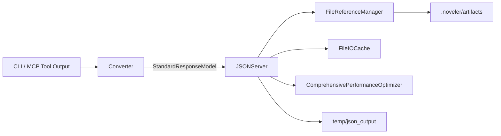

# SPEC-DATA-001: JSON変換・ファイル参照パイプライン仕様書

## 1. 概要

### 1.1 目的
CLI 結果や MCP ツール出力をファイル参照付き JSON として保存し、再利用できる形で提供するパイプラインを定義する。95% トークン削減・SHA256 参照・バックアップ運用を統合し、REQ-DATA-001〜003 を満たす。

### 1.2 対象コンポーネント
- `JSONConversionServer` (`src/noveler/infrastructure/json/mcp/servers/json_conversion_server.py`)
- `CLIResponseConverter` (`src/noveler/infrastructure/json/converters/cli_response_converter.py`)
- `FileReferenceManager` (`src/noveler/infrastructure/json/file_managers/file_reference_manager.py`)
- `FileIOCache`, `WritingSessionManager`, `ComprehensivePerformanceOptimizer`
- MCP ツール `convert_cli_to_json`, `validate_json_response`, `get_file_reference_info`, `get_file_by_hash`, `check_file_changes`, `list_files_with_hashes`

## 2. パイプライン構成

### 2.1 主要責務
- `JSONConversionServer`
  - MCP の FastMCP ベース実装
  - JSON変換ツール登録／セッション管理／キャッシュ制御
- `CLIResponseConverter`
  - CLI結果を `StandardResponseModel` / `ErrorResponseModel` に整形
  - Markdown/YAML/JSONを `FileReferenceManager` で保存し、参照IDを返却
- `FileReferenceManager`
  - SHA256 ハッシュ計算・インデックス管理
  - `.noveler/artifacts/` への永続化と整合性チェック
- `FileIOCache`
  - ファイル読み込みキャッシュ（TTL/LRU）
- `ComprehensivePerformanceOptimizer`
  - JSON変換サーバーの性能監視／最適化フック
  - 備考: `psutil` 未導入でも基本動作しますが、I/O/CPU 詳細は `tracemalloc` ベースの簡易計測にフォールバックします。

## 3. ツール仕様

| ツール名 | 機能 | 入力 | 出力 |
| --- | --- | --- | --- |
| `convert_cli_to_json` | CLI結果を標準JSONへ変換 | `cli_result: object` | `StandardResponseModel` |
| `validate_json_response` | JSONレスポンスバリデーション | `json_data: object` | `{ "valid": bool, "errors": list }` |
| `get_file_reference_info` | ファイル参照詳細取得 | `file_path: string` | `FileReferenceModel` |
| `get_file_by_hash` | SHA256でファイル取得 | `sha256: string` | `FileReferenceModel` or `null` |
| `check_file_changes` | ハッシュ差分検知 | `{ "paths": list[string] }` | `ChangedFileSummary` |
| `list_files_with_hashes` | 管理ファイル列挙 | `project_root?: string` | `{ "files": list[FileReferenceModel] }` |
