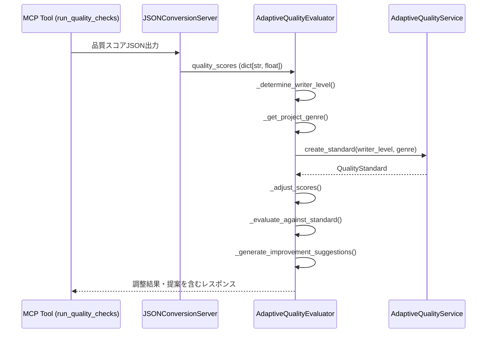

# SPEC-QUALITY-019: 適応的品質評価システム仕様書

## 1. 概要

### 1.1 目的
執筆者の経験値・ジャンル特性・読者フィードバックを踏まえ、大域的品質スコアを個別最適化する「適応的品質評価システム」を定義する。標準化されたA31品質チェック結果に対して、プロジェクト固有の学習データを用いた基準調整と提案生成を行う。

### 1.2 スコープ
- `AdaptiveQualityEvaluator`（アプリケーション層）による適応評価オーケストレーション
- `AdaptiveQualityService`（ドメイン層）による個別基準の調整・学習
- `QualityAdaptationPolicy` / `AdaptiveQualityEvaluator`（ドメインエンティティ）による適応度管理
- `JSONConversionServer` 経由でMCPツールから供給される品質スコアデータを入力とした評価フロー

## 2. 要求事項

| 要件ID | 説明 | 対応セクション |
| --- | --- | --- |
| REQ-QUALITY-003 | 適応的品質評価をDDD準拠で実装する | §3, §4 |
| REQ-QUALITY-001 | ベースになる品質アスペクト（readability/composition/style等）の調整 | §3.3 |
| REQ-DATA-001 | CLI/MCPで生成された品質スコアJSONの取り扱い | §5 |

## 3. システム構成

### 3.1 アプリケーション層コンポーネント
- `AdaptiveQualityEvaluator` (`src/noveler/application/use_cases/adaptive_quality_evaluation_use_case.py`)
  - 依存性: `ISettingsRepositoryFactory`, `WriterLevelService`, `QualityStandardFactory`
  - 公開API: `evaluate_with_adaptive_standards(quality_scores: dict[str, float]) -> dict[str, Any]`
  - インフラ層への直接依存を避け、DIされたファクトリーからリポジトリを取得

### 3.2 ドメイン層コンポーネント
- `AdaptiveQualityService` (`src/noveler/domain/learning/services.py`)
  - 作家プロフィールや読者フィードバックを用いた基準調整
  - `adjust_criteria_for_author`, `update_criteria_from_feedback`, `optimize_quality_standards`
- `AdaptiveQualityEvaluator` (`src/noveler/domain/quality/entities.py`)
  - 適応ポリシーと学習モデルの状態を保持
  - `evaluate_adaptively` で標準スコアを適応スコアへ変換
- `QualityAdaptationPolicy` (`src/noveler/domain/quality/entities.py`)
  - メトリック別の適応強度 (`AdaptationStrength`) を管理

### 3.3 品質アスペクト
対象とする品質指標は以下のとおり。
- `overall`（総合スコア）
- `readability`（可読性）
- `composition`（構成）
- `style`（文体）
- `dialogue`（会話表現）
- `narrative_depth`（描写・内面深度）
それぞれ `QualityStandard` が閾値(`minimum/target/excellent`) と重み(`weight`)を提供する。

### 3.4 適応パラメータ
- 執筆者レベル判定: `WriterLevelService.determine_level(completed_episodes, average_score)`
- ジャンル推定: プロジェクト設定 → ジャンル文字列 → `Genre` 列挙体マッピング
- 改善提案: `MAX_SUGGESTIONS=3`, `URGENT_THRESHOLD=50`
- スコア調整: 重み <1 で緩和 (スコア上昇), 重み >1 で厳格化 (スコア減少)

## 4. 処理フロー



### 4.1 入力検証
- スコア辞書が空の場合は `AdaptiveQualityEvaluationError`
- 各スコアは `0 <= value <= 100`
- プロジェクトルート未指定時はエラー

### 4.2 結果構造
```json
{
  "writer_level": "intermediate",
  "writer_level_description": "中級者: 安定した執筆が可能",
  "genre": "fantasy",
  "original_scores": {"overall": 78.0, ...},
  "adjusted_scores": {"overall": 82.4, ...},
  "overall_score": 82.4,
  "evaluation": {"overall": "良好", "readability": "要改善", ...},
  "thresholds": {"overall": {"minimum": 60, "target": 75, "excellent": 90}, ...},
  "improvement_suggestions": [{"area": "readability", "suggestion": "短い文と長い文を交互に配置し、リズムを作りましょう。"}],
  "encouragement": "読者が読みやすく感じる文章です。次は描写の深さを増やしましょう。"
}
```

## 5. データ連携

- 入力は `run_quality_checks` / `export_quality_report` などMCPツール経由で取得した品質スコアJSON。
- `JSONConversionServer` が `temp/json_output/` 以下に保存し、`convert_cli_to_json` ツールで参照可能。
- 適応評価結果は CLI / MCP レスポンスに含める。

## 6. テスト

| テスト | 目的 |
| --- | --- |
| `tests/test_ddd_compliance_adaptive_quality.py` | DI・依存制約・後方互換のDDD準拠検証 |
| `tests/unit/domain/learning/test_learning_services.py` | `AdaptiveQualityService` の基準調整・学習ロジック |
| `tests/unit/domain/quality/test_quality_entities.py` | `AdaptiveQualityEvaluator` エンティティの適応処理 |
| `tests/unit/domain/test_domain_adaptive_quality_integration.py` | アプリケーション/ドメイン統合テスト |

## 7. セキュリティ・非機能
- 設定・進捗リポジトリへのアクセスは `ISettingsRepositoryFactory` 経由で認証済みストレージに限定
- JSON出力は `FileIOCache` により再利用し、重複処理を50%以上削減
- 適応調整の計算は同期実行で100ms以内（平均ケース）

## 8. 更新履歴

| Version | Date | Summary |
| --- | --- | --- |
| 1.0.0 | 2025-09-17 | As-built版として再構築。アプリケーション/ドメイン構成と品質アスペクト定義を明文化。 |


### 9. デバイス混在・毎日更新プロファイル（mixed_device_daily_6k_10k）
- narration_p25_p75: 14–60（chars）
- short_run_max: 3 / long_run_max: 2
- window_avg_range: 18–70、in_range_ratio >= 0.85
- paragraph_len_main: 1–3文中心
- sections_per_episode: 7–12、section_len: 700–1,100
- hooks: minor 40–60%、mini 80–90%、main=末尾必須
- target_length: ConfigResolverの確定値（必須）。欠落/不正時は QC-009/QC-010 として中断
- dialogue_warnings: same_ending<=4、punctuation_runs>=3 を警告
