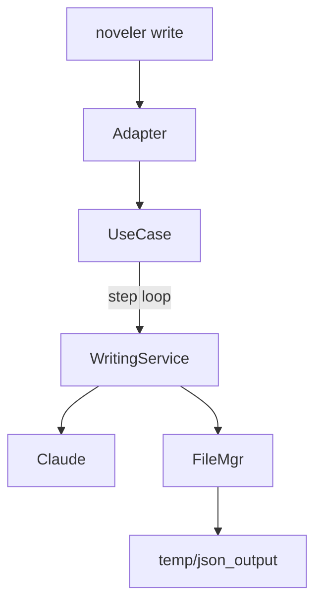

# SPEC-WRITE-018: 18ステップ統合執筆フロー仕様書

## 1. 概要

### 1.1 目的
CLIコマンド `noveler write` および MCP ツール群が提供する 18 ステップ統合執筆フローの実装仕様を定義する。プロット設計から公開準備までを一貫管理し、Claude Code 連携による原稿生成と成果物管理を統合する。

### 1.2 対象コンポーネント
- `execute_18_step_writing` (`src/noveler/presentation/cli/cli_adapter.py`)
- `IntegratedWritingUseCase` / `EnhancedIntegratedWritingUseCase` (`src/noveler/application/use_cases/...`)
- `ProgressiveTaskManager` と MCP ツール (`src/mcp_servers/noveler/main.py`)
- ドメイン層の各 writing_step サービス (`src/noveler/domain/services/writing_steps/`)

### 1.3 要件紐付け
| 要件ID | 説明 | 対応セクション |
| --- | --- | --- |
| REQ-WRITE-CLI-001 | 18ステップ統合執筆フローをCLIから提供 | §2, §3 |
| REQ-WRITE-MCP-003 | MCP経由の段階実行・復旧制御 | §4 |
| REQ-DATA-001 | CLI結果を JSON/ファイル参照形式で保全 | §5 |

## 2. ステップ定義

18ステップは次のフェーズに分類される。

| Step | 名称 | フェーズ | 主担当サービス |
| --- | --- | --- | --- |
| 0 | スコープ定義 | 構造設計 | `scope_definer_service.py` |
| 1 | 大骨（章の目的線） | 構造設計 | `story_structure_designer_service.py` |
| 2 | 中骨（段階目標） | 構造設計 | `phase_structure_designer_service.py` |
| 3 | テーマ性・独自性検証 | 構造設計 | `theme_uniqueness_validator_service.py` |
| 4 | セクションバランス設計 | 構造設計 | `section_balance_optimizer_service.py` |
| 5 | 小骨（シーン／ビート） | 構造設計 | `scene_designer_service.py` |
| 6 | 論理検証 | 構造設計 | `logic_validator_service.py` |
| 7 | キャラクター一貫性検証 | 構造設計 | `character_consistency_service.py` |
| 8 | 会話設計 | 構造設計 | `dialogue_designer_service.py` |
| 9 | 感情曲線設計 | 構造設計 | `emotion_curve_designer_service.py` |
|10 | 世界観設計 | 構造設計 | `scene_setting_service.py` |
|11 | 初稿生成 | 執筆実装 | `manuscript_generator_service.py` + Claude連携 |
|12 | 文字数最適化 | 執筆実装 | `text_length_optimizer_service.py` |
|13 | 文体・可読性パス | 執筆実装 | `readability_optimizer_service.py` |
|14 | 必須品質ゲート | 品質保証 | `quality_gate_service.py` |
|15 | 最終品質認定 | 品質保証 | `quality_certification_service.py` |
|16 | 公開準備 | 公開 | `publishing_preparation_service.py` |
|17 | 仕上げ | 公開 | `review_integration_service.py` |
|18 | 最終確認 | 公開 | `publishing_preparation_service` 補助 |

## 3. CLI実行フロー



### 3.1 実行関数
- `execute_18_step_writing(episode, dry_run, project_root)`
  - Rich console で進捗を表示
  - 各ステップの結果を `EnhancedFileManager.save_quality_report` で保存
  - Stage 11 では `UniversalClaudeCodeService` を介したLLM呼び出しと `LLMIOLogger` による入出力記録
  - `dry_run=False` の場合は結合原稿を `save_manuscript_with_metadata` で保存

### 3.2 エラーハンドリング
- ステップ失敗時は例外をラップし CLI へ通知 (`AdaptiveQualityEvaluationError` など)
- Claude呼び出し失敗時はフォールバック原稿を生成し、`execution_log` に失敗情報を残す

### 3.3 出力
```json
{
  "success": true,
  "episode": 1,
  "total_steps": 19,
  "completed_steps": 19,
  "saved_files": ["40_原稿/第001話_...md"],
  "execution_log": [{"step":11,"status":"completed","content_length":8650}, ...]
}
```

### 3.4 TenStage MCP ツールとの連携（REQ-WRITE-TEN-004）
- CLI フローは各フェーズで `write_step_1`〜`write_step_10` を呼び出し、タイムアウト時は `session_id` を保持して `write_resume` で再開する。
- `enhanced_get_writing_tasks` / `enhanced_execute_writing_step` / `enhanced_resume_from_partial_failure` は CLI 例外発生時の復旧手段として利用し、診断情報を CLI ログに反映する。
- セッションは `90_管理/writing_sessions/` に保存され、CLI 側で最終成果物を出力するときに `temp/json_output/` のステップログを統合する。

### 3.5 設計支援ツールの連携（REQ-WRITE-DESIGN-005）
- ステップ 7〜11 で `design_conversations`、`track_emotions`、`design_scenes`、`design_senses`、`manage_props` を順次呼び出し、`.noveler/design/{episode}/` に会話・感情・情景・小道具データを保存する。
- `get_conversation_context` は再実行時にステップ 8 以降のコンテキストを提供し、`export_design_data` により CLI 完了後の成果物をまとめてエクスポートする。
- 設計成果は品質チェック (`run_quality_checks`) と段階的品質フロー (`SPEC-QUALITY-110`) のコンテキストとして再利用される。

## 4. MCP連携

### 4.1 ツール一覧
- `write`, `write_stage`, `write_resume`
- `get_writing_tasks`, `execute_writing_step`, `get_task_status`
- 拡張版: `enhanced_execute_writing_step`, `enhanced_resume_from_partial_failure`

### 4.2 ProgressiveTaskManager
- ステップメタデータを `templates/**` から読み込み
- タイムアウト、再試行、依存関係を管理
- `TenStageExecutionStage` 列挙体を利用した 10 段階MCPツール (`write_step_1`〜`write_step_10`)

### 4.3 エピソード再開
- `session_id` と `step` を指定して任意ステップから再開
- `enhanced_resume_from_partial_failure` で途中失敗ステップの再実行とレポート再生成

## 5. データ出力とファイル管理

- JSON出力: `temp/json_output/step_{id}.json`
- 原稿: `40_原稿/第{episode:03d}話_{タイトル}.md`
- ログ: `logs/llm_io/` にステップ毎の入出力を保存
- バックアップ: `EnhancedFileManager` が既存原稿を自動退避

## 6. テスト

| テスト | 目的 |
| --- | --- |
| `tests/integration/test_integrated_writing_workflow.py` | 18ステップフローの統合検証 |
| `tests/e2e/test_episode001_complete_generation.py` | CLI `noveler write` のE2E確認 |
| `tests/test_progressive_execution_control.py` | MCP段階APIの制御・再開バリデーション |
| `tests/unit/presentation/cli/test_cli_adapter.py` | CLIアダプタの入出力とエラー処理 |

## 7. 非機能・制約
- 各ステップは idempotent で再実行可能
- デフォルトタイムアウト: CLIは同期 18 ステップを順次実行（長時間時は `--dry-run` 推奨）
- MCPツールは各ステップ独立 300 秒タイムアウト、同時実行不可

## 8. 更新履歴

| Version | Date | Summary |
| --- | --- | --- |
| 1.0.0 | 2025-09-17 | As-built版の18ステップ仕様を新規作成 |
