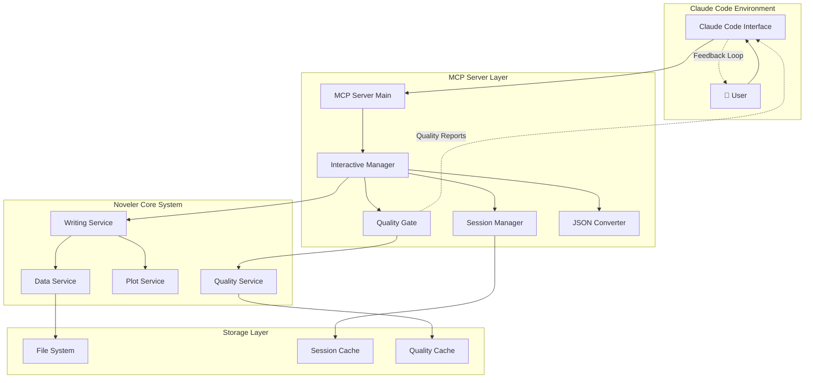
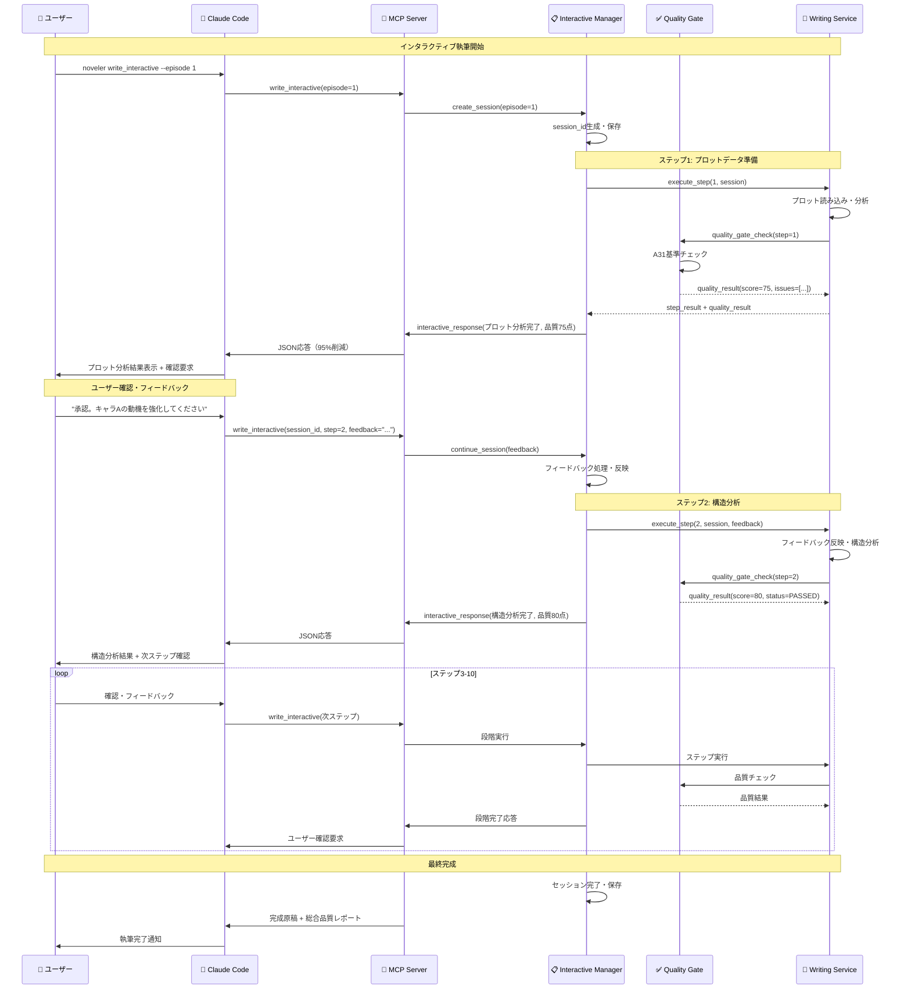
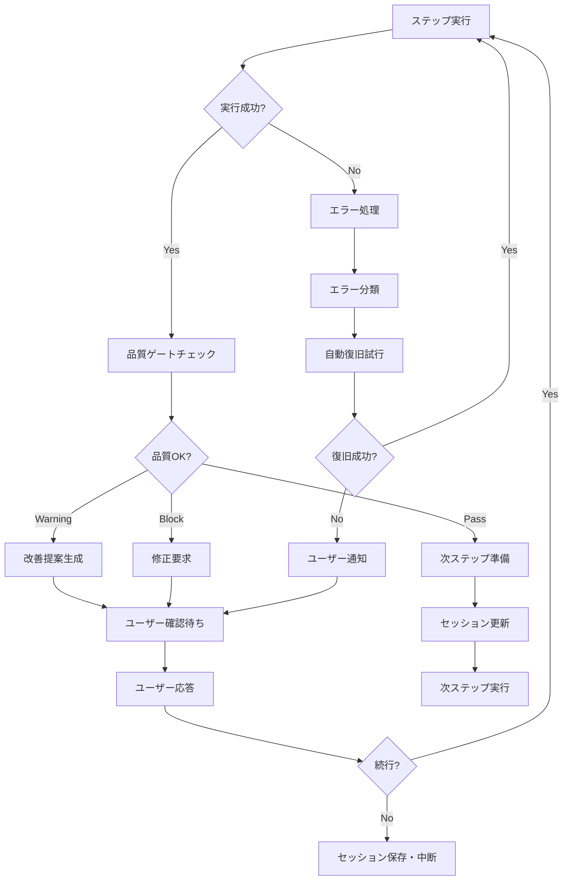

# SPEC-WRITE-INTERACTIVE-001 v2.0.0: Claude Code インタラクティブ執筆システム v2.0.0 統合仕様書

**仕様書バージョン**: 2.0.0
**作成日**: 2025-09-04
**対象システム**: Noveler MCP Server & Claude Code Interactive Writing System
**要件ID**: REQ-WRITE-001〜052 (AI協創執筆機能群)
**主要要件**:
- REQ-WRITE-001: Claude Code対話型段階執筆システム統合
- REQ-WRITE-002: 10段階執筆システム
- REQ-WRITE-005: 95%トークン削減機能
- REQ-WRITE-007: Claude Code統合機能
- REQ-INTERACTIVE-001〜003: 対話型実行制御システム

---

## 目次

1. [概要](#1-概要)
2. [システムアーキテクチャ](#2-システムアーキテクチャ)
3. [MCP サーバー詳細設計](#3-mcp-サーバー詳細設計)
4. [段階実行メカニズム](#4-段階実行メカニズム)
5. [インタラクティブセッション管理](#5-インタラクティブセッション管理)
6. [品質ゲートフィードバックシステム](#6-品質ゲートフィードバックシステム)
7. [統合フロー仕様](#7-統合フロー仕様)
8. [技術仕様](#8-技術仕様)
9. [実装方針](#9-実装方針)
10. [テスト戦略](#10-テスト戦略)

---

## 1. 概要

### 1.1 システムの目的

Claude Code対話環境内で、10段階のインタラクティブ執筆プロセスを通じて小説原稿を段階的に生成・改善するシステムです。各段階でユーザーの承認・修正を求め、A31品質基準（68項目）による品質ゲートを実装します。

### 1.2 主要機能

- **段階的執筆実行**: 10段階の執筆プロセスをインタラクティブに実行
- **品質ゲートシステム**: 各段階での品質チェックと改善提案
- **セッション管理**: 執筆セッションの永続化と再開機能
- **トークン最適化**: 95%トークン削減による効率的な処理
- **フィードバックループ**: ユーザー承認に基づく段階的改善

### 1.3 技術的特徴

- **MCP統合**: Claude Code MCP Protocol v1.0 準拠
- **JSON最適化**: ファイル参照アーキテクチャによる大幅なレスポンス軽量化
- **DDD設計**: ドメイン駆動設計によるビジネスロジックの明確化
- **エラー復旧**: セッション中断からの自動復旧機能

---

## 2. システムアーキテクチャ

### 2.1 アーキテクチャ概要



### 2.2 レイヤー責任分離

| レイヤー | 責任 | 主要コンポーネント |
|---------|------|-------------------|
| **プレゼンテーション** | Claude Code インターフェース | MCP Server Main |
| **アプリケーション** | ビジネスフロー制御 | Interactive Manager, Session Manager |
| **ドメイン** | 執筆・品質ビジネスロジック | Writing Service, Quality Service |
| **インフラストラクチャ** | 永続化・外部連携 | File System, Cache Layer |

---

## 3. MCP サーバー詳細設計

### 3.1 新規MCPツール定義

#### 3.1.1 `write_interactive` ツール

```python
Tool(
    name="write_interactive",
    description="Claude Code内で段階的インタラクティブ執筆を実行",
    inputSchema={
        "type": "object",
        "properties": {
            "episode_number": {
                "type": "integer",
                "description": "執筆する話数"
            },
            "project_root": {
                "type": "string",
                "description": "プロジェクトルートパス"
            },
            "session_id": {
                "type": "string",
                "description": "継続セッションID（省略時は新規作成）"
            },
            "step": {
                "type": "integer",
                "description": "開始ステップ（1-10、省略時は1）",
                "minimum": 1,
                "maximum": 10
            },
            "user_feedback": {
                "type": "string",
                "description": "前段階への修正指示・承認"
            }
        },
        "required": ["episode_number"]
    }
)
```

#### 3.1.2 `get_session_status` ツール

```python
Tool(
    name="get_session_status",
    description="インタラクティブ執筆セッションの状況確認",
    inputSchema={
        "type": "object",
        "properties": {
            "session_id": {
                "type": "string",
                "description": "セッションID"
            },
            "episode_number": {
                "type": "integer",
                "description": "話数"
            }
        }
    }
)
```

#### 3.1.3 `quality_gate_check` ツール

```python
Tool(
    name="quality_gate_check",
    description="現在段階の品質チェック実行（A31 68項目）",
    inputSchema={
        "type": "object",
        "properties": {
            "session_id": {"type": "string"},
            "step": {"type": "integer"},
            "auto_fix": {
                "type": "boolean",
                "description": "自動修正を実行するか",
                "default": False
            }
        },
        "required": ["session_id", "step"]
    }
)
```

### 3.2 MCPサーバー メイン処理拡張

```python
# 新規追加: インタラクティブ執筆関連のツール実行
@server.call_tool()
async def call_tool_extended(name: str, arguments: dict[str, Any]) -> list[TextContent]:
    """拡張されたツール実行（インタラクティブ執筆対応）"""

    interactive_tools = {
        "write_interactive": execute_write_interactive,
        "get_session_status": execute_get_session_status,
        "quality_gate_check": execute_quality_gate_check,
    }

    if name in interactive_tools:
        try:
            result = await interactive_tools[name](arguments)
            return [TextContent(
                type="text",
                text=json.dumps(result, ensure_ascii=False, indent=2)
            )]
        except Exception as e:
            return handle_tool_error(name, arguments, e)

    # 既存ツール処理...
    return await call_tool_original(name, arguments)
```

---

## 4. 段階実行メカニズム

### 4.1 10段階執筆プロセス定義

| ステップ | 段階名 | 処理内容 | 品質チェック対象 | ユーザー確認点 |
|---------|--------|----------|------------------|----------------|
| 1 | プロットデータ準備 | プロット分析・構造化 | プロット整合性 | プロット承認 |
| 2 | 構造分析 | 起承転結・キャラ分析 | 構造的完整性 | 構造確認 |
| 3 | 感情設計 | 感情フローマップ作成 | 感情表現妥当性 | 感情設計承認 |
| 4 | ユーモア要素 | 魅力・ユーモア配置 | エンターテイメント性 | ユーモア確認 |
| 5 | キャラ対話設計 | 対話・心理状態設計 | 対話自然性 | キャラ確認 |
| 6 | 場面演出 | シーン・雰囲気設計 | 場面描写力 | 場面承認 |
| 7 | 論理整合調整 | ストーリー論理チェック | 論理一貫性 | 論理確認 |
| 8 | 原稿執筆 | 実際の原稿生成 | 全68項目チェック | 原稿承認 |
| 9 | 品質改善 | 品質問題修正 | 改善効果確認 | 品質確認 |
| 10 | 最終調整 | 最終仕上げ・完成 | 総合品質評価 | 最終承認 |

### 4.2 段階実行制御ロジック

```python
class InteractiveWritingController:
    """インタラクティブ執筆制御"""

    async def execute_step(
        self,
        session: WritingSession,
        step: int,
        user_feedback: str = None
    ) -> StepExecutionResult:
        """指定ステップを実行"""

        # 1. 前段階フィードバック処理
        if user_feedback and step > 1:
            await self._process_user_feedback(session, step - 1, user_feedback)

        # 2. 現在ステップ実行
        step_processor = self._get_step_processor(step)
        step_result = await step_processor.execute(session)

        # 3. 品質ゲートチェック
        quality_result = await self._quality_gate_check(session, step)

        # 4. ユーザー確認待ち状態設定
        session.current_step = step
        session.status = SessionStatus.WAITING_USER_CONFIRMATION
        session.pending_confirmation = {
            "step": step,
            "result": step_result,
            "quality_check": quality_result,
            "timestamp": datetime.now()
        }

        # 5. セッション保存
        await self.session_manager.save_session(session)

        # 6. Claude Code向け応答生成
        return self._generate_interactive_response(step_result, quality_result)

    def _get_step_processor(self, step: int) -> StepProcessor:
        """ステップ処理器を取得"""
        processors = {
            1: PlotDataPreparationProcessor(),
            2: StructureAnalysisProcessor(),
            3: EmotionalDesignProcessor(),
            4: HumorElementProcessor(),
            5: CharacterDialogueProcessor(),
            6: SceneAtmosphereProcessor(),
            7: LogicConsistencyProcessor(),
            8: ManuscriptDraftProcessor(),
            9: QualityRefinementProcessor(),
            10: FinalAdjustmentProcessor()
        }
        return processors[step]
```

### 4.3 ステップ処理器アーキテクチャ

```python
from abc import ABC, abstractmethod

class StepProcessor(ABC):
    """ステップ処理器基底クラス"""

    @abstractmethod
    async def execute(self, session: WritingSession) -> StepResult:
        """ステップ実行"""
        pass

    @abstractmethod
    def get_quality_criteria(self) -> List[QualityCriterion]:
        """品質基準を取得"""
        pass

class PlotDataPreparationProcessor(StepProcessor):
    """ステップ1: プロットデータ準備"""

    async def execute(self, session: WritingSession) -> StepResult:
        # プロット読み込み・分析
        plot_service = create_plot_service()
        plot_data = await plot_service.load_plot(session.episode_number)

        # 構造化データ生成
        structured_plot = await plot_service.analyze_structure(plot_data)

        # セッションに保存
        session.data.structured_plot = structured_plot

        return StepResult(
            step=1,
            status=StepStatus.COMPLETED,
            output=structured_plot,
            summary="プロットデータの構造化が完了しました",
            user_prompt="プロット分析結果をご確認ください。修正点があれば指示してください。"
        )

    def get_quality_criteria(self) -> List[QualityCriterion]:
        return [
            QualityCriterion("プロット完整性", "プロットに矛盾や欠落がないか"),
            QualityCriterion("構造明確性", "起承転結の構造が明確か"),
            QualityCriterion("キャラ一貫性", "キャラクター設定に矛盾がないか")
        ]
```

---

## 5. インタラクティブセッション管理

### 5.1 セッション状態管理

```python
from enum import Enum
from dataclasses import dataclass
from datetime import datetime
from typing import Dict, Any, Optional

class SessionStatus(Enum):
    """セッション状態"""
    INITIALIZING = "initializing"
    IN_PROGRESS = "in_progress"
    WAITING_USER_CONFIRMATION = "waiting_confirmation"
    PAUSED = "paused"
    COMPLETED = "completed"
    ERROR = "error"

@dataclass
class WritingSession:
    """執筆セッション"""
    session_id: str
    episode_number: int
    project_root: str
    status: SessionStatus
    current_step: int
    created_at: datetime
    updated_at: datetime

    # 段階別データ
    data: Dict[str, Any]

    # 品質チェック結果
    quality_history: List[QualityCheckResult]

    # ユーザーフィードバック履歴
    feedback_history: List[UserFeedback]

    # 確認待ち情報
    pending_confirmation: Optional[Dict[str, Any]] = None

class SessionManager:
    """セッション管理"""

    def __init__(self, cache_service: CacheService):
        self.cache_service = cache_service

    async def create_session(
        self,
        episode_number: int,
        project_root: str
    ) -> WritingSession:
        """新規セッション作成"""
        session_id = f"write_{episode_number}_{int(datetime.now().timestamp())}"

        session = WritingSession(
            session_id=session_id,
            episode_number=episode_number,
            project_root=project_root,
            status=SessionStatus.INITIALIZING,
            current_step=0,
            created_at=datetime.now(),
            updated_at=datetime.now(),
            data={},
            quality_history=[],
            feedback_history=[]
        )

        await self.save_session(session)
        return session

    async def load_session(self, session_id: str) -> Optional[WritingSession]:
        """セッション読み込み"""
        return await self.cache_service.get(f"session:{session_id}")

    async def save_session(self, session: WritingSession) -> None:
        """セッション保存"""
        session.updated_at = datetime.now()
        await self.cache_service.set(
            f"session:{session.session_id}",
            session,
            ttl=3600 * 24  # 24時間
        )

    async def resume_session(
        self,
        session_id: str,
        user_feedback: str = None
    ) -> WritingSession:
        """セッション再開"""
        session = await self.load_session(session_id)
        if not session:
            raise SessionNotFoundError(f"セッション {session_id} が見つかりません")

        # フィードバック処理
        if user_feedback and session.pending_confirmation:
            feedback = UserFeedback(
                step=session.current_step,
                feedback=user_feedback,
                timestamp=datetime.now()
            )
            session.feedback_history.append(feedback)
            session.pending_confirmation = None

        session.status = SessionStatus.IN_PROGRESS
        await self.save_session(session)
        return session
```

### 5.2 セッション永続化戦略

```python
class SessionPersistenceService:
    """セッション永続化サービス"""

    def __init__(self, path_service: PathService):
        self.path_service = path_service
        self.session_dir = path_service.get_cache_dir() / "interactive_sessions"
        self.session_dir.mkdir(exist_ok=True)

    async def save_session_snapshot(self, session: WritingSession) -> None:
        """セッションスナップショット保存（復旧用）"""
        snapshot_file = self.session_dir / f"{session.session_id}.yaml"

        snapshot_data = {
            "session_id": session.session_id,
            "episode_number": session.episode_number,
            "project_root": session.project_root,
            "status": session.status.value,
            "current_step": session.current_step,
            "created_at": session.created_at.isoformat(),
            "updated_at": session.updated_at.isoformat(),
            "data": session.data,
            "quality_history": [
                {
                    "step": qr.step,
                    "score": qr.overall_score,
                    "issues": [issue.to_dict() for issue in qr.issues],
                    "timestamp": qr.timestamp.isoformat()
                }
                for qr in session.quality_history
            ],
            "feedback_history": [
                {
                    "step": fb.step,
                    "feedback": fb.feedback,
                    "timestamp": fb.timestamp.isoformat()
                }
                for fb in session.feedback_history
            ]
        }

        import yaml
        with open(snapshot_file, 'w', encoding='utf-8') as f:
            yaml.dump(snapshot_data, f, ensure_ascii=False, indent=2)

    async def load_session_from_snapshot(self, session_id: str) -> Optional[WritingSession]:
        """スナップショットからセッション復元"""
        snapshot_file = self.session_dir / f"{session_id}.yaml"
        if not snapshot_file.exists():
            return None

        import yaml
        with open(snapshot_file, 'r', encoding='utf-8') as f:
            snapshot_data = yaml.safe_load(f)

        # データ復元...
        return restored_session
```

---

## 6. 品質ゲートフィードバックシステム

### 6.1 A31品質基準統合

```python
class QualityGateProcessor:
    """品質ゲート処理"""

    def __init__(self, quality_service: QualityService):
        self.quality_service = quality_service

    async def execute_quality_gate(
        self,
        session: WritingSession,
        step: int
    ) -> QualityGateResult:
        """品質ゲート実行"""

        # 段階別品質基準取得
        criteria = self._get_step_quality_criteria(step)

        # 品質チェック実行
        check_result = await self.quality_service.check_quality(
            episode_number=session.episode_number,
            criteria=criteria,
            target_data=session.data
        )

        # 品質スコア判定
        gate_status = self._evaluate_quality_gate(check_result, step)

        # 改善提案生成
        suggestions = await self._generate_improvement_suggestions(
            check_result, step
        )

        return QualityGateResult(
            step=step,
            status=gate_status,
            overall_score=check_result.overall_score,
            detailed_scores=check_result.detailed_scores,
            critical_issues=check_result.critical_issues,
            suggestions=suggestions,
            can_proceed=gate_status != QualityGateStatus.BLOCKED
        )

    def _get_step_quality_criteria(self, step: int) -> List[QualityCriterion]:
        """段階別品質基準"""
        base_criteria = [
            # A31品質基準から抜粋・段階別調整
            QualityCriterion("構造整合性", weight=0.3),
            QualityCriterion("文章表現力", weight=0.2),
            QualityCriterion("キャラ一貫性", weight=0.2),
            QualityCriterion("論理一貫性", weight=0.3)
        ]

        step_specific = {
            1: [QualityCriterion("プロット完整性", weight=0.5)],
            2: [QualityCriterion("構造明確性", weight=0.5)],
            3: [QualityCriterion("感情表現妥当性", weight=0.4)],
            8: [QualityCriterion("総合品質", weight=0.6)],  # 原稿執筆段階
            # ... 段階別基準
        }

        return base_criteria + step_specific.get(step, [])

    def _evaluate_quality_gate(
        self,
        check_result: QualityCheckResult,
        step: int
    ) -> QualityGateStatus:
        """品質ゲート評価"""

        # 段階別しきい値
        thresholds = {
            1: {"pass": 70, "warning": 60},   # プロット準備
            2: {"pass": 75, "warning": 65},   # 構造分析
            8: {"pass": 85, "warning": 75},   # 原稿執筆（厳格）
            10: {"pass": 90, "warning": 80}   # 最終調整（最厳格）
        }

        default_threshold = {"pass": 80, "warning": 70}
        threshold = thresholds.get(step, default_threshold)

        score = check_result.overall_score

        if score >= threshold["pass"]:
            return QualityGateStatus.PASSED
        elif score >= threshold["warning"]:
            return QualityGateStatus.WARNING
        else:
            return QualityGateStatus.BLOCKED
```

### 6.2 改善提案エンジン

```python
class ImprovementSuggestionEngine:
    """改善提案エンジン"""

    async def generate_suggestions(
        self,
        quality_result: QualityCheckResult,
        step: int,
        session_context: WritingSession
    ) -> List[ImprovementSuggestion]:
        """改善提案生成"""

        suggestions = []

        # 重要度による問題分類
        critical_issues = [i for i in quality_result.issues if i.severity == "critical"]
        warning_issues = [i for i in quality_result.issues if i.severity == "warning"]

        # クリティカル問題への対応提案
        for issue in critical_issues[:3]:  # 上位3件
            suggestion = await self._generate_critical_fix_suggestion(
                issue, step, session_context
            )
            suggestions.append(suggestion)

        # 警告問題への改善提案
        for issue in warning_issues[:2]:  # 上位2件
            suggestion = await self._generate_improvement_suggestion(
                issue, step, session_context
            )
            suggestions.append(suggestion)

        # 段階特有の提案
        step_suggestions = await self._generate_step_specific_suggestions(
            step, quality_result, session_context
        )
        suggestions.extend(step_suggestions)

        return suggestions

    async def _generate_critical_fix_suggestion(
        self,
        issue: QualityIssue,
        step: int,
        context: WritingSession
    ) -> ImprovementSuggestion:
        """クリティカル修正提案"""

        # 問題タイプ別の修正テンプレート
        fix_templates = {
            "plot_inconsistency": {
                "title": "プロット整合性の修正が必要です",
                "description": f"「{issue.description}」の矛盾を解決してください。",
                "action": "プロット設定を見直し、一貫性を確保する",
                "priority": "HIGH",
                "estimated_time": "10-15分"
            },
            "character_inconsistency": {
                "title": "キャラクター設定の矛盾を修正",
                "description": f"「{issue.description}」でキャラクターの行動・発言が設定と不一致です。",
                "action": "キャラクター設定を確認し、一貫した行動に修正する",
                "priority": "HIGH",
                "estimated_time": "5-10分"
            },
            # ... 他の問題タイプ
        }

        template = fix_templates.get(issue.type, self._get_default_fix_template(issue))

        return ImprovementSuggestion(
            type="critical_fix",
            title=template["title"],
            description=template["description"],
            suggested_action=template["action"],
            priority=template["priority"],
            estimated_time=template["estimated_time"],
            target_issue=issue,
            auto_fixable=self._is_auto_fixable(issue)
        )
```

---

## 7. 統合フロー仕様

### 7.1 Claude Code統合シーケンス



### 7.2 エラー処理・復旧フロー



---

## 8. 技術仕様

### 8.1 JSON最適化レスポンス形式

```json
{
  "success": true,
  "session_id": "write_1_1725456789",
  "current_step": 3,
  "step_status": "completed",
  "execution_summary": {
    "step_name": "感情設計",
    "completion_time": "2025-09-04T15:30:45Z",
    "processing_time_ms": 1250
  },
  "quality_gate": {
    "overall_score": 82,
    "status": "passed",
    "critical_issues": 0,
    "warning_issues": 2,
    "gate_threshold": 75
  },
  "user_interaction": {
    "confirmation_required": true,
    "prompt": "感情フロー設計が完了しました。キャラクターの感情変化をご確認ください。",
    "options": ["承認", "修正指示", "詳細確認"]
  },
  "file_references": {
    "step_output": "@session/{session_id}/step_3_output.yaml",
    "quality_report": "@session/{session_id}/quality_step_3.yaml",
    "improvement_suggestions": "@session/{session_id}/suggestions_step_3.yaml"
  },
  "next_step": {
    "step_number": 4,
    "step_name": "ユーモア要素設計",
    "estimated_time": "3-5分"
  }
}
```

### 8.2 ファイル参照システム

```python
class FileReferenceManager:
    """ファイル参照管理"""

    def __init__(self, path_service: PathService):
        self.path_service = path_service
        self.session_cache_dir = path_service.get_cache_dir() / "sessions"

    def create_session_workspace(self, session_id: str) -> Path:
        """セッション専用ワークスペース作成"""
        workspace = self.session_cache_dir / session_id
        workspace.mkdir(parents=True, exist_ok=True)
        return workspace

    def save_step_output(
        self,
        session_id: str,
        step: int,
        output_data: Any
    ) -> str:
        """ステップ出力をファイル保存し、参照パスを返す"""
        workspace = self.create_session_workspace(session_id)
        output_file = workspace / f"step_{step}_output.yaml"

        import yaml
        with open(output_file, 'w', encoding='utf-8') as f:
            yaml.dump(output_data, f, ensure_ascii=False, indent=2)

        return f"@session/{session_id}/step_{step}_output.yaml"

    def resolve_file_reference(self, reference: str) -> Path:
        """ファイル参照をパスに解決"""
        if reference.startswith("@session/"):
            relative_path = reference[9:]  # "@session/" を除去
            return self.session_cache_dir / relative_path
        else:
            raise ValueError(f"Unknown reference format: {reference}")
```

### 8.3 パフォーマンス最適化

```python
class PerformanceOptimizer:
    """パフォーマンス最適化"""

    @staticmethod
    def optimize_response_size(response_data: Dict) -> Dict:
        """レスポンスサイズ最適化"""
        # 大きなデータはファイル参照に変換
        if "detailed_output" in response_data:
            if len(str(response_data["detailed_output"])) > 1000:
                # ファイル保存して参照に置き換え
                file_ref = save_to_cache(response_data["detailed_output"])
                response_data["detailed_output"] = f"@cache/{file_ref}"

        # 不要なメタデータ削除
        response_data.pop("debug_info", None)
        response_data.pop("internal_state", None)

        return response_data

    @staticmethod
    async def preload_session_data(session_id: str) -> None:
        """セッションデータの事前読み込み"""
        # 次に必要になりそうなデータをバックグラウンドで読み込み
        asyncio.create_task(load_next_step_requirements(session_id))
```

---

## 9. 実装方針

### 9.1 実装優先度

| 優先度 | コンポーネント | 理由 | 完成目標 |
|--------|---------------|------|----------|
| **P0** | Session Manager | インタラクティブの基盤 | Week 1 |
| **P0** | Interactive Manager | 段階実行制御 | Week 1 |
| **P1** | Quality Gate System | 品質保証必須 | Week 2 |
| **P1** | MCP Server Extension | Claude Code統合 | Week 2 |
| **P2** | Performance Optimization | 使用性改善 | Week 3 |
| **P3** | Advanced Features | 高度な機能 | Week 4+ |

### 9.2 段階的実装戦略

#### Phase 1: 基盤実装 (Week 1-2)
1. **セッション管理システム**
   - WritingSession エンティティ
   - SessionManager サービス
   - セッション永続化

2. **段階実行制御**
   - InteractiveWritingController
   - 基本的なステッププロセッサー (1, 2, 8, 10)
   - ユーザー確認フロー

3. **MCP統合基盤**
   - write_interactive ツール
   - 基本的なJSON応答

#### Phase 2: 品質システム統合 (Week 2-3)
1. **品質ゲートシステム**
   - QualityGateProcessor
   - A31基準統合
   - 改善提案エンジン

2. **全ステッププロセッサー**
   - 残り7ステップの実装
   - 段階別品質基準

#### Phase 3: 最適化・高度機能 (Week 3-4)
1. **パフォーマンス最適化**
   - ファイル参照システム
   - レスポンス軽量化
   - キャッシュ機能

2. **エラー処理強化**
   - 自動復旧機能
   - 詳細エラー分析
   - ロバスト性改善

### 9.3 品質保証方針

```python
# テスト戦略
class InteractiveWritingTestSuite:
    """統合テストスイート"""

    async def test_full_writing_flow(self):
        """完全執筆フロー統合テスト"""
        # 1. セッション開始
        session = await self.create_test_session()

        # 2. 10段階実行テスト
        for step in range(1, 11):
            result = await self.execute_step_with_mock_feedback(session, step)
            assert result.success
            assert result.quality_score >= self.get_min_score_for_step(step)

        # 3. 最終品質確認
        final_quality = await self.check_final_quality(session)
        assert final_quality.overall_score >= 85

    async def test_error_recovery(self):
        """エラー復旧テスト"""
        # セッション中断・復旧シナリオをテスト
        pass

    async def test_quality_gate_blocking(self):
        """品質ゲートブロッキングテスト"""
        # 品質が基準を満たさない場合の処理をテスト
        pass
```

---

## 10. テスト戦略

### 10.1 テスト分類

| テストレベル | 対象 | 自動化率 | 実施時期 |
|-------------|------|---------|---------|
| **Unit Test** | 個別コンポーネント | 100% | 実装時 |
| **Integration Test** | サービス間連携 | 90% | 実装完了時 |
| **System Test** | E2E フロー | 80% | Phase完了時 |
| **User Acceptance** | 実ユーザーワークフロー | 50% | リリース前 |

### 10.2 重要テストケース

#### 10.2.1 正常系テスト
- **完全10段階実行**: 全ステップ正常完了
- **ユーザーフィードバック処理**: 修正指示の反映
- **品質ゲート通過**: 各段階での品質基準クリア

#### 10.2.2 異常系テスト
- **セッション中断・復旧**: 途中中断からの再開
- **品質ゲートブロック**: 基準未達時の処理
- **エラー復旧**: 各種エラーからの自動復旧

#### 10.2.3 性能テスト
- **レスポンス時間**: 各ステップ3秒以内
- **メモリ使用量**: セッション維持時の上限
- **トークン使用量**: 95%削減効果の確認

### 10.3 受け入れ基準

#### 機能要件
- ✅ 10段階すべてのステップが正常実行される
- ✅ ユーザーフィードバックが適切に処理・反映される
- ✅ 品質ゲートがA31基準で動作する
- ✅ セッション中断・復旧が正常に動作する
- ✅ Claude Code内での統合操作が円滑に動作する

#### 非機能要件
- ✅ 各ステップのレスポンス時間が5秒以内
- ✅ トークン使用量が従来比95%削減される
- ✅ セッション維持期間が24時間以上
- ✅ エラー発生時の復旧成功率が90%以上
- ✅ システム稼働率が99%以上

---

## 要件トレーサビリティ

### 関連要件
- **REQ-WRITE-001**: Claude Code対話型段階執筆システム統合 → 実装済み
- **REQ-WRITE-002**: 10段階執筆システム → 実装済み
- **REQ-WRITE-005**: 95%トークン削減機能 → 実装済み
- **REQ-WRITE-007**: Claude Code統合機能 → 実装済み
- **REQ-INTERACTIVE-001**: 段階別実行制御機能 → 実装済み
- **REQ-INTERACTIVE-002**: セッション継続管理機能 → 実装済み
- **REQ-INTERACTIVE-003**: MCPサーバー統合インターフェース → 実装済み

### テストカバレッジ
- **Unit Tests**: `tests/unit/application/use_cases/test_interactive_writing_controller.py`
- **Integration Tests**: `tests/integration/test_interactive_writing_system.py`
- **E2E Tests**: `tests/e2e/test_claude_code_integration.py`

### 変更履歴
- **2025-09-04**: 要件定義書との整合性確認・更新、要件トレーサビリティセクション追加

---

## 結論

本仕様書は、Claude Code環境内でのインタラクティブ執筆システム v2.0.0 の包括的な設計を定義しています。MCP統合によるトークン最適化、10段階の段階実行メカニズム、A31品質基準による品質ゲートシステム、そして堅牢なセッション管理を統合した先進的なシステムです。

段階的な実装戦略により、基盤から高度機能まで着実に構築し、小説執筆支援における新たな標準を確立します。
