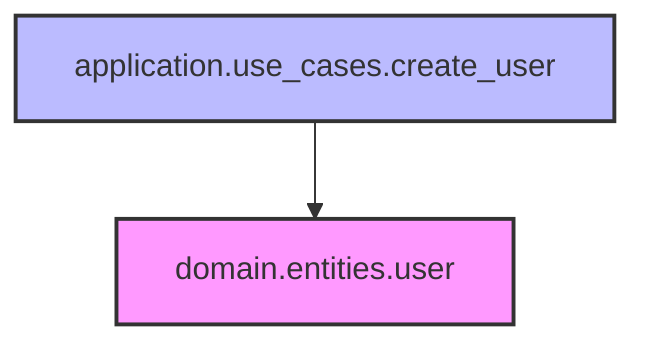

# 依存関係分析ツール（dependency_analyzer.py）仕様書

## 概要
DDD層間の依存関係を詳細に分析し、アーキテクチャの健全性を保つためのツール。レイヤー違反、循環依存、外部パッケージ依存を検出し、修正提案を生成する。

## 主な機能

### 1. 依存関係グラフの構築
- Pythonファイルからimport文を解析
- モジュール間の依存関係をグラフ構造で管理
- レイヤー情報の自動検出と付与

### 2. 違反検出機能
- **レイヤー違反**: DDD原則に反する依存（例：domain → infrastructure）
- **循環依存**: モジュール間の循環参照（Tarjanのアルゴリズム使用）
- **外部依存**: ドメイン層での外部パッケージ使用を警告
- **カスタムルール**: ユーザー定義の検証ルール適用

### 3. メトリクス計算
- **結合度（Coupling）**: モジュール間の依存度合い
- **凝集度（Cohesion）**: パッケージ内の関連性
- **依存深度**: 最大の依存チェーン長
- **ファンイン/ファンアウト**: 各モジュールの依存数

### 4. 可視化エクスポート
- **Mermaid形式**: Webブラウザで表示可能なグラフ
- **Graphviz DOT形式**: 高品質な画像生成用
- **JSON形式**: プログラムでの処理用
- **JUnit XML形式**: CI/CDパイプライン統合用

### 5. 修正提案生成
- 依存性注入パターンの提案
- インターフェース分離の提案
- 共通モジュール抽出の提案

## 実装詳細

### クラス構成

#### ViolationType（Enum）
違反タイプの定義：
- `LAYER_VIOLATION`: レイヤー違反
- `CIRCULAR_DEPENDENCY`: 循環依存
- `EXTERNAL_DEPENDENCY`: 外部依存
- `CUSTOM`: カスタムルール違反

#### DependencyViolation（基底クラス）
すべての違反の共通インターフェース：
- `message`: 違反メッセージ
- `violation_type`: 違反タイプ
- `severity`: 重要度（error/warning）

#### LayerViolation
レイヤー違反の詳細情報：
- `source_module`: 違反元モジュール
- `target_module`: 違反先モジュール
- `source_layer`: 違反元レイヤー
- `target_layer`: 違反先レイヤー

#### CircularDependency
循環依存の詳細：
- `cycle`: 循環を構成するモジュールのリスト

#### ExternalDependency
外部パッケージ依存：
- `module`: 依存元モジュール
- `external_package`: 外部パッケージ名
- `layer`: 依存元のレイヤー

#### DependencyGraph
依存関係グラフの管理：
- `add_node()`: ノード追加
- `add_edge()`: エッジ追加
- `find_cycles()`: 循環検出
- `topological_sort()`: トポロジカルソート

#### DependencyAnalyzer
メインの分析クラス：
- `analyze_project()`: プロジェクト全体を分析
- `detect_violations()`: 違反を検出
- `calculate_metrics()`: メトリクスを計算
- `generate_fix_suggestions()`: 修正提案を生成

### アルゴリズム

#### 循環依存検出（Tarjanのアルゴリズム）
強連結成分を検出し、サイズが2以上のものを循環として報告。

#### トポロジカルソート
依存関係の順序を計算し、最大深度を求める。

#### レイヤー階層
```
domain → application → infrastructure → presentation
```
下位レイヤーが上位レイヤーに依存することは禁止。

## 使用方法

### CLI使用
```bash
# 基本的な分析
python dependency_analyzer.py /path/to/project

# Mermaid形式で出力
python dependency_analyzer.py /path/to/project --format mermaid

# 修正提案付き
python dependency_analyzer.py /path/to/project --fix-suggestions

# テストファイルを除外
python dependency_analyzer.py /path/to/project --exclude "test_*" --exclude "*_test.py"
```

### 統合CLIからの使用
```bash
# 現在のディレクトリを分析
novel deps

# レイヤー違反のみ表示
novel deps --layer-only

# JSON形式で保存
novel deps --format json --output deps.json
```

### プログラムからの使用
```python
from tools.dependency_analyzer import DependencyAnalyzer

analyzer = DependencyAnalyzer()
analyzer.add_exclusion_pattern("test_*")

graph = analyzer.analyze_project(Path("/project"))
violations = analyzer.detect_violations(graph)
metrics = analyzer.calculate_metrics(graph)

# カスタムルールの追加
def naming_rule(module_path, dependencies):
    violations = []
    if "use_case" in module_path and not module_path.endswith("_use_case"):
        violations.append(f"Use case module should end with '_use_case'")
    return violations

analyzer.add_custom_rule("naming", naming_rule)
```

## 出力例

### テキスト形式
```
# 依存関係分析レポート

## サマリー
- 総モジュール数: 150
- 総依存関係数: 450
- 違反検出数: 12
- 結合度: 3.00
- 最大依存深度: 5

## 違反
- [ERROR] Layer violation: domain layer (domain.services.user_service) depends on infrastructure layer (infrastructure.database)
- [ERROR] Circular dependency detected: module_a -> module_b -> module_c -> module_a
```

### Mermaid形式


## エラーハンドリング

- ファイル読み込みエラー: 無視して続行
- 構文エラー: 該当ファイルをスキップ
- 循環インポート: 検出して報告
- 不正なパス: エラーメッセージを表示

## パフォーマンス考慮事項

- 大規模プロジェクト対応: 数千ファイルまで実用的な速度
- メモリ効率: グラフ構造は必要最小限の情報のみ保持
- 並列処理: 将来的な拡張として検討中

## 制限事項

1. 動的インポート（importlib等）は検出不可
2. 条件付きインポートは常に依存として扱う
3. Python以外のファイルは対象外
4. 相対インポートの解決は限定的

## 今後の拡張予定

1. 依存関係の重み付け（使用頻度に基づく）
2. リファクタリング自動実行
3. 依存関係の履歴追跡
4. チーム別の違反レポート
5. IDE統合（VS Code拡張等）
