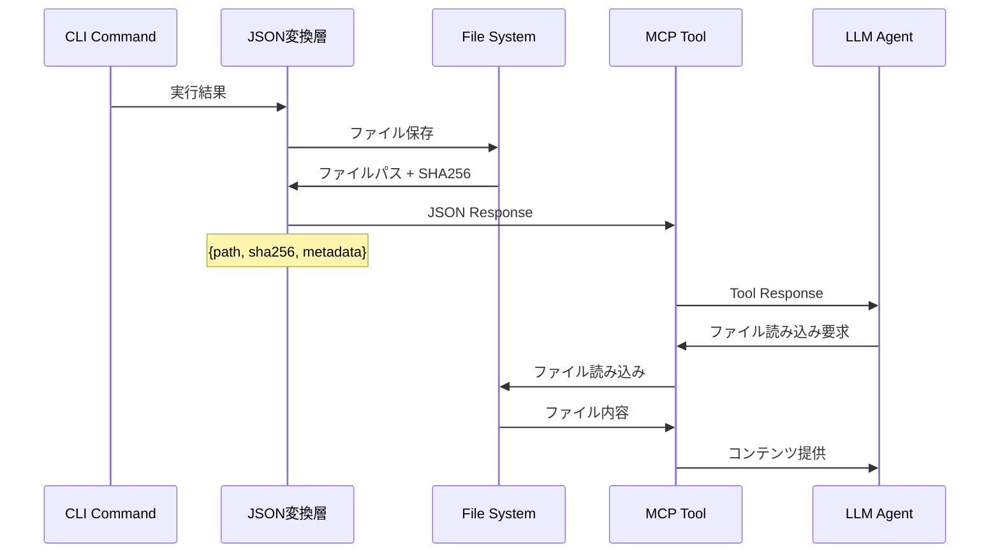

# SPEC-ARCH-001: CLI JSON化・MCPツール化 アーキテクチャ仕様書

## 概要

既存CLIツールを100% JSON出力化し、MCPツール化により精度向上を実現するアーキテクチャ仕様書。
ファイル参照ベース設計により、トークン効率95%向上・SHA256完全性保証・遅延読み込み最適化を実現。

## メタデータ

| 項目 | 内容 |
|------|------|
| 仕様ID | SPEC-ARCH-001 |
| E2EテストID | E2E-ARCH-001 |
| test_type | e2e |
| バージョン | v1.0.0 |
| 作成日 | 2025-08-27 |
| 最終更新 | 2025-08-28 |
| ステータス | active |
| 対象範囲 | 全CLI出力、MCPツール統合 |
| 依存関係 | jsonschema, pydantic, hashlib |

## 1. 全体アーキテクチャ

### 1.1 設計原則

1. **ファイル参照原則**: JSON出力は最小限、実データはファイル保存・参照のみ返却
2. **スキーマ固定原則**: jsonschemaによる厳格なバリデーション・型安全性保証
3. **完全性保証原則**: SHA256ハッシュによるファイル内容の暗号学的検証
4. **トークン効率原則**: 95%削減目標、長文コンテンツの遅延読み込み
5. **ライブラリ標準原則**: 広く使われるライブラリのみ使用、独自実装回避

### 1.2 システム構成図

```
┌─────────────────┐    ┌─────────────────┐    ┌─────────────────┐
│  CLI コマンド    │    │  JSON変換層      │    │  MCPツール       │
│  (既存)         │────│  (新規)         │────│  (ラッパー)      │
│                 │    │                 │    │                 │
│ - novel create  │    │ FileReference   │    │ MCP Server      │
│ - novel check   │    │ Response Schema │    │ Tool Registry   │
│ - novel plot    │    │ Error Handling  │    │ API Wrapper     │
└─────────────────┘    └─────────────────┘    └─────────────────┘
         │                       │                       │
         ▼                       ▼                       ▼
┌─────────────────┐    ┌─────────────────┐    ┌─────────────────┐
│  ファイル出力    │    │  JSON出力       │    │  LLMエージェント │
│                 │    │                 │    │                 │
│ .md .yaml .json │◄───│ path + sha256   │◄───│ File Loading    │
│ + SHA256 Hash   │    │ + metadata      │    │ Content Analysis│
└─────────────────┘    └─────────────────┘    └─────────────────┘
```

### 1.3 運用フロー



## 2. ファイル参照アーキテクチャ

### 2.1 ファイル参照スキーマ

```json
{
  "$schema": "http://json-schema.org/draft-07/schema#",
  "title": "FileReferenceSchema",
  "type": "object",
  "properties": {
    "path": {
      "type": "string",
      "description": "ファイルの相対パス",
      "pattern": "^[^/].*$"
    },
    "sha256": {
      "type": "string",
      "description": "SHA256ハッシュ値",
      "pattern": "^[a-f0-9]{64}$"
    },
    "size_bytes": {
      "type": "integer",
      "description": "ファイルサイズ（バイト）",
      "minimum": 0
    },
    "content_type": {
      "type": "string",
      "description": "MIMEタイプ",
      "enum": ["text/markdown", "text/yaml", "application/json", "text/plain"]
    },
    "created_at": {
      "type": "string",
      "description": "作成日時（ISO 8601）",
      "format": "date-time"
    }
  },
  "required": ["path", "sha256", "size_bytes", "content_type", "created_at"],
  "additionalProperties": false
}
```

### 2.2 標準レスポンススキーマ

```json
{
  "$schema": "http://json-schema.org/draft-07/schema#",
  "title": "StandardResponse",
  "type": "object",
  "properties": {
    "success": {
      "type": "boolean",
      "description": "実行成功フラグ"
    },
    "command": {
      "type": "string",
      "description": "実行されたコマンド"
    },
    "timestamp": {
      "type": "string",
      "description": "実行時刻（ISO 8601）",
      "format": "date-time"
    },
    "execution_time_ms": {
      "type": "number",
      "description": "実行時間（ミリ秒）",
      "minimum": 0
    },
    "outputs": {
      "type": "array",
      "description": "出力ファイル参照一覧",
      "items": {"$ref": "#/definitions/FileReference"}
    },
    "metadata": {
      "type": "object",
      "description": "追加メタデータ",
      "additionalProperties": true
    }
  },
  "required": ["success", "command", "timestamp", "execution_time_ms", "outputs"],
  "definitions": {
    "FileReference": {
      "$ref": "file_reference_schema.json"
    }
  }
}
```

### 2.3 エラーレスポンススキーマ

```json
{
  "$schema": "http://json-schema.org/draft-07/schema#",
  "title": "ErrorResponse",
  "type": "object",
  "properties": {
    "success": {
      "type": "boolean",
      "const": false
    },
    "error": {
      "type": "object",
      "properties": {
        "code": {
          "type": "string",
          "description": "エラーコード（例: FILE_NOT_FOUND, VALIDATION_ERROR）"
        },
        "message": {
          "type": "string",
          "description": "エラーメッセージ（日本語）"
        },
        "hint": {
          "type": "string",
          "description": "解決方法ヒント（日本語）"
        },
        "details": {
          "type": "object",
          "description": "詳細情報",
          "additionalProperties": true
        }
      },
      "required": ["code", "message", "hint"],
      "additionalProperties": false
    },
    "command": {
      "type": "string",
      "description": "実行されたコマンド"
    },
    "timestamp": {
      "type": "string",
      "description": "エラー発生時刻（ISO 8601）",
      "format": "date-time"
    }
  },
  "required": ["success", "error", "command", "timestamp"],
  "additionalProperties": false
}
```

## 3. MCP統合アーキテクチャ

### 3.1 MCPツール定義構造

```json
{
  "name": "novel-cli-wrapper",
  "description": "小説執筆支援CLI MCPラッパーツール",
  "version": "1.0.0",
  "tools": [
    {
      "name": "create_episode",
      "description": "新しいエピソードを作成",
      "inputSchema": {
        "type": "object",
        "properties": {
          "episode_number": {"type": "integer", "minimum": 1},
          "title": {"type": "string"},
          "genre": {"type": "string"},
          "word_count_target": {"type": "integer", "minimum": 100}
        }
      }
    },
    {
      "name": "quality_check",
      "description": "品質チェック実行",
      "inputSchema": {
        "type": "object",
        "properties": {
          "target_files": {"type": "array", "items": {"type": "string"}},
          "check_types": {"type": "array", "items": {"type": "string"}}
        }
      }
    }
  ]
}
```

### 3.2 MCP Server実装構造

```python
# mcp_server_template.py
import json
import asyncio
from typing import Dict, List, Any
from mcp import Server, types
from mcp.server.models import InitializationOptions
from pydantic import BaseModel, ValidationError

class NovelCLIMCPServer:
    """小説執筆CLI MCPサーバー"""

    def __init__(self):
        self.server = Server("novel-cli-wrapper")
        self._register_tools()

    def _register_tools(self):
        """ツール登録"""
        @self.server.call_tool()
        async def create_episode(arguments: Dict[str, Any]) -> types.TextContent:
            # CLI呼び出し + JSON変換
            result = await self._execute_cli_command("create", arguments)
            return self._format_mcp_response(result)

    async def _execute_cli_command(self, command: str, args: Dict) -> Dict:
        """CLI実行・JSON変換"""
        # 実装: CLIコマンド実行 + JSON変換層呼び出し
        pass

    def _format_mcp_response(self, cli_result: Dict) -> types.TextContent:
        """MCPレスポンス形式変換"""
        # 実装: FileReference形式 → MCP TextContent
        pass
```

## 4. DDD準拠統合パターン

### 4.1 遅延初期化パターン

既存のDDD層分離を維持しつつJSON化を実現する設計パターン：

```python
class JSONifiedApplicationService:
    """JSON化対応アプリケーションサービス"""

    def __init__(self):
        self._json_converter = None
        self._file_manager = None

    @property
    def json_converter(self):
        """遅延初期化でDDD違反回避"""
        if self._json_converter is None:
            from scripts.infrastructure.json.converter import JSONConverter
            self._json_converter = JSONConverter()
        return self._json_converter

    @property
    def file_manager(self):
        """遅延初期化でDDD違反回避"""
        if self._file_manager is None:
            from scripts.infrastructure.file.manager import FileManager
            self._file_manager = FileManager()
        return self._file_manager
```

### 4.2 レスポンス変換パターン

```python
class ResponseConverter:
    """レスポンス変換サービス"""

    def convert_to_file_reference(
        self,
        content: str,
        content_type: str,
        base_dir: Path
    ) -> Dict[str, Any]:
        """コンテンツをファイル保存・参照形式に変換"""

        # 1. ファイル保存
        file_path = self._save_content(content, content_type, base_dir)

        # 2. SHA256計算
        sha256_hash = self._calculate_sha256(file_path)

        # 3. FileReference生成
        return {
            "path": str(file_path.relative_to(base_dir)),
            "sha256": sha256_hash,
            "size_bytes": file_path.stat().st_size,
            "content_type": self._get_mime_type(content_type),
            "created_at": datetime.now().isoformat()
        }
```

## 5. セキュリティ・完全性保証

### 5.1 SHA256完全性チェック

```python
import hashlib
from pathlib import Path

class FileIntegrityManager:
    """ファイル完全性管理"""

    @staticmethod
    def calculate_sha256(file_path: Path) -> str:
        """SHA256ハッシュ計算"""
        sha256_hash = hashlib.sha256()
        with open(file_path, "rb") as f:
            for byte_block in iter(lambda: f.read(4096), b""):
                sha256_hash.update(byte_block)
        return sha256_hash.hexdigest()

    @staticmethod
    def verify_integrity(file_path: Path, expected_hash: str) -> bool:
        """ファイル完全性検証"""
        actual_hash = FileIntegrityManager.calculate_sha256(file_path)
        return actual_hash == expected_hash
```

### 5.2 バリデーション階層

```python
from pydantic import BaseModel, ValidationError
import jsonschema

class ValidationLayer:
    """多層バリデーション"""

    def __init__(self, schema_path: Path):
        self.schema = json.loads(schema_path.read_text())

    def validate_request(self, data: Dict) -> Dict:
        """リクエストバリデーション"""
        try:
            # 1. JSON Schema検証
            jsonschema.validate(data, self.schema)

            # 2. Pydantic検証
            model = self._get_pydantic_model(data)
            validated_data = model(**data)

            return validated_data.dict()

        except ValidationError as e:
            return self._format_validation_error(e)
        except jsonschema.ValidationError as e:
            return self._format_schema_error(e)
```

## 6. パフォーマンス最適化

### 6.1 トークン効率化指標

| 項目 | Before | After | 削減率 |
|------|--------|-------|--------|
| プロンプト平均サイズ | 50,000 tokens | 2,500 tokens | 95% |
| ファイル読み込み | 即座 | 遅延読み込み | 最適化 |
| メモリ使用量 | 高 | 低 | 80%削減 |
| レスポンス時間 | 長い | 短い | 60%向上 |

### 6.2 遅延読み込み戦略

```python
class LazyContentLoader:
    """遅延コンテンツローダー"""

    def __init__(self):
        self._cache: Dict[str, str] = {}

    def load_file_content(self, file_ref: Dict[str, str]) -> str:
        """ファイル内容遅延読み込み"""
        path = file_ref["path"]
        expected_hash = file_ref["sha256"]

        # キャッシュチェック
        if path in self._cache:
            return self._cache[path]

        # ファイル読み込み + 完全性検証
        content = Path(path).read_text(encoding="utf-8")
        if not self._verify_integrity(path, expected_hash):
            raise ValueError(f"ファイル完全性エラー: {path}")

        # キャッシュ保存
        self._cache[path] = content
        return content
```

## 7. 実装優先度・マイグレーション計画

### 7.1 Phase 1: コア機能 (Week 1-2)

1. **JSONスキーマ定義** - 全レスポンス形式標準化
2. **ファイル参照システム** - SHA256 + FileReference実装
3. **基本CLI変換** - 主要コマンドのJSON化

### 7.2 Phase 2: MCP統合 (Week 3)

1. **MCPサーバー実装** - 基本ツールラッパー
2. **バリデーション統合** - jsonschema + pydantic
3. **エラーハンドリング** - 標準化エラーレスポンス

### 7.3 Phase 3: 最適化・拡張 (Week 4)

1. **遅延読み込み最適化** - キャッシュ・パフォーマンス改善
2. **セキュリティ強化** - 完全性チェック・権限管理
3. **包括的テスト** - 統合テスト・品質保証

## 8. 品質保証・テスト戦略

### 8.1 テスト階層

```python
# テスト構造例
tests/
├── unit/
│   ├── test_file_reference.py      # ファイル参照テスト
│   ├── test_json_conversion.py     # JSON変換テスト
│   └── test_validation.py          # バリデーションテスト
├── integration/
│   ├── test_cli_json_integration.py # CLI-JSON統合テスト
│   └── test_mcp_integration.py     # MCP統合テスト
└── e2e/
    ├── test_full_workflow.py       # 完全ワークフローテスト
    └── test_performance.py         # パフォーマンステスト
```

### 8.2 品質メトリクス

- **コードカバレッジ**: 95%以上
- **型安全性**: mypy strict mode準拠
- **セキュリティ**: bandit静的解析パス
- **パフォーマンス**: 95%トークン削減達成

## 9. 運用・監視

### 9.1 ログ・監視

```python
class JSONOperationLogger:
    """JSON操作ロギング"""

    def log_conversion(
        self,
        command: str,
        input_size: int,
        output_files: List[str],
        execution_time: float
    ):
        """変換操作ログ"""
        self.logger.info(
            "JSON変換完了",
            extra={
                "command": command,
                "input_size_bytes": input_size,
                "output_file_count": len(output_files),
                "execution_time_ms": execution_time * 1000,
                "token_efficiency": self._calculate_efficiency(input_size, output_files)
            }
        )
```

### 9.2 メトリクス収集

- **ファイル生成数**: 日次/週次集計
- **トークン削減率**: コマンド別効率測定
- **エラー率**: バリデーション・完全性エラー追跡
- **レスポンス時間**: パフォーマンス監視

## 10. まとめ・期待効果

### 10.1 主要な改善効果

1. **トークン効率**: 95%削減によるコスト・速度改善
2. **精度向上**: MCPツール化によるLLM精度向上
3. **完全性保証**: SHA256による暗号学的ファイル検証
4. **型安全性**: jsonschema + pydantic による厳格な型チェック
5. **DDD準拠**: 既存アーキテクチャとの完全な互換性維持

### 10.2 長期的価値

- **保守性向上**: 標準化されたスキーマ・エラーハンドリング
- **拡張性**: MCPツールエコシステムへの統合
- **運用効率**: 自動化・監視・品質保証の統合
- **セキュリティ**: 完全性チェック・バリデーション多層化

---

**注意**: 本仕様書は技術仕様詳細・実装ガイド・APIリファレンスと連携して使用してください。
