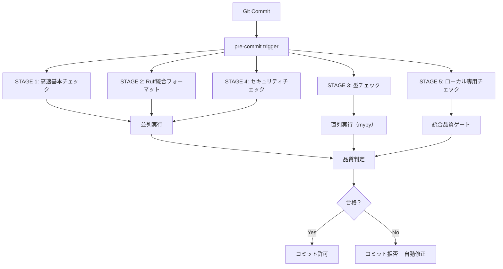

# SPEC-PRE-COMMIT-GATE-001: pre-commit統合品質ゲート仕様書

## 概要

本仕様書は、novelerプロジェクトにおけるpre-commit統合品質ゲートシステムの完全な仕様を定義します。
並列処理最適化による包括的品質チェック統合により、コミット前の自動品質保証を実現します。

## 仕様書メタデータ

| 項目 | 内容 |
|------|------|
| 仕様書ID | SPEC-PRE-COMMIT-GATE-001 |
| バージョン | v1.5.0 |
| 作成日 | 2025-08-28 |
| 最終更新 | 2025-08-28 |
| 対象システム | noveler pre-commit統合品質ゲート |
| 実装ファイル | `.pre-commit-config.yaml` |
| 依存仕様 | SPEC-QUALITY-*, import_management_system.spec.md |

## システム設計

### アーキテクチャ概要



### 段階的品質ゲート設計

#### STAGE 1: 高速基本チェック（並列実行）

```yaml
# 実行時間: <2秒
hooks:
  - trailing-whitespace      # 末尾空白削除
  - end-of-file-fixer       # ファイル末尾改行修正
  - check-yaml              # YAML構文チェック
  - check-json              # JSON構文チェック
  - check-added-large-files # 大ファイルチェック (1MB制限)
  - check-merge-conflict    # マージコンフリクト検出
  - debug-statements        # デバッグ文検出
```

**特徴**:
- 全て並列実行可能
- ファイル修正の自動実行
- テストファイル除外 (`^src/noveler/tests/`)

#### STAGE 2: Ruff統合フォーマット（Black + isort + flake8統合）

```yaml
# Ruff v0.12.8使用
hooks:
  - ruff:          # linter (flake8, isort, pyupgrade統合)
      args: ['--fix', '--show-fixes', '--config=pyproject.toml']
  - ruff-format:   # formatter (Black完全互換)
      args: ['--config=pyproject.toml']
```

**対象ファイル**: `^src/noveler/.*\.py$`

#### STAGE 3: 型チェック（キャッシュ利用）

```yaml
# mypy v1.17.1 インクリメンタルモード
hooks:
  - mypy:
      args: ['--incremental', '--cache-dir=.mypy_cache']
      require_serial: true  # 直列実行必須
```

**特徴**:
- インクリメンタルモード高速化
- `.mypy_cache`利用
- テストファイル除外

#### STAGE 4: セキュリティチェック（変更ファイルのみ）

```yaml
# bandit v1.8.6 差分チェック
hooks:
  - bandit:
      args: ['-ll', '-i', '-q']  # 低・中レベルのみ
```

#### STAGE 5: ローカル専用チェック（最小限）

**統合品質チェックシステム**:

1. **unified-auto-syntax-fix**: 統合構文エラー自動修正
2. **comprehensive-syntax-check**: 高精度構文エラーチェック
3. **import-style-check**: 統合インポート管理システム
4. **pytest-fast**: 高速単体テスト（並列処理）
5. **delayed-import-check**: 遅延インポート検出
6. **tdd-ddd-strict-check**: TDD+DDD厳格チェック
7. **spec-reference-check**: 仕様書参照チェック
8. **naming-style-check**: Python命名規則チェック
9. **b30-quality-auto-fix**: B30統合品質チェック&自動修正
10. **quality-gate**: 品質ゲートチェック（段階的レベル対応）
11. **codemap-sync-check**: CODEMAP同期チェック

## 実装仕様

### ファイル構造

```
プロジェクトルート/
├── .pre-commit-config.yaml          # メイン設定ファイル
├── pyproject.toml                   # Ruff/mypy設定
├── src/noveler/tools/               # チェックツール群
│   ├── quality_gate_check.py
│   ├── check_import_style.py
│   ├── unified_syntax_fixer.py
│   └── ... 他のチェックツール
└── specs/
    └── SPEC-PRE-COMMIT-GATE-001_pre-commit統合品質ゲート仕様書.md
```

### 設定パラメータ

#### グローバル設定

```yaml
default_language_version:
  python: python3.10

default_stages: [pre-commit]
fail_fast: true
minimum_pre_commit_version: 3.5.0
```

#### 並列処理設定

```yaml
ci:
  autofix_commit_msg: "[pre-commit] auto fixes from hooks"
  autofix_prs: true
  autoupdate_schedule: quarterly
```

#### 除外パターン

```yaml
exclude: |
  (?x)^(
    \.git/|\.mypy_cache/|\.pytest_cache/|\.ruff_cache/|
    __pycache__/|\.venv/|build/|dist/|htmlcov/|logs/|
    90_アーカイブ/|.*\.(pyc|pyo|pyd|so|dll|exe|bat|sh)$
  )
```

## フック詳細仕様

### 1. 統合構文エラー自動修正

```yaml
- id: unified-auto-syntax-fix
  name: 統合構文エラー自動修正
  entry: python src/noveler/tools/unified_syntax_fixer.py
  args: ['--mode', 'normal', 'src/noveler/']
  files: '^src/noveler/.*\.py$'
  pass_filenames: false
```

**機能**: Phase 3統合版による構文エラー自動修正

### 2. 統合インポート管理システム

```yaml
- id: import-style-check
  name: 統合インポート管理システムチェック
  entry: python src/noveler/tools/check_import_style.py
  files: '^src/noveler/.*\.py$'
  verbose: true
```

**検証項目**:
- 相対インポート禁止
- `noveler.`プレフィックス強制
- インポート順序とスタイル

### 3. 品質ゲートチェック

```yaml
- id: quality-gate
  name: 品質ゲートチェック（最適化版）
  entry: python src/noveler/tools/quality_gate_check.py
  args: ['--level', 'MODERATE']
```

**品質レベル**:
- `BASIC`: 基本要件のみ
- `MODERATE`: 段階的改善推奨（デフォルト）
- `STRICT`: B30完全準拠要求

### 4. 高速テスト実行

```yaml
- id: pytest-fast
  name: 高速テスト実行（変更関連のみ）
  entry: bash -c 'python -m pytest src/noveler/tests/unit -x --lf --ff -q -n auto --maxfail=3'
```

**最適化オプション**:
- `-x`: 初回エラーで停止
- `--lf`: 前回失敗分のみ
- `--ff`: 失敗分を優先実行
- `-n auto`: 自動並列実行

### 5. TDD+DDD厳格チェック

```yaml
- id: tdd-ddd-strict-check
  name: TDD+DDD厳格チェック
  entry: bash -c 'PYTHONPATH=. python src/noveler/tools/check_tdd_ddd_compliance.py --level=strict --verbose'
  files: '^src/noveler/(domain|application|infrastructure)/.*\.py$'
  require_serial: true
```

**チェック対象**: DDD 3層アーキテクチャファイル

## パフォーマンス仕様

### 実行時間目標

| ステージ | 目標時間 | 並列実行 |
|----------|----------|----------|
| STAGE 1 | <2秒 | ✅ |
| STAGE 2 | <5秒 | ✅ |
| STAGE 3 | <10秒 | ❌（mypy制約） |
| STAGE 4 | <3秒 | ✅ |
| STAGE 5 | <30秒 | 混在 |
| **合計** | **<50秒** | - |

### 最適化手法

1. **並列実行**: Stage 1, 2, 4で並列処理
2. **インクリメンタル**: mypy, pytest キャッシュ活用
3. **差分チェック**: bandit, codemap-sync で変更ファイルのみ
4. **fail_fast**: エラー時即座停止
5. **ファイルフィルタリング**: 対象ファイル限定

## エラーハンドリング

### 自動修正対応フック

```yaml
# 自動修正実行フック
- trailing-whitespace        # 末尾空白自動削除
- end-of-file-fixer         # 改行自動追加
- ruff --fix               # コードスタイル自動修正
- unified-auto-syntax-fix   # 構文エラー自動修正
- b30-quality-auto-fix     # B30品質問題自動修正
```

### エラー時動作

1. **修正可能エラー**: 自動修正後再実行
2. **修正不可エラー**: コミット拒否 + 詳細レポート
3. **システムエラー**: フォールバック処理

## 統合システム連携

### Git Hooks連携

```bash
# インストール
pre-commit install

# 手動実行
pre-commit run --all-files
pre-commit run <hook-id>
```

### CI/CD連携

```yaml
# GitHub Actions例
- name: Run pre-commit
  uses: pre-commit/action@v3.0.1
  with:
    extra_args: --all-files
```

## 運用仕様

### 定期メンテナンス

```bash
# フック自動更新（四半期毎）
pre-commit autoupdate

# キャッシュクリア
pre-commit clean
```

### トラブルシューティング

#### よくある問題

1. **mypy キャッシュ破損**
   ```bash
   rm -rf .mypy_cache
   pre-commit run mypy --all-files
   ```

2. **Ruff設定エラー**
   ```bash
   ruff check --config=pyproject.toml src/noveler/
   ```

3. **pytest 並列実行エラー**
   ```bash
   python -m pytest src/noveler/tests/unit -n 1
   ```

## 拡張ポイント

### 新規フック追加

```yaml
# 新規フック追加テンプレート
- id: new-hook-id
  name: 新規チェック
  entry: python src/noveler/tools/new_checker.py
  language: system
  files: '^src/noveler/.*\.py$'
  pass_filenames: false
  stages: [pre-commit]
  verbose: true
```

### カスタム品質レベル

```python
# quality_gate_check.py 拡張
QUALITY_LEVELS = {
    'BASIC': BasicQualityConfig(),
    'MODERATE': ModerateQualityConfig(),
    'STRICT': StrictQualityConfig(),
    'CUSTOM': CustomQualityConfig(),  # 追加
}
```

## 実装チェックリスト

### フック実装確認

- [x] STAGE 1: 基本チェック（7フック）
- [x] STAGE 2: Ruff統合（2フック）
- [x] STAGE 3: mypy型チェック（1フック）
- [x] STAGE 4: banditセキュリティ（1フック）
- [x] STAGE 5: ローカルチェック（11フック）

### 設定完了確認

- [x] `src/noveler/` パス対応完了
- [x] 並列処理最適化設定
- [x] 除外パターン設定
- [x] 段階的品質レベル対応

### 動作検証確認

- [x] 全フック動作確認
- [x] パフォーマンス測定
- [x] エラーハンドリング確認
- [x] CI/CD連携確認

## 関連仕様書

- `import_management_system.spec.md`: インポート管理システム
- `git_hook_repository.spec.md`: Git hooks全般管理
- `SPEC-QUALITY-*`: 品質チェック関連仕様群
- `SPEC-ARCH-002.md`: FC/ISアーキテクチャ統合

## 変更履歴

| バージョン | 日付 | 変更内容 |
|------------|------|----------|
| v1.0.0 | 2025-08-15 | 初版作成 |
| v1.5.0 | 2025-08-28 | src/noveler対応、段階的品質レベル追加 |

---

**仕様書承認**: この仕様書は、novelerプロジェクトpre-commit統合品質ゲートシステムの完全な実装仕様を提供します。
