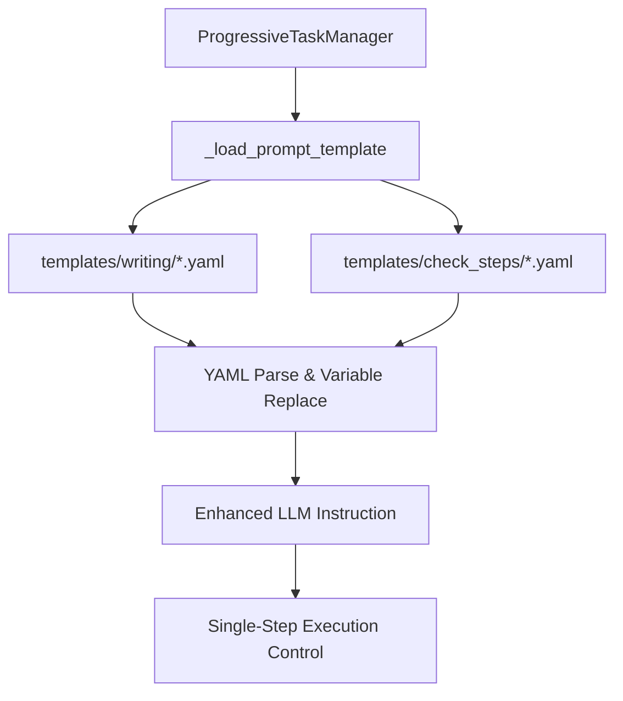

# SPEC-PROMPT-001: プロンプト外部ファイル化システム

## メタデータ

| 項目 | 内容 |
|------|------|
| 仕様ID | SPEC-PROMPT-001 |
| E2EテストID | E2E-PROMPT-001 |
| test_type | integration / unit |
| バージョン | v1.0.0 |
| 作成日 | 2025-01-09 |
| 最終更新 | 2025-01-09 |
| ステータス | draft |
| 関連仕様 | SPEC-PROGRESSIVE-001 (段階実行システム) |

## 1. 概要

18ステップ執筆システムと12ステップ品質チェックシステムで使用するプロンプトを外部YAMLファイル化し、コード変更なしでプロンプトの継続的改善を可能にする。また、LLMが確実に1ステップずつ実行するよう制御を強化する。

## 2. ビジネス要件

### 2.1 目的
- プロンプトの継続的改善によりLLMの出力品質向上
- 段階実行制御の確実性向上（LLMが複数ステップを一括実行しないよう制御）
- 開発者・ライター・編集者によるプロンプト協調改善体制の確立
- A/Bテスト実施によるプロンプト効果測定

### 2.2 成功基準
- プロンプト変更時のコード修正が0回（設定ファイルのみで完結）
- LLMの段階実行遵守率が95%以上（一括実行の防止）
- プロンプト改善サイクル時間が従来比50%削減
- ステップ完了率が80%から95%以上に向上

## 3. 機能仕様

### 3.1 スコープ
- **含まれるもの**:
  - 18ステップ執筆システムのプロンプト外部化
  - 12ステップ品質チェックシステムのプロンプト外部化
  - プロンプトテンプレート読み込み機能
  - 段階実行制御の強化
  - プロンプトバージョン管理機能
- **含まれないもの**:
  - A/Bテスト実行基盤の実装（将来対応）
  - プロンプト効果測定ダッシュボード（将来対応）

### 3.2 ユースケース

#### UC-001: プロンプトテンプレートの読み込み
```yaml
前提条件: ProgressiveTaskManagerが初期化済み
アクター: システム（ProgressiveTaskManager）
入力: step_id (例: 0, 2.5, 5)
処理手順:
  1. templates/writing/step{id}_*.yaml の検索
  2. テンプレートファイルの存在確認
  3. YAMLファイルの読み込みとパース
  4. テンプレート変数の置換
  5. フォールバック（既存llm_instructionの使用）
期待出力: 完成されたLLM指示文字列
事後条件: LLMに適切な指示が渡される
```

#### UC-002: 段階実行制御の強化
```yaml
前提条件: 外部プロンプトテンプレートが読み込み済み
アクター: LLM（Claude等）
入力: 生成されたプロンプト指示
処理手順:
  1. 「このステップのみ実行」指示の確認
  2. 現在のステップ番号と名前の表示
  3. 作業内容の実行
  4. 完了基準の確認
  5. 次ステップへの明示的な停止指示の確認
期待出力: 単一ステップの完了報告
事後条件: LLMが次のステップを自動実行しない
```

#### UC-003: プロンプト改善サイクル
```yaml
前提条件: 既存のプロンプトテンプレートが存在
アクター: 開発者・ライター・編集者
入力: 改善したいステップのプロンプト内容
処理手順:
  1. 該当するYAMLファイルの編集
  2. バージョン番号の更新
  3. 変更理由のメタデータ記録
  4. システム再起動なしでの即座反映
期待出力: 改善されたプロンプト実行
事後条件: 全ユーザーに改善されたプロンプトが適用
```

## 4. 技術仕様

### 4.0 既存実装調査（必須）

**⚠️ 新機能実装前の必須確認事項**

1. **CODEMAP.yaml確認**
   ```bash
   grep -i "template\|prompt\|progressive" CODEMAP.yaml
   ```

2. **共有コンポーネント確認**
   ```yaml
   既存実装活用チェックリスト:
     - ProgressiveTaskManager: ✅ 拡張対象
     - ProgressiveCheckManager: ✅ 同様の機能実装
     - templates/ ディレクトリ: ✅ 既存構造活用
     - yaml.safe_load: ✅ 既存パターン踏襲
   ```

3. **類似機能検索結果**
   ```bash
   # 既存のテンプレート機能
   find templates/ -name "*.yaml" | head -5
   # templates/a30_prompts/step5_logic_verification.yaml
   # templates/claude_quality/comprehensive.yaml
   # templates/plot/chapter_plot.yaml
   ```

4. **再利用可否判定**
   - ✅ 既存ProgressiveTaskManagerクラスを拡張
   - ✅ 既存templates/構造を活用
   - ✅ 既存YAMLパース処理を踏襲
   - ❌ 新規クラス作成は不要（既存拡張で対応）

### 4.1 アーキテクチャ



### 4.2 ディレクトリ構造

```
templates/
├── writing_steps/              # 18ステップ執筆用プロンプト
│   ├── step00_scope_definition.yaml
│   ├── step01_chapter_purpose.yaml
│   ├── step02_section_goals.yaml
│   ├── step02_5_theme_uniqueness.yaml  # 小数点ステップ対応
│   ├── step03_section_balance.yaml
│   ├── step04_scene_beats.yaml
│   ├── step05_logic_verification.yaml  # 既存a30_prompts/から移動
│   ├── step06_character_consistency.yaml
│   ├── step07_dialogue_design.yaml
│   ├── step08_emotion_curve.yaml
│   ├── step09_scene_atmosphere.yaml
│   ├── step10_dramatic_tension.yaml
│   ├── step11_narrative_flow.yaml
│   ├── step12_first_draft.yaml
│   ├── step13_expression_polish.yaml
│   ├── step14_rhythm_adjust.yaml
│   ├── step15_quality_check.yaml
│   ├── step16_final_review.yaml
│   └── step17_publication_prep.yaml
└── check_steps/                # 12ステップ品質チェック用プロンプト
    ├── step01_typo_check.yaml
    ├── step02_grammar_check.yaml
    ├── step03_readability_check.yaml
    ├── step04_character_consistency.yaml
    ├── step05_plot_consistency.yaml
    ├── step06_worldview_check.yaml
    ├── step07_structure_check.yaml
    ├── step08_foreshadowing_check.yaml
    ├── step09_scene_transition_check.yaml
    ├── step10_expression_style_check.yaml
    ├── step11_rhythm_tempo_check.yaml
    └── step12_comprehensive_quality.yaml
```

### 4.3 YAMLテンプレート形式

```yaml
# templates/writing/step00_scope_definition.yaml
metadata:
  step_id: 0
  step_name: "スコープ定義"
  phase: "structural_design"
  version: "1.0.0"
  last_updated: "2025-01-09"
  author: "noveler system"
  description: "エピソードの目的・範囲・文字数目標を明確に定義"

prompt:
  main_instruction: |
    【重要】このステップ（STEP {step_id}）のみを実行してください。
    複数ステップを一括で実行しないでください。

    === 現在のステップ ===
    STEP {step_id}: {step_name}
    進捗: {completed_steps}/{total_steps} ステップ完了
    フェーズ: {phase}

    === 作業内容 ===
    エピソード{episode_number}のスコープを定義します：

    1. **主要目標の設定**
       - このエピソードで達成したい物語上の目標
       - 読者に与えたい感情的体験
       - キャラクターの成長・変化ポイント

    2. **文字数目標の設定**
       - 目安: 5000-8000文字
       - シーン数に応じた配分
       - 読者の読了時間を考慮

    3. **読者への影響の明確化**
       - 期待される感情的効果
       - 次話への期待値設計
       - シリーズ全体への貢献

  completion_criteria: |
    以下が完了したら、このステップは完了です：
    ✓ エピソードの主要目標が具体的に定義されている
    ✓ 文字数目標が適切に設定されている（5000-8000文字目安）
    ✓ 読者への期待される影響が明記されている
    ✓ 次ステップへの準備が整っている

  next_action_instruction: |
    【次のアクション】
    このステップが完了したら、以下を行ってください：

    1. **結果の報告**
       - スコープ定義の内容を整理して報告
       - 設定した目標の妥当性を確認

    2. **次ステップの準備**
       - 次のステップは以下のコマンドで実行します：
       ```
       execute_writing_step episode_number={episode_number} step_id=1
       ```

    **⚠️ 重要**:
    - 次のステップは別途指示があるまで実行しないでください
    - 複数ステップを一括実行しないでください
    - このステップの完了を確認してから進んでください

variables:
  - step_id
  - step_name
  - episode_number
  - completed_steps
  - total_steps
  - phase
  - previous_result  # オプション

control_settings:
  strict_single_step: true      # 厳格な単一ステップ実行
  require_completion_confirm: true  # 完了確認必須
  auto_advance_disabled: true   # 自動進行無効化
  batch_execution_blocked: true # バッチ実行ブロック
```

### 4.4 コード実装仕様

#### ProgressiveTaskManagerの拡張

```python
class ProgressiveTaskManager:
    def __init__(self, project_root: Path, episode_number: int):
        # ...既存コード...
        self.prompt_templates_dir = Path("templates/writing")
        self.check_templates_dir = Path("templates/check_steps")

    def _load_prompt_template(self, step_id: int | float, template_type: str = "writing") -> Optional[dict]:
        """外部プロンプトテンプレートを読み込む

        Args:
            step_id: ステップID（整数または小数点）
            template_type: テンプレートタイプ（"writing" または "check"）

        Returns:
            読み込まれたテンプレート辞書、またはNone
        """
        # ステップIDを文字列に変換（小数点対応）
        step_str = str(step_id).replace('.', '_')

        # テンプレートディレクトリを選択
        template_dir = (self.prompt_templates_dir if template_type == "writing"
                       else self.check_templates_dir)

        # テンプレートファイルを検索
        pattern = f"step{step_str}_*.yaml"
        matching_files = list(template_dir.glob(pattern))

        if matching_files:
            try:
                with open(matching_files[0], 'r', encoding='utf-8') as f:
                    return yaml.safe_load(f)
            except Exception as e:
                self.logger.warning(f"テンプレート読み込みエラー: {e}")

        return None

    def _generate_enhanced_llm_instruction(self, task: dict) -> str:
        """強化されたLLM指示を生成（外部テンプレート対応）"""
        # 外部テンプレートを試行
        template = self._load_prompt_template(task['id'])

        if template:
            # テンプレート変数を準備
            variables = self._prepare_template_variables(task)

            # プロンプトの各セクションを組み立て
            instruction_parts = []

            # メイン指示
            main_instruction = template['prompt']['main_instruction']
            instruction_parts.append(self._replace_variables(main_instruction, variables))

            # 完了基準
            if 'completion_criteria' in template['prompt']:
                instruction_parts.append("=== 完了基準 ===")
                completion_criteria = template['prompt']['completion_criteria']
                instruction_parts.append(self._replace_variables(completion_criteria, variables))

            # 次アクション指示
            if 'next_action_instruction' in template['prompt']:
                instruction_parts.append("=== 次のアクション ===")
                next_action = template['prompt']['next_action_instruction']
                instruction_parts.append(self._replace_variables(next_action, variables))

            return "\n\n".join(instruction_parts)

        # フォールバック: 既存のllm_instructionを使用
        return task.get('llm_instruction', f"ステップ {task['id']} を実行してください")

    def _prepare_template_variables(self, task: dict) -> dict[str, Any]:
        """テンプレート変数を準備"""
        return {
            'step_id': task['id'],
            'step_name': task['name'],
            'episode_number': self.episode_number,
            'completed_steps': len(self.current_state['completed_steps']),
            'total_steps': len(self.tasks_config['tasks']),
            'phase': task.get('phase', 'unknown'),
            'previous_result': self._get_previous_step_result(),
            'project_root': str(self.project_root)
        }

    def _replace_variables(self, text: str, variables: dict) -> str:
        """テンプレート変数を置換"""
        for key, value in variables.items():
            text = text.replace(f'{{{key}}}', str(value))
        return text
```

## 5. 実装計画

### 5.1 Phase 1: ディレクトリ構造整備
1. `templates/writing/` ディレクトリ作成
2. `templates/check_steps/` ディレクトリ作成
3. 既存 `templates/a30_prompts/` からstep5-9を移行

### 5.2 Phase 2: YAMLテンプレート作成
1. 18ステップ執筆用テンプレート作成（step00-step17）
2. 12ステップ品質チェック用テンプレート作成（step01-step12）
3. バージョン管理・メタデータの標準化

### 5.3 Phase 3: コード実装
1. `ProgressiveTaskManager._load_prompt_template()` 実装
2. `ProgressiveTaskManager._generate_enhanced_llm_instruction()` 実装
3. 変数置換システムの実装

### 5.4 Phase 4: テスト・検証
1. ユニットテスト実行
2. 統合テスト実行
3. 段階実行制御の動作確認

## 6. テスト仕様

### 6.1 ユニットテスト

```python
class TestPromptTemplateSystem:
    def test_load_prompt_template_existing_file(self):
        """既存テンプレートファイルの読み込みテスト"""

    def test_load_prompt_template_decimal_step(self):
        """小数点ステップ（2.5等）のテンプレート読み込みテスト"""

    def test_template_variable_replacement(self):
        """テンプレート変数置換テスト"""

    def test_fallback_to_embedded_instruction(self):
        """外部テンプレートが見つからない場合のフォールバック動作テスト"""

    def test_single_step_control_enforcement(self):
        """単一ステップ実行制御の強制テスト"""
```

### 6.2 統合テスト

```python
class TestProgressiveExecutionWithTemplates:
    def test_step_by_step_execution_with_templates(self):
        """テンプレート使用時の段階実行テスト"""

    def test_llm_instruction_quality_improvement(self):
        """LLM指示品質向上の検証テスト"""

    def test_template_hot_reload(self):
        """テンプレートのホットリロード動作テスト"""
```

## 7. 品質基準

### 7.1 パフォーマンス要件
- テンプレート読み込み時間: 50ms以下
- メモリ使用量増加: 5MB以下
- 段階実行遵守率: 95%以上

### 7.2 可用性要件
- テンプレート読み込み失敗時の自動フォールバック
- 不正なYAML形式への適切なエラーハンドリング
- システム再起動なしでのテンプレート反映

### 7.3 保守性要件
- プロンプト変更時のコード修正0回
- テンプレートのバージョン管理機能
- 変更履歴の自動記録

## 8. マイグレーション計画

### 8.1 既存システムからの移行
1. 既存 `llm_instruction` をYAMLテンプレートに変換
2. 段階的な置き換え（フォールバック機能により安全に移行）
3. 既存テストケースの維持・更新

### 8.2 後方互換性
- 外部テンプレートが見つからない場合の自動フォールバック
- 既存の `writing_tasks.yaml` 形式との並行稼働
- 段階的な移行が可能な設計

## 9. 運用・監視

### 9.1 ログ出力
- テンプレート読み込み成功/失敗ログ
- 使用されたテンプレートファイルの記録
- フォールバック発生時の通知

### 9.2 メトリクス監視
- テンプレート使用率
- 段階実行遵守率
- ステップ完了率の変化
- プロンプト改善効果の測定
