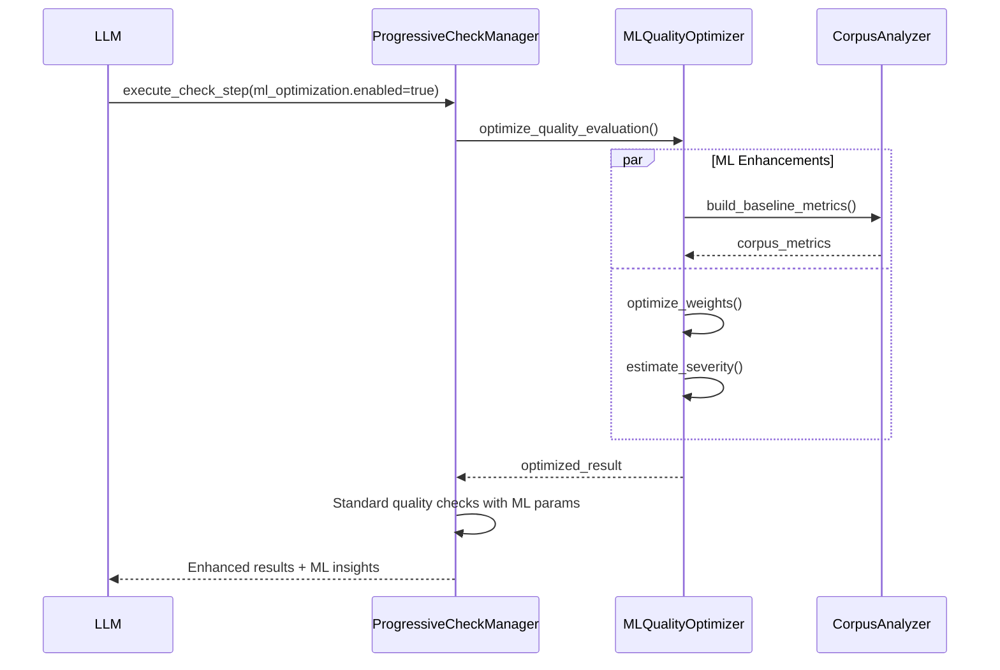

# SPEC-QUALITY-110: 段階的品質チェック MCP フロー仕様書

## 1. 概要

### 1.1 目的
18 ステップ執筆フローの品質保証段階を MCP 経由で段階実行できるようにするため、`get_check_tasks` / `execute_check_step` / `get_check_status` / `get_check_history` / `check_basic` から成るツール群の仕様を定義する。

> MCP 側のツール定義は `SPEC-MCP-002` の「段階的品質チェック MCP フロー」セクションを参照。

### 1.2 範囲
- 対象コンポーネント: `src/noveler/domain/services/progressive_check_manager.py`, `src/mcp_servers/noveler/main.py`
- 出力先: `.noveler/checks/{session_id}/`, `temp/json_output/checks/`（詳細は SPEC-QUALITY-120 を参照）
- 連携先: 品質改善ツール (`run_quality_checks`, `improve_quality_until`), LangSmith ワークフロー, ML品質最適化 (SPEC-QUALITY-140)

### 用語定義（追加）
- Dialogue（会話）: 行頭が「「/『」で始まり対応する閉じ記号を持つ段落、行頭のダッシュ（―/—/─）開始、`名前:` 形式の台詞段落を含む。
- Narration（地の文）: 上記に該当しない段落。
- Section: 700–1,100字を目安とした意味の塊。1話あたり 7–12 セクションを推奨。
- Hook: 40–60%に小山（minor peak）、80–90%にミニフック（mini hook）、末尾に主フック（main hook）。


## 2. ユースケース

| UC ID | シナリオ | 主なツール |
| --- | --- | --- |
| UC-QC-001 | LLM が品質タスク一覧を取得し次のステップを選択する | `get_check_tasks` |
| UC-QC-002 | 特定ステップを実行し品質スコアと改善内容を取得する | `execute_check_step` |
| UC-QC-003 | 実行途中の進捗・残時間をモニタリングする | `get_check_status` |
| UC-QC-004 | 完了履歴を参照し結果を要約する | `get_check_history` |
| UC-QC-005 | CLI 互換の簡易チェックを実行する | `check_basic` |

### 2.1 CLI 役割分離（方針）
- `noveler check`: 品質の『評価』専用（スコア算出・軽量オートフィクスの導線）。原稿の直接書き換えは行わない。
- `noveler polish`: 改稿（Stage2/Stage3）の実行導線。必要に応じてファイルへ適用（`dry_run` 切替）。
- 内部では両者とも ProgressiveCheckManager を共有し、テンプレート読込・段階タスク・LLM向け指示生成・I/Oログを一元管理する。
<!-- CLI_SPLIT_INSERTED -->

## 3. MCP ツール仕様

### 3.1 `get_check_tasks`
```yaml
input:
  episode_number: int (required)
  project_root: string?
  exclude_dialogue_lines: bool?  # 既定 true（会話行を短長判定から除外）
  rule_profile: string?          # 例: "mixed_device_daily_6k_10k"
  window_size: int?              # 既定 5（移動平均）
  config_overrides?:
    target_length?: { min: int, max: int }  # プロジェクト設定の一時上書き  # 省略時は PathService が解決
output:
  session_id: string            # 初回呼び出しで払い出される LangGraph セッションID
  episode_number: int
  current_step: int
  current_task: Task
  executable_tasks: list[Task]
  progress:
    completed: int
    total: int
    percentage: float
  llm_instruction: string
  next_action: string
  phase_info: object
  tasks: list[Task]
Task:
  id: int
  name: string
  phase: string  # basic_quality / structure_quality / polish
  description: string
  llm_instruction: string
  estimated_duration: string  # e.g. "3-5分"
  dependencies: list[int]
```

### 3.2 `execute_check_step`
```yaml
input:
  episode_number: int
  step_id: int
  manuscript_content: string?  # LLM が差し替えたい原稿を直渡しする場合
  check_focus: string?         # typo_detection / grammar / structure 等
  project_root: string?
  exclude_dialogue_lines: bool?  # 既定 true（会話行を短長判定から除外）
  rule_profile: string?          # 例: "mixed_device_daily_6k_10k"
  window_size: int?              # 既定 5（移動平均）
  config_overrides?:
    target_length?: { min: int, max: int }  # プロジェクト設定の一時上書き
output:
  success: bool
  quality_score: float
  issues_found: int
  corrections: list[string]
  files:
    input_file: string
    output_file: string
  next_step: int?
  session_id: string
  guidance: string?  # 失敗時のリカバリガイド
metadata:
  config_snapshot:
    target_length: { min: int, max: int, source: string }  # source: project_config|global_default|default
  rhythm_metrics:  # Narrationのみで算出
    p25: number
    p50: number
    p75: number
    short_run_violations: list
    long_run_violations: list
    window_in_range_ratio: number
  dialogue_warnings:  # 参考（非減点）
    same_ending_runs: list
    punctuation_runs: list
    ultra_short_runs: list
  hook_assessment:
    minor_peak_position_pct: number
    mini_hook_position_pct: number
    main_hook_strength: string  # weak|avg|strong
  length_stats:
    body_chars: int
    in_range: bool

- プロンプトテンプレートは Schema v2 (`templates/quality/checks/check_step*`) をロードし、`tasks` / `control_settings.by_task` / `acceptance_criteria` を LLM 指示と検収判定に利用する。


テンプレート探索順（統一）:

1) `templates/quality/checks/`（正本）

2) `templates/quality/checks/backup/`（退避・参照専用）

3) 旧互換: `templates/writing/`（存在時のみ）

最初に読み込めたテンプレートを採用し、検証失敗時は内蔵フォールバックと WARN ログを発行する。

UniversalLLMUseCase連携:
- ProgressiveCheckManagerは Schema v2 テンプレートから合成した `prompt_content` を UniversalLLMUseCase へ渡し、Claude Code 実行とフォールバック制御を委譲する。
- LLMレスポンス成功時は `summary`/`metrics`/`issues`/`recommendations` を `execution_result.metadata.structured_output` として保存し、`overall_score` や `issues_found` へ反映する。
- LLM呼び出し失敗時は WARN ログを発行し、`metadata.fallback_reason` を付与したスタブ結果にフォールバックする。
<!-- TEMPLATE_SEARCH_ORDER_INSERTED -->


```

### 3.3 `get_check_status`
```yaml
input:
  episode_number: int
output:
  session_id: string
  total_steps: int
  completed_steps: int
  progress_percentage: float
  current_phase: string
  last_completed_step: int?
  next_step: int?
  estimated_remaining_time: string
```

### 3.4 `get_check_history`
```yaml
input:
  episode_number: int
output:
  history: list[HistoryEntry]
HistoryEntry:
  step_id: int
  step_name: string
  executed_at: datetime
  execution_time: float
  success: bool
  quality_score: float
  issues_found: int
```

### 3.5 `check_basic`
- CLI `noveler check --basic` を内部実行。
- 出力: `word_count`, `style_check`, `quick_score`, `issues[]`。
- 失敗時は CLI の stderr をそのまま `error_log` フィールドに格納する。

## 4. セッション管理

- 状態保存: `WorkflowStateStore` が `.noveler/checks/{session_id}/` にセッション/ステップ/I/O/監査ログを出力し、`state_version` と `locks` テーブルで整合性を担保する（SPEC-QUALITY-120 3章参照）。
- 保存タイミング: 各ステップ完了時、および例外発生時に `commit()` を実行。ロールバック時はテンポラリ書き込みを破棄しロック解放。
- 主なキー構造:
```json
{
  "session_id": "QC_EP001_20250918_103000",
  "episode_number": 1,
  "state_version": 2,
  "iteration_policy": {"count": 2, "until_pass": true},
  "locks": {"episode": 1, "status": "held"},
  "steps": [
    {
      "step_id": 1,
      "attempt": 1,
      "issues_detected": 2,
      "manuscript_hash_refs": [
        {"type": "input", "hash": "sha256:..."},
        {"type": "output", "hash": "sha256:..."}
      ],
      "available_tools": ["auto_fix_rhythm"],
      "tool_selection_status": "auto"
    }
  ]
}
```

## 5. エラー処理

| コード | 条件 | 対応 |
| --- | --- | --- |
| QC-001 | セッションファイル不整合 | `session_reset_required: true` を返し再実行を促す |
| QC-002 | 外部ファイル不足 | `missing_files[]` に不足分を列挙し CLI への fallback を案内 |
| QC-003 | LLM 指定ステップ不正 | `valid_steps` を提示し再入力させる |
| QC-004 | CLI 実行失敗（`check_basic` 経由） | `error_log` に CLI stderr を格納し、再実行コマンドを提示 |
| QC-005 | セッションファイル破損 | バックアップから復旧するか新規セッション発行を案内 |
| QC-013 | 手動位置調整が必要 | `manual_alignment_required: true` を返し、SPEC-QUALITY-120 の再マッピング手順へ誘導 |
| QC-015/016/017 | 本文取得失敗 | fetch_artifact/read_snapshot/request_manual_upload の各失敗時に返却し `metadata.recovery_hint` で再試行手順を提示 |
| QC-018 | 本文ハッシュ不一致 | セッションを `state_version` 巻き戻し再取得を要求 |

## 6. 関連テスト

| テスト | 内容 |
| --- | --- |
| `tests/integration/mcp/test_progressive_check_mcp_tools.py` | MCP 経由の段階タスク実行と履歴参照 |
| `tests/unit/domain/services/test_progressive_check_manager_compliance.py` | `ProgressiveCheckManager` のユースケース準拠性 |

### 6.1 追加テスト TODO
- セッション破損時の自動リセット動作を確認する統合テスト
- CLI `noveler check --basic` 失敗時の `error_log` 取得テスト


---

本仕様書は要件 REQ-QUALITY-STAGED-004 の準拠を保証する。今後ステップ構成や評価指標に変更が生じた場合は、本書のセクション 3/4/5 を更新し、`SPEC-MCP-002` と整合させること。


### 5.1 LLM I/O ログ方針
- 位置: `.noveler/checks/{session_id}/` に `*_input.json`/`*_output.json` を保存。
- 追跡: `session_id`, `step_id`, `template_source`（`checks|backup|embedded`）を必ず記録。
- 本文の冗長保存は避け、必要最小限の抜粋やハッシュ参照、またはアーティファクトIDで管理する。


## 6. ProgressiveCheck 反復API（追加）

12ステップ品質チェックをステップ単位で反復実行できるよう、以下の MCP API を提供する。

### 6.1 ツール一覧（progressive_check.*）
- `progressive_check.get_tasks`
  - in: `{ episode_number:int, session_id?:string }`
  - out: `{ session_id:string, tasks:list, executable_tasks:list, current_step:int }`
  - 備考: `session_id` が指定されない場合は ProgressiveCheckManager が LangGraph ワークフローを初期化し、`.noveler/checks/{session_id}/manifest.json` を生成する。既存セッションを再開する場合は `session_id` を指定する。
- `progressive_check.execute_step`
  - in: `{ session_id:string, step_id:int, input_data?:object, iteration_policy?:IterationPolicy, llm_overrides?:object }`
  - out: `{ success:bool, execution_result:ExecutionResult, artifacts:list, passed?:bool, next_step?:int }`
- `progressive_check.repeat_step`
  - in: `{ session_id:string, step_id:int, iteration_policy:IterationPolicy }`
  - out: `{ success:bool, final_result:ExecutionResult, attempts:int, stopped_reason:string }`
- `progressive_check.get_status`
  - in: `{ session_id:string }`
  - out: `{ current_step:int, completed_steps:list, failed_steps:list, progress:object, manifest:object }`
- `progressive_check.list_artifacts`
  - in: `{ session_id:string }`
  - out: `{ artifacts:list }`
- `progressive_check.end_session`
  - in: `{ session_id:string, finalize?:bool }`
  - out: `{ success:bool, closed:bool }`

### 6.2 廃止コマンドとガイダンス
- `progressive_check.start_session` は LangGraph 常時有効化に伴い廃止。呼び出された場合は `get_tasks` の使用を案内する CLI メッセージ（`"use progressive_check.get_tasks to initialise a session"`）を返すこと。
- `progressive_check.get_tasks` 以外の未実装コマンドが呼び出された場合も同様にガイド文を返却し、ステートフルな操作は `session_id` ベースで行うことを明示する。

### 6.3 反復ポリシー（IterationPolicy）
```yaml
IterationPolicy:
  count: int            # 最大反復回数（既定: 1）
  time_budget_s: int?   # 秒単位の時間上限
  cost_budget: int?     # 呼び出し数やトークン上限（将来拡張）
  until_pass: bool      # acceptance_criteria 合格で停止（既定: false）
  min_improvement: float # 前回比の最小改善幅（例: +1.0）
  dry_run: bool         # LLM 実行せず擬似結果（既定: false）
```

### 6.4 マニフェスト（manifest.json）
セッションルートに以下の情報を保持する。
```json
{
  "session_id": "QC_EP001_20250925_1030",
  "episode_number": 1,
  "current_step": 3,
  "completed_steps": [1,2],
  "failed_steps": [],
  "template_version_set": {
    "1": {"version":"2.0.0","hash":"...","path":"templates/quality/checks/check_step01_typo_check.yaml"}
  },
  "budgets": {"time_budget_s": 180, "count": 3},
  "llm_config": {"model_hint": "auto"},
  "target_length": {"min": 6000, "max": 10000, "source": "project_config"}  // 例
}
```

### 6.4 追加エラーコード
| コード | 条件 | 対応 |
| --- | --- | --- |
| QC-006 | TEMPLATE_VERSION_MISMATCH | マニフェストの固定バージョンと不一致。バージョン確認または再セッション作成 |
| QC-007 | POLICY_BUDGET_EXCEEDED | 反復ポリシーの時間/回数/コスト予算を超過 | 反復を停止し最終結果を返却 |
| QC-008 | STATE_CONFLICT | 併行実行・ステート不整合 | セッションを一時ロックし再試行を案内 |
| QC-009 | PROJECT_CONFIG_NOT_FOUND | プロジェクト設定が見つからない | 致命エラーとしてステップを中断し、`input_data.config_overrides.target_length` が指定された場合のみ続行可（source=override）。 |
| QC-010 | PROJECT_CONFIG_INVALID | min/max が不正 | 致命エラーとしてステップを中断し、`input_data.config_overrides.target_length` が指定された場合のみ続行可（source=override）。 |

### 6.5 役割分離の明確化
- `run_quality_checks`/`improve_quality_until` はライトウェイト評価（12ステップではない）。
- 段階的な 12 ステップ実行は `progressive_check.*` 系 API を使用する。


### 7. 最終受入基準（step12 追記）
- length_in_range: 本文の正味文字数が `target_length.min`〜`max` に収まること（必須）。
- 不足/超過時の対応: 2話分割または冗長削減の提案を返し、fail とする。
- プロジェクト設定は `ConfigResolver` で解決し、欠落時は 6000/10000 を使用する。

---

## 8. ML強化品質評価統合 (SPEC-QUALITY-140)

### 8.1 概要
SPEC-QUALITY-140 で定義されるML強化品質最適化システムと統合し、段階的チェックの各ステップでML学習を活用する。

### 8.2 統合ポイント

#### 8.2.1 execute_check_step へのML拡張
`execute_check_step` に以下のオプショナルパラメータを追加:

```yaml
input:
  # 既存パラメータ...
  ml_optimization:
    enabled: bool = false
    corpus_model_id: string?
    use_dynamic_thresholds: bool = false
    use_dynamic_severity: bool = false
    auto_optimize_weights: bool = false
```

#### 8.2.2 出力への学習メトリクス追加
ML有効時、`metadata` に以下を追加:

```yaml
metadata:
  # 既存フィールド...
  ml_enhancements:
    corpus_baseline_comparison:
      genre: string
      baseline_score: float
      relative_score: float  # -1.0 to 1.0 (above/below baseline)
    dynamic_thresholds_applied:
      rhythm:
        original: {short_run_max: int, long_run_max: int}
        learned: {short_run_max: int, long_run_max: int}
      readability:
        original: {min_score: float}
        learned: {min_score: float}
    severity_adjustments:
      - issue_id: string
        base_severity: float
        position_multiplier: float
        frequency_penalty: float
        adjusted_severity: float
    weight_optimization:
      original_weights: dict[str, float]
      optimized_weights: dict[str, float]
      performance_gain: float
```

#### 8.2.3 フィードバック自動記録
各ステップ完了時、ML有効の場合は自動的に `record_improvement_feedback` を呼び出し:
- before_scores: 前ステップのスコア
- after_scores: 現ステップのスコア
- applied_fixes: ステップで適用された修正
- remaining_issues: 未解決の違反

### 8.3 ワークフロー統合



### 8.4 段階的導入

1. **Phase 1**: `execute_check_step` に `ml_optimization` パラメータ追加（デフォルト無効）
2. **Phase 2**: 特定ステップ（rhythm, readability）でML試験運用
3. **Phase 3**: 全ステップでML有効化、標準チェックと並行実行
4. **Phase 4**: ML-enhanced checksを主評価に切り替え

### 8.5 エラーハンドリング

| コード | 条件 | 対応 |
| --- | --- | --- |
| QC-ML-001 | コーパスモデル未見つかり | 標準閾値にフォールバック、WARNING ログ |
| QC-ML-002 | ML最適化タイムアウト | 標準チェックのみ実行、metadata.ml_fallback_reason を設定 |
| QC-ML-003 | フィードバック記録失敗 | チェック結果は返却、エラーログのみ記録 |

### 8.6 パフォーマンス要件

- ML最適化による追加レイテンシ: ≤5秒/ステップ
- コーパスメトリクス計算: ≤3秒（キャッシュ有効時 ≤100ms）
- メモリ使用量増加: ≤200MB（モデルロード時）
