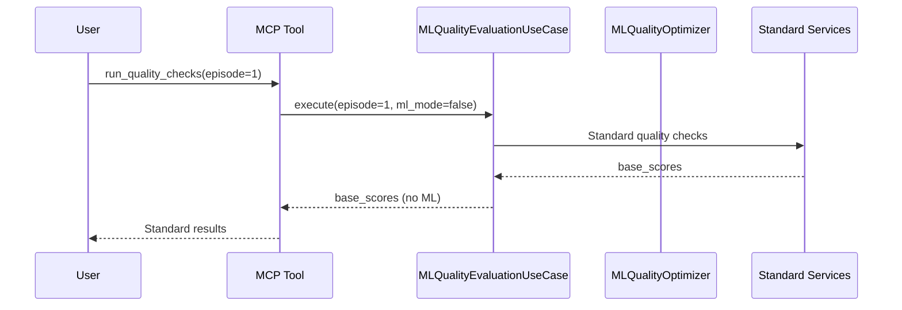
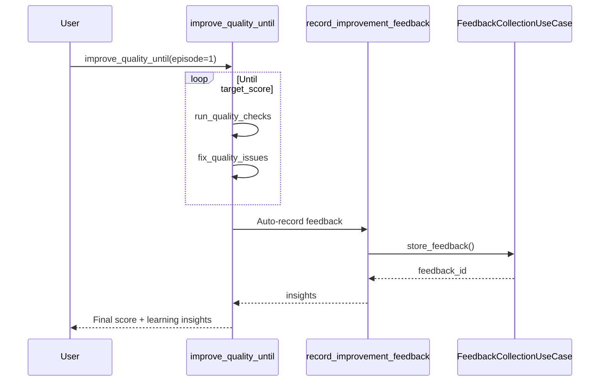

# SPEC-QUALITY-140: ML強化品質最適化システム仕様書

## 1. 概要

### 1.1 目的
静的閾値による品質評価の限界を超え、プロジェクト固有のコーパス学習・動的最適化・フィードバックループを統合した機械学習ベースの品質最適化システムを定義する。

### 1.2 背景と課題
現行の品質チェックシステム (SPEC-QUALITY-110) は以下の制約を抱える:

1. **固定閾値の問題**
   - `SentenceRunAnalysisService`、`ReadabilityAnalysisService` は静的閾値のみを使用
   - プロジェクトごとの特性（ジャンル、読者層、作家スタイル）を反映できない
   - 類似作品との相対比較ができない

2. **重み付けの最適化不足**
   - `run_quality_checks` の `weights` パラメータは手動設定のみ
   - プロジェクトごとの評価実績を反映した自動調整がない
   - `score_method="weighted_average"` の精度向上が困難

3. **Gate設定の硬直性**
   - `.novelerrc.yaml` の `gate_thresholds` と `fail_on` は固定値
   - 検査結果履歴から自動調整する仕組みがない
   - 妥当な合否判定の維持が困難

4. **重大度推定の粗さ**
   - モジュールごとに固定ペナルティ
   - 違反頻度や位置（冒頭・クライマックス等）の重要度を考慮できない
   - `overall_score` の感度が低い

5. **反復学習の不足**
   - `improve_quality_until` との連携が限定的
   - 改善前後のスコア差や未解決違反種別のフィードバックがない
   - 反復的な問題学習・優先順位付けができない

### 1.3 スコープ
- **対象コンポーネント**:
  - `src/noveler/domain/services/ml_quality_optimizer.py` (新規)
  - `src/noveler/domain/learning/corpus_analyzer.py` (新規)
  - `src/noveler/application/use_cases/ml_quality_evaluation_use_case.py` (新規)
- **連携先**:
  - SPEC-QUALITY-110 (Progressive Check Flow)
  - SPEC-QUALITY-019 (Adaptive Quality Evaluation)
  - `run_quality_checks`, `improve_quality_until`, `fix_quality_issues`
- **データソース**:
  - `.noveler/learning/corpus/` - 類似作品コーパス
  - `.noveler/learning/feedback/` - 評価実績とフィードバック
  - `.noveler/learning/models/` - 学習済みモデル

---

## 2. システムアーキテクチャ

### 2.1 レイヤリング

```
┌─────────────────────────────────────────┐
│   Presentation Layer (MCP Tools)        │
│   - ml_optimize_quality                 │
│   - train_quality_model                 │
│   - export_learning_feedback            │
└─────────────────┬───────────────────────┘
                  │
┌─────────────────▼───────────────────────┐
│   Application Layer (Use Cases)         │
│   - MLQualityEvaluationUseCase         │
│   - CorpusLearningUseCase              │
│   - FeedbackCollectionUseCase          │
└─────────────────┬───────────────────────┘
                  │
┌─────────────────▼───────────────────────┐
│   Domain Layer                          │
│   Services:                             │
│   - MLQualityOptimizer                  │
│   - CorpusAnalyzer                      │
│   - DynamicThresholdAdjuster            │
│   - WeightOptimizer                     │
│   - SeverityEstimator                   │
│   Entities:                             │
│   - LearningModel                       │
│   - QualityFeedback                     │
│   - CorpusMetrics                       │
└─────────────────┬───────────────────────┘
                  │
┌─────────────────▼───────────────────────┐
│   Infrastructure Layer                  │
│   - CorpusRepository                    │
│   - FeedbackRepository                  │
│   - ModelRepository                     │
│   - FeatureExtractor                    │
└─────────────────────────────────────────┘
```

### 2.2 主要コンポーネント

#### 2.2.1 MLQualityOptimizer (Domain Service)
```python
class MLQualityOptimizer:
    """
    ML-based quality optimization service.

    Responsibilities:
    - Integrate corpus learning, dynamic thresholds, and feedback loops
    - Coordinate weight optimization and severity estimation
    - Generate adaptive quality recommendations
    """

    def optimize_quality_evaluation(
        self,
        manuscript: str,
        project_context: ProjectContext,
        learning_mode: LearningMode = LearningMode.ONLINE
    ) -> OptimizedQualityResult:
        """
        Execute ML-enhanced quality evaluation.

        Args:
            manuscript: Target manuscript text
            project_context: Project metadata (genre, target_audience, etc.)
            learning_mode: ONLINE (incremental) or BATCH (full retrain)

        Returns:
            OptimizedQualityResult with:
            - base_scores: Standard quality scores
            - optimized_scores: ML-adjusted scores
            - dynamic_thresholds: Context-aware thresholds
            - severity_adjustments: Position/frequency-based severity
            - improvement_priorities: Ranked improvement suggestions
        """
```

#### 2.2.2 CorpusAnalyzer (Domain Service)
```python
class CorpusAnalyzer:
    """
    Analyze similar works corpus to extract quality patterns.

    Responsibilities:
    - Build genre-specific quality baselines
    - Extract statistical features (sentence length distributions, rhythm patterns, etc.)
    - Compute relative quality scores against corpus
    """

    def build_baseline_metrics(
        self,
        genre: Genre,
        target_audience: TargetAudience,
        corpus_path: Path
    ) -> CorpusMetrics:
        """
        Build baseline metrics from corpus.

        Returns:
            CorpusMetrics with:
            - sentence_length_distribution: Percentile-based ranges
            - rhythm_patterns: Optimal long/short runs
            - dialogue_ratio_range: Genre-specific ratios
            - punctuation_style_preferences: Comma/period patterns
        """
```

#### 2.2.3 DynamicThresholdAdjuster (Domain Service)
```python
class DynamicThresholdAdjuster:
    """
    Adjust quality thresholds based on historical feedback.

    Responsibilities:
    - Learn from past quality check results
    - Auto-tune gate_thresholds to minimize false positives/negatives
    - Maintain threshold stability while adapting to project evolution
    """

    def adjust_thresholds(
        self,
        current_thresholds: dict[str, float],
        feedback_history: list[QualityFeedback],
        adjustment_policy: AdjustmentPolicy = AdjustmentPolicy.CONSERVATIVE
    ) -> AdjustedThresholds:
        """
        Adjust thresholds based on feedback.

        Args:
            current_thresholds: Current gate thresholds
            feedback_history: Historical quality feedback
            adjustment_policy: CONSERVATIVE (slow adaptation) or AGGRESSIVE (fast)

        Returns:
            AdjustedThresholds with:
            - new_thresholds: Optimized threshold values
            - confidence_intervals: Statistical confidence for each threshold
            - adjustment_rationale: Explanation for each change
        """
```

#### 2.2.4 WeightOptimizer (Domain Service)
```python
class WeightOptimizer:
    """
    Optimize aspect weights for weighted_average scoring.

    Responsibilities:
    - Learn optimal weights from project-specific evaluation history
    - Minimize prediction error between automated and human scores
    - Provide explainable weight adjustments
    """

    def optimize_weights(
        self,
        evaluation_history: list[EvaluationRecord],
        optimization_objective: OptimizationObjective = OptimizationObjective.F1_SCORE
    ) -> OptimizedWeights:
        """
        Optimize aspect weights.

        Args:
            evaluation_history: Records with automated + human scores
            optimization_objective: F1_SCORE, PRECISION, RECALL, or RMSE

        Returns:
            OptimizedWeights with:
            - weights: Optimized weight values per aspect
            - performance_metrics: Cross-validation scores
            - feature_importance: Contribution of each aspect to overall score
        """
```

#### 2.2.5 SeverityEstimator (Domain Service)
```python
class SeverityEstimator:
    """
    Estimate issue severity based on position, frequency, and context.

    Responsibilities:
    - Compute position-weighted severity (opening/climax have higher impact)
    - Aggregate frequency-based penalties
    - Adjust severity based on narrative structure
    """

    def estimate_severity(
        self,
        issue: QualityIssue,
        manuscript_context: ManuscriptContext
    ) -> SeverityEstimate:
        """
        Estimate issue severity with context awareness.

        Args:
            issue: Quality issue to evaluate
            manuscript_context: Position, surrounding issues, narrative phase

        Returns:
            SeverityEstimate with:
            - base_severity: Original severity from detector
            - position_multiplier: Impact based on location (1.0-2.0)
            - frequency_penalty: Aggregated penalty for repeated violations
            - adjusted_severity: Final severity score
            - explanation: Human-readable reasoning
        """
```

---

## 3. データモデル

### 3.1 学習モデル (LearningModel Entity)
```python
@dataclass(frozen=True)
class LearningModel:
    """Trained ML model for quality evaluation."""

    model_id: str
    model_type: ModelType  # THRESHOLD_OPTIMIZER, WEIGHT_OPTIMIZER, SEVERITY_ESTIMATOR
    genre: Genre
    target_audience: TargetAudience
    training_date: datetime
    training_samples: int
    validation_metrics: dict[str, float]
    model_artifact_path: Path
    feature_schema: dict[str, str]
```

### 3.2 品質フィードバック (QualityFeedback Entity)
```python
@dataclass(frozen=True)
class QualityFeedback:
    """Feedback record for quality evaluation."""

    feedback_id: str
    episode_number: int
    evaluation_timestamp: datetime
    automated_scores: dict[str, float]
    human_scores: Optional[dict[str, float]]  # Manual review scores
    user_corrections: list[CorrectionRecord]  # Accepted/rejected auto-fixes
    outcome: EvaluationOutcome  # PASS, FAIL, MANUAL_OVERRIDE
    feedback_source: FeedbackSource  # AUTHOR, EDITOR, READER
```

### 3.3 コーパス指標 (CorpusMetrics Value Object)
```python
@dataclass(frozen=True)
class CorpusMetrics:
    """Statistical metrics extracted from similar works corpus."""

    genre: Genre
    sample_count: int
    sentence_length_distribution: Percentiles  # p10, p25, p50, p75, p90
    rhythm_patterns: RhythmMetrics
    dialogue_ratio_range: tuple[float, float]
    punctuation_style_preferences: PunctuationMetrics
    vocabulary_complexity_range: tuple[float, float]
    corpus_hash: str  # For cache invalidation
```

---

## 4. 機能仕様

### 4.1 学習ベースのサブチェッカー導入

#### 4.1.1 課題
- 既存の `SentenceRunAnalysisService` や `ReadabilityAnalysisService` は静的閾値のみ
- プロジェクト固有の特性を反映できない

#### 4.1.2 解決策
類似作品コーパスから学習し、ジャンル別・読者層別の動的閾値を提供する。

**MCP Tool: `train_corpus_model`**
```yaml
input:
  corpus_path: string           # Path to corpus directory
  genre: string                # fantasy|mystery|romance|etc.
  target_audience: string      # young_adult|adult|general
  model_type: string           # rhythm|readability|style

output:
  model_id: string
  training_metrics:
    sample_count: int
    validation_f1: float
    baseline_comparison: float  # Improvement over static thresholds
  learned_thresholds:
    sentence_length:
      p25: int
      p50: int
      p75: int
    rhythm:
      short_run_max: int
      long_run_max: int
```

**統合方法**:
- `run_quality_checks` に `corpus_model_id` パラメータを追加
- モデルIDが指定された場合、静的閾値の代わりに学習済み閾値を使用
- フォールバック: モデル未指定時は既存の静的閾値を維持

### 4.2 重み付けの自動最適化

#### 4.2.1 課題
- `weights` パラメータは固定値で、プロジェクトごとの最適化がない
- `score_method="weighted_average"` の精度が不十分

#### 4.2.2 解決策
評価実績をフィードバックし、最適重みを学習する。

**MCP Tool: `optimize_quality_weights`**
```yaml
input:
  project_root: string
  feedback_history_limit: int  # Default: 50
  optimization_objective: string  # f1_score|precision|recall|rmse

output:
  optimized_weights:
    rhythm: float
    readability: float
    grammar: float
    style: float
  performance_metrics:
    baseline_f1: float
    optimized_f1: float
    improvement_pct: float
  recommended_fail_on:
    overall_score: float
    rhythm: float
    readability: float
```

**統合方法**:
- `run_quality_checks` に `auto_optimize_weights: bool` パラメータを追加
- `True` の場合、過去50件の評価実績から最適重みを計算
- `.noveler/learning/feedback/weights_cache.json` にキャッシュ

### 4.3 Gate設定の動的チューニング

#### 4.3.1 課題
- `.novelerrc.yaml` の `gate_thresholds` と `fail_on` は固定値
- 誤検出（偽陽性/偽陰性）を減らす自動調整がない

#### 4.3.2 解決策
検査結果履歴から自動で閾値を調整する。

**MCP Tool: `tune_gate_thresholds`**
```yaml
input:
  project_root: string
  adjustment_policy: string  # conservative|moderate|aggressive
  target_false_positive_rate: float  # Default: 0.05
  target_false_negative_rate: float  # Default: 0.10

output:
  current_thresholds:
    overall_score: float
    rhythm: float
    readability: float
  tuned_thresholds:
    overall_score: float
    rhythm: float
    readability: float
  confidence_intervals:
    overall_score: [float, float]
  false_positive_rate_estimate: float
  false_negative_rate_estimate: float
  recommended_action: string  # apply|review|keep_current
```

**統合方法**:
- `.novelerrc.yaml` に `auto_tune_gates: true` オプションを追加
- `improve_quality_until` 実行時に自動チューニングを提案
- 変更前後の差分を表示し、ユーザー承認後に適用

### 4.4 重大度推定の精緻化

#### 4.4.1 課題
- モジュールごとに固定ペナルティ
- 違反位置（冒頭・クライマックス）の重要度を考慮できない

#### 4.4.2 解決策
位置情報と頻度を考慮した可変ペナルティ。

**アルゴリズム**:
```python
def estimate_severity(issue: QualityIssue, context: ManuscriptContext) -> float:
    base_severity = issue.severity  # low=1.0, medium=2.0, high=3.0

    # Position multiplier
    position_pct = issue.line_number / context.total_lines
    if position_pct < 0.1:  # Opening (first 10%)
        position_multiplier = 1.5
    elif 0.8 <= position_pct < 0.9:  # Climax region (80-90%)
        position_multiplier = 1.8
    elif position_pct >= 0.95:  # Ending (last 5%)
        position_multiplier = 2.0
    else:
        position_multiplier = 1.0

    # Frequency penalty
    similar_issues = context.count_similar_issues(issue.reason_code)
    frequency_penalty = min(1.0 + (similar_issues * 0.1), 2.0)

    adjusted_severity = base_severity * position_multiplier * frequency_penalty
    return adjusted_severity
```

**統合方法**:
- `run_quality_checks` に `use_dynamic_severity: bool` パラメータを追加
- `overall_score` 計算時に調整済み重大度を使用

### 4.5 差分学習と再チェック

#### 4.5.1 課題
- `improve_quality_until` との連携が限定的
- 改善前後のスコア差をフィードバックできない

#### 4.5.2 解決策
改善前後の差分を記録し、未解決の違反種別を学習・優先順位付け。

**MCP Tool: `record_improvement_feedback`**
```yaml
input:
  episode_number: int
  before_scores: dict[str, float]
  after_scores: dict[str, float]
  applied_fixes: list[string]  # AUTO_FIX_RHYTHM, MANUAL_EDIT, etc.
  remaining_issues: list[IssueRecord]

output:
  feedback_id: string
  delta_scores:
    overall: float
    rhythm: float
    readability: float
  learning_insights:
    most_effective_fixes: list[string]
    persistent_issues: list[string]  # Issues still present after fixes
    recommended_next_steps: list[string]
```

**統合方法**:
- `improve_quality_until` 完了時に自動的に `record_improvement_feedback` を呼び出す
- 次回の `run_quality_checks` で persistent_issues を優先的にチェック

---

## 5. ワークフロー統合

### 5.1 標準フロー (既存との互換性)



### 5.2 ML強化フロー

```mermaid
sequenceDiagram
    participant User
    participant MCP as MCP Tool
    participant UC as MLQualityEvaluationUseCase
    participant Opt as MLQualityOptimizer
    participant Corp as CorpusAnalyzer
    participant Weight as WeightOptimizer
    participant Sev as SeverityEstimator

    User->>MCP: run_quality_checks(episode=1, ml_mode=true)
    MCP->>UC: execute(episode=1, ml_mode=true)
    UC->>Opt: optimize_quality_evaluation()

    par Parallel ML enhancements
        Opt->>Corp: build_baseline_metrics()
        Corp-->>Opt: corpus_metrics
    and
        Opt->>Weight: optimize_weights()
        Weight-->>Opt: optimized_weights
    and
        Opt->>Sev: estimate_severity()
        Sev-->>Opt: severity_adjustments
    end

    Opt-->>UC: optimized_result
    UC-->>MCP: ml_enhanced_scores
    MCP-->>User: Optimized results with insights
```

### 5.3 反復改善フロー



---

## 6. データ永続化

### 6.1 ディレクトリ構造
```
.noveler/
└── learning/
    ├── corpus/
    │   ├── fantasy_ya/
    │   │   ├── sample_001.txt
    │   │   └── metadata.json
    │   └── mystery_adult/
    ├── feedback/
    │   ├── 2025-10/
    │   │   ├── episode_001_feedback.json
    │   │   └── episode_002_feedback.json
    │   └── weights_cache.json
    └── models/
        ├── rhythm_optimizer_fantasy_ya_v1.pkl
        ├── threshold_tuner_v2.pkl
        └── severity_estimator_v1.pkl
```

### 6.2 リポジトリ仕様

#### 6.2.1 CorpusRepository
```python
class ICorpusRepository(Protocol):
    def save_corpus_sample(
        self,
        genre: Genre,
        sample_text: str,
        metadata: dict
    ) -> str:
        """Save a corpus sample and return sample_id."""

    def load_corpus(
        self,
        genre: Genre,
        limit: Optional[int] = None
    ) -> list[CorpusSample]:
        """Load corpus samples for a genre."""

    def get_corpus_metrics(
        self,
        genre: Genre,
        target_audience: TargetAudience
    ) -> Optional[CorpusMetrics]:
        """Retrieve pre-computed corpus metrics."""
```

#### 6.2.2 FeedbackRepository
```python
class IFeedbackRepository(Protocol):
    def save_feedback(
        self,
        feedback: QualityFeedback
    ) -> str:
        """Save feedback record and return feedback_id."""

    def load_recent_feedback(
        self,
        project_root: Path,
        limit: int = 50
    ) -> list[QualityFeedback]:
        """Load recent feedback for learning."""

    def get_feedback_statistics(
        self,
        project_root: Path,
        date_range: tuple[datetime, datetime]
    ) -> FeedbackStatistics:
        """Get aggregated feedback statistics."""
```

#### 6.2.3 ModelRepository
```python
class IModelRepository(Protocol):
    def save_model(
        self,
        model: LearningModel,
        model_artifact: bytes
    ) -> str:
        """Save trained model and return model_id."""

    def load_model(
        self,
        model_id: str
    ) -> tuple[LearningModel, bytes]:
        """Load model metadata and artifact."""

    def list_models(
        self,
        model_type: Optional[ModelType] = None,
        genre: Optional[Genre] = None
    ) -> list[LearningModel]:
        """List available models with optional filters."""
```

---

## 7. MCP Tool API仕様

### 7.1 ml_optimize_quality
```yaml
description: "Run ML-enhanced quality check with corpus learning and dynamic optimization"
input:
  episode_number: int
  project_root: string?
  ml_mode: bool = true
  corpus_model_id: string?
  auto_optimize_weights: bool = false
  use_dynamic_severity: bool = true
  learning_mode: string = "online"  # online|batch|disabled

output:
  base_scores: dict[str, float]
  optimized_scores: dict[str, float]
  dynamic_thresholds:
    rhythm:
      short_run_max: int
      long_run_max: int
    readability:
      min_score: float
  severity_adjustments:
    high_impact_issues: list[IssueWithSeverity]
  improvement_priorities: list[PrioritizedSuggestion]
  learning_insights:
    corpus_baseline_comparison: string
    weight_optimization_benefit: float
    model_confidence: float
```

### 7.2 train_corpus_model
```yaml
description: "Train a new quality model from similar works corpus"
input:
  corpus_path: string
  genre: string
  target_audience: string
  model_type: string  # rhythm|readability|style
  validation_split: float = 0.2

output:
  model_id: string
  training_metrics:
    sample_count: int
    validation_f1: float
    baseline_comparison: float
  learned_thresholds: dict
  model_path: string
```

### 7.3 optimize_quality_weights
```yaml
description: "Optimize aspect weights based on project feedback history"
input:
  project_root: string
  feedback_history_limit: int = 50
  optimization_objective: string = "f1_score"

output:
  optimized_weights: dict[str, float]
  performance_metrics:
    baseline_f1: float
    optimized_f1: float
    improvement_pct: float
  recommended_fail_on: dict[str, float]
```

### 7.4 tune_gate_thresholds
```yaml
description: "Auto-tune quality gate thresholds to minimize false positives/negatives"
input:
  project_root: string
  adjustment_policy: string = "conservative"
  target_false_positive_rate: float = 0.05
  target_false_negative_rate: float = 0.10

output:
  current_thresholds: dict[str, float]
  tuned_thresholds: dict[str, float]
  confidence_intervals: dict[str, list[float]]
  false_positive_rate_estimate: float
  false_negative_rate_estimate: float
  recommended_action: string  # apply|review|keep_current
```

### 7.5 record_improvement_feedback
```yaml
description: "Record improvement feedback for learning (auto-called by improve_quality_until)"
input:
  episode_number: int
  before_scores: dict[str, float]
  after_scores: dict[str, float]
  applied_fixes: list[string]
  remaining_issues: list[IssueRecord]

output:
  feedback_id: string
  delta_scores: dict[str, float]
  learning_insights:
    most_effective_fixes: list[string]
    persistent_issues: list[string]
    recommended_next_steps: list[string]
```

### 7.6 export_learning_feedback
```yaml
description: "Export learning feedback for external analysis or model training"
input:
  project_root: string
  date_range_start: string?
  date_range_end: string?
  format: string = "json"  # json|csv|ndjson

output:
  export_path: string
  record_count: int
  summary:
    total_episodes: int
    avg_improvement: float
    most_common_fixes: list[string]
```

---

## 8. 設定ファイル拡張

### 8.1 .novelerrc.yaml 拡張
```yaml
quality_checks:
  # Existing settings
  aspects: [rhythm, readability, grammar]
  fail_on:
    overall_score: 80
    rhythm: 75
    readability: 70

  # New ML settings
  ml_optimization:
    enabled: true
    corpus_model_id: "rhythm_optimizer_fantasy_ya_v1"
    auto_optimize_weights: true
    use_dynamic_severity: true
    learning_mode: "online"  # online|batch|disabled

  # Gate auto-tuning
  auto_tune_gates:
    enabled: false  # Must be explicitly enabled
    adjustment_policy: "conservative"
    target_false_positive_rate: 0.05
    target_false_negative_rate: 0.10
    review_before_apply: true
```

---

## 9. テスト要件

### 9.1 単体テスト
- `tests/unit/domain/services/test_ml_quality_optimizer.py`
  - Corpus metrics integration
  - Weight optimization logic
  - Severity estimation algorithms
- `tests/unit/domain/learning/test_corpus_analyzer.py`
  - Corpus loading and parsing
  - Statistical feature extraction
  - Baseline metrics computation

### 9.2 統合テスト
- `tests/integration/test_ml_quality_evaluation_use_case.py`
  - End-to-end ML-enhanced evaluation
  - Fallback to standard checks when ML disabled
  - Feedback recording and retrieval
- `tests/integration/mcp/test_ml_quality_tools.py`
  - MCP tool contract compliance
  - Model training and loading
  - Threshold tuning workflow

### 9.3 受入基準
- [ ] ML-enhanced checks improve F1 score by ≥10% over baseline
- [ ] Corpus-based thresholds reduce false positives by ≥20%
- [ ] Weight optimization converges within 50 feedback samples
- [ ] Dynamic severity estimation correlates ≥0.7 with human judgment
- [ ] Feedback loop demonstrates measurable learning (score improvement over time)

---

## 10. セキュリティとプライバシー

### 10.1 データ保護
- コーパスサンプルは `.noveler/learning/corpus/` に保存（`.gitignore` 推奨）
- 個人情報を含む原稿は匿名化してコーパス化
- モデルアーティファクトは暗号化オプション提供

### 10.2 モデル検証
- 学習済みモデルは `model_hash` で整合性検証
- 未検証モデルの使用時は警告表示
- モデルバージョンの追跡とロールバック機能

---

## 11. パフォーマンス

### 11.1 レスポンス時間
- Corpus baseline computation: ≤5秒 (100サンプル)
- Weight optimization: ≤3秒 (50フィードバック)
- Severity estimation: ≤100ms per issue
- Overall ML-enhanced check: ≤10秒 (標準チェック+5秒以内)

### 11.2 キャッシング
- Corpus metrics: 24時間キャッシュ (`.noveler/learning/cache/`)
- Optimized weights: プロジェクトごとにキャッシュ
- Models: メモリキャッシュ (LRU, max 3 models)

---

## 12. マイグレーションパス

### 12.1 既存プロジェクトへの導入
1. **Phase 1: Feedback収集** (2週間)
   - 既存の品質チェック結果を自動的にフィードバックとして記録
   - `.novelerrc.yaml` に `ml_optimization.enabled: false` で準備

2. **Phase 2: Corpus構築** (1週間)
   - 類似作品をコーパスに追加
   - `train_corpus_model` で初期モデル作成

3. **Phase 3: ML有効化** (1週間)
   - `ml_optimization.enabled: true` で段階的にロールアウト
   - 標準チェックと並行実行し、結果を比較

4. **Phase 4: 完全移行**
   - ML-enhanced checks を主評価に切り替え
   - 標準チェックはフォールバックとして維持

### 12.2 後方互換性
- `run_quality_checks` は `ml_mode=false` がデフォルト（既存動作維持）
- ML関連パラメータはすべてオプショナル
- モデル未指定時は静的閾値にフォールバック

---

## 13. 関連仕様

| Spec ID | Title | Relationship |
|---------|-------|--------------|
| SPEC-QUALITY-110 | Progressive Check Flow | ML optimizer integrates with step execution |
| SPEC-QUALITY-019 | Adaptive Quality Evaluation | Extends with ML-based adaptation |
| SPEC-QUALITY-031 | Quality Score | Score calculation uses ML-adjusted weights |

---

## 14. 今後の拡張

### 14.1 Phase 2 機能
- **Transfer Learning**: 他プロジェクトの学習結果を活用
- **Multi-Modal Analysis**: 文体だけでなく構成・プロット要素も学習
- **Reader Feedback Integration**: 読者評価を直接フィードバックループへ

### 14.2 Phase 3 機能
- **Explainable AI**: LIME/SHAP による推奨理由の説明
- **Active Learning**: 不確実性が高いサンプルを優先的に人間評価
- **Federated Learning**: 複数プロジェクト間でプライバシー保護しつつモデル共有

---

## 15. 更新履歴

| Version | Date | Summary |
|---------|------|---------|
| 1.0.0 | 2025-10-11 | Initial draft: ML-enhanced quality optimization system |

---

## 16. 承認

- [ ] Architecture Review
- [ ] Security Review
- [ ] Privacy Review
- [ ] Performance Review
- [ ] User Acceptance Testing
