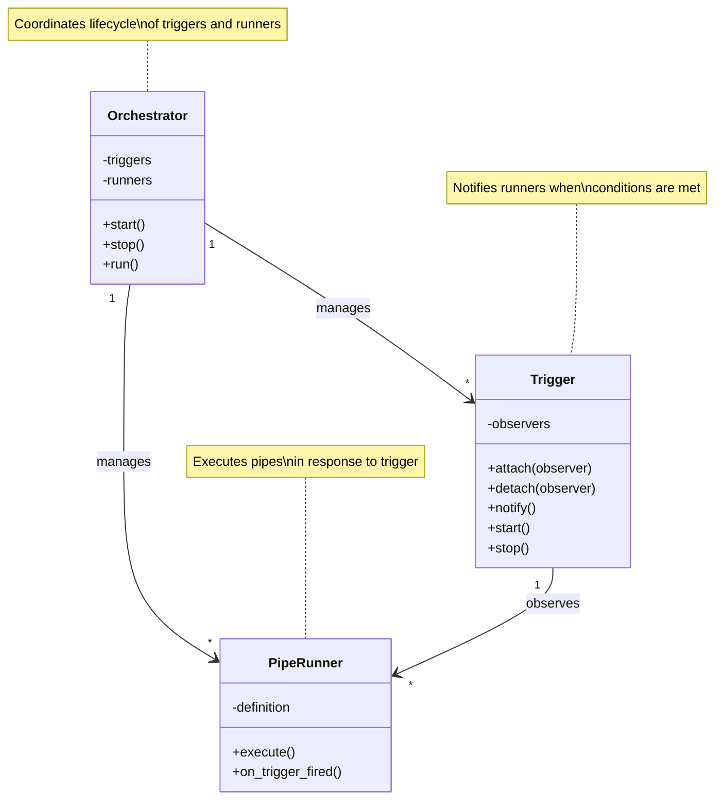

===================
!!!!! # TODO THERES NO DIFFERENCE BETWEEN Orchestrators and Pipes anymore. Orchestrators and Runners are normal Pipe.
The Default Orchestrator behaves in a special way since its a while loop that never stops. but otherwise its a pipe.
The Runners are also Pipes. The Default Runner has an on and a run param.
on and run are both pipess. when the on pipe succeeds the run pipe runs!

# Orchestrator System

The orchestrator coordinates pipeline execution by managing triggers and runners. It implements the Observer pattern,
where triggers notify runners when conditions are met, and runners execute pipelines in response.

## Core Components

The orchestrator system consists of three main components that work together:

**Orchestrator**  
The central coordinator that manages the lifecycle of triggers and runners. It initializes the system, attaches runners
to triggers, and handles startup and shutdown.

**Trigger**  
An event source that monitors for conditions (like time intervals or external events). When a condition is met, it
notifies all attached runners. Multiple runners can observe the same trigger.

**PipeRunner**  
An execution unit that runs a pipeline when notified by a trigger. Each runner is configured with a specific pipeline to
execute and can be attached to one or more triggers.

## Component Relationships



**How they work together:**

1. The **Orchestrator** creates triggers and runners based on configuration
2. Each **PipeRunner** is attached as an observer to one or more **Triggers**
3. When a **Trigger** fires, it notifies all attached **PipeRunners**
4. Each notified **PipeRunner** executes its configured pipeline

## Configuration

The orchestrator is configured through YAML with three main sections:

### Basic Structure

```yaml
orchestrator:
  runners:
    - id: "unique_id"           # Optional identifier
      on: # Optional triggers (omit for one-time execution)
        - id: "trigger_id"
          use: "module:TriggerClass"
          params: { }
      run: # Required: pipes to execute
        id: "pipeline_id"
        use: "module:PipeClass"
        params: { }
```

### Configuration Elements

**Runner Definition** - Defines what pipeline to run and when:

- `id`: Optional unique identifier for the runner
- `on`: List of triggers that will execute this pipeline (optional)
- `run`: The pipeline configuration to execute (required)

**Trigger Definition** - Specifies when to execute:

- `id`: Unique identifier for trigger reuse
- `use`: Fully qualified class path to trigger implementation
- `params`: Trigger-specific parameters (e.g., interval duration)

## Common Usage Patterns

### Time-Based Execution

Execute a pipeline at regular intervals:

```yaml
orchestrator:
  runners:
    - id: periodic_task
      on:
        - id: "every_5_min"
          use: "open_ticket_ai.base.triggers.interval_trigger:IntervalTrigger"
          params:
            minutes: 5
      run:
        id: ticket_classifier
        use: open_ticket_ai.base:CompositePipe
        steps: [ ... ]
```

### Startup Execution

Execute once at application startup (no triggers):

```yaml
orchestrator:
  runners:
    - id: initialization
      run: # No "on" field = runs once at startup
        id: cache_warmup
        use: CacheWarmupPipe
```

### Multiple Triggers

Execute the same pipeline from different triggers:

```yaml
orchestrator:
  runners:
    - id: multi_trigger_task
      on:
        - id: "hourly"
          use: "open_ticket_ai.base.triggers.interval_trigger:IntervalTrigger"
          params:
            hours: 1
        - id: "daily"
          use: "open_ticket_ai.base.triggers.interval_trigger:IntervalTrigger"
          params:
            days: 1
      run:
        id: maintenance
        use: MaintenancePipe
```

### Shared Triggers

Reuse the same trigger for multiple pipelines:

```yaml
orchestrator:
  runners:
    - id: task_one
      on:
        - id: "shared_timer"  # Same trigger ID
          use: "open_ticket_ai.base.triggers.interval_trigger:IntervalTrigger"
          params:
            minutes: 10
      run: { ... }

    - id: task_two
      on:
        - id: "shared_timer"  # Reuses the trigger above
      run: { ... }
```

## Execution Guarantees

The orchestrator provides these execution characteristics:

- **Clean Lifecycle**: Graceful startup and shutdown of all components
- **Error Isolation**: A failure in one runner doesn't affect others
- **Non-Overlapping**: Pipelines won't start if a previous execution is still running (per runner)
- **Multiple Observers**: One trigger can notify multiple runners

## Best Practices

**Trigger Design**

- Use appropriate intervals based on data freshness requirements
- Avoid overly frequent execution that wastes resources
- Consider pipeline execution time when setting intervals
- Reuse triggers with the same schedule to reduce overhead

**Runner Organization**

- Use descriptive IDs for easier debugging
- Group related operations in a single pipeline
- Separate fast checks from slow batch operations
- Monitor execution times and adjust intervals accordingly

## Key Implementation Files

- **`orchestrator.py`** - Main orchestrator class
- **`trigger.py`** - Base trigger class and observer protocol
- **`scheduled_runner.py`** - PipeRunner implementation
- **`orchestrator_config.py`** - Configuration models

## Related Documentation

- [Pipe System](pipeline.md) - Understanding pipeline structure
- [Configuration Reference](../details/config_reference.md) - Full config options
- [First Pipeline Tutorial](../guides/first_pipeline.md) - Getting started guide

