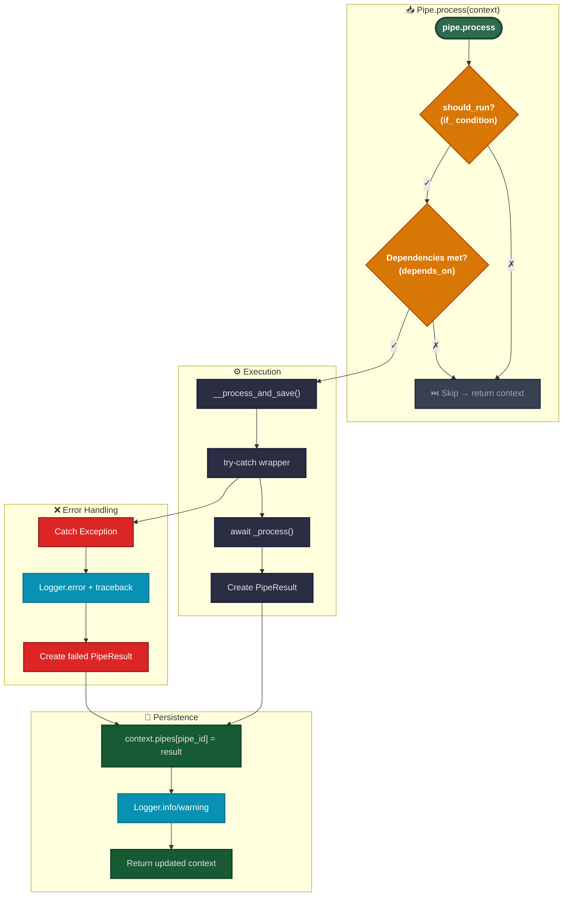

# Pipeline Code Development

This guide explains how to implement custom pipes using the current parameter validation pattern.

## Pipe Execution Flow



## Implementing a Custom Pipe

### Step 1: Define Parameters Model

Create a Pydantic model for your pipe's parameters:

```python
from pydantic import BaseModel


class MyPipeParams(BaseModel):
    input_field: str
    threshold: float = 0.5
    max_items: int = 100
```

### Step 2: Define Result Data Model

Create a model for your pipe's output:

```python
class MyPipeResultData(BaseModel):
    processed_items: list[str]
    count: int
```

### Step 3: Implement the Pipe Class

```python
from typing import Any
from open_ticket_ai.core.pipes.pipe import Pipe
from open_ticket_ai.core.pipes.pipe_models import PipeConfig, PipeResult
from open_ticket_ai.core.logging.logging_iface import LoggerFactory


class MyPipe(Pipe[MyPipeParams]):
    params_class = MyPipeParams  # Required class attribute

    def __init__(
            self,
            pipe_config: PipeConfig[MyPipeParams],
            logger_factory: LoggerFactory,
            # Add injected services here
            *args: Any,
            **kwargs: Any,
    ) -> None:
        super().__init__(pipe_config, logger_factory)
        # self.params is now a validated MyPipeParams instance

    async def _process(self) -> PipeResult[MyPipeResultData]:
        # Access validated parameters
        input_val = self.params.input_field
        threshold = self.params.threshold

        # Your processing logic here
        items = self._do_processing(input_val, threshold)

        # Return result
        return PipeResult[MyPipeResultData](
            success=True,
            failed=False,
            data=MyPipeResultData(
                processed_items=items,
                count=len(items)
            )
        )

    def _do_processing(self, input_val: str, threshold: float) -> list[str]:
        # Implementation details
        return []
```

## Parameter Validation Pattern

### How It Works

The parameter validation happens automatically in the `Pipe` base class:

```python
# In Pipe.__init__ (src/open_ticket_ai/core/pipes/pipe.py:27-30)
if isinstance(pipe_params._config, dict):
    self._config: ParamsT = self.params_class.model_validate(pipe_params._config)
else:
    self._config: ParamsT = pipe_params._config
```

**Flow:**

1. YAML config loaded and templates rendered → produces `dict[str, Any]`
2. Dict passed to Pipe constructor as `pipe_config.params`
3. Base class checks if params is a dict
4. If dict: validates using `params_class.model_validate()`
5. If already typed: uses as-is
6. Result: `self.params` is always the validated Pydantic model

### YAML Configuration Example

Users write YAML with templates:

```yaml
- id: my_custom_pipe
  use: "mypackage:MyPipe"
  params:
    input_field: "{{ pipe_result('previous_step').data.output }}"
    threshold: "{{ env('THRESHOLD', '0.5') }}"
    max_items: 50
```

**What happens:**

1. Templates rendered: `input_field` gets value from previous pipe, `threshold` from env
2. Results in dict: `{"input_field": "some_value", "threshold": "0.5", "max_items": 50}`
3. Passed to `MyPipe.__init__`
4. Validated to `MyPipeParams`: types coerced (threshold: str → float)
5. Available as `self.params.threshold` (float 0.5)

## Dependency Injection

Add service dependencies in the `__init__` signature:

```python
from packages.base.src.otai_base.ticket_system_integration import TicketSystemService


class FetchTicketsPipe(Pipe[FetchTicketsParams]):
    params_class = FetchTicketsParams

    def __init__(
            self,
            ticket_system: TicketSystemService,  # Injected automatically
            pipe_config: PipeConfig[FetchTicketsParams],
            logger_factory: LoggerFactory,
            *args: Any,
            **kwargs: Any,
    ) -> None:
        super().__init__(pipe_config, logger_factory)
        self.ticket_system = ticket_system

    async def _process(self) -> PipeResult[FetchTicketsPipeResultData]:
        # Use injected service
        tickets = await self.ticket_system.find_tickets(...)
        return PipeResult[FetchTicketsPipeResultData](...)
```

**YAML config for service injection:**

```yaml
- id: fetch_tickets
  use: "mypackage:FetchTicketsPipe"
  injects:
    ticket_system: "otobo_system"  # References a service by ID
  params:
    limit: 100
```

## Error Handling

The base `Pipe` class handles errors automatically, but you can also handle specific cases:

```python
async def _process(self) -> PipeResult[MyPipeResultData]:
    try:
        result = await self._risky_operation()
        return PipeResult[MyPipeResultData](
            success=True,
            failed=False,
            data=MyPipeResultData(...)
        )
    except SpecificError as e:
        self._logger.warning(f"Handled specific error: {e}")
        return PipeResult[MyPipeResultData](
            success=False,
            failed=True,
            message=f"Operation failed: {e}",
            data=MyPipeResultData(processed_items=[], count=0)
        )
```

**Note:** Unhandled exceptions are caught by the base class and result in a failed PipeResult.

## Testing Custom Pipes

```python
import pytest
from open_ticket_ai.core.pipes.pipe_context_model import PipeContext
from open_ticket_ai.core.pipes.pipe_models import PipeConfig


@pytest.mark.asyncio
async def test_my_pipe_processes_correctly(logger_factory):
    # Create params as dict (simulates YAML rendering)
    params = {
        "input_field": "test_value",
        "threshold": 0.7,
        "max_items": 10
    }

    # Create pipe config
    config = PipeConfig[MyPipeParams](
        id="test_pipe",
        params=params
    )

    # Instantiate pipe
    pipe = MyPipe(pipe_config=config, logger_factory=logger_factory)

    # Execute
    context = PipeContext()
    result_context = await pipe.process(context)

    # Assert
    assert "test_pipe" in result_context.pipe_results
    assert result_context.pipe_results["test_pipe"].succeeded
    assert result_context.pipe_results["test_pipe"].data.count > 0
```

## Common Patterns

### Accessing Previous Pipe Results

```python
async def _process(self) -> PipeResult[MyPipeResultData]:
    # Access via pipe_config context (if needed)
    # Usually accessed via templates in YAML, but can also be done in code

    # Use self.params which were set from templates
    input_data = self._config.input_field  # Already resolved from template
    return PipeResult[MyPipeResultData](...)
```

### Conditional Execution

Use the `if` field in YAML config:

```yaml
- id: conditional_pipe
  use: "mypackage:MyPipe"
  if: "{{ pipe_result('classifier').data.category == 'urgent' }}"
  params:
  # ...
```

### Dependent Pipes

Use the `depends_on` field:

```yaml
- id: step2
  use: "mypackage:Step2Pipe"
  depends_on:
    - step1
  params:
    input: "{{ pipe_result('step1').data.output }}"
```

## Best Practices

**DO:**

- ✅ Always define `params_class` as a class attribute
- ✅ Let parent `__init__` handle parameter validation
- ✅ Use descriptive parameter names
- ✅ Provide sensible defaults in params model
- ✅ Return clear error messages in PipeResult
- ✅ Log important steps and decisions
- ✅ Keep `_process()` focused and testable

**DON'T:**

- ❌ Don't manually call `model_validate()` in your `__init__`
- ❌ Don't bypass the params_class mechanism
- ❌ Don't put heavy logic in `__init__`
- ❌ Don't catch and hide all exceptions
- ❌ Don't access unvalidated `pipe_config.params` directly
- ❌ Don't forget to call `super().__init__()`

## Related Documentation

- [Configuration and Template Rendering](../concepts/config_rendering.md) - Understanding the rendering flow
- [Configuration Reference](../details/config_reference.md) - YAML configuration syntax
- [Testing Guide](./testing.md) - Testing strategies for pipes
- [Dependency Injection](./dependency_injection.md) - Service injection patterns