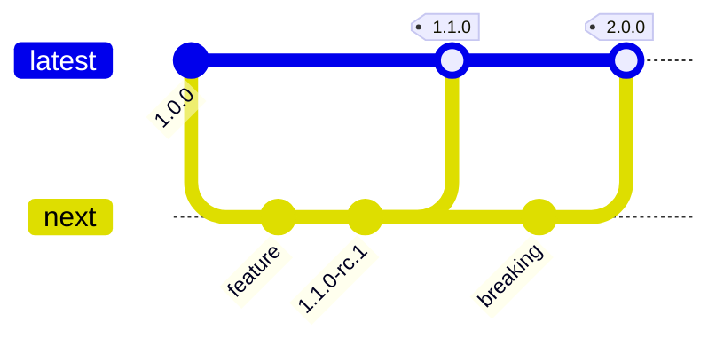

# Versioning Policy

**Effective Date:** October 11, 2025  
**Starting Version:** `1.0.0`

## Overview

Open Ticket AI follows semantic versioning for the product and maintains separate documentation sites for each major
version.

## Semantic Versioning

We use **SemVer** format: `MAJOR.MINOR.PATCH`

| Version Type | Format            | When to Use                          | Example                       |
|--------------|-------------------|--------------------------------------|-------------------------------|
| **MAJOR**    | `1.0.0` → `2.0.0` | Breaking changes, requires migration | API changes, removed features |
| **MINOR**    | `1.0.0` → `1.1.0` | New backward-compatible features     | New pipes, new config options |
| **PATCH**    | `1.0.0` → `1.0.1` | Bug fixes and security patches       | Bug fixes, security updates   |

### Pre-Release Versions

- **Alpha**: `1.1.0-alpha.1` - Early testing, unstable
- **Beta**: `1.1.0-beta.1` - Feature complete, testing
- **RC**: `1.1.0-rc.1` - Release candidate, final testing

### Support Policy

| Version                   | Support Level                | Duration                 |
|---------------------------|------------------------------|--------------------------|
| **Current Major (vN)**    | Full support                 | Until next major         |
| **Previous Major (vN-1)** | Security/critical fixes only | 6 months after new major |
| **Older**                 | End of Life (EOL)            | No support               |

### Deprecation Policy

1. **Announcement**: Deprecated features announced in `CHANGELOG.md`
2. **Availability**: Remain available for rest of current major version
3. **Removal**: Removed only in next major version
4. **Migration**: Each deprecation includes migration guide link

**Example Timeline:**

```
v1.2.0: Feature X deprecated
v1.3.0: Feature X still available (with warnings)
v1.4.0: Feature X still available (with warnings)
v2.0.0: Feature X removed
```

## Git Branching Strategy

### Long-Lived Branches

- **`latest`** - Current stable version (users should install from here)
- **`next`** - Pre-releases for upcoming minor/major versions
- **`v1`, `v2`, `v3`...** - Maintenance branches for each major version

### Release Flow



**Process:**

1. **Development**: Feature branches → merge to `next`
2. **Stabilization**: Tag pre-releases on `next` (`1.1.0-rc.1`)
3. **Release**: Fast-forward `latest` to stable tag
4. **New Major**: Create/advance `vN` branch for old major
5. **Backports**: Cherry-pick fixes to `vN` branches, tag patches

## Documentation Versioning

### URL Structure

| Branch   | URL                                                        | Purpose             |
|----------|------------------------------------------------------------|---------------------|
| `latest` | [open-ticket-ai.com](https://open-ticket-ai.com)           | Current stable docs |
| `next`   | [next.open-ticket-ai.com](https://next.open-ticket-ai.com) | Pre-release docs    |
| `v1`     | [v1.open-ticket-ai.com](https://v1.open-ticket-ai.com)     | Version 1.x docs    |
| `v2`     | [v2.open-ticket-ai.com](https://v2.open-ticket-ai.com)     | Version 2.x docs    |

### SEO & Indexing

- ✅ **Only `latest`** has sitemap and is indexed by search engines
- ❌ **All other versions** use `<meta name="robots" content="noindex,follow">`
- 🔗 Canonical URLs point to same version's domain
- 📝 Internal links use relative paths (work across all versions)

### Version Switcher

**Features:**

- Dropdown in navbar showing all available versions
- Preserves current page path when switching versions
- Stores user preference in `localStorage`
- Optional auto-redirect based on stored preference

**Example:**

```
User on: v1.open-ticket-ai.com/guides/installation.md
Switches to: v2
Navigates to: v2.open-ticket-ai.com/guides/installation.md
```

### Content Strategy

| Change Type       | Where Documented                | Example                |
|-------------------|---------------------------------|------------------------|
| **Major changes** | Only on that major's docs site  | New CLI command syntax |
| **Minor updates** | Latest docs with version badges | New config option      |
| **Patches**       | Inline fixes, no new site       | Fix code example typo  |

### Version Badges

Use inline badges to indicate feature availability:

```markdown
## New Feature <Badge type="tip" text="Added in 1.2" />
## Updated API <Badge type="warning" text="Changed in 1.3" />
## Old Feature <Badge type="danger" text="Deprecated in 1.4" />
```

**Renders as:**

- **Added in 1.2** - New feature introduced
- **Changed in 1.3** - Behavior modified
- **Deprecated in 1.4** - Will be removed in next major
- **Removed in 2.0** - No longer available

## Changelog Structure

### Product Changelog (`CHANGELOG.md`)

Located at repository root, follows [Keep a Changelog](https://keepachangelog.com/) format:

```markdown
## [1.2.0] - 2025-10-13

### Added
- New HuggingFace plugin for local ML inference
- Support for nested composite pipes

### Changed
- Improved error messages in pipe execution
- Updated OTOBO adapter to support version 11

### Deprecated
- Old configuration format (use new YAML structure)
- Legacy pipe naming convention

### Fixed
- Fixed memory leak in template rendering
- Corrected timezone handling in interval triggers

### Security
- Updated dependencies to patch CVE-2025-1234
```

### Documentation Changelog

Each docs site has `/changelog/` page with version-specific changes:

```markdown
# Changelog - Version 1.x

## What's New in 1.2.0
- Added ML classification guide
- New plugin development tutorial
- Updated troubleshooting section
```

## Release Examples

### Example 1: Minor Release (1.0.0 → 1.1.0)

**Git Actions:**

```bash
git checkout next
git tag v1.1.0
git checkout latest
git merge --ff-only next
git push origin latest v1.1.0
```

**Documentation:**

- Docs stay on `latest` branch
- Add version badges: "Added in 1.1"
- No new docs site needed

**User Impact:**

- Backward compatible
- Users can upgrade without changes

### Example 2: Major Release (1.4.0 → 2.0.0)

**Git Actions:**

```bash
# Create maintenance branch for v1
git checkout latest
git branch v1
git push origin v1

# Release v2
git checkout next
git tag v2.0.0
git checkout latest
git merge next
git push origin latest v2.0.0
```

**Documentation:**

- Create `v2` branch from `latest`
- Deploy new sites: `v2.open-ticket-ai.com` and update `open-ticket-ai.com`
- `v1.open-ticket-ai.com` remains for old users
- Add migration guide from v1 to v2

**User Impact:**

- Breaking changes require migration
- v1 gets security fixes for 6 months
- Users can stay on v1 temporarily

### Example 3: Patch Release (1.1.0 → 1.1.1)

**Git Actions:**

```bash
git checkout latest
# Fix applied directly or cherry-picked
git tag v1.1.1
git push origin latest v1.1.1
```

**Documentation:**

- No changes to docs structure
- Fix inline if needed (typos, broken links)
- No version badges needed

**User Impact:**

- Safe to upgrade immediately
- No breaking changes

## Implementation Details

### Netlify Configuration

```toml
# netlify.toml
[build]
  command = "npm run docs:build"
  publish = "docs/.vitepress/dist"

[build.environment]
  NODE_VERSION = "20"
  VITE_DOCS_VERSIONS = "latest,v3,v2,v1,next"

[[redirects]]
  from = "/latest/*"
  to = "/:splat"
  status = 301

[context.production]
  command = "npm run docs:build"

[context.branch-deploy]
  command = "npm run docs:build"
```

**Branch Subdomain Mapping:**

- Enable "Branch deploys" in Netlify
- Configure branch subdomains for each version
- Set environment variables per branch context

### VitePress Configuration

```typescript
// docs/.vitepress/config.ts
export default defineConfig({
  base: '/',
  sitemap: process.env.BRANCH === 'latest' ? {
    hostname: 'https://open-ticket-ai.com'
  } : undefined,
  head: process.env.BRANCH !== 'latest' ? [
    ['meta', { name: 'robots', content: 'noindex,follow' }]
  ] : []
})
```

## FAQ

**Q: Do patch versions get their own URLs?**  
A: No. Patches update the same docs site (e.g., both 1.1.0 and 1.1.1 use `v1` docs).

**Q: Where can I find pre-release documentation?**  
A: Pre-releases are documented at [next.open-ticket-ai.com](https://next.open-ticket-ai.com)

**Q: How long are old major versions supported?**  
A: Old versions remain accessible indefinitely for reading, but only receive security fixes for 6 months after a new
major release.

**Q: When can deprecated features be removed?**  
A: Only in the next major version. They must remain available throughout the current major version.

**Q: What if I need a feature from an older version?**  
A: Visit the version-specific docs (e.g., v1.open-ticket-ai.com) or downgrade your installation.

**Q: How do I know which version introduced a feature?**  
A: Look for version badges in the documentation (e.g., "Added in 1.2").

## Related Documentation

- [Release Notes](https://github.com/Softoft-Orga/open-ticket-ai/releases)
- [Migration Guides](../guides/migration/)
- [Installation Guide](../guides/installation.md)
- [Changelog](https://github.com/Softoft-Orga/open-ticket-ai/blob/latest/CHANGELOG.md)
