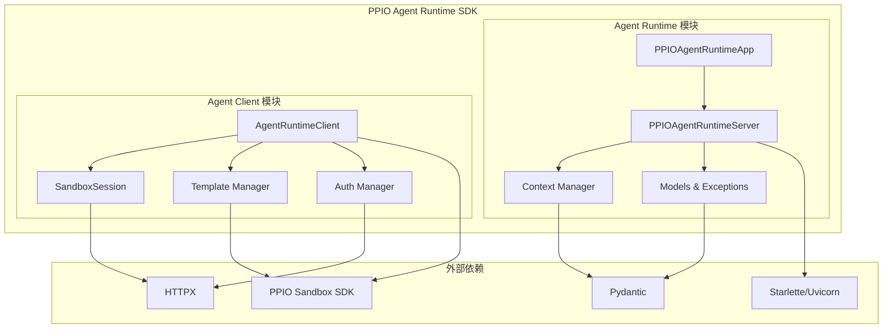

# PPIO Agent Runtime SDK 详细设计文档

## I. 概述

PPIO Agent Runtime SDK 是一个轻量级的 AI 智能体运行时框架，专为 PPIO Agent Sandbox 生态设计。SDK 分为两个核心模块：

1. **Agent Runtime 模块**：面向 AI Agent 开发者，提供将 Agent 逻辑包装为标准 HTTP 服务的能力
2. **Agent Client 模块**：面向后端开发者，提供调用部署在 Sandbox 中的 Agent 的客户端

## II. 整体架构



## III. Agent Runtime 模块详细设计

### 3.1 核心组件架构

基于现有实现的分析，Agent Runtime 模块已经有了良好的架构基础：

```python
# 包结构
ppio_agent_runtime/
├── __init__.py                 # 主入口，导出核心 API
├── exceptions.py               # 异常定义
└── runtime/
    ├── __init__.py
    ├── app.py                  # PPIOAgentRuntimeApp 主类
    ├── server.py               # HTTP 服务器实现
    ├── context.py              # 请求上下文管理
    └── models.py               # 数据模型定义
```

### 3.2 PPIOAgentRuntimeApp 类

**现有实现已经很完善，建议保持当前设计：**

```python
class PPIOAgentRuntimeApp:
    """PPIO Agent Runtime 应用类"""
    
    def __init__(self, debug: bool = False):
        """初始化应用"""
        
    def entrypoint(self, func: Callable) -> Callable:
        """注册主入口点函数 - 核心装饰器"""
        
    def ping(self, func: Callable) -> Callable:
        """注册自定义健康检查函数（可选）"""
        
    def run(self, port: int = 8080, host: Optional[str] = None) -> None:
        """启动服务器"""
        
    @property
    def context(self) -> Optional[RequestContext]:
        """获取当前请求上下文"""
```

**优化建议：**

1. **增加中间件支持**：
```python
def middleware(self, middleware_func: Callable) -> Callable:
    """注册中间件函数"""
    self._server.add_middleware(middleware_func)
    return middleware_func
```

2. **增加配置支持**：
```python
class AgentConfig:
    """Agent 配置类"""
    host: str = "0.0.0.0"
    port: int = 8080
    debug: bool = False
    timeout: int = 300
    max_request_size: int = 1024 * 1024  # 1MB
    cors_origins: List[str] = ["*"]

def __init__(self, config: Optional[AgentConfig] = None):
    self.config = config or AgentConfig()
```

### 3.3 PPIOAgentRuntimeServer 类

**现有实现已经很优秀，支持：**
- 同步/异步函数调用
- 流式响应（Generator/AsyncGenerator）
- 错误处理和日志
- CORS 支持
- 请求上下文管理

**建议增强：**

1. **请求验证中间件**：
```python
async def _validate_request_middleware(self, request: Request, call_next):
    """请求验证中间件"""
    # 检查 Content-Type
    # 检查请求大小
    # 检查认证头（可选）
    return await call_next(request)
```

2. **请求限流**：
```python
class RateLimiter:
    """简单的请求限流器"""
    def __init__(self, max_requests: int = 100, window_seconds: int = 60):
        self.max_requests = max_requests
        self.window_seconds = window_seconds
        self.requests = {}
```

3. **更详细的监控指标**：
```python
class MetricsCollector:
    """指标收集器"""
    def __init__(self):
        self.request_count = 0
        self.error_count = 0
        self.response_times = []
        
    def record_request(self, duration: float, status: str):
        """记录请求指标"""
```

### 3.4 数据模型优化

**现有模型已经很好，建议增加：**

```python
class AgentMetadata(BaseModel):
    """Agent 元数据"""
    name: str
    version: str
    description: Optional[str] = None
    author: Optional[str] = None
    tags: List[str] = Field(default_factory=list)
    created_at: datetime
    
class InvocationRequest(BaseModel):
    """调用请求模型（增强版）"""
    prompt: Optional[str] = None
    data: Optional[Dict[str, Any]] = None
    session_id: Optional[str] = None
    timeout: Optional[int] = None
    stream: bool = False
    metadata: Optional[Dict[str, Any]] = None
    
class InvocationResponse(BaseModel):
    """调用响应模型"""
    result: Any
    status: str = "success"
    duration: float
    metadata: Optional[Dict[str, Any]] = None
    error: Optional[str] = None
```

## IV. Agent Client 模块设计

### 4.1 模块结构

```python
# 新增包结构
ppio_agent_runtime/
├── client/
│   ├── __init__.py
│   ├── client.py               # AgentRuntimeClient 主类
│   ├── session.py              # SandboxSession 实现
│   ├── auth.py                 # 认证管理
│   ├── template.py             # 模板管理
│   └── exceptions.py           # 客户端专用异常
```

### 4.2 AgentRuntimeClient 类

```python
class AgentRuntimeClient:
    """Agent Runtime 客户端"""
    
    def __init__(
        self,
        api_key: str,
        api_secret: Optional[str] = None,
        base_url: Optional[str] = None,
        timeout: int = 300
    ):
        """初始化客户端
        
        Args:
            api_key: API 密钥
            api_secret: API 密钥（可选，用于 AK/SK 认证）
            base_url: Sandbox 平台基础 URL
            timeout: 默认超时时间
        """
        self.auth_manager = AuthManager(api_key, api_secret)
        self.template_manager = TemplateManager(self.auth_manager)
        self.base_url = base_url or self._discover_base_url()
        self.timeout = timeout
        self._sessions: Dict[str, SandboxSession] = {}
        self._http_client = httpx.AsyncClient(timeout=timeout)
    
    async def create_session(
        self,
        template_id: str,
        timeout_seconds: int = 300,
        config: Optional[SandboxConfig] = None
    ) -> SandboxSession:
        """创建新的 Sandbox 会话
        
        Args:
            template_id: Agent 模板 ID
            timeout_seconds: 会话超时时间
            config: Sandbox 配置
            
        Returns:
            SandboxSession 对象
        """
        
    async def get_session(self, session_id: str) -> Optional[SandboxSession]:
        """获取现有会话"""
        
    async def list_sessions(self) -> List[SandboxSession]:
        """列出所有活跃会话"""
        
    async def close_session(self, session_id: str) -> None:
        """关闭指定会话"""
        
    async def close_all_sessions(self) -> None:
        """关闭所有会话"""
        
    # Template 管理方法
    async def list_templates(self) -> List[AgentTemplate]:
        """列出可用的 Agent 模板"""
        
    async def get_template(self, template_id: str) -> AgentTemplate:
        """获取特定模板信息"""
        
    async def invoke_agent(
        self,
        template_id: str,
        request: InvocationRequest,
        create_session: bool = True,
        session_id: Optional[str] = None
    ) -> InvocationResponse:
        """便捷方法：直接调用 Agent（自动管理会话）"""
```

### 4.3 SandboxSession 类

```python
class SandboxSession:
    """Sandbox 会话管理"""
    
    def __init__(
        self,
        session_id: str,
        template_id: str,
        sandbox: Any,  # PPIO Sandbox 实例
        client: AgentRuntimeClient
    ):
        self.session_id = session_id
        self.template_id = template_id
        self.sandbox = sandbox
        self.client = client
        self.created_at = datetime.now()
        self.last_activity = datetime.now()
        self.status = SessionStatus.ACTIVE
        self._host_url: Optional[str] = None
    
    async def invoke(
        self,
        request: Union[InvocationRequest, Dict[str, Any]],
        stream: bool = False
    ) -> Union[InvocationResponse, AsyncIterator[str]]:
        """调用 Agent
        
        Args:
            request: 调用请求
            stream: 是否使用流式响应
            
        Returns:
            响应对象或流式迭代器
        """
        
    async def ping(self) -> PingResponse:
        """健康检查"""
        
    async def get_status(self) -> SessionStatus:
        """获取会话状态"""
        
    async def refresh(self) -> None:
        """刷新会话（重置超时时间）"""
        
    async def close(self) -> None:
        """关闭会话"""
        
    @property
    def host_url(self) -> str:
        """获取 Sandbox 主机 URL"""
        if not self._host_url:
            self._host_url = f"https://{self.sandbox.get_host(8080)}"
        return self._host_url
    
    @property
    def is_active(self) -> bool:
        """检查会话是否活跃"""
        return self.status == SessionStatus.ACTIVE
```

### 4.4 认证管理

```python
class AuthManager:
    """认证管理器"""
    
    def __init__(self, api_key: str, api_secret: Optional[str] = None):
        self.api_key = api_key
        self.api_secret = api_secret
        self._token: Optional[str] = None
        self._token_expires_at: Optional[datetime] = None
    
    async def get_auth_headers(self) -> Dict[str, str]:
        """获取认证头"""
        if self.api_secret:
            # AK/SK 认证
            return self._generate_ak_sk_headers()
        else:
            # Bearer Token 认证
            return {"Authorization": f"Bearer {self.api_key}"}
    
    def _generate_ak_sk_headers(self) -> Dict[str, str]:
        """生成 AK/SK 认证头"""
        # 实现 HMAC 签名逻辑
        pass
    
    async def refresh_token(self) -> None:
        """刷新访问令牌"""
        # 如果使用 OAuth，实现令牌刷新逻辑
        pass
```

### 4.5 模板管理

```python
class TemplateManager:
    """模板管理器"""
    
    def __init__(self, auth_manager: AuthManager):
        self.auth_manager = auth_manager
        self._cache: Dict[str, AgentTemplate] = {}
        self._cache_expires_at: Optional[datetime] = None
    
    async def list_templates(self, refresh: bool = False) -> List[AgentTemplate]:
        """列出模板"""
        if refresh or self._is_cache_expired():
            await self._refresh_cache()
        return list(self._cache.values())
    
    async def get_template(self, template_id: str) -> AgentTemplate:
        """获取特定模板"""
        if template_id not in self._cache or self._is_cache_expired():
            await self._refresh_cache()
        
        if template_id not in self._cache:
            raise TemplateNotFoundError(f"Template {template_id} not found")
        
        return self._cache[template_id]
    
    async def _refresh_cache(self) -> None:
        """刷新模板缓存"""
        # 调用 Sandbox API 获取模板列表
        pass
    
    def _is_cache_expired(self) -> bool:
        """检查缓存是否过期"""
        if not self._cache_expires_at:
            return True
        return datetime.now() > self._cache_expires_at
```

## V. 数据模型定义

### 5.1 客户端数据模型

```python
class SessionStatus(str, Enum):
    """会话状态"""
    ACTIVE = "active"
    INACTIVE = "inactive"
    CLOSED = "closed"
    ERROR = "error"

class AgentTemplate(BaseModel):
    """Agent 模板信息"""
    template_id: str
    name: str
    version: str
    description: Optional[str] = None
    author: Optional[str] = None
    tags: List[str] = Field(default_factory=list)
    created_at: datetime
    updated_at: datetime
    status: str
    metadata: Dict[str, Any] = Field(default_factory=dict)

class SandboxConfig(BaseModel):
    """Sandbox 配置"""
    timeout_seconds: int = 300
    memory_limit: Optional[str] = None
    cpu_limit: Optional[str] = None
    env_vars: Dict[str, str] = Field(default_factory=dict)
    
class ClientConfig(BaseModel):
    """客户端配置"""
    base_url: Optional[str] = None
    timeout: int = 300
    max_retries: int = 3
    retry_delay: float = 1.0
    enable_cache: bool = True
    cache_ttl: int = 300
```

### 5.2 错误处理

```python
# client/exceptions.py
class AgentClientError(PPIOAgentRuntimeError):
    """客户端基础异常"""
    pass

class AuthenticationError(AgentClientError):
    """认证错误"""
    pass

class TemplateNotFoundError(AgentClientError):
    """模板未找到错误"""
    pass

class SandboxCreationError(AgentClientError):
    """Sandbox 创建错误"""
    pass

class SessionNotFoundError(AgentClientError):
    """会话未找到错误"""
    pass

class InvocationError(AgentClientError):
    """调用错误"""
    pass
```

## VI. 使用示例

### 6.1 Agent Runtime 使用

```python
# Agent 开发者使用
from ppio_agent_runtime import PPIOAgentRuntimeApp, RequestContext

app = PPIOAgentRuntimeApp(debug=True)

@app.entrypoint
async def my_agent(request: dict, context: RequestContext) -> dict:
    """主要的 Agent 逻辑"""
    query = request.get("query", "")
    session_id = context.session_id
    
    # Agent 处理逻辑
    result = await process_query(query)
    
    return {
        "response": result,
        "session_id": session_id,
        "metadata": {"processed_at": datetime.now().isoformat()}
    }

@app.ping
def health_check() -> dict:
    """自定义健康检查"""
    # 检查依赖服务状态
    return {"status": "healthy", "dependencies": check_dependencies()}

if __name__ == "__main__":
    app.run(port=8080)
```

### 6.2 Agent Client 使用

```python
# 后端开发者使用
from ppio_agent_runtime.client import AgentRuntimeClient, InvocationRequest
import asyncio

async def main():
    # 初始化客户端
    client = AgentRuntimeClient(
        api_key="your-api-key",
        api_secret="your-api-secret"
    )
    
    # 方式一：自动管理会话（推荐用于简单场景）
    request = InvocationRequest(
        query="请帮我分析这个数据",
        data={"dataset": "sales_data.csv"},
        stream=False
    )
    
    response = await client.invoke_agent(
        template_id="agent-template-123",
        request=request
    )
    print(f"Agent 响应: {response.result}")
    
    # 方式二：手动管理会话（推荐用于复杂场景）
    session = await client.create_session(
        template_id="agent-template-123",
        timeout_seconds=600
    )
    
    try:
        # 多轮对话
        for i in range(3):
            request = InvocationRequest(
                query=f"这是第 {i+1} 轮对话",
                session_id=session.session_id
            )
            
            response = await session.invoke(request)
            print(f"第 {i+1} 轮响应: {response.result}")
            
    finally:
        # 确保会话被关闭
        await session.close()
    
    # 流式响应示例
    session = await client.create_session("streaming-agent-456")
    
    request = InvocationRequest(query="请生成一个长故事", stream=True)
    
    async for chunk in await session.invoke(request, stream=True):
        print(f"流式内容: {chunk}")
    
    await session.close()
    await client.close_all_sessions()

# Django/FastAPI 集成示例
class AgentService:
    def __init__(self):
        self.client = AgentRuntimeClient(
            api_key=settings.PPIO_API_KEY,
            api_secret=settings.PPIO_API_SECRET
        )
    
    async def process_user_request(self, user_id: str, query: str) -> str:
        """处理用户请求"""
        try:
            request = InvocationRequest(
                query=query,
                metadata={"user_id": user_id}
            )
            
            response = await self.client.invoke_agent(
                template_id="customer-service-agent",
                request=request
            )
            
            return response.result
            
        except Exception as e:
            logger.error(f"Agent 调用失败: {e}")
            raise

if __name__ == "__main__":
    asyncio.run(main())
```

## VII. 部署与集成

### 7.1 与 PPIO Sandbox CLI 集成

在现有的 `ppio-sandbox-cli` 中增加 agent 相关命令：

```bash
# 初始化 Agent 项目
ppio-sandbox-cli agent init --name my-agent --entrypoint main.py

# 部署 Agent 
ppio-sandbox-cli agent deploy --config .ppio-agent.yaml

# 测试 Agent
ppio-sandbox-cli agent invoke --template-id xxx --input "test query"

# 列出 Agent 模板
ppio-sandbox-cli agent list

# 查看 Agent 详情
ppio-sandbox-cli agent info --template-id xxx
```

### 7.2 包分发策略

建议将 SDK 拆分为两个包：

1. **ppio-agent-runtime**：只包含 Runtime 模块，供 Agent 开发者使用
2. **ppio-agent-client**：只包含 Client 模块，供后端开发者使用

或者保持单一包 **ppio-agent-runtime**，但允许按需导入：

```python
# Agent 开发者
from ppio_agent_runtime import PPIOAgentRuntimeApp

# 后端开发者  
from ppio_agent_runtime.client import AgentRuntimeClient
```

## VIII. 实现计划

### 阶段一：优化现有 Runtime 模块（1-2 天）
1. 增加配置支持
2. 增强错误处理
3. 添加中间件机制
4. 优化性能监控

### 阶段二：实现 Client 模块（3-4 天）
1. 实现 AgentRuntimeClient 核心功能
2. 实现 SandboxSession 管理
3. 实现认证和模板管理
4. 添加完整的错误处理

### 阶段三：集成与测试（2-3 天）
1. 与 PPIO Sandbox SDK 集成
2. 完善文档和示例
3. 端到端测试
4. 性能测试

### 阶段四：CLI 集成（1-2 天）
1. 在 ppio-sandbox-cli 中添加 agent 命令
2. 集成部署流程
3. 添加模板管理功能

**总计：7-11 天，符合 09/26 完成的时间计划。**

## IX. 总结

本设计文档基于现有的优秀 Runtime 实现，补充了完整的 Client 模块设计。整个 SDK 具有以下特点：

1. **架构清晰**：Runtime 和 Client 模块分离，职责明确
2. **易于使用**：简洁的装饰器 API 和客户端 API
3. **功能完整**：支持同步/异步/流式调用，完善的错误处理
4. **性能优良**：异步设计，支持连接池和缓存
5. **可扩展性**：中间件机制，插件化架构
6. **生产就绪**：完善的日志、监控、认证机制

这个设计可以满足 AWS AgentCore 对标的需求，同时充分利用 PPIO Sandbox 的能力。
