# PQC Dual USB Library

[](https://badge.fury.io/py/pqcdualusb)
[](https://www.python.org/downloads/)
[](https://opensource.org/licenses/MIT)
[](https://en.wikipedia.org/wiki/Post-quantum_cryptography)
[](https://github.com/Johnsonajibi/PostQuantum-DualUSB-Token-Library/stargazers)
[](https://pepy.tech/project/pqcdualusb)
[]()
[]()

A comprehensive **Python library** for post-quantum cryptographic dual USB backup operations with advanced hardware security features and side-channel attack countermeasures.

> **NOTE:** This is a library package designed to be imported into your applications. It provides a set of functions to manage secure backups.

## Overview

The **PQC Dual USB Library** provides a robust, enterprise-grade solution for securing data against threats from both classical and quantum computers. It offers a functional API for developers to integrate post-quantum cryptography (PQC) into applications requiring secure data storage, especially for scenarios involving redundant backups on physical devices like USB drives.

The library is designed with a "secure-by-default" philosophy, automatically handling complex security operations like side-channel attack mitigation, secure memory management, and hybrid cryptographic schemes.

### Quick Import Example

```python
import os
from pathlib import Path
from pqcdualusb.storage import init_dual_usb, rotate_token, verify_dual_setup
from pqcdualusb.backup import restore_from_backup
from pqcdualusb.pqc import pq_write_audit_keys

# Use these functions to build your backup workflow.
# See the Quick Start Guide below for a detailed example.
```

## Architectural Vision

The core architecture is designed to be modular, extensible, and secure. It abstracts the complexity of cryptographic backends and hardware interactions, providing a clean and simple functional API to the application layer.

### High-Level Architecture

The library is composed of several focused modules that work together:

-   **`storage.py`**: Manages the state of the primary drive and orchestrates high-level operations like initialization and key rotation.
-   **`backup.py`**: Handles the creation and restoration of encrypted backup files.
-   **`crypto.py`**: Contains all core classical cryptographic logic, including key derivation (Argon2id) and authenticated encryption (AES-GCM).
-   **`pqc.py`**: Manages all Post-Quantum Cryptography operations (key generation, signing) using available backends.
-   **`device.py`**: Provides helper functions to validate device paths and check their properties (e.g., if they are removable).
-   **`audit.py`**: Implements a secure, structured logging system for all critical security events.
-   **`cli.py`**: Provides a reference implementation of a command-line interface that demonstrates how to use the library's functions.

### PQC Backend Selection Logic

The library prioritizes performance and security by intelligently selecting the best available Post-Quantum Cryptography backend. This flowchart illustrates the decision-making process.

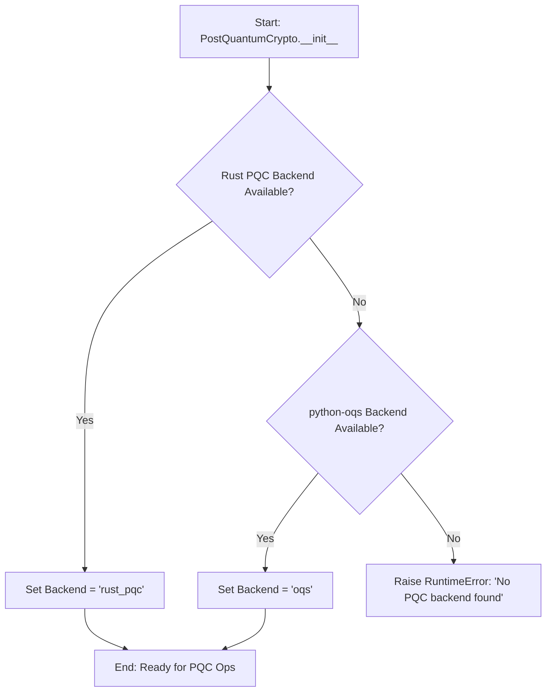

## Key Features

### Cryptographic Security
- **Post-Quantum Cryptography**: NIST-standardized Kyber1024 (KEM) and Dilithium3 (signatures).
- **Hybrid Encryption**: Combines classical AES-256-GCM with post-quantum key encapsulation for robust, dual-layer protection.
- **Power Analysis Protection**: Built-in software countermeasures (instruction jitter, random delays) to obfuscate power consumption patterns and mitigate side-channel attacks.
- **Secure Key Derivation**: Uses Argon2id, a memory-hard function, to stretch user passphrases and resist brute-force attacks.

### Hardware & Memory Security
- **Dual USB Backup**: Manages redundant, secure storage across multiple USB devices.
- **Device Validation**: Functions to verify that provided paths are on distinct, removable devices.
- **Secure Memory Management**: Automatically zeroes out memory that held sensitive data (keys, plaintexts) to prevent data leakage.
- **Timing Attack Mitigation**: Employs constant-time comparison operations where possible to prevent attackers from inferring secret data through timing variations.

## ️ Threat Model and Security Guarantees

This library is designed to protect against a range of threats, from common software vulnerabilities to sophisticated nation-state-level attacks.

### Attack Vectors Considered
- **Quantum Attacks**: An adversary with a large-scale quantum computer attempting to break public-key cryptography.
    - **Mitigation**: **Hybrid Encryption**. The use of Kyber1024 ensures that even if classical algorithms are broken, the encapsulated key remains secure.
- **Side-Channel Attacks**: Timing attacks and power analysis.
    - **Mitigation**: Constant-time operations for critical comparisons and software-based countermeasures like instruction jitter and randomized dummy operations.
- **Physical Access Attacks**: Cold boot attacks or theft of USB drives.
    - **Mitigation**: **Secure Memory Wiping** and strong, multi-layered encryption. Data on the drives is useless without the user's passphrase.

### Limitations
- This library cannot protect against keyloggers, screen-capture malware, or other compromises of the host operating system. The security of the overall system depends on the security of the environment in which it runs.

## ️ Roadmap

This project is under active development. Our goals for the near future include:

### Q4 2025
- **[Feature] High-Level `BackupManager` Class**:
    - Implement an optional `BackupManager` class to provide a simpler, high-level API for orchestrating dual-drive backups.
- **[Security] External Security Audit**:
    - Engage a third-party security firm to perform a full audit of the cryptographic and security-sensitive code.
- **[CI/CD] Automated PyPI Publishing**:
    - Set up GitHub Actions to automatically build and publish new releases to PyPI upon tagging.

### Q1 2026
- **[Feature] Hardware Security Module (HSM) Support**:
    - Add an abstraction layer to support storing PQC keys on HSMs (e.g., YubiKey, NitroKey) via a PKCS#11 interface.
- **[Performance] SIMD-Optimized Backends**:
    - Integrate official PQC implementations that use AVX2/NEON instructions for significant performance gains on supported platforms.

## Installation

### 1. Standard Installation
```bash
pip install pqcdualusb
```

### 2. Development Installation
For contributing or running tests, clone the repository and install in editable mode with development dependencies.
```bash
git clone https://github.com/Johnsonajibi/PostQuantum-DualUSB-Token-Library.git
cd PostQuantum-DualUSB-Token-Library
python -m venv venv
source venv/bin/activate  # On Windows: venv\Scripts\activate
pip install -e ".[dev]"
```

### 3. Backend Dependencies
The library requires at least one PQC backend. The Rust backend is recommended for performance.

#### Rust PQC Backend (Recommended)
```bash
# Windows
./install_rust_windows.bat

# Linux/macOS
curl --proto '=https' --tlsv1.2 -sSf https://sh.rustup.rs | sh
python build_rust_pqc.py
```

#### OQS Backend (Alternative Fallback)
If the Rust backend is not available, the library will fall back to `python-oqs`.
```bash
pip install oqs
```

## Quick Start Guide

This example demonstrates the end-to-end process of creating and managing a secure dual USB backup using the library's functions.

```python
import os
from pathlib import Path
import tempfile
import shutil

# Import the necessary functions from the library
from pqcdualusb.storage import init_dual_usb, rotate_token, verify_dual_setup
from pqcdualusb.backup import restore_from_backup
from pqcdualusb.crypto import verify_backup
from pqcdualusb.device import _is_removable_path # For mocking in this example

# --- Setup: Create temporary directories to simulate USB drives ---
# In a real application, these paths would point to your actual USB drives.
# For this example, we will mock the check for removable drives.
tmp_dir = Path(tempfile.mkdtemp(prefix="pqc_usb_test_"))
primary_path = tmp_dir / "PRIMARY"
backup_path = tmp_dir / "BACKUP"
primary_path.mkdir()
backup_path.mkdir()

print(f"Simulating drives:\n- Primary: {primary_path}\n- Backup:  {backup_path}")

# --- Core Variables ---
# A strong, unique password for encryption
passphrase = "a-very-strong-and-unique-passphrase"
# The initial secret data you want to protect
initial_secret = os.urandom(64)


# In a real scenario, you would validate the drives are removable.
# For this example, we assume they are.
# assert _is_removable_path(primary_path)
# assert _is_removable_path(backup_path)


# 1. Initialize the Dual USB Backup
print("\nStep 1: Initializing the dual USB backup...")
init_info = init_dual_usb(
    token=initial_secret,
    primary_mount=primary_path,
    backup_mount=backup_path,
    passphrase=passphrase
)
print(" Initialization complete.")
print(f"   - Primary token written to: {init_info['primary_token']}")
print(f"   - Encrypted backup written to: {init_info['backup_file']}")


# 2. Verify the Backup Integrity
print("\nStep 2: Verifying the backup file...")
is_valid = verify_backup(Path(init_info['backup_file']), passphrase, initial_secret)
assert is_valid
print(" Backup integrity verified successfully.")


# 3. Rotate the Token with a New Secret
print("\nStep 3: Rotating the token with a new secret...")
new_secret = os.urandom(64)
# The `prev_rotation` is 0 for the first rotation.
rotate_info = rotate_token(
    token=new_secret,
    primary_mount=primary_path,
    backup_mount=backup_path,
    passphrase=passphrase,
    prev_rotation=0
)
print(" Token rotation complete.")
print(f"   - New rotation counter: {rotate_info['rotation']}")


# 4. Verify the Complete Setup After Rotation
print("\nStep 4: Verifying the entire setup after rotation...")
# Get the latest token file from the primary drive
latest_token_path = sorted(primary_path.glob("token_*.bin"))[-1]
is_setup_valid = verify_dual_setup(
    primary_token_path=latest_token_path,
    backup_file=Path(rotate_info['backup']),
    passphrase=passphrase,
    enforce_device=False,      # Set to True in production on real hardware
    enforce_rotation=True
)
assert is_setup_valid
print(" Dual USB setup is consistent and valid.")


# 5. Restore from the Latest Backup
print("\nStep 5: Restoring the secret from the latest backup...")
restore_path = tmp_dir / "RESTORED"
restore_path.mkdir()
restored_token_path, _ = restore_from_backup(
    backup_file=Path(rotate_info['backup']),
    restore_primary=restore_path,
    passphrase=passphrase
)
# Check that the restored data matches the new secret
restored_data = restored_token_path.read_bytes()
assert restored_data == new_secret
print(" Restore successful. Restored data matches the new secret.")


# --- Cleanup ---
shutil.rmtree(tmp_dir)
print("\nCleanup complete.")

```

## ️ Detailed Architecture

This section provides a deep dive into the library's internal design, data flows, and security model.

### 1. High-Level System Architecture

The system is designed as a Python library that provides a secure, functional API to an application. It manages interactions between the host system and two physical USB drives (Primary and Backup) to store a sensitive token, ensuring redundancy and security through a split-trust model.

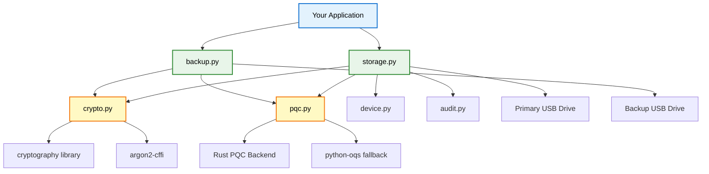

### 2. Detailed Component (Module) Architecture

The library is broken down into several focused modules. This promotes separation of concerns, making the system easier to maintain, test, and audit.

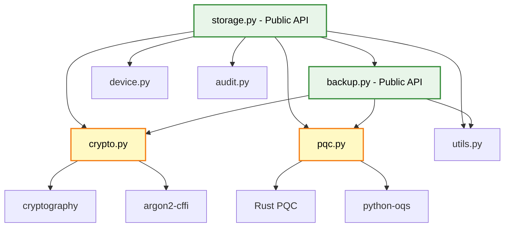

### 3. High-Level Logic Flowcharts

#### 3.1. Initialization Flow (`init_dual_usb`)

This flowchart shows the complete logic flow when initializing a dual USB backup system, including all validation and error handling.

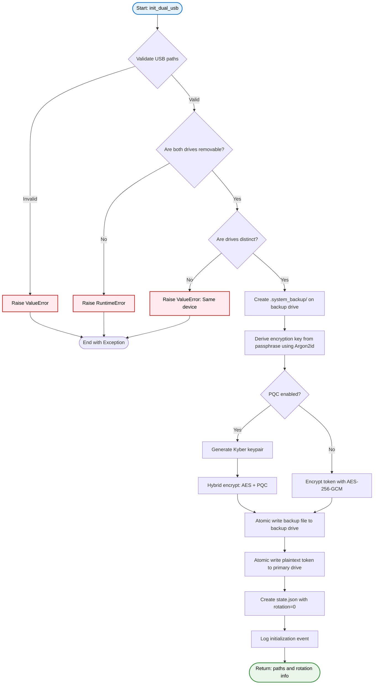

#### 3.2. Token Rotation Flow (`rotate_token`)

This flowchart illustrates the complete logic for rotating a token, including state verification and cleanup.

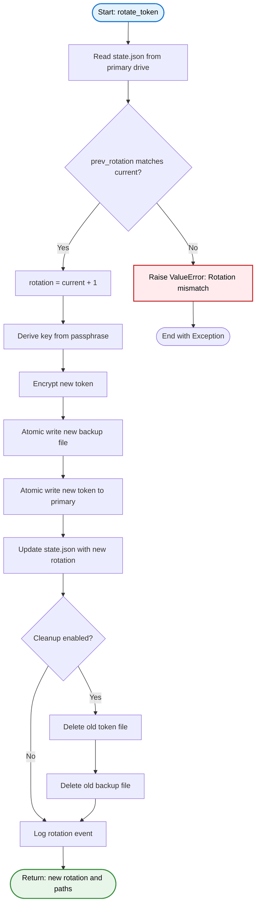

#### 3.3. Backup Verification Flow

This shows the logic for verifying that a backup file can be decrypted and matches the expected token.

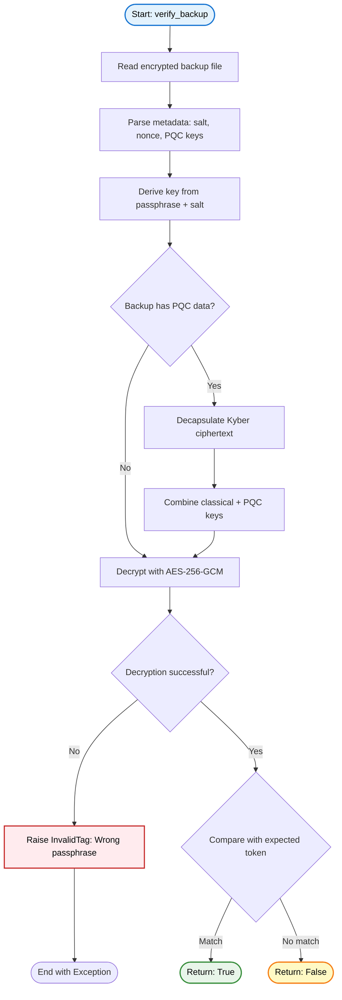

#### 3.4. Restore Operation Flow

Complete logic for restoring from a backup file to a new primary drive.

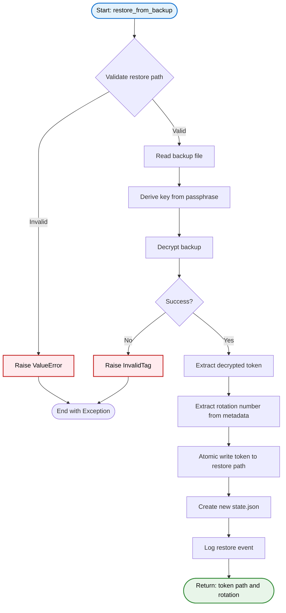

#### 3.5. PQC Backend Selection Logic

This shows how the library selects the appropriate Post-Quantum Cryptography backend at runtime.

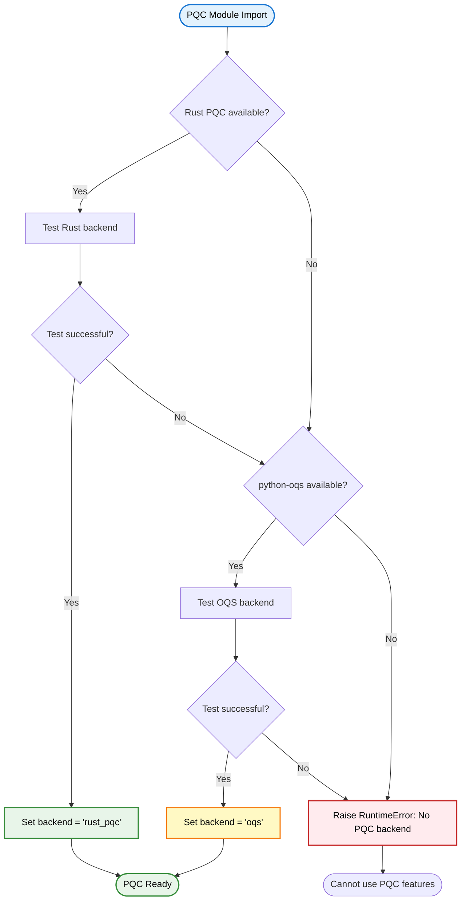

### 4. Data Flow Sequence Diagrams

#### 4.1. `init_dual_usb` Data Flow

This diagram shows the sequence of events when initializing the dual USB setup for the first time.

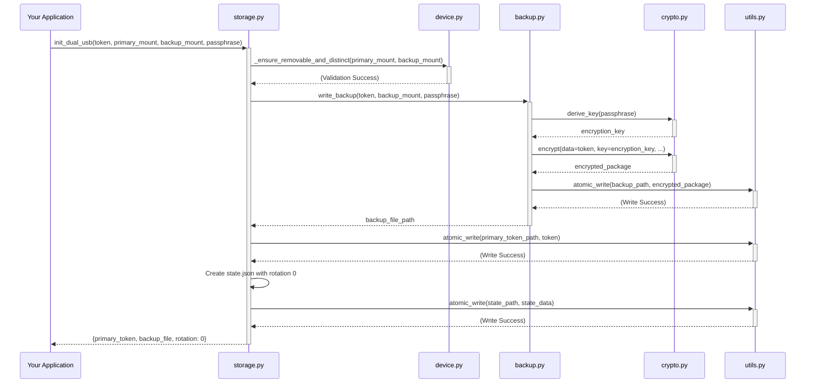

#### 4.2. `rotate_token` Data Flow

This diagram illustrates the process of updating the secret token, which involves creating a new backup and then updating the primary drive.

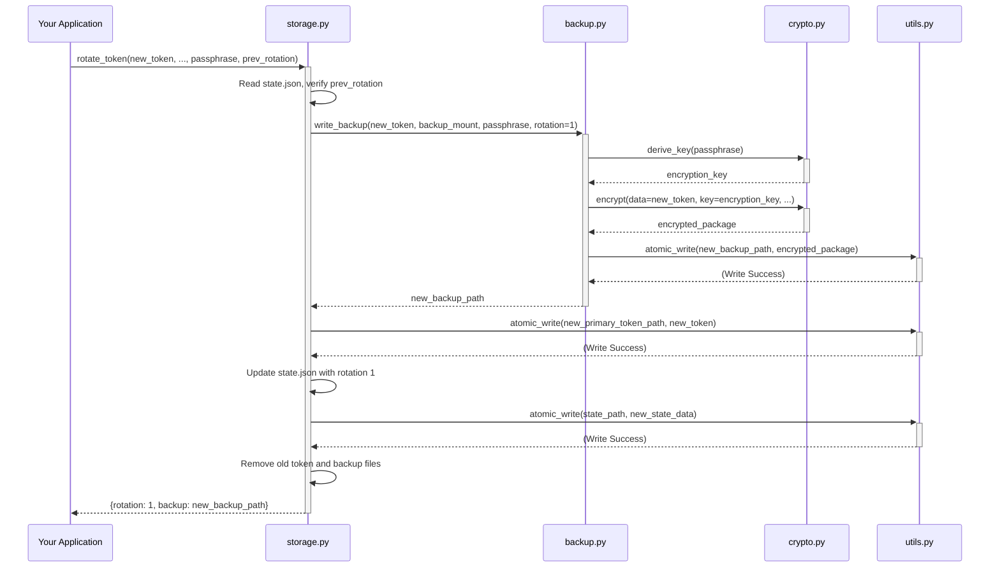

### 5. Cryptographic Pipeline

The library uses a hybrid cryptographic model, combining classical authenticated encryption (AES-GCM) with post-quantum key encapsulation (Kyber) to derive the final encryption key.

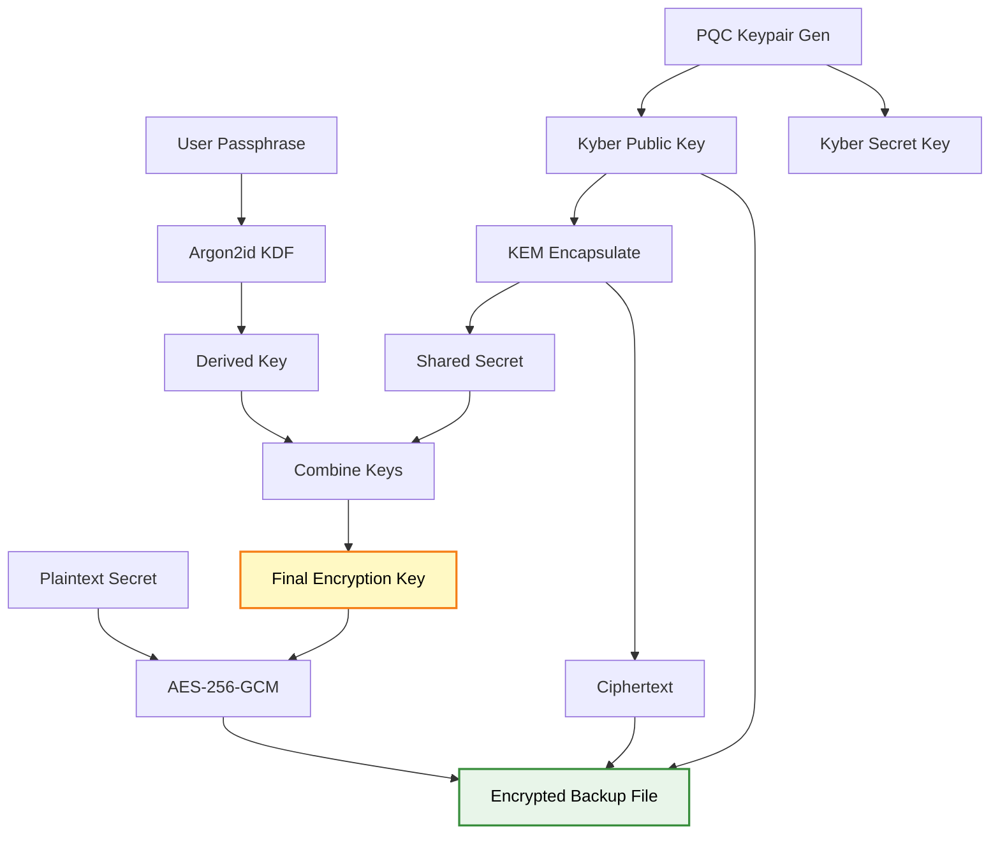

### 6. File System Layout

The library creates a specific file and directory structure on the primary and backup USB drives to maintain state and store cryptographic materials securely.

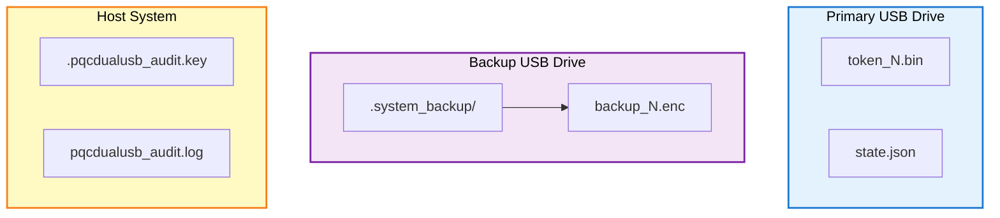

### 7. Security Threat Model & Mitigations

The security of the library is built on a defense-in-depth strategy, mapping specific threats to concrete mitigation techniques implemented in the code.

```mermaid
graph TB
    T1[Quantum Computer Attack] --> M1[Hybrid Encryption: AES-GCM + Kyber1024]
    T2[Side-Channel Attack] --> M2[Constant-time ops + Secure memory wiping]
    T3[Physical Theft of Drives] --> M3[Strong encryption + Passphrase required]
    T4[Brute-Force on Passphrase] --> M4[Argon2id KDF: Memory-hard function]
    T5[Data Corruption] --> M5[Atomic writes: Temp file + move]
    T6[Memory Forensics] --> M6[SecureMemory: Auto-zeroing sensitive data]
    
    style M1 fill:#e8f5e9,stroke:#388e3c,stroke-width:2px,color:#000
    style M2 fill:#e8f5e9,stroke:#388e3c,stroke-width:2px,color:#000
    style M3 fill:#e8f5e9,stroke:#388e3c,stroke-width:2px,color:#000
    style M4 fill:#e8f5e9,stroke:#388e3c,stroke-width:2px,color:#000
    style M5 fill:#e8f5e9,stroke:#388e3c,stroke-width:2px,color:#000
    style M6 fill:#e8f5e9,stroke:#388e3c,stroke-width:2px,color:#000
    
    style T1 fill:#ffebee,stroke:#c62828,stroke-width:2px,color:#000
    style T2 fill:#ffebee,stroke:#c62828,stroke-width:2px,color:#000
    style T3 fill:#ffebee,stroke:#c62828,stroke-width:2px,color:#000
    style T4 fill:#ffebee,stroke:#c62828,stroke-width:2px,color:#000
    style T5 fill:#ffebee,stroke:#c62828,stroke-width:2px,color:#000
    style T6 fill:#ffebee,stroke:#c62828,stroke-width:2px,color:#000
```

## Testing

The library includes a comprehensive test suite to ensure correctness and security.

### Running Tests
```bash
# Install test dependencies
pip install -e ".[dev]"

# Run all tests with verbose output
python -m pytest tests/ -v

# Run tests and generate a coverage report
python -m pytest tests/ --cov=pqcdualusb --cov-report=html
```

## Contributing

Contributions are welcome! Please follow the standard fork-and-pull-request workflow.

### Development Setup
1.  Clone the repository.
2.  Create and activate a virtual environment.
3.  Install in development mode: `pip install -e ".[dev,test]"`
4.  Install pre-commit hooks: `pre-commit install`

### Code Style
-   **Formatting**: `black` and `isort`
-   **Linting**: `flake8`
-   **Type Checking**: `mypy`

The pre-commit hooks will automatically enforce the code style.

## License

This project is licensed under the MIT License. See the [LICENSE](LICENSE) file for details.
