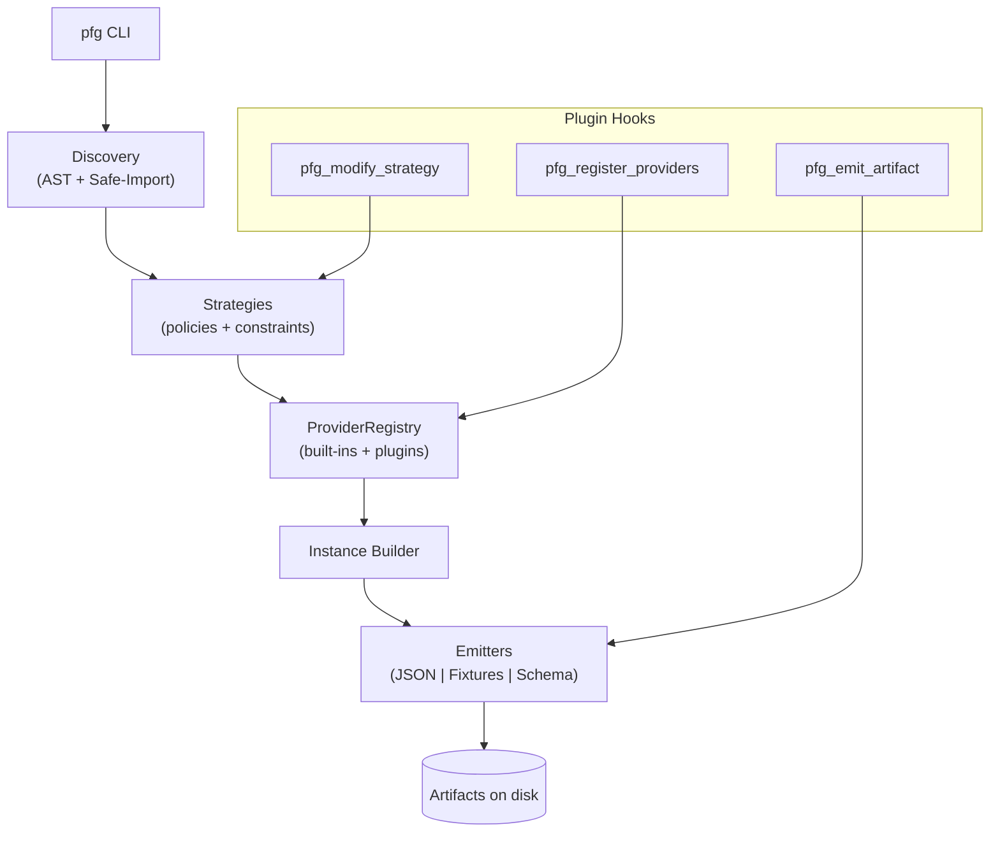

# Cookbook: Recipes for power users and plugin authors (cookbook)

> Strategy tuning, plugin hooks, emitter tricks, sandbox hardening, and performance for large test suites.

---

## Strategy personalization (strategy-personalization)

### Context

Override per-field behavior without forking the project.

### Prerequisites

- Custom plugin module importable in your environment.

### Steps

1. **Write a strategy plugin**:

   ```python
   # plugins/my_strategy_plugin.py
   from pydantic import BaseModel
   from pydantic_fixturegen.plugins.hookspecs import hookimpl

   class _NicknameBoost:
       @hookimpl
       def pfg_modify_strategy(self, model: type[BaseModel], field_name: str, strategy):
           if model.__name__ == "User" and field_name == "nickname":
               return strategy.model_copy(update={"p_none": 0.1})
           return None

   plugin = _NicknameBoost()
   ```

2. **Register the plugin**:

   ```python
   from pydantic_fixturegen.core.providers import create_default_registry
   from pydantic_fixturegen.plugins.loader import register_plugin

   from plugins.my_strategy_plugin import plugin

   registry = create_default_registry(load_plugins=False)
   registry.register_plugin(plugin)
   ```

3. **Verify changes**:

   ```bash
   pfg gen explain ./models.py
   ```

### Why it matters

Hooks like `pfg_modify_strategy` let you adjust probability weights or inject new behaviors while preserving determinism and upstream compatibility.

---

## Advanced emitters (advanced-emitters)

### Context

Control artifact formatting, sharding, and fixture styles.

### Prerequisites

- Optional extras: `pip install "pydantic-fixturegen[orjson]"` for high-throughput JSON.

### Steps

1. **Shard JSONL output for large runs**:

   ```bash
   pfg gen json ./models.py --n 10000 --jsonl --shard-size 2000 --out ./out
   ```

2. **Toggle orjson** for speed:

   ```bash
   pfg gen json ./models.py --orjson --indent 0 --out ./out
   ```

3. **Generate factory-style fixtures**:

   ```bash
   pfg gen fixtures ./models.py --style factory --scope function --return-type dict --out tests/factories.py
   ```

4. **Switch fixture scope** when sharing instances:

   ```bash
   pfg gen fixtures ./models.py --scope session --out tests/fixtures/session_fixtures.py
   ```

### Why it matters

Emitters are intentionally configurable so you can balance performance, readability, and integration style without giving up deterministic seeds.

---

## Plugin architecture (plugin-architecture)

### Context

Extend providers or emitters through Pluggy hooks.

### Prerequisites

- A package exposing entry points under `pydantic_fixturegen`.

### Steps

1. **Add an entry point** in `pyproject.toml`:

   ```toml
   [project.entry-points."pydantic_fixturegen"]
   email_masker = "acme_fixtures.plugins:EmailMaskerPlugin"
   ```

2. **Implement hooks**:

   ```python
   # acme_fixtures/plugins.py
   from pydantic import BaseModel
   from pydantic_fixturegen.plugins.hookspecs import hookimpl

   class EmailMaskerPlugin:
       @hookimpl
       def pfg_register_providers(self, registry):
           ...  # add custom providers

       @hookimpl
       def pfg_emit_artifact(self, kind, context):
           if kind == "json":
               context.output.write_text("redacted")
               return True
           return False
   ```

3. **Load plugins** automatically by calling `create_default_registry()` (entry points are discovered).

4. **Inspect strategy changes** via `pfg gen explain`.

### Why it matters

Pluggy keeps extensions isolated and testable; third parties can hook in without modifying core files.

---

## Security-focused recipes (security)

### Context

Safely evaluate untrusted models.

### Prerequisites

- Trust boundary defined; CLI runs inside a controlled working directory.

### Steps

1. **Prefer AST discovery** when imports are risky:

   ```bash
   pfg list ./third_party_models.py --ast
   ```

2. **Use the sandbox** for imports during generation:

   ```bash
   pfg gen json ./third_party_models.py --n 10 --out ./out
   ```

3. **Run the doctor** before CI:

   ```bash
   pfg doctor ./third_party_models.py --fail-on-warn
   ```

### Guarantees

- **Network lockdown**: socket calls raise `RuntimeError`.
- **Filesystem jail**: writes outside the working directory are denied.
- **Resource caps**: `RLIMIT_AS` and `RLIMIT_DATA` limit memory.
- **Timeouts**: exit code **40** signals a timed-out sandbox.

### Why it matters

You can evaluate community models without risking exfiltration or unstable CI.

---

## Performance optimization (performance)

### Context

Scale to large datasets with predictable memory and CPU.

### Prerequisites

- Sufficient CPU cores; consider enabling `orjson`.

### Steps

1. **Use worker pools for JSON** (enabled by the JSON emitter):

   ```bash
   pfg gen json ./models.py --n 200000 --jsonl --shard-size 5000 --out ./out
   ```

2. **Reduce formatting overhead**:

   ```bash
   pfg gen json ./models.py --indent 0 --orjson --out ./out
   ```

3. **Budget memory** with sharding and JSONL; avoid loading everything into RAM.

### Verification

- Measure wall time and file sizes; outputs remain deterministic given the same seed.

### Why it matters

Parallel-safe emitters plus sharding yield throughput without compromising reproducibility.

---

## Mermaid: plugin workflow (plugin-workflow)



---

## Extras matrix (extras-matrix)

| Extra                       | Capabilities Unlocked                                               | Install Command                                 | Ideal Use Case                                      |
| --------------------------- | ------------------------------------------------------------------- | ----------------------------------------------- | --------------------------------------------------- |
| `regex` → `rstr`            | String generation from regex patterns                               | `pip install 'pydantic-fixturegen[regex]'`      | Models with regex-constrained fields                |
| `orjson` → `orjson`         | High-throughput JSON encoding                                       | `pip install 'pydantic-fixturegen[orjson]'`     | Large JSON/JSONL dumps in CI                        |
| `hypothesis` → `hypothesis` | Property-based testing extras                                       | `pip install 'pydantic-fixturegen[hypothesis]'` | Complement deterministic runs with generative tests |
| `all`                       | All runtime extras                                                  | `pip install 'pydantic-fixturegen[all]'`        | One-shot enablement                                 |
| `all-dev`                   | Runtime extras + dev tools (`mypy`, `ruff`, `pytest`, `pytest-cov`) | `pip install 'pydantic-fixturegen[all-dev]'`    | Local development and contributions                 |

---

## FAQ (faq)

<details>
<summary>How is determinism guaranteed across runs and machines?</summary>
Seeds cascade deterministically per model and field across Python <code>random</code>, Faker, and optional NumPy RNGs. Keep the seed fixed via CLI or <code>PFG_SEED</code>. Banners/headers record <em>seed/version/digest</em> for verification.
</details>

<details>
<summary>Which configuration value “wins” if I set it in multiple places?</summary>
Precedence is strict: CLI args → <code>PFG_*</code> environment → <code>[tool.pydantic_fixturegen]</code> in <code>pyproject.toml</code> or YAML → defaults. Booleans accept <code>true/false/1/0</code>.
</details>

<details>
<summary>Can I change how a specific field is generated without forking?</summary>
Yes. Implement <code>pfg_modify_strategy</code> in a plugin to adjust the field’s strategy or constraints. Verify with <code>pfg gen explain</code>.
</details>

<details>
<summary>Is it safe to run against untrusted model modules?</summary>
Yes. The safe-import sandbox blocks network, jails writes, scrubs env, and caps memory; timeouts exit with code 40. Combine with <code>pfg doctor</code> and, if discovery suffices, use <code>--ast</code>.
</details>

<details>
<summary>How do I avoid partial schema files if generation fails?</summary>
The schema emitter writes to a temp file and renames atomically. You either get the old file or the new one—never a partial.
</details>

<details>
<summary>What if I need machine-readable errors in CI?</summary>
Use <code>--json-errors</code> on supported commands. Discovery failures return a JSON payload with code <code>20</code>.
</details>

---

## Next steps (next-steps)

- Browse the **[Quickstart](./quickstart.md)** for the core flow.
