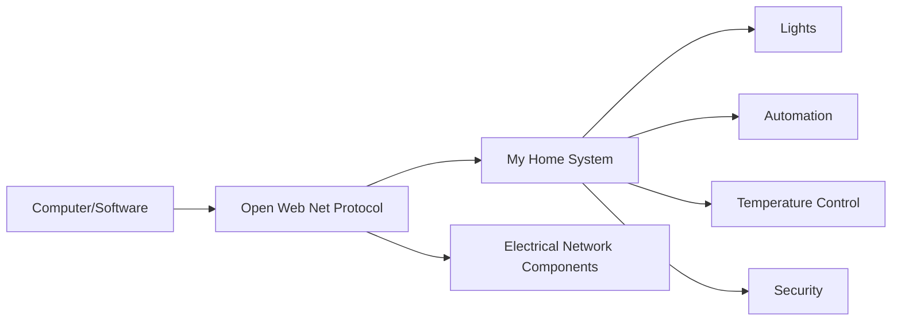
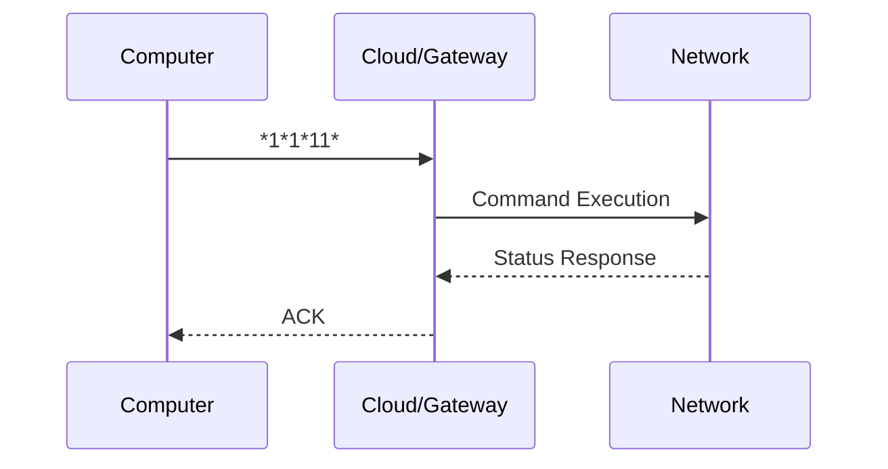
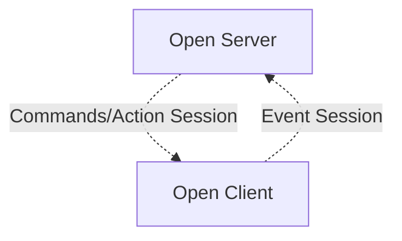
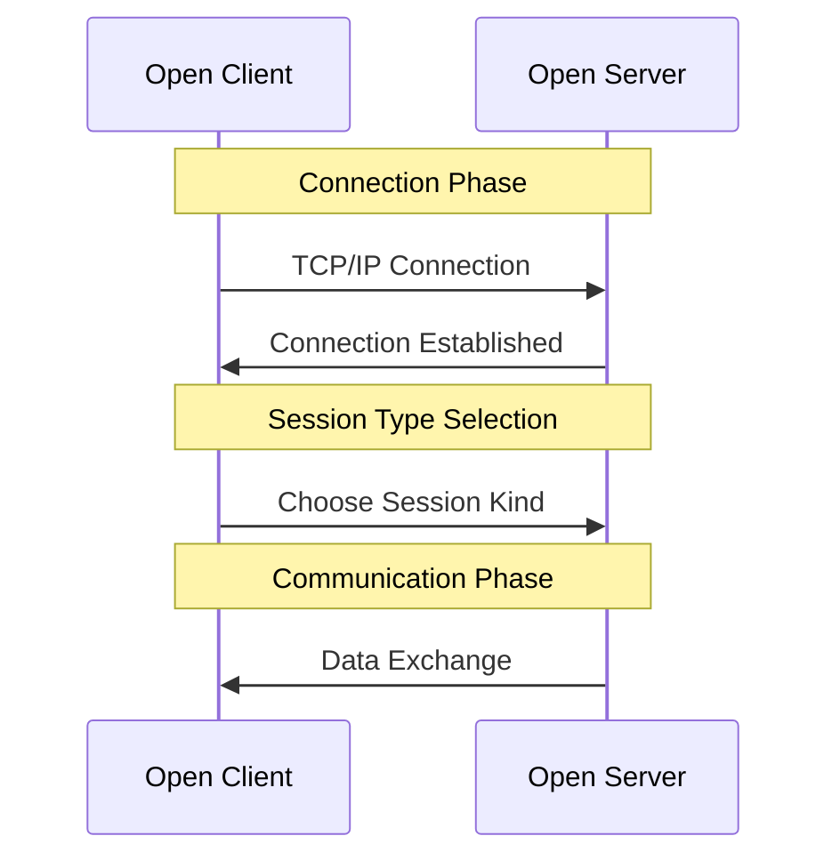
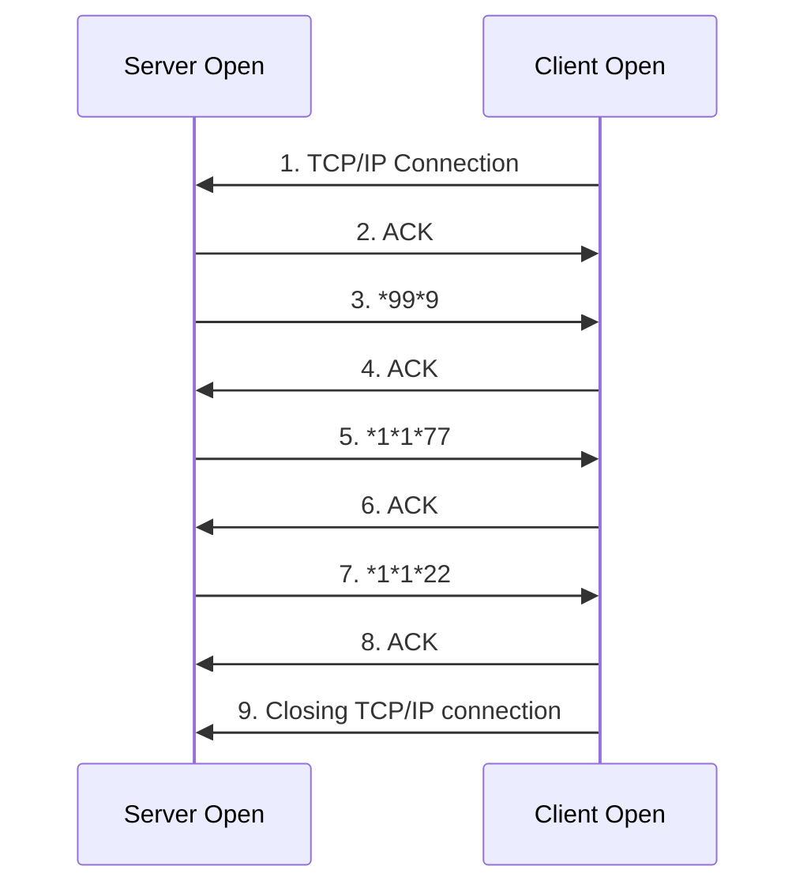
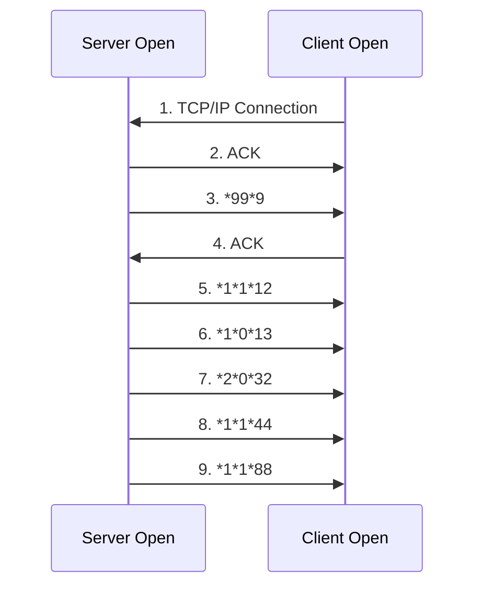

[Original Document](/assets/pdf/OWN_Intro_ENG.pdf)

## Introduction

In the last decades BTicino invested on the technological research and on development of Home Automation Systems.
To let anyone who has knowledge about programming language to interact with the systems we thought to implement a communication language called Open Web Net

**OPEN = Open Protocol for Electronic Networks**

Thanks to the Open Web Net it is possible to exchange data and to send commands between a remote unity and the My Home System. The protocol is thought to be independent from the communication way, considering using DTMF tones on the normal phone line PSTN as a minimum requirement. Up to now the devices which are using this protocol are the web servers and the phone actuators.
This language has been implemented also to allow the integration with third party systems and functions or to let, some devices; as PC, Smart phones and tablets, communicate with My Home out of a LAN network.
The Open Web Net has been introduced to provide an abstract level which allows the supervision and the control of My Home systems focusing on functions without caring about the configuration details and without knowing deeply the SCS technology.

## Examples of Integration

Knowing the syntax protocol it is possible to use a own software to control My Home system.

## Syntax of an Open Message

An Open frame is composed by characters belonging to the following collection:

`{0, 1, 2, 3, 4, 5, 6, 7, 8, 9, *, #}`

It starts with the character `*`, and ends with the couple `##`.

The character `*` is also used as a separator among the tags.
An Open message is built in this way:

`*tag1*tag2*tag3*...*tagN##`

A tag is composed by characters belonging to this set:

`{0, 1, 2, 3, 4, 5, 6, 7, 8, 9, #}`

A tag can't have the couple `##`. A tag may be omitted, creating Open message similar to this one:

`*tag1*..*..*tag4*...*tagN**##`

The table shows the different kinds of messages that can be sent or received in a Open Client-Server conversation.

| Type               | Message                                          |
|:-------------------|:-------------------------------------------------|
| ACK                | `*#*1##`                                         |
| NACK               | `*#*0##`                                         |
| NORMAL             | `*WHO*WHAT*WHERE##`                              |
| STATUS REQUEST     | `*#WHO*WHERE##`                                  |
| DIMENSION REQUEST  | `*#WHO*WHERE*DIMENSION##`                        |
| DIMENSION WRITING  | `*#WHO*WHERE*#DIMENSION*VAL₁*VAL2*...*VAL##`     |

## Communication Sessions

The TCP-IP gateway offers the Open Server on the 20000 port.
There are three main phases to establish a session:

- connection
- identification
- communication

The Open Client can establish two different kinds of sessions:

- **Command Session (actions)**: used to send commands, status requests, dimension requests and writing
- **Event Session**: used by the Open Client to read all what happens on the home automation bus in a asynchronous way.

## Example of Communication Stream

The identification phase changes if, in the Open Server, is configured an IP range that allows the communication without the need of the OPEN password.

For further information: <http://www.myopen-legrandgroup.com/resources/tutorials/m/mediagallery/33995.aspx>

Whether you have to exchange an OPEN password, the OPEN Client must know the authentication algorithm.

## Commands/Actions Session

After having chosen a TCP-IP connection between a Client and a Server; the communication flow will be the following:

Example connection commands session:

## Event Session

After having established a TCP-IP connection between a Client and a Server; the communication flow will be the following:

Example Event Session:

## Programmed Scenario Session

This kind of session it can be used only if a Scenario module (F420 for BTicino; 03551 for Legrand) is in configuration modality and there is the necessity to program it through Ethernet.

After having established a TCP-IP connection between a Client and a Server; the communication flow will be the following:

Example Programmed Scenario Session:

## Particular Open Messages

In addition to the commands messages there are particular messages that will be sent during the communication flow: ACK and NACK frames

### ACK message

The Acknowledgement Open message has the following syntax:

`*#*1##`

This frame indicates that the Open message, sent by the Client, or received by the Server, is semantically and syntactically correct.
Furthermore it is used as an ended message when it is the answer to an Open frame which involves the forwarding of one or more messages in sequence (status or dimension requests).

### NACK message

The Open Message of not-acknowledge (NACK) is

`*#*0##`

This frame means that the Open message, sent by the Client to the Server, is semantically or syntactically wrong. Furthermore it is used as an ended message when it is the answer to an Open frame which involves the forwarding of one or more messages in sequence (status or dimension requests).
In this case, the Client may consider invalid any message received before the NACK.

## Command / Status Open Frames

The Open message, that has this function is so structured:

`*WHO*WHAT*WHERE##`

This frame is used both in the action/commands session and in the events one.

- **Events session**: indicates that a My Home system object has changed its status.
- **Commands / Actions session**:
  - Message sent by the Server to the Client as response to a status request.
  - Message sent by the Client to the Server to require an action execution.

### Tag WHO

The Tag WHO identifies the Home automation system's area involved by the Open frame used.

### Tag WHAT

The tag WHAT, identifies the action to make (ON lights, OFF lights, dimmer at 20%, shutters UP, shutters DOWN, set program 1 in thermoregulation central, etc...)

For each WHO (and so for every function) is described a WHAT table.
The WHAT tag can contain other parameters:

`WHAT#PAR₁#PAR₂...#PARn`

### Tag WHERE

The tag WHERE detects the objects involved by the frame (environment, room, single object, whole system).

For each WHO (and so for every function) is described a WHERE table.
The WHERE tag can contain other parameters:

`WHERE#PAR₁#PAR₂...#PARn`

### Command Examples

| OPEN                 | Description                                     |
|:---------------------|:------------------------------------------------|
| `*1*1*12##`          | Command to switch ON light 12 / report light status 12, ON |
| `*2*1*41#4#2##`      | Command shutter 41 UP on local bus interface 2  |
| `*1*0*0##`           | Command OFF whole system                        |
| `*7*0*4000##`        | Command ON cam whose address is 4000            |
| `*4*303*1##`         | Command OFF room 1 (thermoregulation function)  |

## Status Request Open Frame

The status request Open message is so structured:

`*#WHO*WHERE##`

The Client sends this message in the Command/action session to require information on the status of a single object or the entire system. The Server replies to this request by sending one or more Open status messages.
The reply must end with an ACK or NACK frame.
If the field WHERE isn't specified, the request is generic and sent to the whole system.

### Status Request Examples

| OPEN               | Description                                                                                              |
|:-------------------|:---------------------------------------------------------------------------------------------------------|
| `*#1*12##`         | Request status light 12                                                                                  |
| `*1*1*12##`        | Reply status light 12, light ON.                                                                        |
| ACK                | The flow is closed with an ACK only if the frame is correctly sent.                                     |
| `*#1*41#4#2##`     | Request status light 41 on local bus interface 2                                                        |
| `*#1*0##`          | Request status light function                                                                            |
| `*#4*1##`          | Request status zone 1 thermoregulation function                                                         |

## Dimension Request Open Frame

The OPEN message to require the dimension is so structured:

`*#WHO*WHERE*DIMENSION##`

The client sends in the commands session to require information about the dimension value of both one single object or an entire system.
The server replies by sending one or more Open status messages, so structured:

`*#WHO*WHERE*DIMENSION*VAL₁*...*VALn##`

The number of VAL fields depends on the DIMENSION requested.
The answer message is followed by the ACK.
If there is an error in the dimension request then it will be displayed the NACK frame.

The reply message is generically sent even in the Events connections.
The Open Server forwards the dimension message if there are variation on that dimension or simply if the device has to signal periodically his dimension status (for example the thermo probe has to communicate a value every 15 minutes).

### Dimension Request Examples

| OPEN                 | Description                                                                                           |
|:---------------------|:------------------------------------------------------------------------------------------------------|
| `*#13**1##`          | Request date of the device that implements the Open Server.                                          |
| `*#13**1*D*G*M*A##`  | The reply message has 4 parameters which represent day of the week, month, year.                     |
| ACK                  | The flow is ended by an ACK if the reply is correctly sent.                                          |
| `*#4*1*0##`          | Request temperature in the zone 1 of the thermoregulation function.                                  |
| `*#4*1*0*0215*3##`   | The reply message includes the temperature value 21.5° written in the first parameter.              |
| ACK                  |                                                                                                       |
| `*#4*1*14*0250##`    | Temperature Zone 1 of the thermoregulation function set at 25°.                                      |

## Dimension Writing Open Frame

The OPEN message to write the dimension is so structured:

`*#WHO*WHERE*#DIMENSION*VAL₁*...*VALn##`

The message implies a modification only for the dimensions which can be modified.

The Client sends this message in the Commands/actions session to modify the dimension values of a single object or the whole system.
The Server will answer with an ACK or NACK message.

### Dimension Writing Examples

| OPEN                        | Description                                                                                         |
|:----------------------------|:----------------------------------------------------------------------------------------------------|
| `*#13**#0*21*10*00*01##`    | Set the device time which implements the OPEN server at 21.10.00                                   |
| `*#4*#0*#0*0250*1##`        | Set the Thermo Central Unit temperature at 25 degrees in heating mode.                             |

## Functions Developed Thanks to Open Web Net

### Table of WHO

| Code     | Description                                   |
|:---------|:----------------------------------------------|
| 0        | Scenarios                                     |
| 1        | Lightning                                     |
| 2        | Automation                                    |
| 3        | Controllo carichi *                           |
| 4        | Temperature Control                           |
| 5        | Alarm                                         |
| 6        | VDES                                          |
| 13       | Gateway Management                            |
| 15       | CEN commands                                  |
| 16 / 22  | Sound diffusion**                             |
| 17       | MH200N scenarios                              |
| 18       | Energy management                             |
| 25       | CEN plus/ scenarios plus/ dry contacts        |
| 1001     | Automation diagnostic                         |
| 1004     | Thermoregulation diagnostic                   |
| 1013     | Device diagnostic                             |

---

## Copyright Notice

Copyright (C) 2011 [`www.myopen-legrandgroup.com`](https://www.myopen-legrandgroup.com). All Rights Reserved.

## License

By using and/or copying this document, you (the licensee) agree that you have read, understood, and will comply with the following terms and conditions:

Permission to copy, and distribute the contents of this document, in any medium for any purpose and without fee or royalty is hereby granted, provided that you include the following on ALL copies of the document, or portions thereof, that you use:

- A link or URL to the [`www.myopen-legrandgroup.com`](https://www.myopen-legrandgroup.com).
- The copyright notice of the original author, or if it doesn't exist, a notice (hypertext is preferred, but a textual representation is permitted) of the form: "Copyright (C) [date-of-document] [`www.myopen-legrandgroup.com`](https://www.myopen-legrandgroup.com). All Rights Reserved.

When space permits, inclusion of the full text of this NOTICE should be provided. We request that authorship attribution be provided in any software, documents, or other items or products that you create pursuant to the implementation of the contents of this document, or any portion thereof.

Any contributions to the document (i.e. translation, modifications, improvements, etc) has to be submitted to and accepted by the My Open staff (using the forum of the community or sending an email via the [`www.myopen-legrandgroup.com`](https://www.myopen-legrandgroup.com) dedicated section) . Once the improvement has been accepted the new release will be published in the My Open Community web site.

## Disclaimers

THIS DOCUMENT IS PROVIDED "AS IS," AND COPYRIGHT HOLDERS MAKE NO REPRESENTATIONS OR WARRANTIES, EXPRESS OR IMPLIED, INCLUDING, BUT NOT LIMITED TO, WARRANTIES OF MERCHANTABILITY, FITNESS FOR A PARTICULAR PURPOSE, NON-INFRINGEMENT, OR TITLE; THAT THE CONTENTS OF THE DOCUMENT ARE SUITABLE FOR ANY PURPOSE; NOR THAT THE IMPLEMENTATION OF SUCH CONTENTS WILL NOT INFRINGE ANY THIRD PARTY PATENTS, COPYRIGHTS, TRADEMARKS OR OTHER RIGHTS.

COPYRIGHT HOLDERS WILL NOT BE LIABLE FOR ANY DIRECT, INDIRECT, SPECIAL OR CONSEQUENTIAL DAMAGES ARISING OUT OF ANY USE OF THE DOCUMENT OR THE PERFORMANCE OR IMPLEMENTATION OF THE CONTENTS THEREOF.

The name and trademarks of copyright holders may NOT be used in advertising or publicity pertaining to this document or its contents without specific, written prior permission. Title to copyright in this document will at all times remain with copyright holders.
