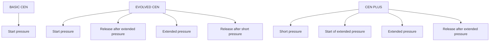
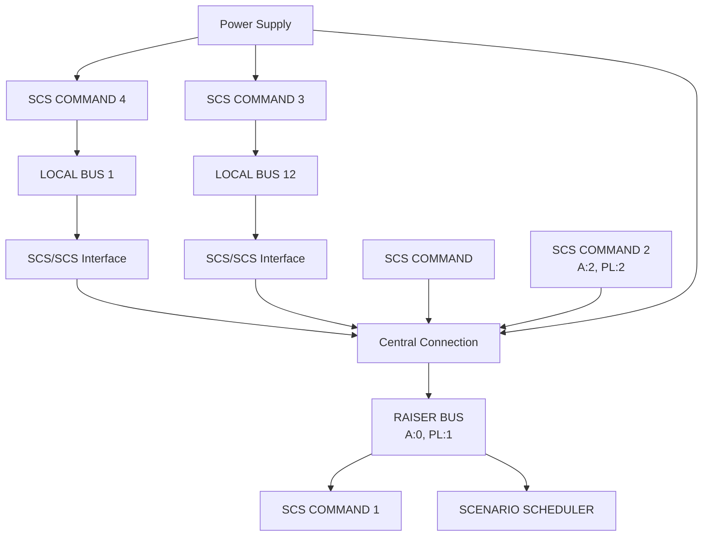

[Original Document](/assets/pdf/WHO_15-25.pdf)

Open Web Net frames for Scenario Scheduler

| Brand   | Item           |
|:--------|:---------------|
| Legrand | 03565          |
| BTicino | MH200, MH200N  |

## Description

The **Scenario Scheduler** is a Home Controller with instructions called scenarios. These scenarios are managed by receiving **CEN Frames** from command modules or from software to activate, deactivate, enable and disable each scenario.

CEN Frames can be sent on the SCS BUS using SCS Devices (as a normal SCS Command) or using an Open Web Net / SCS Gateway.

The Scenario Scheduler reads these frames on the bus, analyzes them, manages scenarios.

The Scenario Scheduler works also as an Ethernet Gateway¹. It monitors all the SCS Frames traveling in the SCS bus, and all the Open Web Net Frames arriving from IP socket connections. The received SCS Frames are processed and routed according to the CEN source address and the key pressure information.

CEN Frames can be used for integration between My Home System and 3rd party Systems.

Installing My Home Commands in the system, configured as CEN, it's possible to forward the information of pressure of a Command to a 3rd party System using a Scenario Scheduler as Ethernet Gateway. This information can be used to control functions of other System.

*¹ MH200 doesn't manage this function*

---

A SCS Command configured in modality CEN generates CEN messages when one of its push button is pressed.

This schema helps to understand the meaning of the new functions available with the evolved CEN and CEN PLUS:

## Open Web Net WHO = 15

**BASIC & EVOLVED CEN**

### WHAT Table

| VALUE | DESCRIPTION   | CONNECTION |       |
|:------|:--------------|:-----------|:------|
|       |               | ACTION     | EVENT |
| 00    | Button Number | W          | R     |
| ...   | Button Number | W          | R     |
| 31    | Button Number | W          | R     |

### Parameters

| PARAMETER | DESCRIPTION                        | CONNECTION |       |
|:----------|:-----------------------------------|:-----------|:------|
|           |                                    | ACTION     | EVENT |
| 1         | Release after short pressure¹      | W          | R     |
| 2         | Release after an extended pressure¹| W          | R     |
| 3         | Extended pressure¹⁻²               | W          | R     |

### WHERE Table

| VALUE | DESCRIPTION                      |
|:------|:---------------------------------|
| A-PL  | [1-9]\[1-9] Normal Area – Light Point |
| A-PL  | [00]\[01-15] Zone 0: Advanced A-PL¹ |
| A-PL  | [10]\[01-15] Zone 10: Advanced A-PL¹ |
| A-PL  | [01-09]\[10-15] Light Point 10-15: Advanced A-PL¹ |

### Parameters

| PARAMETER | DESCRIPTION                                    |
|:----------|:-----------------------------------------------|
| #3        | Private Raiser BUS¹                            |
| #4#[01-15]| Local BUS where SCS/SCS Interface has address I₄ |

*¹ MH200 doesn't manage this function*  
*² To have an extended pressure of a command, the push button has to be pressed for 0.5s. From the first pressure, to the release, every 0.5s the relative frame is sent on the SCS BUS.*  
*³ W = Write, R = Read*

---

## Action Connection

### Virtual Pressure

| Action Connection | Open Frame         | Note                                                                                          |
|:------------------|:-------------------|:----------------------------------------------------------------------------------------------|
| Client → Server   | `*15*WHAT*WHERE##` | WHAT = virtual pressure of the push button n N value = [00-31] WHERE = push button virtual address values = all the values in the WHERE Table |
| Client ← Server   | `*#*1##`           |                                                                                               |

| Event Connection | Open Frame         | Note                                                                                             |
|:-----------------|:-------------------|:-------------------------------------------------------------------------------------------------|
| Client ← Server  | `*15*WHAT*WHERE##` | The OWN/SCS Gateway informs each Client with an opened Event Connection that a CEN Frame is read on the SCS BUS |

### Virtual Release After Short Pressure

| Action Connection | Open Frame            | Note                                                                                          |
|:------------------|:----------------------|:----------------------------------------------------------------------------------------------|
| Client → Server   | `*15*WHAT#1*WHERE##`  | WHAT = virtual pressure of the push button n N value = [00-31] WHERE = push button virtual address values = all the values in the WHERE Table |
| Client ← Server   | `*#*1##`              |                                                                                               |

| Event Connection | Open Frame            | Note                                                                                             |
|:-----------------|:----------------------|:-------------------------------------------------------------------------------------------------|
| Client ← Server  | `*15*WHAT#1*WHERE##`  | The OWN/SCS Gateway informs each Client with an opened Event Connection that a CEN Frame is read on the SCS BUS |

### Virtual Release After Extended Pressure

| Action Connection | Open Frame            | Note                                                                                          |
|:------------------|:----------------------|:----------------------------------------------------------------------------------------------|
| Client → Server   | `*15*WHAT#2*WHERE##`  | WHAT = virtual pressure of the push button n N value = [00-31] WHERE = push button virtual address values = all the values in the WHERE Table |
| Client ← Server   | `*#*1##`              |                                                                                               |

| Event Connection | Open Frame            | Note                                                                                             |
|:-----------------|:----------------------|:-------------------------------------------------------------------------------------------------|
| Client ← Server  | `*15*WHAT#2*WHERE##`  | The OWN/SCS Gateway informs each Client with an opened Event Connection that a CEN Frame is read on the SCS BUS |

### Virtual Extended Pressure

| Action Connection | Open Frame            | Note                                                                                          |
|:------------------|:----------------------|:----------------------------------------------------------------------------------------------|
| Client → Server   | `*15*WHAT#3*WHERE##`  | WHAT = virtual pressure of the push button n N value = [00-31] WHERE = push button virtual address values = all the values in the WHERE Table |
| Client ← Server   | `*#*1##`              |                                                                                               |

| Event Connection | Open Frame            | Note                                                                                             |
|:-----------------|:----------------------|:-------------------------------------------------------------------------------------------------|
| Client ← Server  | `*15*WHAT#3*WHERE##`  | The OWN/SCS Gateway informs each Client with an opened Event Connection that a CEN Frame is read on the SCS BUS |

---

## Event Connection

### Pressure

| Event Connection | Open Frame         | Note                                                           |
|:-----------------|:-------------------|:---------------------------------------------------------------|
| Client ← Server  | `*15*WHAT*WHERE##` | This frame is sent to a Client if: • a physical push button is pressed • a OWN client sends a virtual pressure on the bus |

### Release After Short Pressure

| Event Connection | Open Frame           | Note                                                                 |
|:-----------------|:---------------------|:---------------------------------------------------------------------|
| Client ← Server  | `*15*WHAT#1*WHERE##` | This frame is sent to a Client if: • a physical push button is released after a short pressure • a OWN client sends a virtual release after a short pressure on the bus |

### Release After Extended Pressure

| Event Connection | Open Frame           | Note                                                                     |
|:-----------------|:---------------------|:-------------------------------------------------------------------------|
| Client ← Server  | `*15*WHAT#2*WHERE##` | This frame is sent to a Client if: • a physical push button is released after an extended pressure • a OWN client sends a virtual release after a long pressure on the bus |

### Extended Pressure

| Event Connection | Open Frame           | Note                                                               |
|:-----------------|:---------------------|:-------------------------------------------------------------------|
| Client ← Server  | `*15*WHAT#3*WHERE##` | This frame is sent to a Client if: • a physical push button is keep pressing • a OWN client sends a virtual keep pressing on the bus |

---

## Example

The following schema helps to understand how the Scenario Scheduler translates into Open Web Net frames the actions done on the systems, when a push button of SCS Command configured with M = CEN is pressed or a Software sends CEN Message to the System.

### Example Sequences

When the push button n° 1 of SCS Command 1 is pressed, kept pressed, then released an Open Web Net Client reads the following sequence of OWN Frames:

| Event Connection | Time         | OWN Frame           | Action            |
|:-----------------|:-------------|:--------------------|:------------------|
| Client ← Server  | 17:07:48:140 | `*15*01*0001##`     | Pressure          |
| Client ← Server  | 17:07:48:687 | `*15*01#3*0001##`   | Extended Pressure |
| Client ← Server  | 17:07:49:202 | `*15*01#3*0001##`   | Extended Pressure |
| Client ← Server  | 17:07:49:499 | `*15*01#2*0001##`   | Release           |

When the push button n° 4 of Command SCS 1 is pressed and released an Open Web Net Client reads the following sequence of OWN Frames:

| Event Connection | Time         | OWN Frame         | Action   |
|:-----------------|:-------------|:------------------|:---------|
| Client ← Server  | 17:06:50:733 | `*15*04*0001##`   | Pressure |
| Client ← Server  | 17:06:51:014 | `*15*04#1*0001##` | Release  |

When the push button n° 2 of Command SCS 2 is pressed and released an Open Web Net Client reads the following sequence of OWN Frames:

| Event Connection | Time         | OWN Frame       | Action   |
|:-----------------|:-------------|:----------------|:---------|
| Client ← Server  | 17:06:53:013 | `*15*02*22##`   | Pressure |
| Client ← Server  | 17:06:53:204 | `*15*02#1*22##` | Release  |

When the push button n° 6 of Command SCS 3 is pressed and released an Open Web Net Client reads the following sequence of OWN Frames:

| Event Connection | Time         | OWN Frame             | Action   |
|:-----------------|:-------------|:----------------------|:---------|
| Client ← Server  | 17:06:54:883 | `*15*06*36#4#01##`    | Pressure |
| Client ← Server  | 17:06:55:125 | `*15*06#1*36#4#01##`  | Release  |

When the push button n° 3 of Command SCS 4 is pressed and released an Open Web Net Client reads the following sequence of OWN Frames:

| Event Connection | Time         | OWN Frame               | Action   |
|:-----------------|:-------------|:------------------------|:---------|
| Client ← Server  | 17:06:56:232 | `*15*03*0112#4#12##`    | Pressure |
| Client ← Server  | 17:06:56:418 | `*15*03#1*0112#4#12##`  | Release  |

### Virtual Command Examples

When an OWN Client sends a Virtual Pressure of Button=31, A=02, PL=15, each Client with an Event Connection opened reads the following OWN Frame:

| Action Connection | Time         | OWN Frame       | Action           |
|:------------------|:-------------|:----------------|:-----------------|
| Client → Server   | 17:21:05:528 | `*15*31*0215##` | Virtual Pressure |

| Event Connection | Time         | OWN Frame       | Action           |
|:-----------------|:-------------|:----------------|:-----------------|
| Client ← Server  | 17:21:05:044 | `*15*31*0215##` | Virtual Pressure |

When an OWN Client sends a Virtual Short Release of Button=3, A=10, PL=01, each Client with an Event Connection opened reads the following OWN Frame:

| Action Connection | Time         | OWN Frame         | Action               |
|:------------------|:-------------|:------------------|:---------------------|
| Client → Server   | 17:21:07:041 | `*15*03#1*1001##` | Virtual Short Release|

| Event Connection | Time         | OWN Frame         | Action               |
|:-----------------|:-------------|:------------------|:---------------------|
| Client ← Server  | 17:21:07:062 | `*15*03#1*1001##` | Virtual Short Release|

When an OWN Client sends a Virtual keep pressing of Button=0, A=00, PL=10, each Client with an Event Connection opened reads the following OWN Frame:

| Action Connection | Time         | OWN Frame         | Action                   |
|:------------------|:-------------|:------------------|:-------------------------|
| Client → Server   | 17:21:11:916 | `*15*00#3*0010##` | Virtual Extended Pressure|

| Event Connection | Time        | OWN Frame         | Action                   |
|:-----------------|:------------|:------------------|:-------------------------|
| Client ← Server  | 7:21:11:932 | `*15*00#3*0010##` | Virtual Extended Pressure|

When an OWN Client sends a Virtual Release after an Extended Pressure of Button=20, A=03, PL=03, I₄ = 02, each Client with an Event Connection opened reads the following OWN Frame:

| Action Connection | Time         | OWN Frame             | Action                              |
|:------------------|:-------------|:----------------------|:------------------------------------|
| Client → Server   | 17:21:07:041 | `*15*20#2*33#4#02##`  | Virtual Release after Extended Pressure |

| Event Connection | Time         | OWN Frame             | Action                              |
|:-----------------|:-------------|:----------------------|:------------------------------------|
| Client ← Server  | 17:21:07:062 | `*15*20#2*33#4#02##`  | Virtual Release after Extended Pressure |

---

## Open Web Net WHO = 25

**CEN PLUS**

### WHAT Table

| VALUE | DESCRIPTION                                     | CONNECTION |       |
|:------|:------------------------------------------------|:-----------|:------|
|       |                                                 | ACTION     | EVENT |
| 21    | Short pressure (< 0.5 seconds)                 | W          | R     |
| 22    | Start of extended pressure (>= 0.5 seconds)    | W          | R     |
| 23    | Extended pressure                               | W          | R     |
| 24    | Released after an extended pressure            | W          | R     |
| 25    | Rotary selector in slow clockwise rotation     | W          | R     |
| 26    | Rotary selector in fast clockwise rotation     | W          | R     |
| 27    | Rotary selector in slow counter-clockwise rotation | W      | R     |
| 28    | Rotary selector in fast counter-clockwise rotation | W      | R     |

### Parameter

| PARAMETER | DESCRIPTION       | CONNECTION |       |
|:----------|:------------------|:-----------|:------|
|           |                   | ACTION     | EVENT |
| 0-31      | Virtual Pushbutton| W          | R     |

### WHERE Table

| VALUE | DESCRIPTION                                              |
|:------|:---------------------------------------------------------|
| 2     | [0-2047] Virtual Address has a value done with the union of: [2] \[Object] |

---

## Action Connection

### Virtual Short Pressure (< 0.5 seconds)

| Action Connection | Open Frame                      | Note                                                                      |
|:------------------|:--------------------------------|:--------------------------------------------------------------------------|
| Client → Server   | `*25*21#pushbutton*WHERE##`     | WHAT = action # object pushbutton = virtual pressure of the push button n N value = [0-31] WHERE = [2] \[object] object = push button virtual address = [0-2047] |
| Client ← Server   | `*#*1##`                        |                                                                           |

| Event Connection | Open Frame                       | Note                                                                      |
|:-----------------|:---------------------------------|:--------------------------------------------------------------------------|
| Client ← Server  | `*25*21#pushbutton*WHERE##`      | The OWN/SCS Gateway informs each Client with an opened Event Connection that a CEN PLUS Frame is read on the SCS BUS |

### Virtual Start of Extended Pressure (>= 0.5 seconds)

| Action Connection | Open Frame                      | Note                                                                      |
|:------------------|:--------------------------------|:--------------------------------------------------------------------------|
| Client → Server   | `*25*22#pushbutton*WHERE##`     | WHAT = action # object pushbutton = virtual pressure of the push button n N value = [0-31] WHERE = [2] \[object] object = push button virtual address = [0-2047] |
| Client ← Server   | `*#*1##`                        |                                                                           |

| Event Connection | Open Frame                       | Note                                                                      |
|:-----------------|:---------------------------------|:--------------------------------------------------------------------------|
| Client ← Server  | `*25*22#pushbutton*WHERE##`      | The OWN/SCS Gateway informs each Client with an opened Event Connection that a CEN PLUS Frame is read on the SCS BUS |

### Virtual Extended Pressure

| Action Connection | Open Frame                      | Note                                                                      |
|:------------------|:--------------------------------|:--------------------------------------------------------------------------|
| Client → Server   | `*25*23#pushbutton*WHERE##`     | WHAT = action # object pushbutton = virtual pressure of the push button n N value = [0-31] WHERE = [2] \[object] object = push button virtual address = [0-2047] |
| Client ← Server   | `*#*1##`                        |                                                                           |

| Event Connection | Open Frame                       | Note                                                                      |
|:-----------------|:---------------------------------|:--------------------------------------------------------------------------|
| Client ← Server  | `*25*23#pushbutton*WHERE##`      | The OWN/SCS Gateway informs each Client with an opened Event Connection that a CEN PLUS Frame is read on the SCS BUS |

### Virtual Released After Extended Pressure

| Action Connection | Open Frame                      | Note                                                                      |
|:------------------|:--------------------------------|:--------------------------------------------------------------------------|
| Client → Server   | `*25*24#pushbutton*WHERE##`     | WHAT = action # object pushbutton = virtual pressure of the push button n N value = [0-31] WHERE = [2] \[object] object = push button virtual address = [0-2047] |
| Client ← Server   | `*#*1##`                        |                                                                           |

| Event Connection | Open Frame                       | Note                                                                      |
|:-----------------|:---------------------------------|:--------------------------------------------------------------------------|
| Client ← Server  | `*25*24#pushbutton*WHERE##`      | The OWN/SCS Gateway informs each Client with an opened Event Connection that a CEN PLUS Frame is read on the SCS BUS |

---

## Event Connection

### Short Pressure (< 0.5 seconds)

| Event Connection | Open Frame                | Note                                                                 |
|:-----------------|:--------------------------|:---------------------------------------------------------------------|
| Client ← Server  | `*25*21#object*WHERE##`   | This frame is sent to a Client if: • a physical push button configured as CEN PLUS is short pressed • a OWN client sends a virtual short pressure on the bus |

### Start of Extended Pressure (>= 0.5 seconds)

| Event Connection | Open Frame                | Note                                                                 |
|:-----------------|:--------------------------|:---------------------------------------------------------------------|
| Client ← Server  | `*25*22#object*WHERE##`   | This frame is sent to a Client if: • a physical push button configured as CEN PLUS is pressed (>=0.5 seconds) • a OWN client sends a virtual start of extended pressure on the bus |

### Extended Pressure

| Event Connection | Open Frame                | Note                                                                 |
|:-----------------|:--------------------------|:---------------------------------------------------------------------|
| Client ← Server  | `*25*23#object*WHERE##`   | This frame is sent to a Client if: • a physical push button configured as CEN PLUS is keep pressed • a OWN client sends a virtual extended pressure on the bus |

### End of Extended

| Event Connection | Open Frame                | Note                                                                 |
|:-----------------|:--------------------------|:---------------------------------------------------------------------|
| Client ← Server  | `*25*24#object*WHERE##`   | This frame is sent to a Client if: • a physical push button configured as CEN PLUS is released after an extended pressure • a OWN client sends a virtual end of extended pressure on the bus |

---

## CEN PLUS Example

The following schema helps to understand how the Scenario Scheduler translates into Open Web Net frames the actions done on the systems, when a push button of SCS Command configured with M = CEN PLUS is pressed or a Software sends CEN Message to the System.

### Example Sequences

When the push button n° 1 of SCS Command 1 is pressed, kept pressed, then released an Open Web Net Client reads the following sequence of OWN Frames:

| Event Connection | Time         | OWN Frame         | Action            |
|:-----------------|:-------------|:------------------|:------------------|
| Client ← Server  | 14:44:00:051 | `*25*22#1*21##`   | Pressure          |
| Client ← Server  | 14:44:00:551 | `*25*23#1*21##`   | Extended Pressure |
| Client ← Server  | 14:44:01:082 | `*25*23#1*21##`   | Extended Pressure |
| Client ← Server  | 14:44:01:238 | `*25*24#1*21##`   | Release           |

When the push button n° 2 of SCS Command 2 is pressed and released after 0.5 seconds an Open Web Net Client reads the following sequence of OWN Frames:

| Event Connection | Time         | OWN Frame           | Action   |
|:-----------------|:-------------|:--------------------|:---------|
| Client ← Server  | 14:42:29:354 | `*25*22#2*22047##`  | Pressure |
| Client ← Server  | 14:42:29:557 | `*25*24#2*22047##`  | Release  |

When the push button n° 3, address 3, of SCS Command is pressed and released in less than 0.5 seconds an Open Web Net Client reads the following sequence of OWN Frames:

| Event Connection | Time         | OWN Frame       | Action   |
|:-----------------|:-------------|:----------------|:---------|
| Client ← Server  | 14:43:22:604 | `*25*21#3*20##` | Pressure |

### Virtual Command Examples

When an OWN Client sends a Virtual Short Pressure of Button=31, WHERE = 1, each Client with an Event Connection opened reads the following OWN Frame:

| Action Connection | Time         | OWN Frame         | Action                |
|:------------------|:-------------|:------------------|:----------------------|
| Client → Server   | 16:11:07:528 | `*25*21#31*21##`  | Virtual short pressure|

| Event Connection | Time         | OWN Frame         | Action                |
|:-----------------|:-------------|:------------------|:----------------------|
| Client ← Server  | 16:11:07:044 | `*25*21#31*21##`  | Virtual Short Pressure|

When an OWN Client sends a Virtual Start of extended pressure of Button=3, WHERE = 2010, each Client with an Event Connection opened reads the following OWN Frame:

| Action Connection | Time         | OWN Frame           | Action                              |
|:------------------|:-------------|:--------------------|:------------------------------------|
| Client → Server   | 16:11:09:041 | `*25*22#3*22010##`  | Start of a virtual extended pressure|

| Event Connection | Time         | OWN Frame           | Action                              |
|:-----------------|:-------------|:--------------------|:------------------------------------|
| Client ← Server  | 16:11:09:062 | `*25*22#3*22010##`  | Start of a virtual extended pressure|

When an OWN Client sends a Virtual extended pressure of Button=0, WHERE = 0, each Client with an Event Connection opened reads the following OWN Frame:

| Action Connection | Time         | OWN Frame       | Action                   |
|:------------------|:-------------|:----------------|:-------------------------|
| Client → Server   | 16:11:21:926 | `*15*23#0*20##` | Virtual extended pressure|

| Event Connection | Time         | OWN Frame       | Action                   |
|:-----------------|:-------------|:----------------|:-------------------------|
| Client ← Server  | 16:11:21:942 | `*15*23#0*20##` | Virtual extended pressure|

When an OWN Client sends a Virtual Release after extended pressure of Button=10, WHERE = 101, each Client with an Event Connection opened reads the following OWN Frame:

| Action Connection | Time         | OWN Frame          | Action                             |
|:------------------|:-------------|:-------------------|:-----------------------------------|
| Client → Server   | 16:15:57:142 | `*15*24#10*2101##` | End of a virtual extended pressure |

| Event Connection | Time         | OWN Frame          | Action                             |
|:-----------------|:-------------|:-------------------|:-----------------------------------|
| Client ← Server  | 16:15:57:163 | `*15*24#10*2101##` | End of a virtual extended pressure |

---

## General Information About Devices Configured in CEN Mode

### Advanced CEN Configuration

• CEN devices configured with Advanced Virtual Configuration don't use an address on the SCS BUS

• CEN devices configured with Basic Virtual Configuration use an address on the SCS BUS

• CEN devices configured with Physical Jumper use an address on the SCS BUS

**Advanced Virtual Configuration**

Address → WHERE → Object (TiMH200N)

Button n → WHAT → Action (Button) (TiMH200N)

### CEN PLUS Configuration

• CEN Plus device can be configured only with Advanced Virtual Configuration and don't use an address on the BUS

**Advanced Virtual Configuration**

CEN Number → WHERE → Pushbutton (TiMH200N)

Button n → WHAT parameter → Object (TiMH200N)

---

## Devices That Allow CEN Pressure and CEN PLUS

| BTicino         | Legrand           | Data  |
|:----------------|:------------------|:------|
| H/L/N/NT 4652/2 | 573974 – 67241    | 09W46 |
| H/L/N/NT 4652/3 | 573975            | 09W37 |
| H/L/N/NT 4651M2 | 573976 – 67242    | All   |
| H/L/N/NT 4680   | 573902/3 – 67217/8| 09W08 |
| 3477            | 573996            | 10W04 |
| F428            | 03553             | 09W50 |

## How a Touch Screen Allows to Send CEN Messages

| BTicino | Legrand | FW     | CEN | CEN PRESSURE | CEN PLUS              |
|:--------|:--------|:-------|:----|:-------------|:----------------------|
| TS 3.5" | TS 3.5" | 5.0.33 | YES | NO           | NO                    |
| TS 3.5" | TS 3.5" | 6.0.7  | YES | NO           | Only Short Pressure   |
| TS 10"  | TS 10"  | 1.0.36 | NO  | NO           | NO                    |
| TS 10"  | TS 10"  | 2.0.x  | YES | NO           | Only Short Pressure   |

## Gateways That Allow Pressure Information and CEN PLUS

| BTicino        | Legrand          | CEN | CEN PRESSURE | CEN PLUS |
|:---------------|:-----------------|:----|:-------------|:---------|
| MH200          |                  | YES | NO           | NO       |
| MH200N         | 03565            | YES | YES          | YES      |
| F453AV (v1.0.19)|                 | YES | NO           | NO       |
| F453AV (v2.1.7)| 573992 (v2.1.7)  | YES | YES          | YES      |
| F453           |                  | YES | YES          | YES      |
| F452V          |                  | YES | NO           | NO       |
| F452           |                  | YES | NO           | NO       |

---

## Important Note

CEN frames are always delivered via SCS to a Scenario Scheduler. Without a Scenario Scheduler connected on the SCS BUS, the other gateways are not able to read from the SCS System the CEN frames.

For example, if a command is configured as CEN, a F453 can forward OWN CEN Frames to a Client only if an MH200N is on the BUS. Otherwise, when the pushbutton of a command is pressed, the F453 doesn't translate this information.

---

## Copyright Notice

Copyright (C) 2010 [`www.myopen-legrandgroup.com`](https://www.myopen-legrandgroup.com). All Rights Reserved.

## License

By using and/or copying this document, you (the licensee) agree that you have read, understood, and will comply with the following terms and conditions:

Permission to copy, and distribute the contents of this document, in any medium for any purpose and without fee or royalty is hereby granted, provided that you include the following on ALL copies of the document, or portions thereof, that you use:

- A link or URL to the [`www.myopen-legrandgroup.com`](https://www.myopen-legrandgroup.com).
- The copyright notice of the original author, or if it doesn't exist, a notice (hypertext is preferred, but a textual representation is permitted) of the form: "Copyright (C) [date-of-document] [`www.myopen-legrandgroup.com`](https://www.myopen-legrandgroup.com). All Rights Reserved.

When space permits, inclusion of the full text of this NOTICE should be provided. We request that authorship attribution be provided in any software, documents, or other items or products that you create pursuant to the implementation of the contents of this document, or any portion thereof.

Any contributions to the document (i.e. translation, modifications, improvements, etc) has to be submitted to and accepted by the My Open staff (using the forum of the community or sending an email via the [`www.myopen-legrandgroup.com`](https://www.myopen-legrandgroup.com) dedicated section) . Once the improvement has been accepted the new release will be published in the My Open Community web site.

## Disclaimers

THIS DOCUMENT IS PROVIDED "AS IS," AND COPYRIGHT HOLDERS MAKE NO REPRESENTATIONS OR WARRANTIES, EXPRESS OR IMPLIED, INCLUDING, BUT NOT LIMITED TO, WARRANTIES OF MERCHANTABILITY, FITNESS FOR A PARTICULAR PURPOSE, NON-INFRINGEMENT, OR TITLE; THAT THE CONTENTS OF THE DOCUMENT ARE SUITABLE FOR ANY PURPOSE; NOR THAT THE IMPLEMENTATION OF SUCH CONTENTS WILL NOT INFRINGE ANY THIRD PARTY PATENTS, COPYRIGHTS, TRADEMARKS OR OTHER RIGHTS.

COPYRIGHT HOLDERS WILL NOT BE LIABLE FOR ANY DIRECT, INDIRECT, SPECIAL OR CONSEQUENTIAL DAMAGES ARISING OUT OF ANY USE OF THE DOCUMENT OR THE PERFORMANCE OR IMPLEMENTATION OF THE CONTENTS THEREOF.

The name and trademarks of copyright holders may NOT be used in advertising or publicity pertaining to this document or its contents without specific, written prior permission. Title to copyright in this document will at all times remain with copyright holders.
