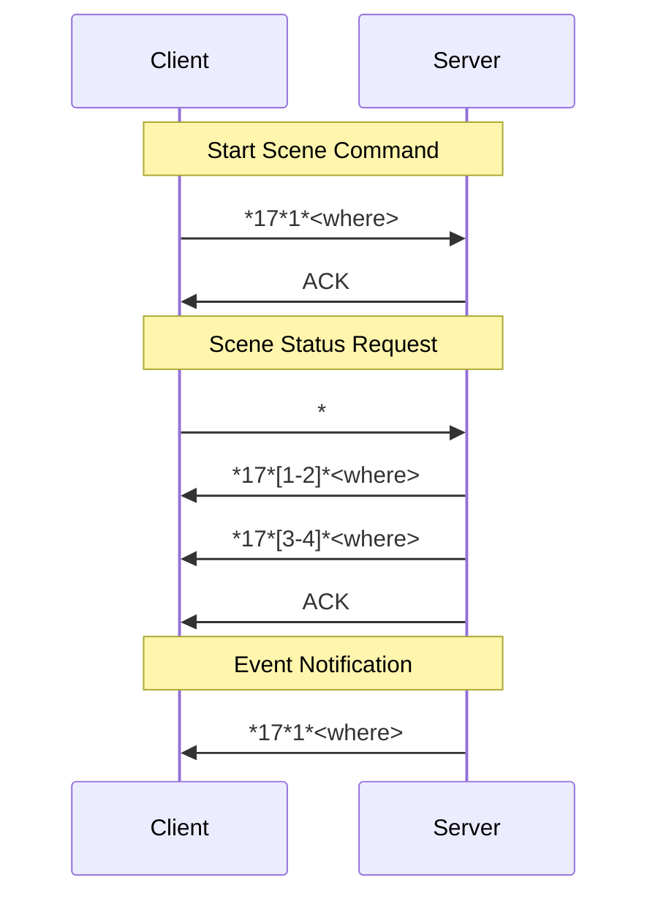

[Original Document](/assets/pdf/WHO_17.pdf)

This document describes the Open Web Net Message for WHO = 17 - SCENES, containing command, event session and status request messages.

## WHAT Table

| Value | Description    |
|:------|:---------------|
| 1     | Start Scene    |
| 2     | Stop Scene     |
| 3     | Enable Scene   |
| 4     | Disable Scene  |

## WHERE Table

| Description | Value                      |
|:------------|:---------------------------|
| General     | 0                          |
| Scene num   | • If MH200N → [1-300]      |
|             | • If MH202 → Numeric Value |

## Command Session - Scenes Frames

### Start Scene - What = 1

**Command:**

| Direction        | Open Frame          |
|:-----------------|:--------------------|
| Client → Server  | `*17*1*<where>##`   |
| Server → Client  | ACK                 |

**Event Session:**

| Direction        | Open Frame          |
|:-----------------|:--------------------|
| Server → Client  | `*17*1*<where>##`   |

### Stop Scene - What = 2

**Command:**

| Direction        | Open Frame          |
|:-----------------|:--------------------|
| Client → Server  | `*17*2*<where>##`   |
| Server → Client  | ACK                 |

**Event Session:**

| Direction        | Open Frame          |
|:-----------------|:--------------------|
| Server → Client  | `*17*2*<where>##`   |

### Enable Scene - What = 3

**Command:**

| Direction        | Open Frame          |
|:-----------------|:--------------------|
| Client → Server  | `*17*3*<where>##`   |
| Server → Client  | ACK                 |

**Event Session:**

| Direction        | Open Frame          |
|:-----------------|:--------------------|
| Server → Client  | `*17*3*<where>##`   |

### Disable Scene - What = 4

**Command:**

| Direction        | Open Frame          |
|:-----------------|:--------------------|
| Client → Server  | `*17*4*<where>##`   |
| Server → Client  | ACK                 |

**Event Session:**

| Direction        | Open Frame          |
|:-----------------|:--------------------|
| Server → Client  | `*17*4*<where>##`   |

## Status Request

### Scene Status Request Command

**Command:**

| Direction        | Open Frame              |
|:-----------------|:------------------------|
| Client → Server  | `*#17*<where>##`        |
| Server → Client  | `*17*[1-2]*<where>##`   |
| Server → Client  | `*17*[3-4]*<where>##`   |
| Server → Client  | ACK                     |

**Event Session:**

| Direction        | Open Frame              |
|:-----------------|:------------------------|
| Server → Client  | `*17*[1-2]*<where>##`   |
| Server → Client  | `*17*[3-4]*<where>##`   |

## Scene Communication Flow

The following diagram illustrates the typical scene command flow:

## Message Format

All scene commands follow the standard Open Web Net format:

- **Start delimiter:** `*`
- **WHO field:** `17` (Scenes)
- **WHAT field:** Command type (1-4)
- **WHERE field:** Scene identifier
- **End delimiter:** `##`

Example: `*17*1*5##` starts scene number 5.

---

## Copyright Notice

Copyright (C) 2015 [`www.myopen-legrandgroup.com`](https://www.myopen-legrandgroup.com). All Rights Reserved.

## License

By using and/or copying this document, you (the licensee) agree that you have read, understood, and will comply with the following terms and conditions:

Permission to copy, and distribute the contents of this document, in any medium for any purpose and without fee or royalty is hereby granted, provided that you include the following on ALL copies of the document, or portions thereof, that you use:

- A link or URL to the [`www.myopen-legrandgroup.com`](https://www.myopen-legrandgroup.com).
- The copyright notice of the original author, or if it doesn't exist, a notice (hypertext is preferred, but a textual representation is permitted) of the form: "Copyright (C) [date-of-document] [`www.myopen-legrandgroup.com`](https://www.myopen-legrandgroup.com). All Rights Reserved.

When space permits, inclusion of the full text of this NOTICE should be provided. We request that authorship attribution be provided in any software, documents, or other items or products that you create pursuant to the implementation of the contents of this document, or any portion thereof.

Any contributions to the document (i.e. translation, modifications, improvements, etc) has to be submitted to and accepted by the My Open staff (using the forum of the community or sending an email via the [`www.myopen-legrandgroup.com`](https://www.myopen-legrandgroup.com) dedicated section) . Once the improvement has been accepted the new release will be published in the My Open Community web site.

## Disclaimers

THIS DOCUMENT IS PROVIDED "AS IS," AND COPYRIGHT HOLDERS MAKE NO REPRESENTATIONS OR WARRANTIES, EXPRESS OR IMPLIED, INCLUDING, BUT NOT LIMITED TO, WARRANTIES OF MERCHANTABILITY, FITNESS FOR A PARTICULAR PURPOSE, NON-INFRINGEMENT, OR TITLE; THAT THE CONTENTS OF THE DOCUMENT ARE SUITABLE FOR ANY PURPOSE; NOR THAT THE IMPLEMENTATION OF SUCH CONTENTS WILL NOT INFRINGE ANY THIRD PARTY PATENTS, COPYRIGHTS, TRADEMARKS OR OTHER RIGHTS.

COPYRIGHT HOLDERS WILL NOT BE LIABLE FOR ANY DIRECT, INDIRECT, SPECIAL OR CONSEQUENTIAL DAMAGES ARISING OUT OF ANY USE OF THE DOCUMENT OR THE PERFORMANCE OR IMPLEMENTATION OF THE CONTENTS THEREOF.

The name and trademarks of copyright holders may NOT be used in advertising or publicity pertaining to this document or its contents without specific, written prior permission. Title to copyright in this document will at all times remain with copyright holders.
