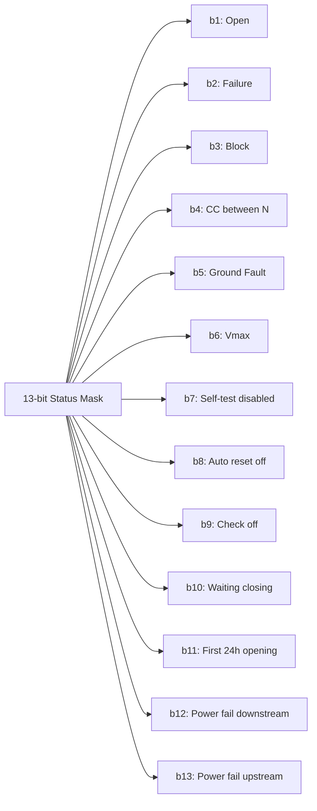
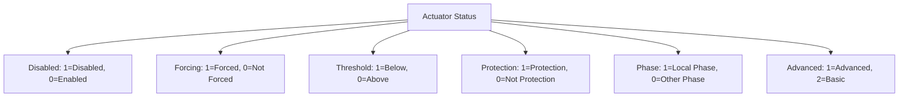

[Original Document](/assets/pdf/WHO_18.pdf)

The Energy Management Functions system (WHO=18) is composed of various devices for supervision and energy control in Open Web Net protocol networks.

## System Components

The system includes:

- **STOP&GO** devices for electrical protection
- **Central Energy Saving** units for load control and energy counters  
- **Energy Saving Actuators** for automated control

Each device is identified by a different WHERE address.

## Device Addressing (WHERE)

| WHERE | Description |
|-------|-------------|
| `1N` | Stop & Go (N=[1-127]) |
| `5N` | Energy Management Central Unit, Pulse Counter, Power Meter (N=[1-255]) - BTicino: F520, F523, 3522 - Legrand: 03555, 03557, 03554 |
| `7N#0` | Energy Management Actuators (N=[1-255]) - BTicino: F522, F523 - Legrand: 03558, 03559 |

## Commands (WHAT)

| WHAT | Description |
|------|-------------|
| `26` | Activation of the automatic reset |
| `27` | Deactivation of the automatic reset |
| `57` | Start sending daily totalizers on an hourly basis for 16-bit Daily graphics |
| `58` | Start sending monthly on an hourly basis for 16-bit graphics average Daily |
| `59` | Start sending monthly totalizers current year on a daily basis for 32-bit Monthly graphics |
| `510` | Start sending monthly totalizers on a daily basis, last year compared to 32-bit graphics TouchX Previous Year |
| `71` | Enable Actuator |
| `73` | Forced actuator for X Time |
| `74` | End forced Actuator |
| `75` | Reset totalizers |

## Dimensions (DIMENSION)

| DIMENSION | Description |
|-----------|-------------|
| `113` | Active Power |
| `1200` | End Automatic Update size |
| `51` | Energy/Unit Totalizer |
| `52` | Energy/Unit per month |
| `53` | Partial totalizer for current month |
| `54` | Partial totalizer for current day |
| `71` | Actuators info |
| `72` | Totalizers |
| `73` | Differential current level |
| `250` | Status Stop&Go (General) |
| `251` | Status Stop&Go (open/close) |
| `252` | Status Stop&Go (failure/no failure) |
| `253` | Status Stop&Go (block/not block) |
| `254` | Status Stop&Go (open for CC between the N/not open for CC between the N) |
| `255` | Status Stop&Go (opened ground fault/not opened ground fault) |
| `256` | Status Stop&Go (open for Vmax/Not open for Vmax) |
| `257` | Status Stop&Go (Self-test disabled/close) |
| `258` | Status Stop&Go (Automatic reset off/close) |
| `259` | Status Stop&Go (check off/close) |
| `260` | Status Stop&Go (Waiting for closing/close) |
| `261` | Status Stop&Go (First 24hours of opening/close) |
| `262` | Status Stop&Go (Power failure downstream/close) |
| `263` | Status Stop&Go (Power failure upstream/close) |
| `511` | Daily totalizers on an hourly basis for 16-bit Daily graphics |
| `512` | Monthly average on an hourly basis for 16-bit Media Daily graphics |
| `513` | Monthly totalizers current year on a daily basis for 32-bit Monthly graphics |
| `514` | Monthly totalizers on a daily basis last year compared to 32 bit graphics TouchX Previous Year |

## Action Commands

### Automatic Reset Control

#### Activation of Automatic Reset

```text
Client → Server: *18*26*where##
Client ← Server: *#*1##
```

#### Deactivation of Automatic Reset

```text
Client → Server: *18*27*where##  
Client ← Server: *#*1##
```

### Data Collection Commands

#### Start Daily Totalizers (16-bit)

```text
Client → Server: *18*57#<M>#<D>*where##
Client ← Server: *#*1##
```

**Event Response:**

```text
Client ← Server: *#18*<Where>*511#<M>#<D>*<Tag>*<Val>##
                 *#18*<Where>*511#<M>#<D>*<Tag>*<Val>##
                 ...
                 *#18*<Where>*511#<M>#<D>*25*<TOT>##
```

Where:

- `<M>` = Month
- `<D>` = Day  
- `<Tag>` = Measure number (1 to 24)
- `<Val>` = Watt/h
- `<TOT>` = Daily Total Unit

#### Start Monthly Average (16-bit)

```text
Client → Server: *18*58#<M>*where##
Client ← Server: *#*1##
```

**Event Response:**

```text
Client ← Server: *#18*<Where>*512#<M>*<Tag>*<Val>##
                 *#18*<Where>*512#<M>*25*<MED>##
```

Where:

- `<M>` = Month
- `<Tag>` = Measure number (1 to 24)
- `<Val>` = Watt/h average on a month
- `<MED>` = Monthly Average Wh/Unit

#### Start Monthly Totalizers Current Year (32-bit)

```text
Client → Server: *18*59#<M>*where##
Client ← Server: *#*1##
```

**Event Response:**

```text
Client ← Server: *#18*<Where>*513#<M>*<Tag>*<Val>##
                 *#18*<Where>*513#<M>*<Tag>*<Val>##
                 ...
```

Where:

- `<M>` = Month
- `<Tag>` = Day (1 to 31)

#### Start Monthly Totalizers Previous Year (32-bit)

```text
Client → Server: *18*510#<M>*where##
Client ← Server: *#*1##
```

**Event Response:**

```text
Client ← Server: *#18*<Where>*514#<M>*<Tag>*<Val>##
                 *#18*<Where>*514#<M>*<Tag>*<Val>##
                 ...
```

Where:

- `<M>` = Month
- `<Tag>` = Measure number (1 to 31)

### Actuator Control Commands

#### Enable Actuator

```text
Client → Server: *18*71*where##
Client ← Server: *#*1##
```

#### Force Actuator for Time

```text
Client → Server: *18*73#<Time>*where##
Client ← Server: *#*1##
```

Where `<Time>` is expressed in tens of minutes (values 1-254, from 10m to 2h 20m).

#### Force Actuator for Default Time

```text
Client → Server: *18*73*where##
Client ← Server: *#*1##
```

#### End Forced Actuator

```text
Client → Server: *18*74*where##
Client ← Server: *#*1##
```

#### Reset Totalizers

```text
Client → Server: *18*75#<Tot_N>*where##
Client ← Server: *#*1##
```

Where `<Tot_N>` is the Totalizer Number (values 1 to 2).

## Status Requests

### General Status Request

```text
Client → Server: *#18*where*250##
Client ← Server: *#18*<Where>*250*<MASC>##
                 *#18*<Where>*251*<b1>##
                 *#18*<Where>*252*<b2>##
                 ...
                 *#18*<Where>*263*<b13>##
                 *#*1##
```

The `<MASC>` is a 13-bit mask indicating device status: `b13b12b11b10b9b8b7b6b5b4b3b2b1`

#### Status Bit Meanings



| Bit | Meaning |
|-----|---------|
| `b1` | Open (1) / Close (0) |
| `b2` | Failure (1) / No failure (0) |
| `b3` | Block (1) / Not block (0) |
| `b4` | Open for CC between N (1) / Close (0) |
| `b5` | Opened ground fault (1) / Close (0) |
| `b6` | Open for Vmax (1) / Close (0) |
| `b7` | Self-test disabled (1) / Self-test enabled (0) |
| `b8` | Automatic reset off (1) / Automatic reset on (0) |
| `b9` | Check off (1) / Check on (0) |
| `b10` | Waiting for closing (1) / Close (0) |
| `b11` | First 24 hours of opening (1) / Close (0) |
| `b12` | Power failure downstream (1) / No failure (0) |
| `b13` | Power failure upstream (1) / No failure (0) |

### Individual Status Requests

Individual status bits can be requested using dimensions 251-263:

```text
Client → Server: *#18*where*<DIM>##
Client ← Server: *#18*<Where>*<DIM>*<bit_value>##
                 *#*1##
```

Where `<DIM>` corresponds to dimensions 251-263 and `<bit_value>` is 0 or 1.

## Power and Energy Requests

### Instantaneous Power Monitoring

#### Start Automatic Power Updates

```text
Client → Server: *#18*<Where>*#1200#<Type>*<Time>##
Client ← Server: *#*1##
```

**Event Response:**

```text
Client ← Server: *#18*<Where>*1200#<Type>*<Time>##
                 *#18*<where>*113*<Val>##
```

Where:

- `<Type>` = 1 (active power)
- `<Time>` = Update interval in minutes (1-255)
- `<Val>` = Power in Watts

#### Stop Automatic Power Updates

```text
Client → Server: *#18*where*#1200#<Type>*0##
Client ← Server: *#*1##
```

### Energy Totalizer Requests

#### Request Active Power

```text
Client → Server: *#18*<Where>*113##
Client ← Server: *#18*<Where>*113*<Val>##
                 *#*1##
```

Where `<Val>` is power in Watts.

#### Request Energy/Unit Totalizer

```text
Client → Server: *#18*where*51##
Client ← Server: *#18*where*51*<Val>##
                 *#*1##
```

#### Request Monthly Energy Totalizer

```text
Client → Server: *#18*where*52#<Y>#<M>##
Client ← Server: *#18*where*52#<Y>#<M>*<Val>##
                 *#*1##
```

Where:

- `<Y>` = Year in YY format
- `<M>` = Month
- `<Val>` = Energy in Watts

#### Request Partial Totalizer (Current Month)

```text
Client → Server: *#18*where*53##
Client ← Server: *#18*where*53*<Val>##
                 *#*1##
```

#### Request Partial Totalizer (Current Day)

```text
Client → Server: *#18*where*54##
Client ← Server: *#18*where*54*<Val>##
                 *#*1##
```

### Actuator Status Request

```text
Client → Server: *#18*where*71##
Client ← Server: *#18*where*71*<disabled>*<forcing>*<threshold>*<protection>*<phase>*<advanced>##
                 *#*1##
```

#### Actuator Status Fields



| Field | Values |
|-------|--------|
| Disabled | 1=Disabled, 0=Enabled |
| Forcing | 1=Forced, 0=Not Forced |
| Threshold | 1=Below Threshold, 0=Above Threshold |
| Protection | 1=Protection, 0=Not Protection |
| Phase | 1=Disable Local Phase, 0=Disable Other Phase |
| Advanced | 1=Advanced, 2=Basic |

### Totalizer History Request

```text
Client → Server: *#18*where*72#<Tot_N>##
Client ← Server: *#18*where*72#<Tot_N>*<Energy>*<D>*<M>*<Y>*<H>*<m>##
                 *#*1##
```

Where:

- `<Tot_N>` = Totalizer Number (1-2)
- `<Energy>` = Energy from reset (Wh)
- `<D>` = Day of last reset
- `<M>` = Month of last reset
- `<Y>` = Year of last reset
- `<H>` = Hour of last reset
- `<m>` = Minute of last reset

### Differential Current Level Request

```text
Client → Server: *#18*where*73##
Client ← Server: *#18*where*73*<level>##
                 *#*1##
```

Where `<level>` has values from 1 to 3.

## Event Messages

Event messages are automatically sent by devices to notify status changes, energy readings, and other monitoring data. The format follows the same structure as the corresponding request responses.

### Power Monitoring Events

Automatic power updates are sent based on configured intervals:

```text
Client ← Server: *#18*<where>*113*<Val>##
```

### Status Change Events

Status changes trigger automatic event messages with the complete 13-bit status mask and individual bit values.

### Energy Data Events

Totalizer and energy measurement events provide real-time energy consumption data according to configured reporting schedules.

---

## Copyright Notice

Copyright (C) 2011 [`www.myopen-legrandgroup.com`](https://www.myopen-legrandgroup.com). All Rights Reserved.

## License

By using and/or copying this document, you (the licensee) agree that you have read, understood, and will comply with the following terms and conditions:

Permission to copy, and distribute the contents of this document, in any medium for any purpose and without fee or royalty is hereby granted, provided that you include the following on ALL copies of the document, or portions thereof, that you use:

- A link or URL to the [`www.myopen-legrandgroup.com`](https://www.myopen-legrandgroup.com).
- The copyright notice of the original author, or if it doesn't exist, a notice (hypertext is preferred, but a textual representation is permitted) of the form: "Copyright (C) [date-of-document] [`www.myopen-legrandgroup.com`](https://www.myopen-legrandgroup.com). All Rights Reserved.

When space permits, inclusion of the full text of this NOTICE should be provided. We request that authorship attribution be provided in any software, documents, or other items or products that you create pursuant to the implementation of the contents of this document, or any portion thereof.

Any contributions to the document (i.e. translation, modifications, improvements, etc) has to be submitted to and accepted by the My Open staff (using the forum of the community or sending an email via the [`www.myopen-legrandgroup.com`](https://www.myopen-legrandgroup.com) dedicated section) . Once the improvement has been accepted the new release will be published in the My Open Community web site.

## Disclaimers

THIS DOCUMENT IS PROVIDED "AS IS," AND COPYRIGHT HOLDERS MAKE NO REPRESENTATIONS OR WARRANTIES, EXPRESS OR IMPLIED, INCLUDING, BUT NOT LIMITED TO, WARRANTIES OF MERCHANTABILITY, FITNESS FOR A PARTICULAR PURPOSE, NON-INFRINGEMENT, OR TITLE; THAT THE CONTENTS OF THE DOCUMENT ARE SUITABLE FOR ANY PURPOSE; NOR THAT THE IMPLEMENTATION OF SUCH CONTENTS WILL NOT INFRINGE ANY THIRD PARTY PATENTS, COPYRIGHTS, TRADEMARKS OR OTHER RIGHTS.

COPYRIGHT HOLDERS WILL NOT BE LIABLE FOR ANY DIRECT, INDIRECT, SPECIAL OR CONSEQUENTIAL DAMAGES ARISING OUT OF ANY USE OF THE DOCUMENT OR THE PERFORMANCE OR IMPLEMENTATION OF THE CONTENTS THEREOF.

The name and trademarks of copyright holders may NOT be used in advertising or publicity pertaining to this document or its contents without specific, written prior permission. Title to copyright in this document will at all times remain with copyright holders.
