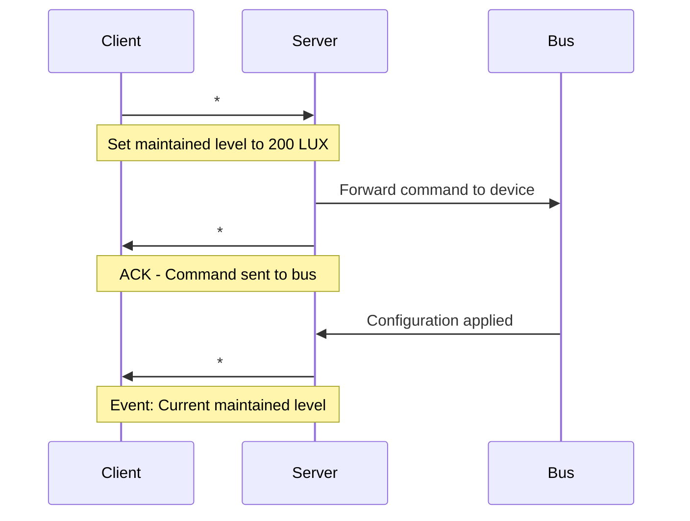
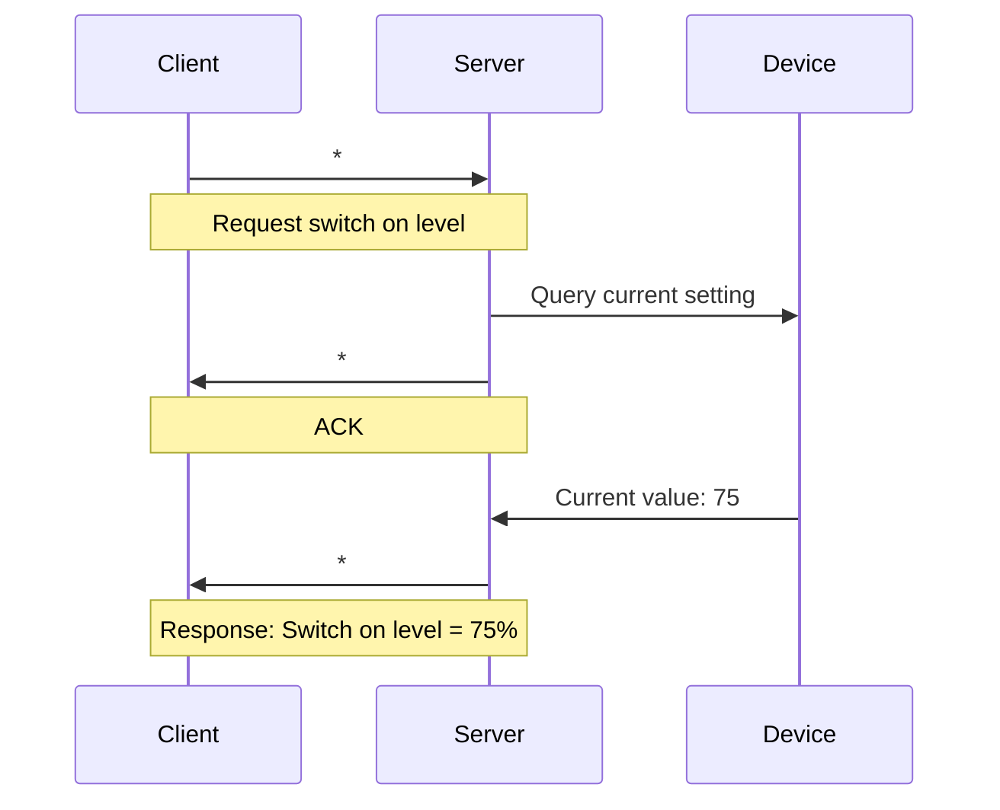
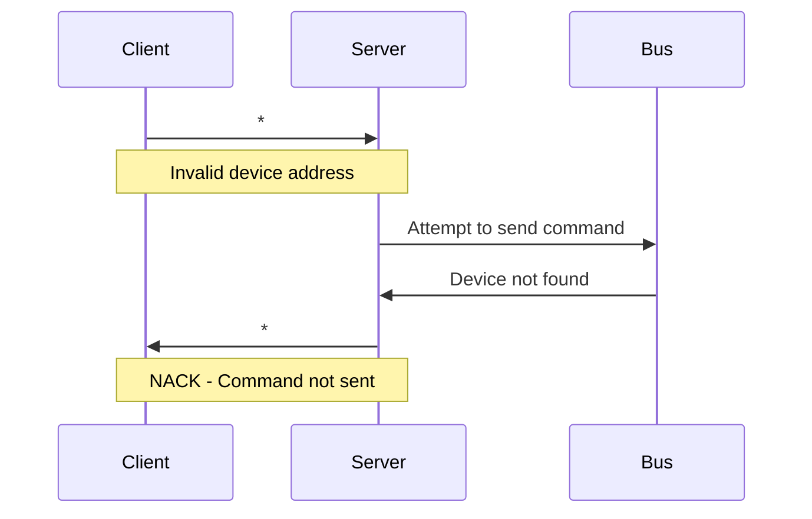
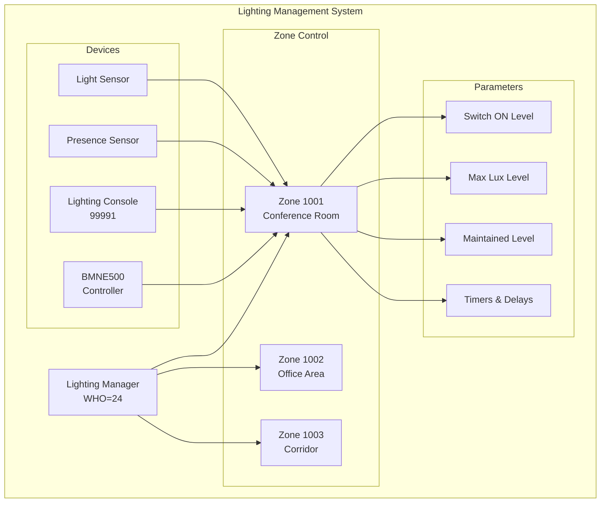

[Original Document](/assets/pdf/WHO_24.pdf)

This document contains the Open Web Net frames that implement the lighting management functions of a My Home system.

## System Overview

The Lighting Management system (WHO=24) provides comprehensive control over automated lighting systems through Open Web Net protocol, enabling intelligent lighting control based on presence detection, ambient light levels, and configured parameters.

## WHAT Commands

| WHAT | Description |
|------|-------------|
| `1#PROFILE_ID` | Profile Frame |
| `2#[0-1]` | Slave Offset Enable/Disable |

## WHERE Addressing

### Address Format

| Component | Format | Description |
|-----------|--------|-------------|
| **Recipient** | `LM_zone_num # dev_type & sys_addr` | Target device address |
| **Sender** | `#00# LM_zone_num # dev_type & sys_addr` | Source device address |

### Zone Numbers (LM_zone_num)

| Code | Description |
|------|-------------|
| `0` | No zones |
| `1000+zone_number` | Zone selection |
| `1000` | Every zones |

### Device Types (dev_type)

| Code | Description |
|------|-------------|
| `1` | BMNE500/002645 device |
| `99991` | Lighting Console |
| `9991` | Virtual Configurator |
| `4` | Broadcast |
| `8` | Unknown |

### System Address (sys_addr)

Range: 1 to 9

## Configuration Examples

### Configuration Software Commands

- **Set maintained level**: `*#24*1001#8#00#0#8*#3*200##`
- **Lighting console set maintained level**: `*#24*1001#11#00#0#999911*#3*200##`
  - BMNE500 sys_addr = 1, Lighting console sys_addr = 1

### Request/Response Examples

- **Request maintained level**: `*#24*1001#11#00#0#999911*3##`
- **Response with maintained level**: `*#24*0#99991#00#1001#11*3*200##`
- **BMview centralized LUX request**: `*#24*1000#4#00#0#8*18#65##`
- **BMNE500 response**: `*#24*0#8#00#1001#11*18#65*297*0##`

## DIMENSIONS

| Dimension | Description |
|-----------|-------------|
| `1` | Switch ON |
| `2` | Max Lux |
| `3` | Maintained Level |
| `4` | Automatic Switch ON |
| `5` | Switch ON Delay |
| `6` | Automatic Switch OFF |
| `7` | Switch OFF Delay |
| `8` | Delay Timer |
| `9` | Stand-by Timer |
| `10` | Stand-by value |
| `11` | Off value |
| `12` | Slave Offset (GAP) value |
| `17` | State (Automatic/Manual/Stop) |
| `18` | Centralised Lux value |

## Command Messages

### Switch On Level (Dimension 1)

Controls the luminosity intensity increase when lights are switched on for presence detection.

**Set Command:**

```text
Client → Server: *#24*WHERE*#1*Switch_on##
Server → Client: *#*1##    (ACK)
Server → Client: *#24*WHERE*1*Switch_on##  (Event)
```

**Parameters:**

- `Switch_on`: 1-100 (percentage value)
  - 1 = Lower luminosity intensity
  - 100 = Maximum luminosity intensity

**Status Request:**

```text
Client → Server: *#24*WHERE*1##
Server → Client: *#*1##                    (ACK)
Server → Client: *#24*WHERE*1*Switch_on##  (Current value)
```

### Max Lux Level (Dimension 2)

Configures the maximum light level supplied by lamps.

**Set Command:**

```text
Client → Server: *#24*WHERE*#2*Max_lux##
Server → Client: *#*1##    (ACK)
Server → Client: *#24*WHERE*2*Max_lux##  (Event)
```

**Parameters:**

- `Max_lux`: 1-2000 (LUX value)
  - 1 = Lower luminosity intensity
  - 2000 = Maximum luminosity intensity

**Status Request:**

```text
Client → Server: *#24*WHERE*2##
Server → Client: *#*1##                  (ACK)
Server → Client: *#24*WHERE*2*Max_lux##  (Current value)
```

### Maintained Level (Dimension 3)

Sets the default light level to be maintained by the system.

**Set Command:**

```text
Client → Server: *#24*WHERE*#3*Maint_lev##
Server → Client: *#*1##    (ACK)
Server → Client: *#24*WHERE*3*Maint_lev##  (Event)
```

**Parameters:**

- `Maint_lev`: 0-2000 (LUX value)
  - 0 = Lower luminosity intensity
  - 2000 = Maximum luminosity intensity

**Status Request:**

```text
Client → Server: *#24*WHERE*3##
Server → Client: *#*1##                     (ACK)
Server → Client: *#24*WHERE*3*Maint_lev##   (Current value)
```

### Auto Switch On (Dimension 4)

Controls automatic switching on of lamps.

**Set Command:**

```text
Client → Server: *#24*WHERE*#4*Auto_sw_on##
Server → Client: *#*1##    (ACK)
Server → Client: *#24*WHERE*4*Auto_sw_on##  (Event)
```

**Parameters:**

- `Auto_sw_on`: 0-1
  - 0 = Disable automatic switch on
  - 1 = Enable automatic switch on

**Status Request:**

```text
Client → Server: *#24*WHERE*4##
Server → Client: *#*1##                       (ACK)
Server → Client: *#24*WHERE*4*Auto_sw_on##    (Current value)
```

### Switch On Delay (Dimension 5)

Configures the delay of response when light level is varying.

**Set Command:**

```text
Client → Server: *#24*WHERE*#5*Sw_on_delay##
Server → Client: *#*1##    (ACK)
Server → Client: *#24*WHERE*5*Sw_on_delay##  (Event)
```

**Parameters:**

- `Sw_on_delay`: 0-300 (seconds)

**Status Request:**

```text
Client → Server: *#24*WHERE*5##
Server → Client: *#*1##                        (ACK)
Server → Client: *#24*WHERE*5*Sw_on_delay##    (Current value)
```

### Auto Switch Off (Dimension 6)

Controls automatic switching off of lamps.

**Set Command:**

```text
Client → Server: *#24*WHERE*#6*Auto_sw_off##
Server → Client: *#*1##    (ACK)
Server → Client: *#24*WHERE*6*Auto_sw_off##  (Event)
```

**Parameters:**

- `Auto_sw_off`: 0-1
  - 0 = Disable automatic switch off
  - 1 = Enable automatic switch off

**Status Request:**

```text
Client → Server: *#24*WHERE*6##
Server → Client: *#*1##                        (ACK)
Server → Client: *#24*WHERE*6*Auto_sw_off##    (Current value)
```

### Switch Off Delay (Dimension 7)

Sets the time after which the central unit switches off lights if automatic switch is selected.

**Set Command:**

```text
Client → Server: *#24*WHERE*#7*Sw_off_delay##
Server → Client: *#*1##    (ACK)
Server → Client: *#24*WHERE*7*Sw_off_delay##  (Event)
```

**Parameters:**

- `Sw_off_delay`: 0-900 (seconds)

**Status Request:**

```text
Client → Server: *#24*WHERE*7##
Server → Client: *#*1##                         (ACK)
Server → Client: *#24*WHERE*7*Sw_off_delay##    (Current value)
```

### Delay Timer (Dimension 8)

Configures the time after which, if no presence is detected, lights go to OFF value.

**Set Command:**

```text
Client → Server: *#24*WHERE*#8*Delay_timer##
Server → Client: *#*1##    (ACK)
Server → Client: *#24*WHERE*8*Delay_timer##  (Event)
```

**Parameters:**

- `Delay_timer`: 0-3600 (seconds)

**Status Request:**

```text
Client → Server: *#24*WHERE*8##
Server → Client: *#*1##                        (ACK)
Server → Client: *#24*WHERE*8*Delay_timer##    (Current value)
```

### Stand-by Timer (Dimension 9)

Sets the time after which, if no presence is detected, the light level drops to a lower level.

**Set Command:**

```text
Client → Server: *#24*WHERE*#9*Standby_timer##
Server → Client: *#*1##    (ACK)
Server → Client: *#24*WHERE*9*Standby_timer##  (Event)
```

**Parameters:**

- `Standby_timer`: 0-900 (seconds)

**Status Request:**

```text
Client → Server: *#24*WHERE*9##
Server → Client: *#*1##                          (ACK)
Server → Client: *#24*WHERE*9*Standby_timer##    (Current value)
```

### Stand-by Value (Dimension 10)

Configures the light level to which lights are dimmed after the stand-by timer expires.

**Set Command:**

```text
Client → Server: *#24*WHERE*#10*Standby_val##
Server → Client: *#*1##    (ACK)
Server → Client: *#24*WHERE*10*Standby_val##  (Event)
```

**Parameters:**

- `Standby_val`: 0-100 (percentage value)
  - 0 = Lower luminosity intensity  
  - 100 = Maximum luminosity intensity

**Status Request:**

```text
Client → Server: *#24*WHERE*10##
Server → Client: *#*1##                         (ACK)
Server → Client: *#24*WHERE*10*Standby_val##    (Current value)
```

### OFF Value (Dimension 11)

Sets the light value when switched OFF.

**Set Command:**

```text
Client → Server: *#24*WHERE*#11*Off_val##
Server → Client: *#*1##    (ACK)
Server → Client: *#24*WHERE*11*Off_val##  (Event)
```

**Parameters:**

- `Off_val`: 0-100 (percentage value)
  - 0 = Lower luminosity intensity
  - 100 = Maximum luminosity intensity

**Status Request:**

```text
Client → Server: *#24*WHERE*11##
Server → Client: *#*1##                      (ACK)
Server → Client: *#24*WHERE*11*Off_val##     (Current value)
```

### Slave Offset Value (Dimension 12)

Sets the level which dimmers in master mode must reach before switching on dimmers in slave mode.

**Set Command:**

```text
Client → Server: *#24*WHERE*#12*Slave_offset##
Server → Client: *#*1##    (ACK)
Server → Client: *#24*WHERE*12*Slave_offset##  (Event)
```

**Parameters:**

- `Slave_offset`: 0-100 (percentage value)

**Status Request:**

```text
Client → Server: *#24*WHERE*12##
Server → Client: *#*1##                          (ACK)
Server → Client: *#24*WHERE*12*Slave_offset##    (Current value)
```

### State Control (Dimension 17)

Configures the functioning mode of the zone and conditions for returning to automatic mode.

**Set Command:**

```text
Client → Server: *#24*WHERE*#17*MOD*EXIT*TIME##
Server → Client: *#*1##    (ACK)
Server → Client: *#24*WHERE*17*MOD*EXIT*TIME##  (Event)
```

**Parameters:**

- `MOD`: 0-2 (Functioning mode)
  - 0 = STOP
  - 1 = AUTOMATIC  
  - 2 = MANUAL

- `EXIT`: 1-5 (Condition to return to Automatic mode)
  - 1 = TIME mode
  - 2 = FOR mode
  - 3 = PROFILE mode
  - 4 = NORMAL mode
  - 5 = NEVER mode

- `TIME`: [0-23]*[0-59]*[0-59] (Time or duration for Exit mode)

**Status Request:**

```text
Client → Server: *#24*WHERE*17##
Server → Client: *#*1##                             (ACK)
Server → Client: *#24*WHERE*17*MOD*EXIT*TIME##      (Current state)
```

### Centralised Lux Value (Dimension 18)

Sets the centralized light intensity value for a sensor.

**Set Command:**

```text
Client → Server: *#24*WHERE*#18*Sensor_addr*Lux_level*Err##
Server → Client: *#*1##    (ACK)
Server → Client: *#24*WHERE*18*Sensor_addr*Lux_level*Err##  (Event)
```

**Parameters:**

- `Sensor_addr`: Address of the sensor
- `Lux_level`: Light intensity to set (LUX value)
- `Err`: 0-2 (Error status)
  - 0 = All sensors have required parameters
  - 1 = Sensor not in configuration
  - 2 = Sensor present but missing parameters

**Status Request:**

```text
Client → Server: *#24*WHERE*18*Sensor_addr##
Server → Client: *#*1##                                      (ACK)
Server → Client: *#24*WHERE*18*Sensor_addr*Lux_level*Err##  (Current value)
```

**Response Parameters:**

- `Lux_level`: Light intensity detected (LUX value)
- `Err`: 0-2 (Error status)
  - 0 = All sensors have required parameters (no errors)
  - 1 = Sensor not in configuration
  - 2 = Sensor present but missing parameters

## Profile Management Commands

### Activation Profile Frame

Activates a specific profile configuration.

```text
Client → Server: *24*1#Profile_ID*WHERE##
Server → Client: *#*1##    (ACK)
```

**Parameters:**

- `Profile_ID`: Identification profile number

### Enable/Disable Slave Offset

Controls the slave offset functionality.

```text
Client → Server: *24*2#Slave_offset_flag*WHERE##
Server → Client: *#*1##    (ACK)
```

**Parameters:**

- `Slave_offset_flag`: 0-1
  - 0 = Disable slave offset
  - 1 = Enable slave offset

## Event Messages

The system automatically generates event messages in response to status changes or configuration updates. All event messages follow the same format as their corresponding response messages.

### State Change Events

Automatically sent when the zone state changes:

```text
Server → Client: *#24*WHERE*17*MOD*EXIT*TIME##
```

### Sensor Value Events

Automatically sent when centralized lux values change:

```text
Server → Client: *#24*WHERE*18*Sensor_addr*Lux_level*Err##
```

## Communication Flow Diagrams

### Basic Configuration Sequence



### Status Request Sequence



### Error Handling Flow



### Lighting System Architecture



---

## Copyright Notice

Copyright (C) 2012 [`www.myopen-legrandgroup.com`](https://www.myopen-legrandgroup.com). All Rights Reserved.

## License

By using and/or copying this document, you (the licensee) agree that you have read, understood, and will comply with the following terms and conditions:

Permission to copy, and distribute the contents of this document, in any medium for any purpose and without fee or royalty is hereby granted, provided that you include the following on ALL copies of the document, or portions thereof, that you use:

- A link or URL to the [`www.myopen-legrandgroup.com`](https://www.myopen-legrandgroup.com).
- The copyright notice of the original author, or if it doesn't exist, a notice (hypertext is preferred, but a textual representation is permitted) of the form: "Copyright (C) [date-of-document] [`www.myopen-legrandgroup.com`](https://www.myopen-legrandgroup.com). All Rights Reserved.

When space permits, inclusion of the full text of this NOTICE should be provided. We request that authorship attribution be provided in any software, documents, or other items or products that you create pursuant to the implementation of the contents of this document, or any portion thereof.

Any contributions to the document (i.e. translation, modifications, improvements, etc) has to be submitted to and accepted by the My Open staff (using the forum of the community or sending an email via the [`www.myopen-legrandgroup.com`](https://www.myopen-legrandgroup.com) dedicated section) . Once the improvement has been accepted the new release will be published in the My Open Community web site.

## Disclaimers

THIS DOCUMENT IS PROVIDED "AS IS," AND COPYRIGHT HOLDERS MAKE NO REPRESENTATIONS OR WARRANTIES, EXPRESS OR IMPLIED, INCLUDING, BUT NOT LIMITED TO, WARRANTIES OF MERCHANTABILITY, FITNESS FOR A PARTICULAR PURPOSE, NON-INFRINGEMENT, OR TITLE; THAT THE CONTENTS OF THE DOCUMENT ARE SUITABLE FOR ANY PURPOSE; NOR THAT THE IMPLEMENTATION OF SUCH CONTENTS WILL NOT INFRINGE ANY THIRD PARTY PATENTS, COPYRIGHTS, TRADEMARKS OR OTHER RIGHTS.

COPYRIGHT HOLDERS WILL NOT BE LIABLE FOR ANY DIRECT, INDIRECT, SPECIAL OR CONSEQUENTIAL DAMAGES ARISING OUT OF ANY USE OF THE DOCUMENT OR THE PERFORMANCE OR IMPLEMENTATION OF THE CONTENTS THEREOF.

The name and trademarks of copyright holders may NOT be used in advertising or publicity pertaining to this document or its contents without specific, written prior permission. Title to copyright in this document will at all times remain with copyright holders.
