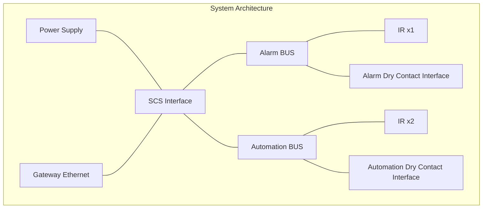

[Original Document](/assets/pdf/WHO_25.pdf)

## Description

Dry Contact Interfaces and some IR Interfaces are able to provide the state of their contacts / IR. The last version of My Home gateways are able to translate the state of these devices in Open Web Net messages.

This function is really useful to know the state of the system and to execute or condition scenarios.

The alarm devices are able to provide the state information in any case, when the burglar alarm system is engaged or not engaged.

For example, if a dry contact interface is used to detect an intrusion on a window, this device can be used to know the status of the windows: opened / closed.

This information can be used:

- to run a scenario: when the window is opened, heating off
- to monitor the window state from a remote application

## Open Web Net WHO = 25 - Dry Contact

### WHAT Table

| VALUE | DESCRIPTION | CONNECTION |  |
|:------|:------------|:-----------|:--|
|       |             | **ACTION** | **EVENT** |
| 31    | ON / IR Detection | W / R | R |
| 32    | OFF / IR not/end Detection | W / R | R |

### Parameter Table

| PARAMETER | DESCRIPTION | CONNECTION |  |
|:----------|:------------|:-----------|:--|
|           |             | **ACTION** | **EVENT** |
| 0         | State if requested | R | R |
| 1         | State if an event happens in the System | W / R | R |

### WHERE Table

| VALUE | DESCRIPTION |
|:------|:------------|
| [1-201] | For automation dry contact interface (3477 and F428, 573996 and 03553) WHERE is configured only using Virtual Configurator Software |
| \[1-9\]\[1-9\] | For alarm dry contact interface and IR (3480, F482, IR 4610, 4611, 4640 067513, 003573, 573936, 573937, 573938, 573939) WHERE is configured using Z and N with physical configurators |

## Action Connection

### Command Messages

#### Virtual ON / IR Detection

| Connection | Direction | Open Frame | Note |
|:-----------|:----------|:-----------|:-----|
| **Action Connection** | Client → Server | `*25*31#1*WHERE##` |  |
|                      | Client ← Server | `*#*1##` |  |
| **Event Connection** | Client ← Server | `*25*31#1*WHERE##` |  |

#### Virtual OFF / IR not/end Detection

| Connection | Direction | Open Frame | Note |
|:-----------|:----------|:-----------|:-----|
| **Action Connection** | Client → Server | `*25*32#1*WHERE##` |  |
|                      | Client ← Server | `*#*1##` |  |
| **Event Connection** | Client ← Server | `*25*32#1*WHERE##` |  |

### Request Message

#### Request of Contact / IR State

| Connection | Direction | Open Frame | VALUE | Note |
|:-----------|:----------|:-----------|:------|:-----|
| **Action Connection** | Client → Server | `*#25*WHERE##` |  |  |
|                      | Client ← Server | `*25*VALUE#0*WHERE##` | 31 if ON / IR Detection; 32 if OFF / IR no Detection |  |
|                      | Client ← Server | `*#*1##` |  |  |
| **Event Connection** | Client ← Server | `*25*VALUE#0*WHERE##` |  |  |

## Event Connection

### State ON / IR Detection after a system event

| Connection | Direction | Open Frame | Note |
|:-----------|:----------|:-----------|:-----|
| **Event Connection** | Client ← Server | `*25*31#1*WHERE##` |  |

### State ON / IR Detection after a state request

| Connection | Direction | Open Frame | Note |
|:-----------|:----------|:-----------|:-----|
| **Event Connection** | Client ← Server | `*25*31#0*WHERE##` |  |

### State OFF / IR end Detection after a system event

| Connection | Direction | Open Frame | Note |
|:-----------|:----------|:-----------|:-----|
| **Event Connection** | Client ← Server | `*25*32#1*WHERE##` |  |

### State OFF / IR not Detection after a state request

| Connection | Direction | Open Frame | Note |
|:-----------|:----------|:-----------|:-----|
| **Event Connection** | Client ← Server | `*25*32#0*WHERE##` |  |

## Example

### Device Configuration

#### Device Settings

**IR x1 on Alarm BUS:**

- Z: 1
- N: 1  
- MOD: Empty
- AUX: AUX

**IR x2 on Automation BUS:**

- Z: 9
- N: 9
- MOD: AUX
- AUX: AUX

**Alarm Dry Contact Interface:**

- Z1: 2
- N1: 2
- MOD1: AUX

**Automation Dry Contact Interface:**

- Channel 1: 1
- Channel 2: 201

### Communication Examples

#### IR x1 Detection Sequence

IR x1 detects presence, after 6 seconds it ends:

| Connection | Time | OWN Frame | Event |
|:-----------|:-----|:----------|:------|
| Event Connection | 16:51:08:975 | `*25*31#1*311##` | Presence detection |
| Event Connection | 16:51:14:861 | `*25*32#1*311##` | Presence end |

Software requests the state of IR x1:

| Connection | Time | OWN Frame | Action/Event |
|:-----------|:-----|:----------|:-------------|
| Action Connection | 16:45:11:990 | `*#25*311##` | State request |
| Action Connection | 16:45:12:068 | `*25*31#0*311##` | State requested |
| Event Connection | 16:45:12:068 | `*25*31#0*311##` | State requested |

#### IR x2 Detection Sequence

IR x2 detects presence, after 62 seconds it ends:

| Connection | Time | OWN Frame | Event |
|:-----------|:-----|:----------|:------|
| Event Connection | 17:02:49:788 | `*25*31#1*399##` | Presence detection |
| Event Connection | 17:03:51:209 | `*25*32#1*399##` | Presence end |

Software requests the state of IR x2 during presence detected:

| Connection | Time | OWN Frame | Action/Event |
|:-----------|:-----|:----------|:-------------|
| Action Connection | 17:03:16:538 | `*#25*399##` | State request |
| Action Connection | 17:03:16:631 | `*25*32#0*399##` | State requested |
| Event Connection | 17:03:16:631 | `*25*32#0*399##` | State requested |

#### Alarm Dry Contact Interface

The Alarm Dry Contact Interface closes the contact and then opens it:

| Connection | Time | OWN Frame | Event |
|:-----------|:-----|:----------|:------|
| Event Connection | 16:52:04:171 | `*25*31#1*322##` | Contact closing |
| Event Connection | 16:53:01:110 | `*25*32#1*322##` | Contact opening |

Software requests the state of the Alarm Dry Contact Interface:

| Connection | Time | OWN Frame | Action/Event |
|:-----------|:-----|:----------|:-------------|
| Action Connection | 17:15:11:538 | `*#25*322##` | State request |
| Action Connection | 17:15:11:616 | `*25*31#0*322##` | State requested |
| Event Connection | 17:15:11:616 | `*25*31#0*322##` | State requested |

#### Automation Dry Contact Interface - Channel 1

The Automation Dry Contact Interface – Channel 1, closes and opens the contact:

| Connection | Time | OWN Frame | Event |
|:-----------|:-----|:----------|:------|
| Event Connection | 17:16:14:428 | `*25*31#1*31##` | Contact closing |
| Event Connection | 17:46:17:459 | `*25*32#1*31##` | Contact opening |

Software requests the state of contact – channel 1 while it's opened:

| Connection | Time | OWN Frame | Action/Event |
|:-----------|:-----|:----------|:-------------|
| Action Connection | 17:17:19:178 | `*#25*31##` | State request |
| Action Connection | 17:17:19:256 | `*25*32#0*31##` | State requested |
| Event Connection | 17:17:19:256 | `*25*32#0*31##` | State requested |

#### Automation Dry Contact Interface - Channel 2

The Automation Dry Contact Interface – Channel 2 closes and opens the contact:

| Connection | Time | OWN Frame | Event |
|:-----------|:-----|:----------|:------|
| Event Connection | 17:16:14:428 | `*25*31#1*3201##` | Contact closing |
| Event Connection | 17:46:17:459 | `*25*32#1*3201##` | Contact opening |

Software requests the state of Dry Contact – Channel 2 while it's closed:

| Connection | Time | OWN Frame | Action/Event |
|:-----------|:-----|:----------|:-------------|
| Action Connection | 17:17:19:178 | `*#25*31##` | State request |
| Action Connection | 17:17:19:256 | `*25*31#0*3201##` | State requested |
| Event Connection | 17:17:19:256 | `*25*31#0*3201##` | State requested |

## Configuration Requirements

The following configurations are required to use the state information coming from dry contact interfaces and IR devices.

### Automation Dry Contacts Configuration

Configuration is done through Virtual Configurator software where you can select the contact type and assign contact numbers.

### Alarm Dry Contacts Configuration

#### SCS Configuration

| Function Type | Z | N | MOD |
|:--------------|:--|:--|:----|
| Just contact function | 1-9 | 1-9 | AUX |
| Alarm plus contact function | 1-9 | 1-9 | 4-7 |

### Alarm IR Configuration

#### ZN MOD AUX CE Configuration

| Function Type | Z | N | MOD | AUX |
|:--------------|:--|:--|:----|:----|
| Just contact function | 1-9 | 1-9 | AUX | AUX |
| Alarm plus contact function | 1-9 | 1-9 | empty | AUX |

## Compatible Devices

### Devices that Allow the Function

| BTicino | Legrand | Data |
|:--------|:--------|:-----|
| 3477 | 573996 | 10W14 |
| F428 | 03553 | 10W14 |
| 3480 | 067513 | All |
| F482 | 003573 | All |
| H/L/N 4610/AM5790 | 573936/573937 | 01W08 |
| H/L/N 4611/AM5791 | 573938/573939 | 01W08 |
| N4640 | | 01W08 |

### Touch Screen Support

| BTicino | Legrand | FW | Function Available |
|:--------|:--------|:---|:-------------------|
| TS 3.5" | TS 3.5" | 5.0.33 | NO |
| TS 3.5" | TS 3.5" | 6.0.7 | YES |
| TS 10" | TS 10" | 1.0.36 | NO |
| TS 10" | TS 10" | 2.0.x | YES |

### Gateway Support

| BTicino | Legrand | Function Available |
|:--------|:--------|:-------------------|
| MH200 | | NO |
| MH200N | 03565 | YES |
| F453AV (v1.0.19) | | NO |
| F453AV (v2.1.7) | 573992 (v2.1.7) | YES |
| F453 | | YES |
| F452V | | NO |
| F452 | | NO |

---

## Copyright Notice

Copyright (C) 2010 [`www.myopen-legrandgroup.com`](https://www.myopen-legrandgroup.com). All Rights Reserved.

## License

By using and/or copying this document, you (the licensee) agree that you have read, understood, and will comply with the following terms and conditions:

Permission to copy, and distribute the contents of this document, in any medium for any purpose and without fee or royalty is hereby granted, provided that you include the following on ALL copies of the document, or portions thereof, that you use:

- A link or URL to the [`www.myopen-legrandgroup.com`](https://www.myopen-legrandgroup.com).
- The copyright notice of the original author, or if it doesn't exist, a notice (hypertext is preferred, but a textual representation is permitted) of the form: "Copyright (C) [date-of-document] [`www.myopen-legrandgroup.com`](https://www.myopen-legrandgroup.com). All Rights Reserved.

When space permits, inclusion of the full text of this NOTICE should be provided. We request that authorship attribution be provided in any software, documents, or other items or products that you create pursuant to the implementation of the contents of this document, or any portion thereof.

Any contributions to the document (i.e. translation, modifications, improvements, etc) has to be submitted to and accepted by the My Open staff (using the forum of the community or sending an email via the [`www.myopen-legrandgroup.com`](https://www.myopen-legrandgroup.com) dedicated section) . Once the improvement has been accepted the new release will be published in the My Open Community web site.

## Disclaimers

THIS DOCUMENT IS PROVIDED "AS IS," AND COPYRIGHT HOLDERS MAKE NO REPRESENTATIONS OR WARRANTIES, EXPRESS OR IMPLIED, INCLUDING, BUT NOT LIMITED TO, WARRANTIES OF MERCHANTABILITY, FITNESS FOR A PARTICULAR PURPOSE, NON-INFRINGEMENT, OR TITLE; THAT THE CONTENTS OF THE DOCUMENT ARE SUITABLE FOR ANY PURPOSE; NOR THAT THE IMPLEMENTATION OF SUCH CONTENTS WILL NOT INFRINGE ANY THIRD PARTY PATENTS, COPYRIGHTS, TRADEMARKS OR OTHER RIGHTS.

COPYRIGHT HOLDERS WILL NOT BE LIABLE FOR ANY DIRECT, INDIRECT, SPECIAL OR CONSEQUENTIAL DAMAGES ARISING OUT OF ANY USE OF THE DOCUMENT OR THE PERFORMANCE OR IMPLEMENTATION OF THE CONTENTS THEREOF.

The name and trademarks of copyright holders may NOT be used in advertising or publicity pertaining to this document or its contents without specific, written prior permission. Title to copyright in this document will at all times remain with copyright holders.
