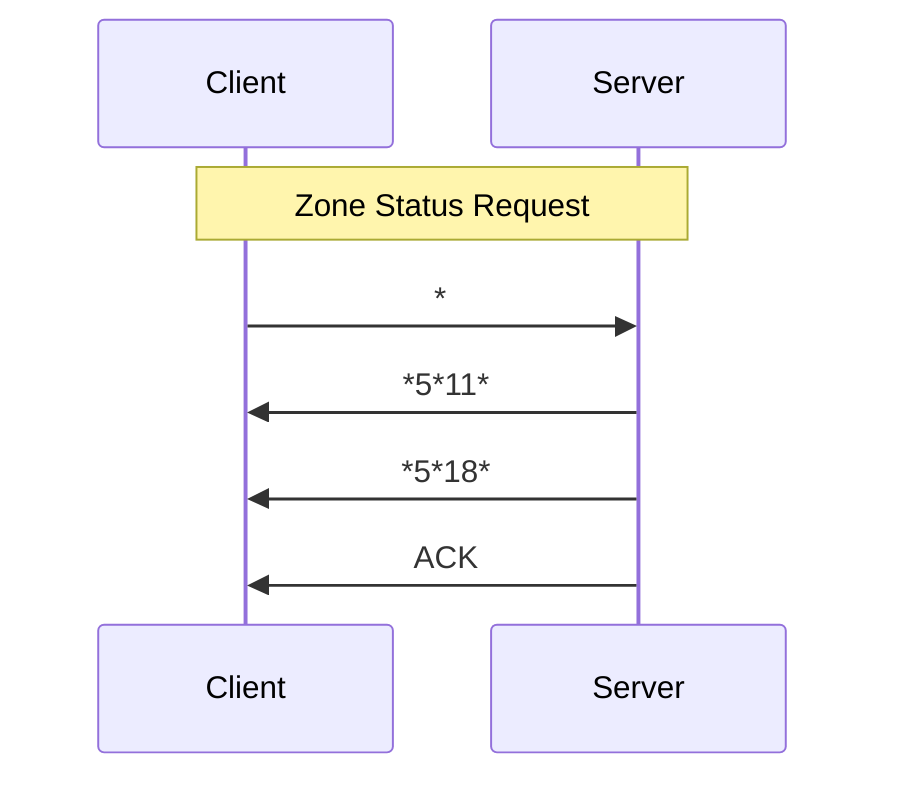
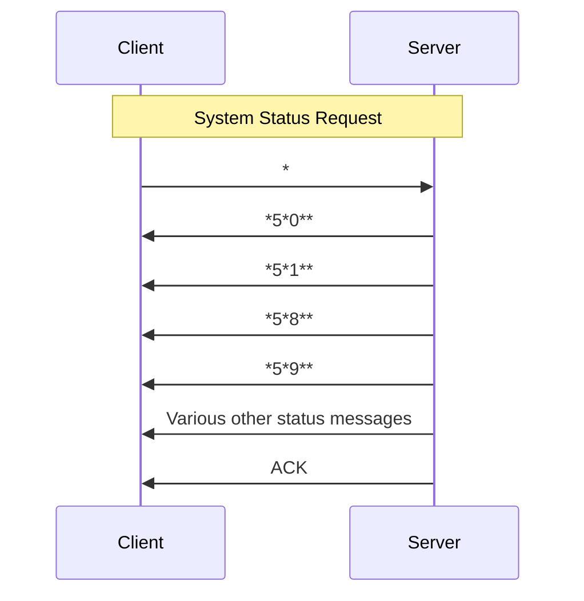
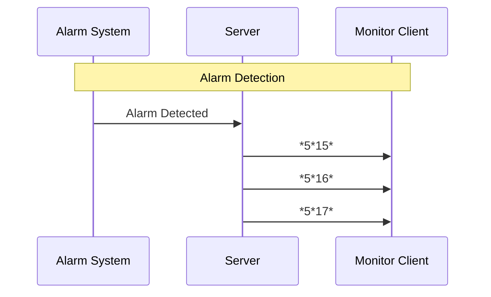

[Original Document](/assets/pdf/WHO_5.pdf)

## Introduction

This document describes the Open Web Net Message for WHO = 5 - BURGLAR ALARM. It contains WHAT/WHERE tables and allowed OPEN messages for command and monitor sessions, status requests, and alarm signalling.

## WHAT Table

| Value | Description                                |
|:------|:------------------------------------------|
| 0     | MAINTENANCE                               |
| 1     | ACTIVATION                                |
| 2     | DISACTIVATION                             |
| 3     | DELAY END                                 |
| 4     | SYSTEM BATTERY FAULT                      |
| 5     | BATTERY OK                                |
| 6     | NO NETWORK                                |
| 7     | NETWORK PRESENT                           |
| 8     | ENGAGE                                    |
| 9     | DISENGAGE                                 |
| 10    | BATTERY UNLOADS                           |
| 11    | ACTIVE ZONE                               |
| 12    | TECHNICAL ALARM                           |
| 13    | RESET TECHNICAL ALARM                     |
| 14    | NO RECEPTION - ACK PERIPHERAL DEVICE      |
| 15    | INTRUSION ALARM                           |
| 16    | ALARM 24h / TAMPERING                     |
| 17    | ANTI-PANIC ALARM                          |
| 18    | NON-ACTIVE ZONE                           |
| 26    | START PROGRAMMING                         |
| 27    | STOP PROGRAMMING                          |
| 31    | SILENT ALARM                              |

## WHERE Table

| Value     | Description                     |
|:----------|:--------------------------------|
| 0         | GENERIC/SYSTEM                  |
| 1         | CONTROL PANEL                   |
| #0..8     | ZONE 0..8 CENTRAL               |
| #1..9     | AUX1..9                         |
| WHO = 9   |                                 |
| 01        | INPUT ZONE: DEVICE 1            |
| 0n        | INPUT ZONE: DEVICE n            |
| 11        | ZONE 1: SENSOR n°1              |
| 1n        | ZONE 1: SENSOR n°n              |
| 81        | ZONE 8: SENSOR n°1              |
| 8n        | ZONE 8: SENSOR n°n              |
| #12       | ZONE C / AUX C                  |
| #15       | ZONE F / AUX F                  |

**Notes:**
- Zone 0 is for inputs and the 3 internal sirens
- Zone C (zone 12) is a special zone comprising: power feeder, external sirens, mechanical key, communicator

## Command Session Messages

### Status Request Frame

#### Status request zone N (web server answer without system request)

| Session Type | Direction         | Open Frame       | Comments         |
|:-------------|:------------------|:-----------------|:-----------------|
| Command      | Client -> Server  | `*#5*#N##`       | N=1..8           |
| Command      | Server -> Client  | `*5*11*#N##`     | If zone N engaged |
| Command      | Server -> Client  | `*5*18*#N##`     | If zone N divided |
| Command      | Server -> Client  | ACK              |                  |

#### Central Unit Status Request (web server answer without system request)

| Session Type | Direction         | Open Frame       | Comments                          |
|:-------------|:------------------|:-----------------|:----------------------------------|
| Command      | Client -> Server  | `*#5##`          |                                   |
| Command      | Server -> Client  | `*5*0**##`       | If system on maintenance          |
| Command      | Server -> Client  | `*5*1**##`       | If system active                  |
| Command      | Server -> Client  | `*5*8**##`       | If system engaged                 |
| Command      | Server -> Client  | `*5*9**##`       | If system disengaged              |
| Command      | Server -> Client  | `*5*4**##`       | If battery fault                  |
| Command      | Server -> Client  | `*5*5**##`       | If battery OK                     |
| Command      | Server -> Client  | `*5*10**##`      | If battery KO                     |
| Command      | Server -> Client  | `*5*6**##`       | If no network                     |
| Command      | Server -> Client  | `*5*7**##`       | If network OK                     |
| Command      | Server -> Client  | `*5*11*#n##`     | If zone N engaged                 |
| Command      | Server -> Client  | `*5*18*#n##`     | If zone N divided                 |
| Command      | Server -> Client  | `*5*15*#n##`     | If zone n in Intrusion alarm      |
| Command      | Server -> Client  | `*5*16*#n##`     | If zone n in Tampering alarm      |
| Command      | Server -> Client  | `*5*17*#n##`     | If zone n in Anti-panic alarm     |
| Command      | Server -> Client  | `*5*12*#x##`     | If aux n in Technical alarm       |
| Command      | Server -> Client  | `*5*31*#x##`     | Silent alarm from aux x           |
| Command      | Server -> Client  | ACK              |                                   |

#### Central Unit Status Request (central unit direct answer)

The frame is mainly used on process start to align with Burglar Alarm system status

| Session Type | Direction         | Open Frame       | Comments                                      |
|:-------------|:------------------|:-----------------|:----------------------------------------------|
| Command      | Client -> Server  | `*#5*0##`        |                                               |
| Command      | Server -> Client  | `*5*0**##`       | If system on maintenance                      |
| Command      | Server -> Client  | `*5*1**##`       | If system active                              |
| Command      | Server -> Client  | `*5*8**##`       | If system engaged                             |
| Command      | Server -> Client  | `*5*9**##`       | If system disengaged                          |
| Command      | Server -> Client  | `*5*4**##`       | If battery fault                              |
| Command      | Server -> Client  | `*5*5**##`       | If battery OK                                 |
| Command      | Server -> Client  | `*5*10**##`      | If battery KO                                 |
| Command      | Server -> Client  | `*5*6**##`       | If no network                                 |
| Command      | Server -> Client  | `*5*7**##`       | If network OK                                 |
| Command      | Server -> Client  | `*5*11*#n##`     | If zone N engaged                             |
| Command      | Server -> Client  | `*5*18*#n##`     | If zone N divided                             |
| Command      | Server -> Client  | `*5*15*#n##`     | If zone n in Intrusion alarm                  |
| Command      | Server -> Client  | `*5*16*#n##`     | If zone n in Tampering alarm                  |
| Command      | Server -> Client  | `*5*17*#n##`     | If zone n in Anti-panic alarm                 |
| Command      | Server -> Client  | `*5*12*#x##`     | If aux n in technical alarm                   |
| Command      | Server -> Client  | `*5*31*#x##`     | Silent alarm from aux x                       |
| Command      | Server -> Client  | `*5*14*ZN##`     | Failed interconnection of device N of zone Z |
| Command      | Server -> Client  | `*5*14*D##`      | Failed Interconnection from device D         |
| Command      | Server -> Client  | ACK              |                                               |

#### Auxiliaries Status Request (web server answer without system request)

| Session Type | Direction         | Open Frame       | Comments         |
|:-------------|:------------------|:-----------------|:-----------------|
| Command      | Client -> Server  | `*#9##`          |                  |
| Command      | Server -> Client  | `*9*k*1##`       | K=0: OFF         |
| Command      | Server -> Client  | `*9*k*2##`       | K=1: ON          |
| Command      | Server -> Client  | `*9*k*3##`       | K=2: TOGGLE      |
| Command      | Server -> Client  | `*9*k*4##`       | K=3: STOP        |
| Command      | Server -> Client  | `*9*k*5##`       | K=4: UP          |
| Command      | Server -> Client  | `*9*k*6##`       | K=5: DOWN        |
| Command      | Server -> Client  | `*9*k*7##`       | K=6: ENABLED     |
| Command      | Server -> Client  | `*9*k*8##`       | K=7: DISABLED    |
| Command      | Server -> Client  | `*9*k*9##`       | K=8: RESET_GEN   |
| Command      | Server -> Client  | ACK              | K=9: RESET_BI, K=10: RESET_TRI |

## Monitor Session Messages

### Status changes Zone 1-4

| Session Type | Direction         | Open Frame       | Comments                 |
|:-------------|:------------------|:-----------------|:-------------------------|
| Event        | Server -> Client  | `*5*1**##`       | If system active         |
| Event        | Server -> Client  | `*5*8**##`       | If system engaged        |
| Event        | Server -> Client  | `*5*9**##`       | If system disengaged     |
| Event        | Server -> Client  | `*5*11*#n##`     | If zone N engaged        |
| Event        | Server -> Client  | `*5*18*#n##`     | If zone N divided        |

### Status Changes Zone 5-8

| Session Type | Direction         | Open Frame       | Comments                 |
|:-------------|:------------------|:-----------------|:-------------------------|
| Event        | Server -> Client  | `*5*1**##`       | If system active         |
| Event        | Server -> Client  | `*5*8**##`       | If system engaged        |
| Event        | Server -> Client  | `*5*9**##`       | If system disengaged     |
| Event        | Server -> Client  | `*5*11*#n##`     | If zone N engaged        |
| Event        | Server -> Client  | `*5*18*#n##`     | If zone N divided        |

### Asynchronous Event

| Session Type | Direction         | Open Frame       | Comments              |
|:-------------|:------------------|:-----------------|:----------------------|
| Event        | Server -> Client  | `*5*6*##`        | No network            |
| Event        | Server -> Client  | `*5*7*##`        | Network OK            |
| Event        | Server -> Client  | `*5*10*##`       | Battery KO            |
| Event        | Server -> Client  | `*5*26**##`      | Start Programming     |
| Event        | Server -> Client  | `*5*27**##`      | Stop Programming      |

### System Led - battery status

| Session Type | Direction         | Open Frame       | Comments              |
|:-------------|:------------------|:-----------------|:----------------------|
| Event        | Server -> Client  | `*5*4*##`        | Battery fault         |
| Event        | Server -> Client  | `*5*5*##`        | Battery OK            |

### Technical Alarms

| Session Type | Direction         | Open Frame       | Comments                               |
|:-------------|:------------------|:-----------------|:---------------------------------------|
| Event        | Server -> Client  | `*5*12*#N##`     | If aux n in technical alarm is ON      |
| Event        | Server -> Client  | `*5*13*#N##`     | If aux in technical alarm Reset        |

### Alarm Signalling or Asynchronous Event

| Session Type | Direction         | Open Frame       | Comments                        |
|:-------------|:------------------|:-----------------|:--------------------------------|
| Event        | Server -> Client  | `*5*3*##`        | If delay end                    |
| Event        | Server -> Client  | `*5*2*0##`       | If silent alarm                 |
| Event        | Server -> Client  | `*5*0*0##`       | If system disactivated          |
| Event        | Server -> Client  | `*5*15*#Zn##`    | If Intrusion Alarm Zone N       |
| Event        | Server -> Client  | `*5*16*#Zn##`    | If Tampering alarm Zone N       |
| Event        | Server -> Client  | `*5*17*#Zn##`    | If Anti-panic alarm Zone N      |

## Communication Flow Diagrams

### Status Request Sequence

### Central Unit Status Request

### Alarm Event Flow

---

## Copyright Notice

Copyright (C) 2007 [`www.myopen-legrandgroup.com`](https://www.myopen-legrandgroup.com). All Rights Reserved.

## License

By using and/or copying this document, you (the licensee) agree that you have read, understood, and will comply with the following terms and conditions:

Permission to copy, and distribute the contents of this document, in any medium for any purpose and without fee or royalty is hereby granted, provided that you include the following on ALL copies of the document, or portions thereof, that you use:

- A link or URL to the [`www.myopen-legrandgroup.com`](https://www.myopen-legrandgroup.com).
- The copyright notice of the original author, or if it doesn't exist, a notice (hypertext is preferred, but a textual representation is permitted) of the form: "Copyright (C) [date-of-document] [`www.myopen-legrandgroup.com`](https://www.myopen-legrandgroup.com). All Rights Reserved.

When space permits, inclusion of the full text of this NOTICE should be provided. We request that authorship attribution be provided in any software, documents, or other items or products that you create pursuant to the implementation of the contents of this document, or any portion thereof.

Any contributions to the document (i.e. translation, modifications, improvements, etc) has to be submitted to and accepted by the My Open staff (using the forum of the community or sending an email via the [`www.myopen-legrandgroup.com`](https://www.myopen-legrandgroup.com) dedicated section) . Once the improvement has been accepted the new release will be published in the My Open Community web site.

## Disclaimers

THIS DOCUMENT IS PROVIDED "AS IS," AND COPYRIGHT HOLDERS MAKE NO REPRESENTATIONS OR WARRANTIES, EXPRESS OR IMPLIED, INCLUDING, BUT NOT LIMITED TO, WARRANTIES OF MERCHANTABILITY, FITNESS FOR A PARTICULAR PURPOSE, NON-INFRINGEMENT, OR TITLE; THAT THE CONTENTS OF THE DOCUMENT ARE SUITABLE FOR ANY PURPOSE; NOR THAT THE IMPLEMENTATION OF SUCH CONTENTS WILL NOT INFRINGE ANY THIRD PARTY PATENTS, COPYRIGHTS, TRADEMARKS OR OTHER RIGHTS.

COPYRIGHT HOLDERS WILL NOT BE LIABLE FOR ANY DIRECT, INDIRECT, SPECIAL OR CONSEQUENTIAL DAMAGES ARISING OUT OF ANY USE OF THE DOCUMENT OR THE PERFORMANCE OR IMPLEMENTATION OF THE CONTENTS THEREOF.

The name and trademarks of copyright holders may NOT be used in advertising or publicity pertaining to this document or its contents without specific, written prior permission. Title to copyright in this document will at all times remain with copyright holders.
