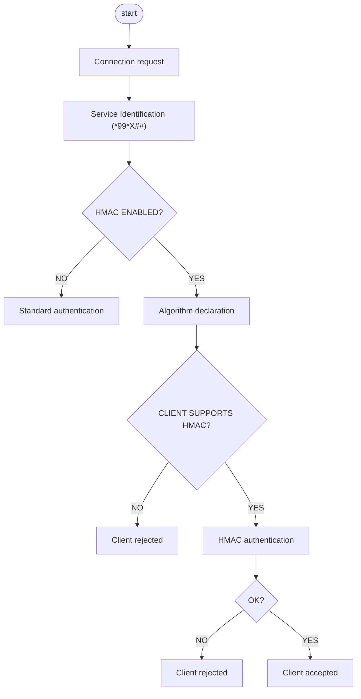

[Original Document](/assets/pdf/Hmac.pdf)

In this document is described the algorithm that is going to replace OPEN authentication algorithm: HMAC

The idea is to implement the HMAC protocol (Hashed Message Authentication Code).
The HMAC is used only to cypher OPEN communication.
the enabling of the HMAC authentication service is configurable wia a tag in the *conf.xml*.
Note that any string hash that appears in the followingdescriptions. is represented with 2 digits for each hexadecimal digit (i.e. 1=01, a=10, etc..)

We have two kind of HMAC authentication:

- sha1: it uses sha-1 digest that produces 160 bits long keys
- sha2: it uses sha-2 (256) digest that produces 256 bits long keys

the simple authentication mode, provide the authentication for the incoming connection. It is carried out in the three steps described here below:

- Server Random String: the server ends a random string 256 bits long to the client (in case of sha1 this string is 160 bits long) (Ra)
- Client Authentication Response: client answer consists in a tuple: a 256 bits lognrandom string (in case of sha1 this string is 160 bits long) (RB) and a hash HMAC(Ra,Rb,A,B,Kab)
- Server Authentication Confirmation: HMAC(Ra,Rb,Kab)

Where:

- Kab is a 256 bits pre-shared key (in case of sha1 this key is 160 bits long), obtained with a SHA-2(SHA-256) of the OPEN password (in case of sha1 this is obrtained with SHA-1).
- A is the client identity (ASCII copen)= 736F70653E
- B is the server identity (ASCII sopen)= 636F70653E
- HMAC is the SHA-2 (AHS-256) HASH function (In case of sha1 the hash function is SHA-1)

NB: if the handshake fails, the connection with the client is closed.

Every time 3 handshakes procedures fail within 60 seconds, the authentication service have to be disabled for 60 seconds.
The structures to be hashed in the and third steps are displayed in the diagram below

In the diagram is described the actual handshake:

```text
... connection setup ...
server -> *#Ra##
client -> *#Rb*HMAC(Ra, Rb, A, B, Kab)##
server -> *#HMAC(Ra, Rb, Kab)##
client -> *#*1##
... open session ...
```

All hash and bit-streams data included within "*#" and "*#" is represented as hex digits.

In Linux embedded devices, the HMAC password is stored in the conf.xml file:

```xml
<configuratore>
    <sicurezza>
        <pwd_open>12345</pwd_open>
    </sicurezza>
</configuratore>
```

The password must be made by up to 30 alphanumeric characters, among digits (0-9) lowercase and uppercase letters (a-z, A-Z).
Minimum length and other constraints must be handled by applications.

The authentication algorithm to be used is declared by the server into the `*98*N##` OPEN command.

- `*98*1##` = means to use sha1 authentication
- `*98*2##` = means to use sha2 authentication

in any case, if the connection is initiated by a device having an IP address configured into as open range, still no authentication is needed.
The algorithm message is not needed for "old" open authentication.

In the diagram below, is reported an example of how to carry out the handshake with the algorithm declaration.

```text
... connection setup ...
server -> *#*1##
client -> *99*X##
server -> *98*Y##
client -> *#*1##
... SAM handshake ...
```

where X is the value describing the type of connection, while Y states the authentication mode.
The missing frame means OPEN algorithm (client will receive "OPERATIONS" frame instead of *98*Y frame) has to be used, while Y=1 means to use sha1 authentication and Y=2 means to use HMAC_sha2 authentication.
If the HMAC algorithm is enabled:

- Server declares its authentication algorithm sending the open message *98*2##
- if the client does not support this algorithm, it will send nack and the server will close the socket
- if the client supports this algorithm, it will send ack and then it will receive the Ra random key

In the following graph is represented the handshake when there is an OPEN range enabled including the IP address of the OPEN client.

```text
... connection setup ...
server -> *#*1##
client -> *99*X##
server -> *#*1##
...session open...
```

This diagram shows the operations flow inside the server:



Ra ,Rb, Kab and each HMAC digest are 32 Bytes long (20 Bytes long for sha1; each byte is a 2 digit Hex number: 0x01, 0xff, 0x20 are 3 Bytes.
In order to send these random keys through open messages you need to do a conversion: each Byte has to be represented by 4 chars: for example 0xff becomes 1515; 0x0a becomes 0010; 0x01 becomes 0001.
So Ra or Rb will be represented by an 128 chars array (80 chars array for sha1).

In order to compute hash, you have to convert Ra, Rb, Kab to text strings.
Ra, Rb, Kab and each HMAC digest are 32 Bytes long (20 bytes long for sha1); each byte is a 2 digit Hex number: 0x01, 0xff, 0x20 are 3 Bytes.
The byte 0x01 becomes the array of two chars 01; the byte 0xff becomes the array of two chars ff and so on.
So Ra, Rb, or Kab will be represented by an array of 64 chars (an array of 40 chars in case of sha1).

The client has to calculate the HMAC(Ra, Rb, A, B, Kab):

Ra = Hex random key received from the server through open message (32 bytes)

Rb = Hex random key generated by the client (32 bytes)

Kab = Hmac (pwd open) (32 bytes)

In order to calculate the hash to send to the server you have to use the "text version" of Ra, Rb, Kab.
The text version is the key in hex like this a1b2c3...

HMAC ( Ra, Rb, A, B, Kab ) HMAC is the hash function; then you have to convert the hash in the "128 char" version in order to send it to the server

---

## Copyright Notice

Copyright (C) 2016 [`www.myopen-legrandgroup.com`](https://www.myopen-legrandgroup.com). All Rights Reserved.

## License

By using and/or copying this document, you (the licensee) agree that you have read, understood, and will comply with the following terms and conditions:

Permission to copy, and distribute the contents of this document, in any medium for any purpose and without fee or royalty is hereby granted, provided that you include the following on ALL copies of the document, or portions thereof, that you use:

- A link or URL to the [`www.myopen-legrandgroup.com`](https://www.myopen-legrandgroup.com).
- The copyright notice of the original author, or if it doesn't exist, a notice (hypertext is preferred, but a textual representation is permitted) of the form: "Copyright (C) [date-of-document] [`www.myopen-legrandgroup.com`](https://www.myopen-legrandgroup.com). All Rights Reserved.

When space permits, inclusion of the full text of this NOTICE should be provided. We request that authorship attribution be provided in any software, documents, or other items or products that you create pursuant to the implementation of the contents of this document, or any portion thereof.

Any contributions to the document (i.e. translation, modifications, improvements, etc) has to be submitted to and accepted by the My Open staff (using the forum of the community or sending an email via the [`www.myopen-legrandgroup.com`](https://www.myopen-legrandgroup.com) dedicated section) . Once the improvement has been accepted the new release will be published in the My Open Community web site.

## Disclaimers

THIS DOCUMENT IS PROVIDED "AS IS," AND COPYRIGHT HOLDERS MAKE NO REPRESENTATIONS OR WARRANTIES, EXPRESS OR IMPLIED, INCLUDING, BUT NOT LIMITED TO, WARRANTIES OF MERCHANTABILITY, FITNESS FOR A PARTICULAR PURPOSE, NON-INFRINGEMENT, OR TITLE; THAT THE CONTENTS OF THE DOCUMENT ARE SUITABLE FOR ANY PURPOSE; NOR THAT THE IMPLEMENTATION OF SUCH CONTENTS WILL NOT INFRINGE ANY THIRD PARTY PATENTS, COPYRIGHTS, TRADEMARKS OR OTHER RIGHTS.

COPYRIGHT HOLDERS WILL NOT BE LIABLE FOR ANY DIRECT, INDIRECT, SPECIAL OR CONSEQUENTIAL DAMAGES ARISING OUT OF ANY USE OF THE DOCUMENT OR THE PERFORMANCE OR IMPLEMENTATION OF THE CONTENTS THEREOF.

The name and trademarks of copyright holders may NOT be used in advertising or publicity pertaining to this document or its contents without specific, written prior permission. Title to copyright in this document will at all times remain with copyright holders.
