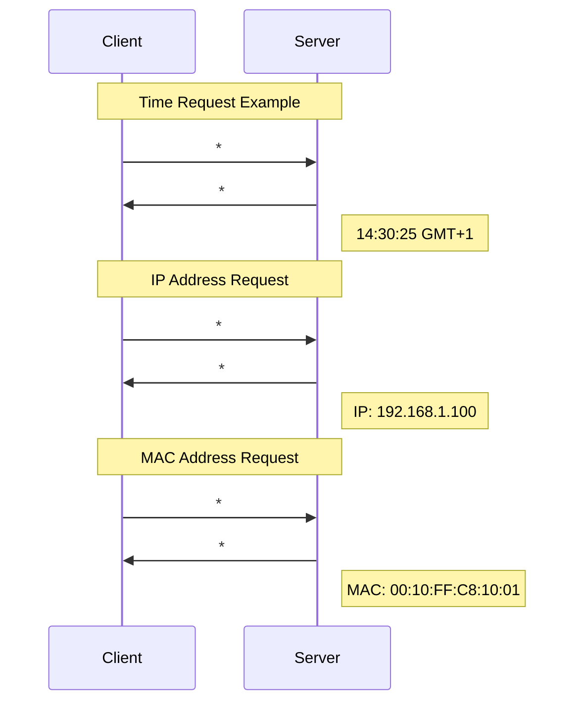

[Original Document](/assets/pdf/WHO_13.pdf)

OpenWebNet frames for external interface device status (WHO = 13).

## WHAT/DIMENSION Table

R = READ: Data read allowed.  
W = WRITE: Data write allowed.

| WHAT | Description           | R/W |
|:-----|:---------------------|:----|
| 0    | Time                  | R/W |
| 1    | Date                  | R/W |
| 10   | IP Address            | R   |
| 11   | Net Mask              | R   |
| 12   | MAC Address           | R   |
| 15   | Device Type           | R   |
| 16   | Firmware Version      | R   |
| 19   | Uptime                | R   |
| 22   | Date and Time         | R/W |
| 23   | Kernel Version        | R   |
| 24   | Distribution Version  | R   |

## Command Session Messages

### Time Request (WHAT = 0)

**Request:**
```
*#13**0##
```

**Response:**
```
*#13**0*H*M*S*T##
```

**Parameters:**
- `H` - Hours (00-23)
- `M` - Minutes (00-59)  
- `S` - Seconds (00-59)
- `T` - Time zone (3 digits):
  - First digit: 0 = positive, 1 = negative
  - Next two digits: hour offset
  - Example: `001` = GMT+1, `102` = GMT-2

### Date Request (WHAT = 1)

**Request:**
```
*#13**1##
```

**Response:**
```
*#13**1*W*D*M*Y##
```

**Parameters:**
- `W` - Day of week (00 = Sunday, 06 = Saturday)
- `D` - Day (01-31)
- `M` - Month (01-12)
- `Y` - Year (4 digits)

### IP Address Request (WHAT = 10)

**Request:**
```
*#13**10##
```

**Response:**
```
*#13**10*IP1*IP2*IP3*IP4##
```

**Parameters:**
- IP address as four separate values
- Example: For IP `192.168.10.1` → `*192*168*10*1`

### Net Mask Request (WHAT = 11)

**Request:**
```
*#13**11##
```

**Response:**
```
*#13**11*MASK1*MASK2*MASK3*MASK4##
```

**Parameters:**
- Net mask as four separate values
- Example: For mask `255.255.255.0` → `*255*255*255*0`

### MAC Address Request (WHAT = 12)

**Request:**
```
*#13**12##
```

**Response:**
```
*#13**12*MAC1*MAC2*MAC3*MAC4*MAC5*MAC6##
```

**Parameters:**
- MAC address as six decimal values
- Example: For MAC `00:10:FF:C8:10:01` → `*0*10*255*200*10*1`

### Device Type Request (WHAT = 15)

**Request:**
```
*#13**15##
```

**Response:**
```
*#13**15*MODEL##
```

**Device Types:**
- `6` - F452
- `7` - F452V
- `11` - MHServer2
- `13` - H4684

### Firmware Version Request (WHAT = 16)

**Request:**
```
*#13**16##
```

**Response:**
```
*#13**16*V*R*B##
```

**Parameters:**
- `V` - Version
- `R` - Release
- `B` - Build

### Uptime Request (WHAT = 19)

**Request:**
```
*#13**19##
```

**Response:**
```
*#13**19*D*H*M*S##
```

**Parameters:**
- `D` - Days since last start-up (00-31)
- `H` - Hours since last start-up (00-23)
- `M` - Minutes since last start-up (00-59)
- `S` - Seconds since last start-up (00-59)

### Date and Time Request (WHAT = 22)

**Request:**
```
*#13**22##
```

**Response:**
```
*#13**22*H*M*S*T*W*D*M*Y##
```

**Parameters:**
- `H` - Hours (00-23)
- `M` - Minutes (00-59)
- `S` - Seconds (00-59)
- `T` - Time zone (3 digits, same format as WHAT = 0)
- `W` - Day of week (00-06)
- `D` - Day (01-31)
- `M` - Month (01-12)
- `Y` - Year (4 digits)

### Kernel Version Request (WHAT = 23)

**Request:**
```
*#13**23##
```

**Response:**
```
*#13**23*V*R*B##
```

**Parameters:**
- `V` - Version
- `R` - Release
- `B` - Build

### Distribution Version Request (WHAT = 24)

**Request:**
```
*#13**24##
```

**Response:**
```
*#13**24*V*R*B##
```

**Parameters:**
- `V` - Version
- `R` - Release
- `B` - Build

## Write Commands

### Time Set (WHAT = 0)

**Command:**
```
*#13**0*H*M*S*T##
```

**Parameters:**
- Same format as Time Request response
- Sets the current time on the device

### Date Set (WHAT = 1)

**Command:**
```
*#13**1*W*D*M*Y##
```

**Parameters:**
- Same format as Date Request response
- Sets the current date on the device

### Date and Time Set (WHAT = 22)

**Command:**
```
*#13**22*H*M*S*T*W*D*M*Y##
```

**Parameters:**
- Same format as Date and Time Request response
- Sets both date and time on the device

## Monitor Session

All requests above also generate corresponding monitor messages:

```
*#13**<WHAT>*<parameters>##
```

The monitor session receives the same messages as the command responses, allowing real-time monitoring of device status changes.

## Communication Flow



## Notes

- All read commands return `*#*1##` for acknowledgment
- Time zone format uses 3 digits with first digit indicating sign
- MAC addresses are transmitted in decimal format, not hexadecimal
- Date and time can be read and written using WHAT = 22
- Monitor sessions receive the same frame formats as command responses

---

## Copyright Notice

Copyright (C) 2006 [`www.myopen-legrandgroup.com`](https://www.myopen-legrandgroup.com). All Rights Reserved.

## License

By using and/or copying this document, you (the licensee) agree that you have read, understood, and will comply with the following terms and conditions:

Permission to copy, and distribute the contents of this document, in any medium for any purpose and without fee or royalty is hereby granted, provided that you include the following on ALL copies of the document, or portions thereof, that you use:

- A link or URL to the [`www.myopen-legrandgroup.com`](https://www.myopen-legrandgroup.com).
- The copyright notice of the original author, or if it doesn't exist, a notice (hypertext is preferred, but a textual representation is permitted) of the form: "Copyright (C) [date-of-document] [`www.myopen-legrandgroup.com`](https://www.myopen-legrandgroup.com). All Rights Reserved.

When space permits, inclusion of the full text of this NOTICE should be provided. We request that authorship attribution be provided in any software, documents, or other items or products that you create pursuant to the implementation of the contents of this document, or any portion thereof.

Any contributions to the document (i.e. translation, modifications, improvements, etc) has to be submitted to and accepted by the My Open staff (using the forum of the community or sending an email via the [`www.myopen-legrandgroup.com`](https://www.myopen-legrandgroup.com) dedicated section) . Once the improvement has been accepted the new release will be published in the My Open Community web site.

## Disclaimers

THIS DOCUMENT IS PROVIDED "AS IS," AND COPYRIGHT HOLDERS MAKE NO REPRESENTATIONS OR WARRANTIES, EXPRESS OR IMPLIED, INCLUDING, BUT NOT LIMITED TO, WARRANTIES OF MERCHANTABILITY, FITNESS FOR A PARTICULAR PURPOSE, NON-INFRINGEMENT, OR TITLE; THAT THE CONTENTS OF THE DOCUMENT ARE SUITABLE FOR ANY PURPOSE; NOR THAT THE IMPLEMENTATION OF SUCH CONTENTS WILL NOT INFRINGE ANY THIRD PARTY PATENTS, COPYRIGHTS, TRADEMARKS OR OTHER RIGHTS.

COPYRIGHT HOLDERS WILL NOT BE LIABLE FOR ANY DIRECT, INDIRECT, SPECIAL OR CONSEQUENTIAL DAMAGES ARISING OUT OF ANY USE OF THE DOCUMENT OR THE PERFORMANCE OR IMPLEMENTATION OF THE CONTENTS THEREOF.

The name and trademarks of copyright holders may NOT be used in advertising or publicity pertaining to this document or its contents without specific, written prior permission. Title to copyright in this document will at all times remain with copyright holders.
