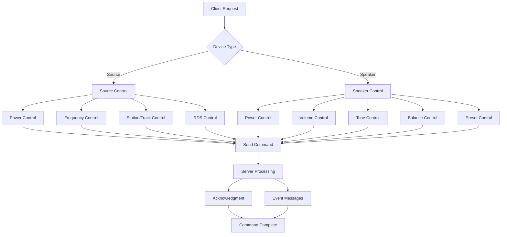
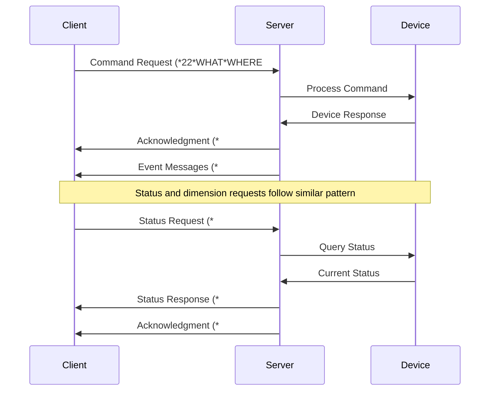

[Original Document](/assets/pdf/WHO_22.pdf)

The Sound Diffusion system (WHO=22) is composed of various devices for audio distribution and control in Open Web Net protocol networks.

## System Components

The system includes:

- **Sources** for audio signal generation and processing
- **Speakers** for audio output and local control
- **Amplifiers** for signal distribution and enhancement

Each device is identified by a different WHERE address and supports various multimedia types.

## Device Addressing (WHERE)

| WHERE | Description |
|-------|-------------|
| `2#<sourceID>` | Source (sourceID=[1-4]) |
| `3#<area>#<point>` | Speaker (area=[1-9], point=[1-9]) |
| `4#<area>` | Speaker Area (area=[1-9]) |
| `5#<sender_address>` | General |
| `6` | All Source |

## Commands (WHAT)

| WHAT | Description |
|------|-------------|
| `0` | Turn off |
| `1` | Turn on |
| `2` | Source turned on |
| `3` | Increase volume |
| `4` | Decrease volume |
| `5` | Automatic tuner search towards higher frequencies |
| `6` | Manual tuner search towards lower frequencies |
| `9` | Go to a following station |
| `10` | Go to a previous station |
| `11` | Go to a following track |
| `12` | Go to a previous track |
| `22` | Sliding request |
| `31` | Ask a source to start telling RDS message |
| `32` | Ask a source to stop telling RDS message |
| `33` | Store the presently tuned frequency on a certain station |
| `34` | Turn ON Amplifier with follow me method |
| `35` | Turn ON Amplifier to a certain source |
| `36` | Increment Low Tones |
| `37` | Decrement Low Tones |
| `38` | Increment Mid Tones |
| `39` | Decrement Mid Tones |
| `40` | Increment High Tones |
| `41` | Decrement High Tones |
| `42` | Increment balance (left>right) |
| `43` | Decrement balance (left<right) |
| `55` | Next Preset |
| `56` | Previous Preset |

## Dimensions (DIMENSION)

| DIMENSION | Description |
|-----------|-------------|
| `1` | Volume |
| `2` | High Tones |
| `3` | Medium Tones |
| `4` | Low Tones |
| `5` | Frequency |
| `6` | Track/station |
| `7` | Play status |
| `11` | Frequency and Station |
| `12` | Device state |
| `17` | Balance |
| `18` | 3D |
| `19` | Preset |
| `20` | Loudness |

## Parameter Definitions

### Multimedia Types (`<mmtype>`)

| Value | Description |
|-------|-------------|
| `1` | Voice |
| `2` | Canal Right |
| `3` | Canal Left |
| `4` | Canal Stereo |
| `11` | All Source |

### Frequency Parameters

| Parameter | Range | Description |
|-----------|-------|-------------|
| `<freqStep>` | [1-15] | Frequency step (1=50Hz, 2=100Hz, ..., 15=750Hz) |
| `<freqValue>` | Variable | Frequency of the selected station |
| `<modulation>` | [1-4] | 1=FM, 2=AM-LW, 3=AM-MW, 4=AM-SW |

### Audio Control Parameters

| Parameter | Range | Description |
|-----------|-------|-------------|
| `<volumeStep>` | [1-31] | Volume step increase |
| `<volume>` | [0-31] | Volume level |
| `<tonesValue>` | [1-63] | Tone values |
| `<balanceValue>` | [1-63] | Balance values |
| `<3dLevel>` | [0-10] | Level of 3D effect |
| `<loudness>` | [0-1] | 0=OFF, 1=ON |

### Preset Types (`<presetType>`)

| Value | Description |
|-------|-------------|
| `2` | Normal |
| `3` | Dance |
| `4` | Pop |
| `5` | Rock |
| `6` | Classic |
| `7` | Techno |
| `8` | Party |
| `9` | Soft |
| `10` | Full bass |
| `11` | Full treble |
| `16-25` | User defined preset |

### Device States

| Parameter | Range | Description |
|-----------|-------|-------------|
| `<deviceState>` | [0-1] | 0=OFF, 1=ON |
| `<station>` | [1-5] | Number of memorized station (F500) |
| `<track>` | [1-999] | Track number to select |

## Source Control Commands

### Turn Source OFF

```text
Client → Server: *22*0#<mmtype>#<area>*2#<sourceID>##
Client ← Server: *#*1##
```

**Event Response:**

```text
Client ← Server: *#22*2#<sourceID>*12*<deviceState>*<mmtype>##
```

### Turn Source ON

```text
Client → Server: *22*1#<mmtype>#<area>*2#<sourceID>##
Client ← Server: *#*1##
```

**Event Response:**

```text
Client ← Server: *#22*2#<sourceID>*12*<deviceState>*<mmtype>##
Client ← Server: *22*21#<mmtype>#<area>*5#2#<sourceID>##
Client ← Server: *22*2#<mmtype>#<area>*5#2#<sourceID>##
```

### Frequency Control

#### Frequency Up (Automatic)

```text
Client → Server: *22*5#*2#<sourceID>##
Client ← Server: *#*1##
```

#### Frequency Up (Manual Step)

```text
Client → Server: *22*5#<freqStep>*2#<sourceID>##
Client ← Server: *#*1##
```

**Event Response:**

```text
Client ← Server: *#22*where*5*<modulation>*<freqValue>##
```

#### Frequency Down (Automatic)

```text
Client → Server: *22*6#*2#<sourceID>##
Client ← Server: *#*1##
```

#### Frequency Down (Manual Step)

```text
Client → Server: *22*6#<freqStep>*2#<sourceID>##
Client ← Server: *#*1##
```

**Event Response:**

```text
Client ← Server: *#22*where*5*<modulation>*<freqValue>##
```

### Station/Track Navigation

#### Next Station

```text
Client → Server: *22*9#*2#<sourceID>##
Client ← Server: *#*1##
```

**Event Response:**

```text
Client ← Server: *#22*5#2#<sourceID>*5*<modulation>*<freqValue>##
Client ← Server: *#22*5#2#<sourceID>*11*<modulation>*<freqValue>*<station>##
Client ← Server: *#22*2#<sourceID>*6*<station>##
```

#### Previous Station

```text
Client → Server: *22*10#*2#<sourceID>##
Client ← Server: *#*1##
```

**Event Response:**

```text
Client ← Server: *#22*5#2#<sourceID>*5*<modulation>*<freqValue>##
Client ← Server: *#22*5#2#<sourceID>*11*<modulation>*<freqValue>*<station>##
Client ← Server: *#22*2#<sourceID>*6*<station>##
```

#### Next Track

```text
Client → Server: *22*11#*2#<sourceID>##
Client ← Server: *#*1##
```

or with step:

```text
Client → Server: *22*11#<freqStep>*2#<sourceID>##
Client ← Server: *#*1##
```

*Note: Source allowed: Aux, Multimedia SCS Source*

#### Previous Track

```text
Client → Server: *22*12#*2#<sourceID>##
Client ← Server: *#*1##
```

or with step:

```text
Client → Server: *22*12#<freqStep>*2#<sourceID>##
Client ← Server: *#*1##
```

*Note: Source allowed: Aux, Multimedia SCS Source*

### Source Selection

#### Go To Source

```text
Client → Server: *22*22#<mmtype>#<area>*2#<sourceID>##
Client ← Server: *#*1##
```

**Event Response:**

```text
Client ← Server: *#22*5#2#<sourceID>*5*<modulation>*<freqValue>##
Client ← Server: *#22*5#2#<sourceID>*11*<modulation>*<freqValue>*<station>##
Client ← Server: *#22*2#<sourceID>*6*<station>##
```

### RDS Control

#### Start RDS Message

```text
Client → Server: *22*31#<sourceID>##
Client ← Server: *#*1##
```

**Event Response:**

```text
Client ← Server: *#22*where*10*VAL1*VAL2*VALn##
```

*Note: Source allowed: radio*

#### Stop RDS Message

```text
Client → Server: *22*32#<sourceID>##
Client ← Server: *#*1##
```

*Note: Source allowed: radio*

### Store Station

```text
Client → Server: *22*33#<station>*2#<sourceID>##
Client ← Server: *#*1##
```

**Event Response:**

```text
Client ← Server: *#22*5#2#<sourceID>*5*<modulation>*<freqValue>##
Client ← Server: *#22*5#2#<sourceID>*11*<modulation>*<freqValue>*<station>##
Client ← Server: *#22*2#<sourceID>*6*<station>##
```

*Note: Source allowed: radio*

## Speaker Control Commands

### Basic Speaker Control

#### Turn Speaker OFF

```text
Client → Server: *22*0#<mmtype><area>*3#<area><point>##
Client ← Server: *#*1##
```

**Event Response:**

```text
Client ← Server: *#22*3#<area>#<point>*12*<deviceState>*<mmtype>##
```

#### Turn Speaker ON

```text
Client → Server: *22*1#<mmtype><area>*3#<area><point>##
Client ← Server: *#*1##
```

**Event Response:**

```text
Client ← Server: *#22*3#<area>#<point>*12*<deviceState>*<mmtype>##
Client ← Server: *#22*3#<area>#<point>*1*<volume>##
```

### Volume Control

#### Increase Volume

```text
Client → Server: *22*3#<volumeStep>*3#<area>#<point>##
Client ← Server: *#*1##
```

**Event Response:**

```text
Client ← Server: *#22*3#<area>#<point>*1*<volume>##
```

#### Decrease Volume

```text
Client → Server: *22*4#<volumeStep>*3#<area>#<point>##
Client ← Server: *#*1##
```

**Event Response:**

```text
Client ← Server: *#22*3#<area>#<point>*1*<volume>##
```

### Advanced Speaker Control

#### Turn ON with Follow Me

```text
Client → Server: *22*34#<mmtype>#<area>*3#<area>#<point>##
Client ← Server: *#*1##
```

**Event Response:**

```text
Client ← Server: *22*2#<mmtype>#<area>*5#2#<sourceID>##
Client ← Server: *#22*3#<area>#<point>*12*<deviceState>*<mmtype>##
```

#### Turn ON Amplifier to Certain Source

```text
Client → Server: *22*35#4#<area>#<sourceID>*3#<area>#<point>##
Client ← Server: *#*1##
```

**Event Response:**

```text
Client ← Server: *22*21#<mmtype>#<area>*5#2#<sourceID>##
Client ← Server: *22*2#<mmtype>#area*5#2#<sourceID>##
Client ← Server: *#22*3#<area>#<point>*12*<deviceState>*<mmtype>##
Client ← Server: *#22*3#<area>#<point>*1*<volume>##
```

### Tone Control

#### Low Tone Control

##### Increment Low Tones

```text
Client → Server: *22*36#<tonesValue>*3#<area>#<point>##
Client ← Server: *#*1##
```

**Event Response:**

```text
Client ← Server: *#22*3#<area>#<point>*2*<tonesValue>##
Client ← Server: *#22*3#<area>#<point>*4*<tonesValue>##
```

##### Decrement Low Tones

```text
Client → Server: *22*37#<tonesValue>*3#<area>#<point>##
Client ← Server: *#*1##
```

**Event Response:**

```text
Client ← Server: *#22*3#<area>#<point>*2*<tonesValue>##
Client ← Server: *#22*3#<area>#<point>*4*<tonesValue>##
```

#### Mid Tone Control

##### Increment Mid Tones

```text
Client → Server: *22*38#<tonesValue>*3#<area>#<point>##
Client ← Server: *#*1##
```

**Event Response:**

```text
Client ← Server: *#22*3#<area>#<point>*3*<tonesValue>##
```

##### Decrement Mid Tones

```text
Client → Server: *22*39#<tonesValue>*3#<area>#<point>##
Client ← Server: *#*1##
```

**Event Response:**

```text
Client ← Server: *#22*3#<area>#<point>*3*<tonesValue>##
```

#### High Tone Control

##### Increment High Tones

```text
Client → Server: *22*40#<tonesValue>*3#<area>#<point>##
Client ← Server: *#*1##
```

**Event Response:**

```text
Client ← Server: *#22*3#<area>#<point>*2*<tonesValue>##
Client ← Server: *#22*3#<area>#<point>*4*<tonesValue>##
```

##### Decrement High Tones

```text
Client → Server: *22*41#<tonesValue>*3#<area>#<point>##
Client ← Server: *#*1##
```

**Event Response:**

```text
Client ← Server: *#22*3#<area>#<point>*2*<tonesValue>##
Client ← Server: *#22*3#<area>#<point>*4*<tonesValue>##
```

### Balance Control

#### Increment Balance (Left > Right)

```text
Client → Server: *22*42#<balanceValue>*3#<area>#<point>##
Client ← Server: *#*1##
```

**Event Response:**

```text
Client ← Server: *#22*3#<area>#<point>*17*<value>##
```

#### Decrement Balance (Left < Right)

```text
Client → Server: *22*43#<balanceValue>*3#<area>#<point>##
Client ← Server: *#*1##
```

**Event Response:**

```text
Client ← Server: *#22*3#<area>#<point>*17*<value>##
```

### Preset Control

#### Next Preset

```text
Client → Server: *22*55##<area>#<point>##
Client ← Server: *#*1##
```

**Event Response:**

```text
Client ← Server: *#22*3#<area>#<point>*19*<presetType>##
Client ← Server: *#22*3#<area>#<point>*18*<3dLevel>##
Client ← Server: *#22*3#<area>#<point>*20*<loudness>##
Client ← Server: *#22*3#<area>#<point>*21#1*<band>##
Client ← Server: *#22*3#<area>#<point>*21#2*<band>##
Client ← Server: *#22*3#<area>#<point>*21#3*<band>##
```

#### Previous Preset

```text
Client → Server: *22*56##<area>#<point>##
Client ← Server: *#*1##
```

**Event Response:**

```text
Client ← Server: *#22*3#<area>#<point>*19*<presetType>##
Client ← Server: *#22*3#<area>#<point>*18*<3dLevel>##
Client ← Server: *#22*3#<area>#<point>*20*<loudness>##
Client ← Server: *#22*3#<area>#<point>*21#1*<band>##
Client ← Server: *#22*3#<area>#<point>*21#2*<band>##
Client ← Server: *#22*3#<area>#<point>*21#3*<band>##
```

## Status Requests

### Source Status Request

```text
Client → Server: *#22*<where>##
Client ← Server: *#*1##
```

**Event Response:**

```text
Client ← Server: *#22*2#<sourceID>*12*<deviceState>*<mmtype>##
```

*Note: If where is 5#2#sourceID in status request then we have a dimension 12 for each source and speaker*

### Speaker Status Request

```text
Client → Server: *#22*3#<area>#<point>##
Client ← Server: *#*1##
```

**Event Response:**

```text
Client ← Server: *#22*3#<area>#<point>*12*<deviceState>*<mmtype>##
```

## Dimension Writing Commands

### Source Dimension Writing

#### State Memorized Station (Dimension=11)

```text
Client → Server: *#22*5#2#<sourceID>*#11*<modulation>*<freqValue>*<station>##
Client ← Server: *#*1##
```

**Event Response:**

```text
Client ← Server: *#22*5#2#<sourceID>*5*<modulation>*<freqValue>##
Client ← Server: *#22*5#2#<sourceID>*11*<modulation>*<freqValue>*<station>##
```

#### Device State (Dimension=12)

```text
Client → Server: *#22*5#2#<sourceID>*#12*<deviceState>*<mmtype>##
Client ← Server: *#*1##
```

### Speaker Dimension Writing

#### Volume (Dimension=1)

```text
Client → Server: *#22*3#<area>#<point>#1*<volumeStep>##
Client ← Server: *#*1##
```

**Event Response:**

```text
Client ← Server: *#16*<area><point>*1*<volume>##
Client ← Server: *#22*3#<area>#<point>*1*<volume>##
```

#### High Tones (Dimension=2)

```text
Client → Server: *#22*3#<area>#<point>#2*<tonesValue>##
Client ← Server: *#*1##
```

**Event Response:**

```text
Client ← Server: *#22*3#<area>#<point>*2*<tonesValue>##
Client ← Server: *#22*3#<area>#<point>*4*4##
```

#### Medium Tones (Dimension=3)

```text
Client → Server: *#22*3#<area>#<point>#3*<tonesValue>##
Client ← Server: *#*1##
```

**Event Response:**

```text
Client ← Server: *#22*3#<area>#<point>*2*<tonesValue>##
Client ← Server: *#22*3#<area>#<point>*4*4##
```

#### Low Tones (Dimension=4)

```text
Client → Server: *#22*3#<area>#<point>#4*<tonesValue>##
Client ← Server: *#*1##
```

**Event Response:**

```text
Client ← Server: *#22*3#<area>#<point>*2*<tonesValue>##
Client ← Server: *#22*3#<area>#<point>*4*4##
```

#### Device State (Dimension=12)

```text
Client → Server: *#22*3#<area>#<point>*#12*<deviceState>*<mmtype>##
Client ← Server: *#*1##
```

#### Balance (Dimension=17)

```text
Client → Server: *#22*3#<area>#<point>*#17*<balanceValue>##
Client ← Server: *#*1##
```

**Event Response:**

```text
Client ← Server: *#22*3#<area>#<point>*17*<balanceValue>##
```

#### Preset (Dimension=19)

```text
Client → Server: *#22*3#<area>#<point>*#19*<presetType>##
Client ← Server: *#*1##
```

**Event Response:**

```text
Client ← Server: *#22*3#<area>#<point>*20*<loudness>##
Client ← Server: *#22*3#<area>#<point*18*<3dLevel>##
Client ← Server: *#22*3#<area>#<point*19*<presetType>##
Client ← Server: *#22*5#3#<area>#<point*21#<equalization1>*<band>##
Client ← Server: *#22*5#3#<area>#<point*21#<equalization2>*<band>##
Client ← Server: *#22*5#3#<area>#<point*21#<equalization3>*<band>##
```

#### Loudness (Dimension=20)

```text
Client → Server: *#22*3#<area>#<point>*#20*<loudness>##
Client ← Server: *#*1##
```

**Event Response:**

```text
Client ← Server: *#22*3#<area>#<point>*20*<loudness>##
Client ← Server: *#22*3#<area>#<point>*18*<3dLevel>##
Client ← Server: *#22*3#<area>#<point>*19*<presetType>##
```

## Dimension Request Commands

### Source Dimension Requests

#### State Frequency (Dimension=5)

```text
Client → Server: *#22*5#2#<sourceID>*5##
Client ← Server: *#22*5#2#<sourceID>*5*<modulation>*<freqValue>##
Client ← Server: *#*1##
```

**Event Response:**

```text
Client ← Server: *#22*5#2#<sourceID>*5*<modulation>*<freqValue>##
Client ← Server: *#22*2#<sourceID>*11*<modulation>*<freqValue>*<station(or track)>##
```

#### State Station/Track (Dimension=6)

```text
Client → Server: *#22*5#2#<sourceID>*6##
Client ← Server: *#22*5#2#<sourceID>*6*<station(or track)>##
Client ← Server: *#*1##
```

**Event Response:**

```text
Client ← Server: *#22*2#<sourceID>*5*<modulation>*<freqValue>##
Client ← Server: *#22*2#<sourceID>*6*<station(or track)>##
Client ← Server: *#22*2#<sourceID>*11*<modulation>*<freqValue>*<station(or track)>##
```

#### State Memorized Station (Dimension=11)

```text
Client → Server: *#22*5#2#<sourceID>*11##
Client ← Server: *#22*5#2#<sourceID>*11*<modulation>*<freqValue>*<station(or track)>##
Client ← Server: *#*1##
```

**Event Response:**

```text
Client ← Server: *#22*5#2#<sourceID>*5*<modulation>*<freqValue>##
Client ← Server: *#22*5#2#<sourceID>*11*<modulation>*<freqValue>*<station(or track)>##
```

#### Device State (Dimension=12)

```text
Client → Server: *#22*5#2#<sourceID>*12##
Client ← Server: *#22*2#<sourceID>*12*<deviceState>*<mmtype>##
Client ← Server: *#*1##
```

**Event Response:**

```text
Client ← Server: *#22*2#<sourceID>*12*<deviceState>*<mmtype>##
```

### Speaker Dimension Requests

#### Volume (Dimension=1)

```text
Client → Server: *#22*3#<area>#<point>*1##
Client ← Server: *#22*3#<area>#<point>*1*<volume>##
Client ← Server: *#*1##
```

**Event Response:**

```text
Client ← Server: *#16*<area><point>*1*<volume>##
Client ← Server: *#22*3#<area>#<point>*1*<volume>##
```

#### High Tones (Dimension=2)

```text
Client → Server: *#22*3#<area>#<point>*2##
Client ← Server: *#22*3#<area>#<point>*2*<tonesValue>##
Client ← Server: *#*1##
```

**Event Response:**

```text
Client ← Server: *#22*3#<area>#<point>*3*<tonesValue>##
Client ← Server: *#22*3#<area>#<point>*4*<tonesValue>##
```

#### Medium Tones (Dimension=3)

```text
Client → Server: *#22*3#<area>#<point>*3##
Client ← Server: *#22*3#<area>#<point>*3*<tonesValue>##
Client ← Server: *#*1##
```

**Event Response:**

```text
Client ← Server: *#22*3#<area>#<point>*3*<tonesValue>##
Client ← Server: *#22*3#<area>#<point>*4*<tonesValue>##
```

#### Low Tones (Dimension=4)

```text
Client → Server: *#22*3#<area>#<point>*4##
Client ← Server: *#22*3#<area>#<point>*4*<tonesValue>##
Client ← Server: *#*1##
```

**Event Response:**

```text
Client ← Server: *#22*3#<area>#<point>*2*<tonesValue>##
Client ← Server: *#22*3#<area>#<point>*4*<tonesValue>##
```

#### Device State (Dimension=12)

```text
Client → Server: *#22*3#<area>#<point>*12##
Client ← Server: *#22*3#<area>#<point>*12*<deviceState>*<mmtype>##
Client ← Server: *#*1##
```

**Event Response:**

```text
Client ← Server: *16*3*<area><point>##
Client ← Server: *#22*3#<area>#<point>*12*<deviceState>*<mmtype>##
```

#### Balance (Dimension=17)

```text
Client → Server: *#22*3#<area>#<point>*17##
Client ← Server: *#*1##
```

**Event Response:**

```text
Client ← Server: *#22*3#<area>#<point>*17*<balanceValue>##
```

#### Preset (Dimension=19)

```text
Client → Server: *#22*3#<area>#<point>*19##
Client ← Server: *#22*3#<area>#<point>*19*<presetType>##
Client ← Server: *#*1##
```

**Event Response:**

```text
Client ← Server: *#22*3#<area>#<point>*20*<loudness>##
Client ← Server: *#22*3#<area>#<point>*18*<3dLevel>##
Client ← Server: *#22*3#<area>#<point>*19*<presetType>##
```

#### Loudness (Dimension=20)

```text
Client → Server: *#22*3#<area>#<point>*20##
Client ← Server: *#22*3#<area>#<point>*20*<loudness>##
Client ← Server: *#*1##
```

**Event Response:**

```text
Client ← Server: *#22*3#<area>#<point>*20*<loudness>##
Client ← Server: *#22*3#<area>#<point>*18*<3dLevel>##
Client ← Server: *#22*3#<area>#<point>*19*<presetType>##
```

## Audio Control Workflow

The following Mermaid diagram shows the typical audio control workflow:



## Communication Flow

The following sequence diagram shows the typical communication flow:



---

## Copyright Notice

Copyright (C) 2014 [`www.myopen-legrandgroup.com`](https://www.myopen-legrandgroup.com). All Rights Reserved.

## License

By using and/or copying this document, you (the licensee) agree that you have read, understood, and will comply with the following terms and conditions:

Permission to copy, and distribute the contents of this document, in any medium for any purpose and without fee or royalty is hereby granted, provided that you include the following on ALL copies of the document, or portions thereof, that you use:

- A link or URL to the [`www.myopen-legrandgroup.com`](https://www.myopen-legrandgroup.com).
- The copyright notice of the original author, or if it doesn't exist, a notice (hypertext is preferred, but a textual representation is permitted) of the form: "Copyright (C) [date-of-document] [`www.myopen-legrandgroup.com`](https://www.myopen-legrandgroup.com). All Rights Reserved.

When space permits, inclusion of the full text of this NOTICE should be provided. We request that authorship attribution be provided in any software, documents, or other items or products that you create pursuant to the implementation of the contents of this document, or any portion thereof.

Any contributions to the document (i.e. translation, modifications, improvements, etc) has to be submitted to and accepted by the My Open staff (using the forum of the community or sending an email via the [`www.myopen-legrandgroup.com`](https://www.myopen-legrandgroup.com) dedicated section) . Once the improvement has been accepted the new release will be published in the My Open Community web site.

## Disclaimers

THIS DOCUMENT IS PROVIDED "AS IS," AND COPYRIGHT HOLDERS MAKE NO REPRESENTATIONS OR WARRANTIES, EXPRESS OR IMPLIED, INCLUDING, BUT NOT LIMITED TO, WARRANTIES OF MERCHANTABILITY, FITNESS FOR A PARTICULAR PURPOSE, NON-INFRINGEMENT, OR TITLE; THAT THE CONTENTS OF THE DOCUMENT ARE SUITABLE FOR ANY PURPOSE; NOR THAT THE IMPLEMENTATION OF SUCH CONTENTS WILL NOT INFRINGE ANY THIRD PARTY PATENTS, COPYRIGHTS, TRADEMARKS OR OTHER RIGHTS.

COPYRIGHT HOLDERS WILL NOT BE LIABLE FOR ANY DIRECT, INDIRECT, SPECIAL OR CONSEQUENTIAL DAMAGES ARISING OUT OF ANY USE OF THE DOCUMENT OR THE PERFORMANCE OR IMPLEMENTATION OF THE CONTENTS THEREOF.

The name and trademarks of copyright holders may NOT be used in advertising or publicity pertaining to this document or its contents without specific, written prior permission. Title to copyright in this document will at all times remain with copyright holders.
