## Simple diagram
```python linenums="1"
--8<-- "simple_rbd.py:13:13,16:"
```

--8<-- "simple_rbd.py:4:8"




## Example with more functionality

```python linenums="1"
--8<-- "example_rbd.py:15:19,22:"
```

--8<-- "example_rbd.py:4:9"




## Layered `Series` and `Group` instances

```python linenums="1"
--8<-- "layered_rbd.py:6:6,9:"
```


