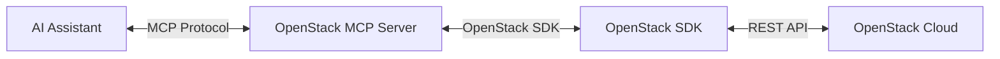

# python-openstackmcp-server

Openstack mcp server is a [Model Context Protocol (MCP)](https://modelcontextprotocol.io/docs/getting-started/intro) server that provides an interface for AI assistants to interact with OpenStack services.



# Table of Contents
- [Table of Contents](#table-of-contents)
- [Features](#features)
- [Quick Start with Claude Desktop](#quick-start-with-claude-desktop)
  - [Requirements](#requirements)
  - [Using python](#using-python)
  - [Using uvx](#using-uvx)
  - [Contributing](#contributing)
  - [License](#license)

# Features
- **MCP Protocol Support**: Implements the Model Context Protocol for AI assistants.
- **Compute Tools**: Manage OpenStack compute resources (servers, flavors).
- **Image Tools**: Manage OpenStack images.
- **Identity Tools**: Handle OpenStack identity and authentication.
- **Network Tools**: Manage OpenStack networking resources.
- **Block Storage Tools**: Manage OpenStack block storage resources.

# Quick Start with Claude Desktop

Get started quickly with the OpenStack MCP server using Claude Desktop

## Requirements
- Python 3.10 or higher
- OpenStack credentials configured in `clouds.yaml` file
- Claude Desktop installed

1. **Create or update your `clouds.yaml` file with your OpenStack credentials.**
   
   Example `clouds.yaml`:
   ```yaml
   clouds:
     openstack:
       auth:
         auth_url: https://your-openstack-auth-url.com
         username: your-username
         password: your-password
         project_name: your-project-name
         user_domain_name: Default
         project_domain_name: Default
       region_name: your-region
       interface: public
       identity_api_version: 3
   ```

2. **Create or update your Claude Desktop configuration file**:
   - **macOS**: Edit `$HOME/Library/Application Support/Claude/claude_desktop_config.json`
   - **Windows**: Edit `%APPDATA%\Claude\claude_desktop_config.json`
   - **Linux**: Edit `$HOME/.config/Claude/claude_desktop_config.json`
   
### Using python
 
   ```json
   {
     "mcpServers": {
       "openstack-mcp-server": {
         "command": "/path/to/your/python",
         "args": [
           "python-openstackmcp-server"
         ],
         "env" : {
           "OS_CLIENT_CONFIG_FILE": "/path/to/your/clouds.yaml"
         }
       }
     }
   }
   ```

### Using uvx
  
   ```json
   {
     "mcpServers": {
       "openstack-mcp-server": {
         "command": "uvx",
         "args": [
           "python-openstackmcp-server"
         ],
         "env" : {
           "OS_CLIENT_CONFIG_FILE": "/path/to/your/clouds.yaml"
         }
       }
     }
   }
   ```

# Contributing
Contributions are welcome! Please see the [CONTRIBUTING](CONTRIBUTING.rst) file for details on how to contribute to this project.

# License
This project is licensed under the Apache License 2.0. See the [LICENSE](LICENSE) file for details.