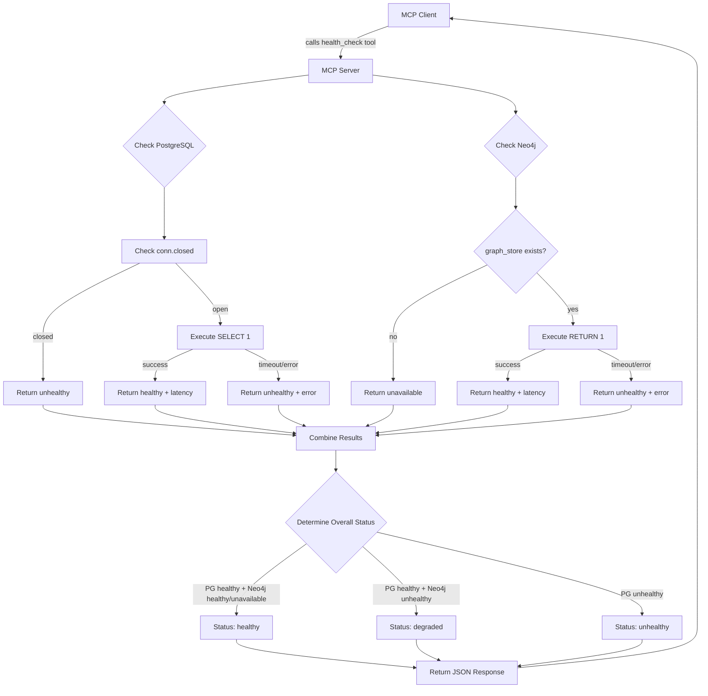

# Health Check Flow Diagram



## Response Flow

### Scenario 1: All Systems Healthy
```json
{
  "status": "healthy",
  "timestamp": "2025-10-21T12:34:56.789Z",
  "components": {
    "postgres": {"status": "healthy", "latency_ms": 1.23},
    "neo4j": {"status": "healthy", "latency_ms": 5.67}
  },
  "message": "All systems operational"
}
```

### Scenario 2: RAG-Only Mode (Neo4j Not Configured)
```json
{
  "status": "healthy",
  "timestamp": "2025-10-21T12:34:56.789Z",
  "components": {
    "postgres": {"status": "healthy", "latency_ms": 1.23},
    "neo4j": {"status": "unavailable", "latency_ms": null}
  },
  "message": "PostgreSQL healthy, Neo4j unavailable (RAG-only mode)"
}
```

### Scenario 3: Degraded (Neo4j Down)
```json
{
  "status": "degraded",
  "timestamp": "2025-10-21T12:34:56.789Z",
  "components": {
    "postgres": {"status": "healthy", "latency_ms": 1.23},
    "neo4j": {"status": "unhealthy", "latency_ms": 50.0, "error": "Service unavailable"}
  },
  "message": "PostgreSQL healthy, Neo4j unhealthy (degraded)"
}
```

### Scenario 4: System Down (PostgreSQL Failed)
```json
{
  "status": "unhealthy",
  "timestamp": "2025-10-21T12:34:56.789Z",
  "components": {
    "postgres": {"status": "unhealthy", "latency_ms": 100.0, "error": "Connection refused"},
    "neo4j": {"status": "unavailable", "latency_ms": null}
  },
  "message": "PostgreSQL unhealthy (system unavailable)"
}
```
