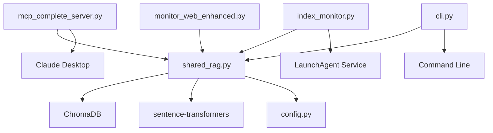

# Project Structure - Ragdex

## Repository Overview
```
ragdex/ (or ~/ragdex_env/ for PyPI installation)
├── 📁 Source Code (src/personal_doc_library/)
│   ├── __init__.py               # Package initialization
│   ├── cli.py                    # Command-line interface (ragdex)
│   │
│   ├── 📁 Core Components
│   │   ├── config.py             # Configuration management
│   │   ├── shared_rag.py         # Core RAG functionality
│   │   ├── logging_config.py     # Logging setup
│   │   └── timeout_handler.py    # Timeout management
│   │
│   ├── 📁 MCP Server
│   │   └── servers/
│   │       └── mcp_complete_server.py  # Main MCP server (17 tools, 5 prompts, 4 resources)
│   │
│   ├── 📁 Document Indexing
│   │   └── indexing/
│   │       ├── index_monitor.py        # Background indexing service
│   │       ├── execute_indexing.py     # Indexing execution
│   │       ├── complete_indexing.py    # Full indexing workflow
│   │       ├── handle_large_pdf.py     # Large PDF processing
│   │       ├── manage_failed_pdfs.py   # Failed document management
│   │       └── clean_pdfs.py           # PDF cleaning utility
│   │
│   ├── 📁 Email Loaders (v0.2.0+)
│   │   └── loaders/
│   │       ├── email_loaders.py        # Base email loader & filtering
│   │       ├── emlx_loader.py          # Apple Mail EMLX support
│   │       └── outlook_loader.py       # Outlook OLM support
│   │
│   ├── 📁 Web Monitoring
│   │   └── monitoring/
│   │       └── monitor_web_enhanced.py # Web dashboard (localhost:8888)
│   │
│   └── 📁 Utilities
│       └── utils/
│           ├── check_indexing_status.py  # Status checking
│           ├── find_unindexed.py        # Find unindexed docs
│           ├── fix_skipped_file.py      # Fix skipped files
│           ├── index_lock.py            # Lock management
│           ├── ocr_manager.py           # OCR processing
│           ├── show_config.py           # Display config
│           └── fallback_search.py       # Fallback search logic
│
├── 📁 Scripts Directory
│   ├── Core Operations
│   │   ├── run.sh                      # Main runner (MCP server & indexing)
│   │   ├── serviceInstall.sh           # Comprehensive setup script
│   │   └── install_interactive_nonservicemode.sh  # Interactive setup
│   │
│   ├── Background Monitoring
│   │   ├── index_monitor.sh            # Manual background monitor
│   │   ├── stop_monitor.sh             # Stop background monitor
│   │   └── index_monitor_service.sh    # Service wrapper (LaunchAgent)
│   │
│   ├── Service Management
│   │   ├── install_service.sh          # Install index monitor service
│   │   ├── uninstall_service.sh        # Remove index monitor service
│   │   └── service_status.sh           # Check service health
│   │
│   ├── Web Monitor Services
│   │   ├── install_webmonitor_service.sh     # Install web monitor service
│   │   ├── uninstall_webmonitor_service.sh   # Remove web monitor service
│   │   ├── webmonitor_service_status.sh      # Check web monitor status
│   │   └── start_web_monitor.sh              # Manual web dashboard start
│   │
│   ├── Indexing Control
│   │   ├── pause_indexing.sh           # Pause indexing
│   │   ├── resume_indexing.sh          # Resume indexing
│   │   └── indexing_status.sh          # Check indexing progress
│   │
│   └── Debugging & Maintenance
│       ├── view_mcp_logs.sh            # View MCP logs
│       ├── test_logs.sh                # Test log viewing
│       ├── manage_failed_docs.sh       # Manage failed documents
│       └── cleanup_failed_list.sh      # Clean failed list
│
├── 📁 Package Configuration
│   ├── pyproject.toml                  # Package metadata and build config
│   ├── requirements.txt                # Python dependencies
│   ├── MANIFEST.in                     # Package distribution config
│   └── .gitignore                      # Git ignore patterns
│
├── 📁 Documentation
│   ├── README.md                       # Main documentation
│   ├── CLAUDE.md                       # Claude Code instructions
│   ├── PROJECT_STRUCTURE.md            # This file
│   ├── QUICK_REFERENCE.md              # Command reference
│   ├── docs/
│   │   ├── ARCHITECTURE.md             # System architecture
│   │   └── images/                     # Screenshots
│   └── config/
│       └── claude_desktop_config.json.template  # Config template
│
├── 📁 Testing
│   ├── test_mcp_features.py            # MCP protocol tests
│   ├── test_resources.py               # Resources functionality tests
│   └── test_pypi_deployment.py         # PyPI deployment tests
│
├── 📁 PyPI Service Scripts
│   ├── install_ragdex_services.sh      # Install services from PyPI
│   ├── uninstall_ragdex_services.sh    # Uninstall services
│   └── ragdex_status.sh                # Check ragdex installation
│
└── 📁 Runtime (created automatically)
    ├── books/                           # Document library
    ├── chroma_db/                       # Vector database
    ├── venv_mcp/                        # Virtual environment (source)
    ├── ~/ragdex_env/                    # Virtual environment (PyPI)
    └── logs/                            # Application logs
```

## Package Structure

The project is now structured as a proper Python package (`personal_doc_library`) with the following entry points:

### CLI Commands
- `pdlib-cli` - Main command-line interface
- `pdlib-mcp` - Start MCP server
- `pdlib-indexer` - Start background indexer
- `pdlib-webmonitor` - Start web dashboard

### Python Modules
```python
# MCP Server
from personal_doc_library.servers.mcp_complete_server import main

# Core RAG
from personal_doc_library.core.shared_rag import SharedRAG

# Configuration
from personal_doc_library.core.config import config

# Indexing
from personal_doc_library.indexing.index_monitor import IndexMonitor
```

## MCP Protocol Implementation

### MCP Complete Server (`mcp_complete_server.py`)
- **Purpose**: Main Model Context Protocol server for Claude Desktop
- **Features**:
  - 17 tools for document interaction
  - 5 prompt templates for workflows
  - 4 dynamic resources for real-time info
  - Lazy initialization (< 1s startup)
  - ARM64 compatible

### Tools (17 total)
```
Search & Discovery:
- search              # Semantic search with synthesis
- list_books          # List books by pattern/author
- recent_books        # Find recently indexed books
- find_practices      # Find specific techniques

Content Extraction:
- extract_pages       # Extract specific pages
- extract_quotes      # Find notable quotes
- summarize_book      # Generate AI summaries

Analysis & Synthesis:
- compare_perspectives # Compare across sources
- question_answer     # Direct Q&A
- daily_reading       # Suggested passages

System Management:
- library_stats       # Library statistics
- index_status        # Indexing progress
- refresh_cache       # Refresh search cache
- warmup              # Initialize RAG system
- find_unindexed      # Find unindexed docs
- reindex_book        # Force reindex
- clear_failed        # Clear failed list
```

### Prompts (5 templates)
```
- analyze_theme       # Theme analysis across library
- compare_authors     # Author comparison
- extract_practices   # Extract techniques
- research_topic      # Deep research
- daily_wisdom        # Daily wisdom passages
```

### Resources (4 dynamic)
```
- library://stats     # Current statistics
- library://recent    # Recent additions
- library://search-tips # Usage examples
- library://config    # Configuration
```

## Core Components

### Shared RAG (`shared_rag.py`)
- **Purpose**: Core RAG functionality shared across all components
- **Features**:
  - ChromaDB integration (768-dim embeddings)
  - Document processing pipeline
  - Lock management (30-min timeout)
  - MD5 hash-based tracking
- **Embedding**: sentence-transformers/all-mpnet-base-v2

### Configuration (`config.py`)
- **Purpose**: Centralized configuration management
- **Features**:
  - Environment variable support
  - Default path configuration
  - Platform-specific paths
  - Configuration validation

### Index Monitor (`index_monitor.py`)
- **Purpose**: Background service for automatic indexing
- **Features**:
  - File system event watching
  - Automatic document processing
  - Service mode with LaunchAgent
  - Progress tracking and status updates

### Web Monitor (`monitor_web_enhanced.py`)
- **Purpose**: Real-time monitoring dashboard
- **Features**:
  - Live statistics and progress
  - Search interface with Enter key
  - Document library browsing
  - Failed document management
- **Access**: http://localhost:8888

## Script Connection Map

```
User has 3 ways to run the system:

1. PACKAGE MODE (pip install -e .)
   ├── pdlib-mcp        → MCP server
   ├── pdlib-indexer    → Background indexer
   └── pdlib-webmonitor → Web dashboard

2. MANUAL MODE (scripts/)
   ├── run.sh           → Direct execution
   ├── index_monitor.sh → Terminal background
   └── start_web_monitor.sh → Manual web start

3. SERVICE MODE (LaunchAgent)
   ├── install_service.sh → Install services
   └── service_status.sh  → Check status
```

## Data Flow

### Document Processing Pipeline
```
Document → MD5 Hash → Check Index → Load Document
→ Chunk Text (1200 chars) → Categorize → Generate Embeddings
→ Store in ChromaDB → Update Book Index
```

### Search Flow
```
Query → Generate Embedding → Vector Similarity Search
→ Retrieve Chunks → Load Book Metadata → Rank Results
→ Format Response → Return to Claude
```

### MCP Protocol Flow
```
Claude Desktop → MCP Protocol → Tool Handler → SharedRAG
→ ChromaDB → Process Results → MCP Response → Claude Desktop
```

## File Dependencies



## Configuration Files

### Claude Desktop Config
- **Location**: `~/Library/Application Support/Claude/claude_desktop_config.json`
- **Purpose**: MCP server integration with Claude Desktop
- **Format**:
```json
{
  "mcpServers": {
    "personal-library": {
      "command": "/path/to/venv_mcp/bin/python",
      "args": ["-m", "personal_doc_library.servers.mcp_complete_server"],
      "env": {
        "PYTHONPATH": "/path/to/src",
        "CHROMA_TELEMETRY": "false"
      }
    }
  }
}
```

### Service Configuration
- **Location**: `~/Library/LaunchAgents/com.personal-library.*.plist`
- **Purpose**: Background service configuration
- **Created by**: Installation scripts

### Environment Variables
```bash
PERSONAL_LIBRARY_DOC_PATH    # Document library path
PERSONAL_LIBRARY_DB_PATH     # Database path
PERSONAL_LIBRARY_LOGS_PATH   # Logs directory
CHROMA_TELEMETRY            # Disable telemetry (false)
```

## Development Workflow

1. **Setup**: Install package with `pip install -e .`
2. **Development**: Edit source files in `src/personal_doc_library/`
3. **Testing**: Run test scripts (`test_mcp_features.py`)
4. **Integration**: Test with Claude Desktop
5. **Service**: Install as service for production

## Performance Characteristics

- **Startup**: < 1 second (lazy initialization)
- **Search**: ~1.75s per query (768-dim embeddings)
- **Indexing**: ~10-30 minutes for full library
- **Memory**: ~4GB for embeddings model
- **Storage**: ~55MB ChromaDB for 68 books, 38K chunks

## Security Architecture

- **Local Processing**: No data leaves machine
- **User Permissions**: Services run as user
- **No Network**: All processing is offline
- **Sandboxed**: MCP runs in separate process