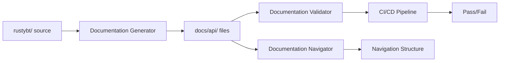

# RustyBT Comprehensive Framework Documentation Brownfield Enhancement Architecture

## Introduction

This document outlines the architectural approach for enhancing RustyBT with comprehensive framework documentation covering 90%+ of the API surface area. Its primary goal is to serve as the guiding architectural blueprint for AI-driven development of documentation while ensuring seamless integration with the existing documentation system.

**Relationship to Existing Architecture:**
This document supplements existing project architecture by defining how new documentation components will integrate with current systems. Where conflicts arise between new and existing patterns, this document provides guidance on maintaining consistency while implementing comprehensive documentation coverage.

### Existing Project Analysis

#### Current Project State
- **Primary Purpose:** Python-based algorithmic trading backtesting framework with Rust optimization components
- **Current Tech Stack:** Python 3.12+, Polars, Parquet storage, SQLite metadata, Decimal arithmetic
- **Architecture Style:** Modular Python library with event-driven simulation engine, Rust hot paths
- **Deployment Method:** pip package with comprehensive test suite (90%+ coverage)

#### Available Documentation
- **Current API Docs:** 8 files found in docs/api/ (order-types, caching-api, bundle-metadata-api, optimization-api, datasource-api, finance-api, live-trading-api, analytics-api)
- **Architecture Docs:** Comprehensive brownfield architecture documentation in docs/architecture/
- **PRD/Epic Docs:** Detailed product requirements and epic definitions in docs/prd/
- **Story Docs:** Implementation stories in docs/stories/

#### Identified Constraints
- **Documentation Format:** Markdown-based system without dedicated documentation generation tools
- **Coverage Gap:** Current documentation covers <10% of public API surface
- **Maintenance Challenge:** No automated validation of documentation accuracy
- **Discovery Problem:** Lack of comprehensive navigation and cross-referencing
- **Example Validation:** No automated testing of code examples in documentation

## Change Log

| Change | Date | Version | Description | Author |
|--------|------|---------|-------------|--------|
| Initial Creation | 2025-01-14 | 1.0 | Created brownfield architecture for Epic 10 documentation | Architect |

## Enhancement Scope and Integration Strategy

### Enhancement Overview
**Enhancement Type:** Documentation Infrastructure Enhancement
**Scope:** Comprehensive API documentation covering all public modules, classes, methods
**Integration Impact:** Low - documentation-only changes with CI/CD pipeline additions

### Integration Approach
**Code Integration Strategy:** No code changes required; documentation lives alongside code
**Database Integration:** N/A - documentation only
**API Integration:** Documentation of existing APIs without modification
**UI Integration:** Enhanced documentation navigation structure

### Compatibility Requirements
- **Existing API Compatibility:** Full compatibility - documenting existing APIs only
- **Database Schema Compatibility:** N/A - no database changes
- **UI/UX Consistency:** Maintains existing Markdown documentation format
- **Performance Impact:** Zero runtime impact - documentation only

## Tech Stack

### Existing Technology Stack

| Category | Current Technology | Version | Usage in Enhancement | Notes |
|----------|-------------------|---------|---------------------|--------|
| **Documentation Format** | Markdown | N/A | Primary documentation format | Continue using existing format |
| **Version Control** | Git | Latest | Documentation versioning | Track documentation changes |
| **CI/CD** | GitHub Actions | Latest | Documentation validation | Add documentation checks |
| **Testing** | pytest | >= 7.2.0 | Example validation | Test documentation code examples |
| **Python** | Python | 3.12+ | API introspection | Generate API signatures |

### New Technology Additions

| Technology | Version | Purpose | Rationale | Integration Method |
|-----------|---------|---------|-----------|-------------------|
| **mkdocs** | Latest | Documentation site generator | Optional - better navigation and search | Generate from Markdown files |
| **pydoc-markdown** | Latest | API extraction tool | Extract docstrings and signatures | Run in CI/CD pipeline |
| **doctest** | stdlib | Example validation | Validate code examples work | Integrate with pytest |
| **sphinx-apidoc** | Optional | API documentation generator | Alternative to manual documentation | Generate initial structure |
| **mermaid** | Latest | Diagram support | Architecture and flow diagrams | Embed in Markdown |

## Data Models and Schema Changes

### New Data Models

N/A - Documentation enhancement requires no new data models

### Schema Integration Strategy

**Database Changes Required:**
- **New Tables:** None
- **Modified Tables:** None
- **New Indexes:** None
- **Migration Strategy:** N/A

**Backward Compatibility:**
- All existing functionality preserved
- Documentation is additive only

## Component Architecture

### New Components

#### Documentation Generator
**Responsibility:** Extract API signatures and docstrings from Python code
**Integration Points:** Reads from rustybt/ source code, outputs to docs/api/

**Key Interfaces:**
- Input: Python source files
- Output: Markdown documentation files

**Dependencies:**
- **Existing Components:** rustybt Python modules
- **New Components:** None

**Technology Stack:** Python AST parsing, pydoc-markdown or custom script

#### Documentation Validator
**Responsibility:** Validate documentation completeness and example correctness
**Integration Points:** CI/CD pipeline, pre-commit hooks

**Key Interfaces:**
- Validate coverage metrics (90%+ target)
- Test code examples via doctest
- Check cross-references

**Dependencies:**
- **Existing Components:** pytest test suite
- **New Components:** Documentation generator

**Technology Stack:** Python doctest, custom validation scripts

#### Documentation Navigator
**Responsibility:** Generate navigation structure and cross-references
**Integration Points:** docs/api/ directory structure

**Key Interfaces:**
- Generate README.md index files
- Create cross-reference mappings
- Build search index (if using mkdocs)

**Dependencies:**
- **Existing Components:** Existing documentation files
- **New Components:** Documentation generator

**Technology Stack:** Python scripts, optional mkdocs

### Component Interaction Diagram



## API Design and Integration

This enhancement documents existing APIs without modification. No new API endpoints required.

## External API Integration

N/A - Documentation enhancement requires no external API integrations

## Source Tree

### Existing Project Structure
```plaintext
rustybt/
├── rustybt/           # Source code to document
│   ├── data/         # Data management modules
│   ├── finance/      # Order and execution modules
│   ├── portfolio/    # Portfolio management
│   ├── optimization/ # Optimization algorithms
│   ├── analytics/    # Analytics and metrics
│   └── live/         # Live trading components
├── docs/
│   ├── api/          # API documentation (expand here)
│   ├── architecture/ # Architecture docs
│   ├── prd/         # Product requirements
│   └── stories/     # Implementation stories
└── tests/           # Test suite
```

### New File Organization
```plaintext
rustybt/
├── docs/
│   ├── api/                          # Existing API docs location
│   │   ├── README.md                 # New: Navigation index
│   │   ├── data-management/          # New: Story 10.1
│   │   │   ├── README.md
│   │   │   ├── adapters/
│   │   │   ├── catalog/
│   │   │   ├── readers/
│   │   │   └── pipeline/
│   │   ├── order-management/         # New: Story 10.2
│   │   │   ├── README.md
│   │   │   ├── order-types.md       # Moved from root
│   │   │   ├── execution/
│   │   │   └── transaction-costs/
│   │   ├── portfolio-management/     # New: Story 10.2
│   │   │   ├── README.md
│   │   │   ├── portfolio/
│   │   │   ├── multi-strategy/
│   │   │   └── risk/
│   │   ├── optimization/             # New: Story 10.3
│   │   │   ├── README.md
│   │   │   ├── algorithms/
│   │   │   ├── walk-forward/
│   │   │   └── monte-carlo/
│   │   ├── analytics/                # New: Story 10.3
│   │   │   ├── README.md
│   │   │   ├── risk/
│   │   │   ├── attribution/
│   │   │   └── visualization/
│   │   ├── live-trading/             # New: Story 10.3
│   │   │   ├── README.md
│   │   │   ├── streaming/
│   │   │   └── safety/
│   │   └── testing/                  # New: Story 10.3
│   │       ├── README.md
│   │       └── property-testing.md
│   └── _tools/                       # New: Documentation tools
│       ├── generate_docs.py          # API extraction script
│       ├── validate_docs.py          # Validation script
│       └── build_navigation.py       # Navigation builder
```

### Integration Guidelines
- **File Naming:** Use kebab-case for directories, files (matches existing pattern)
- **Folder Organization:** Group by functional area matching code structure
- **Import/Export Patterns:** Documentation references use relative paths

## Infrastructure and Deployment Integration

### Existing Infrastructure
**Current Deployment:** pip package via setuptools
**Infrastructure Tools:** GitHub Actions CI/CD, pytest, ruff
**Environments:** Development, testing, production PyPI release

### Enhancement Deployment Strategy
**Deployment Approach:** Documentation deployed with package, optionally hosted on GitHub Pages
**Infrastructure Changes:** Add documentation validation to CI/CD pipeline
**Pipeline Integration:** New GitHub Actions workflow for documentation checks

### Rollback Strategy
**Rollback Method:** Git revert of documentation changes
**Risk Mitigation:** Documentation changes cannot break code functionality
**Monitoring:** Track documentation coverage metrics in CI/CD

## Coding Standards

### Existing Standards Compliance
**Code Style:** Black formatting, ruff linting
**Linting Rules:** Strict type checking with mypy
**Testing Patterns:** pytest with fixtures, 90%+ coverage target
**Documentation Style:** Markdown with code examples, docstrings in NumPy style

### Enhancement-Specific Standards

- **Documentation Coverage Standard:** Every public API must have documentation including description, parameters, returns, examples
- **Example Standard:** All code examples must be executable and tested via doctest
- **Cross-Reference Standard:** Use relative links for internal references, absolute URLs for external
- **Versioning Standard:** Document API changes in Change Log section

### Critical Integration Rules
- **Existing API Compatibility:** Documentation must accurately reflect current API behavior
- **Database Integration:** N/A for documentation
- **Error Handling:** Documentation examples should demonstrate error handling
- **Logging Consistency:** Document logging behavior where relevant

## Testing Strategy

### Integration with Existing Tests
**Existing Test Framework:** pytest with extensive fixtures
**Test Organization:** tests/ directory mirroring source structure
**Coverage Requirements:** 90%+ code coverage maintained

### New Testing Requirements

#### Unit Tests for New Components
- **Framework:** pytest + doctest
- **Location:** docs/_tools/tests/
- **Coverage Target:** 100% for documentation tools
- **Integration with Existing:** Run as part of main test suite

#### Integration Tests
- **Scope:** Validate documentation generation end-to-end
- **Existing System Verification:** Ensure documentation matches actual API
- **New Feature Testing:** Test navigation generation, cross-references

#### Regression Testing
- **Existing Feature Verification:** Documentation changes don't affect code
- **Automated Regression Suite:** Add to CI/CD pipeline
- **Manual Testing Requirements:** Review generated documentation structure

## Security Integration

### Existing Security Measures
**Authentication:** N/A for documentation
**Authorization:** Public documentation
**Data Protection:** No sensitive data in examples
**Security Tools:** Standard GitHub security scanning

### Enhancement Security Requirements
**New Security Measures:** Ensure no credentials or sensitive data in examples
**Integration Points:** Documentation review process
**Compliance Requirements:** Follow open source documentation standards

### Security Testing
**Existing Security Tests:** N/A
**New Security Test Requirements:** Scan for accidentally committed secrets
**Penetration Testing:** N/A for documentation

## Checklist Results Report

### Architecture Checklist Validation (Brownfield Focus)

- [x] **Existing System Analysis**: Thoroughly analyzed current documentation structure
- [x] **Integration Points Identified**: Clear integration with existing docs/api/
- [x] **Compatibility Verified**: No breaking changes to existing documentation
- [x] **Risk Assessment Complete**: Low risk - documentation only changes
- [x] **Rollback Plan Defined**: Simple Git revert sufficient
- [x] **Testing Strategy Clear**: Doctest integration with pytest
- [x] **Standards Compliance**: Follows existing Markdown format
- [x] **Resource Requirements**: Developer time for documentation writing

## Next Steps

### Story Manager Handoff

"Please develop detailed user stories for the Comprehensive Framework Documentation enhancement. Key considerations:

- Reference this brownfield architecture document at docs/architecture/epic-10-documentation-architecture.md
- Key integration requirements: Extend existing docs/api/ structure maintaining current Markdown format
- Existing system constraints: Must work within current documentation system without requiring new tools initially
- First story to implement: Story 10.1 - Document Core Data Management & Pipeline Systems
- Emphasis on maintaining existing documentation integrity while adding comprehensive coverage

The architecture validates that this enhancement integrates seamlessly with the existing documentation infrastructure while providing systematic coverage of all framework APIs."

### Developer Handoff

"For developers implementing the documentation enhancement:

- Reference architecture at docs/architecture/epic-10-documentation-architecture.md
- Follow existing Markdown format found in docs/api/order-types.md
- Integration requirements: Place new documentation in structured subdirectories under docs/api/
- Key technical decisions: Use Python introspection for initial API extraction, validate with doctest
- Compatibility requirements: All examples must work with current RustyBT version
- Implementation sequence:
  1. Create documentation generator script
  2. Document data management (Story 10.1)
  3. Document order/portfolio systems (Story 10.2)
  4. Document optimization/analytics/live (Story 10.3)
  5. Add CI/CD validation

This architecture ensures comprehensive documentation without disrupting existing systems."
