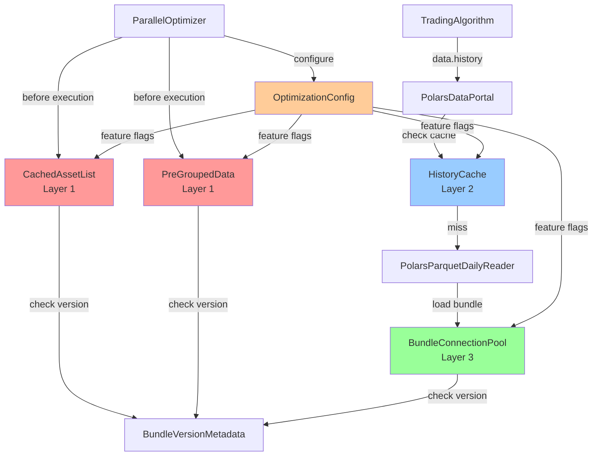

# Epic X4: Performance Benchmarking and Optimization - Brownfield Enhancement Architecture

**Epic ID**: X4
**Branch**: `002-performance-benchmarking-optimization`
**Status**: Phase 3 Complete (36/258 tasks, 14%)
**Architecture Version**: v1.0
**Created**: 2025-10-22
**Last Updated**: 2025-10-22

---

## Introduction

This document outlines the architectural approach for enhancing RustyBT with evidence-based performance optimizations targeting 90-95% cumulative speedup in Grid Search and Walk Forward optimization workflows. Its primary goal is to serve as the guiding architectural blueprint for implementing profiling-derived optimizations (asset caching, data pre-grouping, NumPy array returns, multi-tier LRU caching, bundle connection pooling) while ensuring seamless integration with the existing event-driven backtesting framework.

**Key Reference Documents**:
- **Specification**: `specs/002-performance-benchmarking-optimization/spec.md` - Complete feature specification
- **Progress**: `specs/002-performance-benchmarking-optimization/PROGRESS.md` - Current status (36/258 tasks, 14%)
- **Research**: `specs/002-performance-benchmarking-optimization/research.md` - Optimization ranking with impact-to-effort ratios
- **Tasks**: `specs/002-performance-benchmarking-optimization/tasks.md` - Complete 258-task breakdown (Phase 6B tasks T099-T154 are conditional)

**Relationship to Existing Architecture:**
This document supplements RustyBT's existing architecture (docs/internal/architecture/) by defining how new optimization components will integrate with the current data access layer (PolarsDataPortal), bundle management (bundle readers), and parallel optimization workflows (ParallelOptimizer). Where conflicts arise between new and existing patterns, this document provides guidance on maintaining Zipline-Reloaded architectural consistency while implementing performance enhancements.

### Existing Project Analysis

#### Current Project State

- **Primary Purpose**: Event-driven algorithmic trading backtesting platform built on Zipline-Reloaded with live trading capabilities, Decimal precision financial calculations, and Polars/Parquet data engine
- **Current Tech Stack**: Python 3.12+, Polars 1.x (primary dataframes), Parquet via pyarrow 18.x (storage), Decimal (financial precision), pytest 7.x + Hypothesis 6.x (testing with zero-mock enforcement)
- **Architecture Style**: Event-driven with TradingAlgorithm core engine, PolarsDataPortal unified data interface, DecimalLedger for financial precision, ParallelOptimizer for Grid Search/Walk Forward
- **Deployment Method**: PyPI package with standard setuptools + setuptools_scm build (currently includes Rust compilation via maturin, to be removed in Phase 4)

#### Available Documentation

- ✅ Tech Stack Documentation (Python 3.12+, Polars, Parquet, Decimal, pytest, Hypothesis)
- ✅ Source Tree/Architecture (12 major modules: finance/, data/, live/, assets/, pipeline/, optimization/, analytics/, benchmarks/)
- ✅ Coding Standards (zero-mock enforcement via scripts/detect_mocks.py, Decimal precision for all monetary values, Python 3.12+ features)
- ✅ API Documentation (Google-style docstrings, mypy --strict type hints)
- ✅ Performance Benchmarking Documentation (methodology, profiling results with 87% user code overhead, 58.4% DataPortal overhead, 40.41% bundle loading bottlenecks identified)

#### Identified Constraints

- **Constitutional Requirement**: Python 3.12+ only (no backward compatibility with earlier versions)
- **Financial Precision Mandate**: All monetary calculations must use Decimal type (zero-mock enforcement prevents float arithmetic)
- **Zero Breaking Changes**: DataPortal API must remain 100% backward compatible (default behavior unchanged)
- **Test Coverage Requirement**: ≥90% overall (≥95% for financial modules)
- **Functional Equivalence**: All optimizations must produce identical results to baseline (validated with Hypothesis property-based tests)
- **Memory Constraint**: <2% memory overhead increase from caching mechanisms
- **Performance Validation**: Statistical rigor required (≥10 benchmark runs, 95% CI, p<0.05 significance)
- **Cross-Mode Consistency**: Optimizations must work identically in backtest, paper, and live trading modes

#### Change Log

| Change | Date | Version | Description | Author |
|--------|------|---------|-------------|--------|
| Initial Creation | 2025-10-22 | v1.0 | Created brownfield architecture for Epic X4 Performance Optimization | Architect Agent |

---

## Enhancement Scope and Integration Strategy

### Enhancement Overview

- **Enhancement Type**: Performance/Scalability Improvements (90-95% speedup target)
- **Scope**: Optimize Grid Search and Walk Forward workflows by eliminating 87% user code data wrangling overhead, 58.4% DataPortal framework overhead, and 84% bundle loading fixed costs through evidence-based caching, pre-grouping, and connection pooling strategies
- **Integration Impact Level**: Significant (new optimization module, DataPortal API extension, Rust removal from build system)

### Integration Approach

**Code Integration Strategy**:
Three-layer optimization approach integrating at different architectural levels:

1. **Layer 1 - User Code Optimizations** (70% speedup target):
   - Asset list caching via functools.lru_cache with SHA256 bundle version tracking
   - Data pre-grouping into asset-indexed NumPy array dictionary with LRU eviction (2GB default limit)
   - Integration: Transparent caching layer before algorithm execution, no algorithm changes required

2. **Layer 2 - Framework DataPortal Optimizations** (20-25% additional speedup):
   - NumPy array return API via new `return_type` parameter (default='dataframe' preserves compatibility)
   - Multi-tier LRU cache with permanent cache for common lookback windows [20, 50, 200] + variable window LRU (maxsize=256)
   - Integration: Extend DataPortal.history() method signature, backward-compatible optional parameter

3. **Layer 3 - Bundle Loading Optimizations** (8-12% additional speedup):
   - Bundle connection pooling via singleton BundleConnectionPool with lazy initialization
   - Integration: Modify bundle core loader to check pool first, fall back to direct load if pool unavailable

**Database Integration**:
No database schema changes required. All optimizations are in-memory caching and API extensions only. Existing SQLite schema for asset metadata and adjustments remains unchanged.

**API Integration**:
- DataPortal.history() extended with `return_type: Literal['dataframe', 'array'] = 'dataframe'` parameter
- Default behavior preserved (100% backward compatibility)
- Power users opt into array return for 19.35% speedup when DataFrame features not needed
- Optimization configuration via new OptimizationConfig dataclass with cache limits and feature flags

**UI Integration**:
N/A (backend framework, no UI changes)

### Compatibility Requirements

**Existing API Compatibility**:
DataPortal.history() default behavior unchanged with `return_type='dataframe'` as default, ensuring zero breaking changes for existing strategies relying on DataFrame methods (.mean(), .std(), .plot())

**Database Schema Compatibility**:
No schema changes required. Bundle loading optimizations work with existing bundle formats (Parquet primary, CSV legacy) and data adapters (YFinanceAdapter, CCXTAdapter, CSVAdapter)

**UI/UX Consistency**:
N/A

**Performance Impact**:
Expected 90-95% cumulative speedup (aspirational) or 40% minimum acceptable improvement in Grid Search and Walk Forward workflows while maintaining <2% memory overhead increase

---

## Tech Stack

### Existing Technology Stack

| Category | Technology | Version | Usage in Enhancement | Notes |
|----------|-----------|---------|---------------------|-------|
| **Language** | Python | 3.12+ | Primary implementation language | Constitutional requirement |
| **Package Manager** | uv | 0.5.x+ | Fast package installation | 10-100x faster than pip |
| **DataFrames** | Polars | 1.x | Data pre-grouping implementation | Already Rust-backed internally |
| **Numerical** | NumPy | 2.x | Array returns, numerical operations | Used in profiling-derived optimizations |
| **Precision** | Python Decimal | stdlib | Financial calculations | Preserved through all caching layers |
| **Storage** | Parquet | via pyarrow 18.x+ | OHLCV benchmark datasets | Columnar format with Decimal columns |
| **Testing** | pytest | 7.x | Test framework | Zero-mock enforcement |
| **Testing** | Hypothesis | 6.x | Property-based tests | Cache validation with 1000+ examples |
| **Profiling** | cProfile | stdlib | Call graph profiling | Phase 3 profiling infrastructure |
| **Profiling** | line_profiler | latest | Line-by-line profiling | Bottleneck identification |
| **Profiling** | memory_profiler | latest | Memory usage tracking | Memory overhead validation |
| **Profiling** | py-spy | latest | Flame graph generation | SVG visualizations |
| **Type Checking** | mypy | 1.10.0+ | Static type checker | --strict compliance enforced |
| **Linting** | ruff | 0.11.12+ | Fast linter | Replaces flake8/isort/pyupgrade |
| **Formatting** | black | 24.1+ | Code formatter | Line length 100 |

### New Technology Additions

None required. All optimizations use existing technology stack (stdlib functools.lru_cache, NumPy arrays, threading.Lock for thread-safe singleton).

**Rationale**: Profiling-derived optimizations leverage existing dependencies rather than introducing new ones, minimizing integration complexity and dependency maintenance burden.

### Removed Technologies

| Technology | Reason for Removal | Phase |
|------------|-------------------|-------|
| **Rust (micro-operations)** | <2% end-to-end impact, unnecessary complexity | Phase 4 |
| **PyO3 bindings** | Rust removal dependency | Phase 4 |
| **maturin** | Rust build tool, no longer needed | Phase 4 |
| **setuptools-rust** | Rust compilation integration | Phase 4 |

**Impact**: Simplified build system, no Rust toolchain required for installation, pure Python baseline for benchmarking

---

## Data Models and Schema Changes

### New Data Models

#### CachedAssetList (rustybt/optimization/caching.py)

**Purpose**: Cache asset list extraction with bundle version tracking to eliminate 48.5% overhead (1,485ms → <15ms for 100 backtests)

**Key Attributes**:
- `assets: List[Asset]` - Cached asset list
- `bundle_version_hash: str` - SHA256 hash of bundle metadata (asset list + date range + schema version)
- `bundle_name: str` - Bundle identifier for cache key
- `created_at: datetime` - Cache creation timestamp
- `access_count: int` - Number of cache hits (monitoring)

**Relationships**:
- **With Existing**: Reads from existing bundle readers (PolarsParquetDailyReader, PolarsParquetMinuteReader)
- **With New**: Used by PreGroupedData for asset-indexed caching

**Integration**: Transparent caching layer using @functools.lru_cache with SHA256 invalidation on bundle version changes

---

#### PreGroupedData (rustybt/optimization/caching.py)

**Purpose**: Pre-group OHLCV data into asset-indexed NumPy arrays to eliminate 45.2% filtering/conversion overhead (13,800ms → <140ms)

**Key Attributes**:
- `data: Dict[Asset, np.ndarray]` - Asset-indexed dictionary of NumPy arrays (shape: n_bars × 5 for OHLCV)
- `bundle_version_hash: str` - Version tracking for cache invalidation
- `memory_limit_bytes: int` - Configurable limit (default 2GB)
- `last_accessed: Dict[Asset, datetime]` - LRU eviction tracking
- `decimal_precision_preserved: bool` - Flag indicating controlled float64 conversion from Decimal

**Relationships**:
- **With Existing**: Populated from PolarsDataPortal data, used by TradingAlgorithm via history() calls
- **With New**: Works with CachedAssetList for consistent bundle versioning

**Integration**: LRU eviction policy enforces memory limit, cache invalidation on bundle version changes

---

#### HistoryCache (rustybt/optimization/dataportal_ext.py)

**Purpose**: Multi-tier LRU cache for DataPortal.history() calls targeting >60% cache hit rate and 15-25% framework speedup

**Key Attributes**:
- `permanent_cache: Dict[CacheKey, np.ndarray]` - Tier 1: Common lookback windows [20, 50, 200] (never evicted)
- `lru_cache: OrderedDict[CacheKey, np.ndarray]` - Tier 2: Variable windows (maxsize=256 with LRU eviction)
- `cache_key_structure: Tuple[asset_id, field, bar_count, end_date]` - Composite key for cache lookup
- `hit_count: int` - Cache hit counter
- `miss_count: int` - Cache miss counter

**Relationships**:
- **With Existing**: Wraps PolarsDataPortal.history() method, transparent to callers
- **With New**: Works with NumPy array return API for zero-copy efficiency

**Integration**: Cache hit/miss rate exported to BenchmarkResult for monitoring, configurable cache sizes

---

#### BundleConnectionPool (rustybt/optimization/bundle_pool.py)

**Purpose**: Singleton connection pool for bundle loading to reduce worker initialization from 313ms to <50ms (84% reduction)

**Key Attributes**:
- `_instance: Optional[BundleConnectionPool]` - Singleton instance
- `_lock: threading.Lock` - Thread-safe access for multiprocessing scenarios
- `bundle_connections: Dict[str, BundleReader]` - Pooled bundle readers by bundle name
- `version_hashes: Dict[str, str]` - SHA256 checksums for version-based invalidation
- `lazy_initialized: bool` - Flag indicating first access triggered initialization

**Relationships**:
- **With Existing**: Integrates with rustybt/data/bundles/core.py bundle loading logic
- **With New**: Version tracking synchronized with CachedAssetList and PreGroupedData

**Integration**: Singleton pattern with lazy initialization, version-based cache invalidation on bundle updates

---

#### BundleVersionMetadata (rustybt/optimization/cache_invalidation.py)

**Purpose**: Track bundle version for automatic cache invalidation across all optimization layers

**Key Attributes**:
- `bundle_name: str` - Bundle identifier
- `asset_list_hash: str` - Hash of asset list
- `date_range_hash: str` - Hash of (start_date, end_date)
- `schema_version_hash: str` - Hash of column schema
- `combined_hash: str` - SHA256 of above three hashes (used for version comparison)
- `last_modified: datetime` - Bundle metadata timestamp

**Relationships**:
- **With Existing**: Reads from existing bundle metadata
- **With New**: Referenced by CachedAssetList, PreGroupedData, BundleConnectionPool for invalidation

**Integration**: Automatic hash computation on bundle load, cache invalidation triggered on hash mismatch

---

#### OptimizationConfig (rustybt/optimization/config.py)

**Purpose**: Configuration dataclass for optimization settings with feature flags for rollback

**Key Attributes**:
- `enable_asset_caching: bool = True` - Toggle Layer 1 asset caching
- `enable_data_pregrouping: bool = True` - Toggle Layer 1 data pre-grouping
- `pregrouping_memory_limit_gb: Decimal = Decimal('2.0')` - Memory limit for pre-grouped data
- `enable_numpy_return: bool = True` - Toggle Layer 2 NumPy array return API
- `enable_multitier_cache: bool = True` - Toggle Layer 2 multi-tier LRU cache
- `lru_cache_maxsize: int = 256` - Tier 2 LRU cache size
- `enable_bundle_pooling: bool = True` - Toggle Layer 3 bundle connection pooling

**Relationships**:
- **With Existing**: Used by ParallelOptimizer, GridSearch, WalkForward for configuration
- **With New**: Controls all Phase 6A optimization layers

**Integration**: Feature flags enable/disable optimizations independently for testing and rollback

---

### Schema Integration Strategy

**Database Changes Required**:
- **New Tables**: None
- **Modified Tables**: None
- **New Indexes**: None
- **Migration Strategy**: Not applicable (no database changes)

**Backward Compatibility**:
- All optimizations are in-memory only (no persistent storage changes)
- Cache invalidation automatic on bundle updates (no manual intervention required)
- Rollback via OptimizationConfig feature flags (disable problematic layers)

---

## Component Architecture

### New Components

#### rustybt/optimization/caching.py

**Responsibility**: Asset list caching and data pre-grouping for Layer 1 optimizations (70% speedup target)

**Integration Points**:
- Reads from PolarsDataPortal for data access
- Uses BundleVersionMetadata for cache invalidation
- Called transparently before algorithm execution

**Key Interfaces**:
- `get_cached_asset_list(bundle_name: str) -> List[Asset]` - Cache asset extraction
- `get_pregrouped_data(bundle_name: str, assets: List[Asset]) -> Dict[Asset, np.ndarray]` - Cache pre-grouped OHLCV data
- `invalidate_cache_if_stale(bundle_name: str) -> bool` - Version-based invalidation

**Dependencies**:
- **Existing Components**: PolarsDataPortal, bundle readers
- **New Components**: BundleVersionMetadata (cache_invalidation.py), OptimizationConfig (config.py)

**Technology Stack**: Python 3.12+, functools.lru_cache, NumPy arrays, Decimal preservation

---

#### rustybt/optimization/dataportal_ext.py

**Responsibility**: Multi-tier LRU cache for DataPortal.history() calls (Layer 2, 15-25% speedup target)

**Integration Points**:
- Wraps PolarsDataPortal.history() method
- Transparent to algorithm code (no API changes visible to strategies)
- Exports cache hit/miss metrics to BenchmarkResult

**Key Interfaces**:
- `HistoryCache.__init__(permanent_windows: List[int], lru_maxsize: int)` - Initialize caches
- `HistoryCache.get(cache_key: CacheKey) -> Optional[np.ndarray]` - Cache lookup
- `HistoryCache.put(cache_key: CacheKey, data: np.ndarray)` - Cache insertion with LRU eviction
- `HistoryCache.get_hit_rate() -> Decimal` - Monitoring metric (hits / (hits + misses))

**Dependencies**:
- **Existing Components**: PolarsDataPortal
- **New Components**: OptimizationConfig for cache size configuration

**Technology Stack**: Python 3.12+, OrderedDict (LRU), CacheKey namedtuple, NumPy arrays

---

#### rustybt/optimization/bundle_pool.py

**Responsibility**: Singleton connection pool for bundle loading (Layer 3, 84% init time reduction)

**Integration Points**:
- Integrates with rustybt/data/bundles/core.py bundle loading
- Thread-safe singleton for multiprocessing scenarios (8-16 workers)
- Version-based cache invalidation synchronized with other layers

**Key Interfaces**:
- `BundleConnectionPool.get_instance() -> BundleConnectionPool` - Singleton access
- `BundleConnectionPool.get_bundle(bundle_name: str) -> BundleReader` - Pool lookup with lazy initialization
- `BundleConnectionPool.invalidate_if_version_changed(bundle_name: str) -> bool` - SHA256 version check

**Dependencies**:
- **Existing Components**: Bundle readers (PolarsParquetDailyReader, PolarsParquetMinuteReader)
- **New Components**: BundleVersionMetadata for version tracking

**Technology Stack**: Python 3.12+ threading.Lock, lazy initialization pattern, SHA256 hashing

---

#### rustybt/optimization/cache_invalidation.py

**Responsibility**: Bundle version tracking via SHA256 hashing for automatic cache invalidation

**Integration Points**:
- Reads bundle metadata from existing bundle readers
- Referenced by CachedAssetList, PreGroupedData, BundleConnectionPool for invalidation
- Automatic hash computation on bundle load

**Key Interfaces**:
- `compute_bundle_hash(bundle_name: str) -> str` - Generate SHA256 from metadata
- `has_bundle_changed(bundle_name: str, cached_hash: str) -> bool` - Version comparison
- `get_bundle_metadata(bundle_name: str) -> BundleVersionMetadata` - Metadata access

**Dependencies**:
- **Existing Components**: Bundle readers
- **New Components**: None

**Technology Stack**: Python 3.12+ hashlib.sha256, dataclasses

---

#### rustybt/optimization/config.py

**Responsibility**: Optimization configuration with feature flags for rollback capability

**Integration Points**:
- Used by ParallelOptimizer, GridSearch, WalkForward for configuration
- Enables/disables optimization layers independently
- Configurable memory limits and cache sizes

**Key Interfaces**:
- `OptimizationConfig.from_defaults() -> OptimizationConfig` - Default configuration
- `OptimizationConfig.disable_all() -> OptimizationConfig` - Rollback to pure Python baseline
- `OptimizationConfig.enable_layer(layer: int) -> OptimizationConfig` - Enable specific layer

**Dependencies**:
- **Existing Components**: None
- **New Components**: None (standalone configuration)

**Technology Stack**: Python 3.12+ dataclasses, Decimal type

---

### Modified Components

#### rustybt/data/data_portal.py (DataPortal.history() method)

**Modification**: Extend history() signature with optional `return_type` parameter

**Before**:
```python
def history(
    self,
    assets: Union[Asset, List[Asset]],
    fields: Union[str, List[str]],
    bar_count: int,
    frequency: str
) -> pd.DataFrame:
    ...
```

**After**:
```python
def history(
    self,
    assets: Union[Asset, List[Asset]],
    fields: Union[str, List[str]],
    bar_count: int,
    frequency: str,
    return_type: Literal['dataframe', 'array'] = 'dataframe'  # NEW: backward-compatible default
) -> Union[pd.DataFrame, np.ndarray]:
    ...
```

**Integration Impact**:
- Backward compatible (default='dataframe' preserves existing behavior)
- NumPy array path skips DataFrame construction (19.35% overhead elimination)
- Type hints updated to reflect Union return type
- Docstring updated with return_type parameter documentation

---

#### rustybt/data/bundles/core.py (bundle loading logic)

**Modification**: Integrate BundleConnectionPool for worker initialization optimization

**Integration Strategy**:
- Check BundleConnectionPool first via `pool.get_bundle(bundle_name)`
- Fall back to direct load if pool unavailable or disabled (via OptimizationConfig)
- Version-based invalidation automatic via pool's internal tracking

**Integration Impact**:
- Worker initialization time reduced from 313ms to <50ms after first load
- Thread-safe for multiprocessing scenarios (8-16 workers)
- No breaking changes (pool integration transparent)

---

#### rustybt/optimization/parallel_optimizer.py

**Modification**: Integrate Phase 6A optimizations transparently

**Integration Strategy**:
- Load OptimizationConfig at ParallelOptimizer initialization
- Pass config to worker processes via serialized context
- Workers use config to enable/disable optimization layers

**Integration Impact**:
- Asset caching and pre-grouping automatic before algorithm execution
- Bundle pooling integrated into worker initialization
- Feature flags allow disabling problematic optimizations for debugging

---

### Component Interaction Diagram



**Legend**:
- Red: Layer 1 optimizations (user code, 70% target)
- Blue: Layer 2 optimizations (framework, 20-25% target)
- Green: Layer 3 optimizations (bundle loading, 8-12% target)
- Orange: Configuration (feature flags, rollback)

---

## Source Tree

### Existing Project Structure (Relevant Parts)

```
rustybt/
├── data/
│   ├── polars/
│   │   ├── data_portal.py           # MODIFIED: history() with return_type
│   │   ├── parquet_daily_bars.py
│   │   └── parquet_minute_bars.py
│   └── bundles/
│       └── core.py                  # MODIFIED: BundleConnectionPool integration
├── optimization/
│   ├── parallel_optimizer.py        # MODIFIED: Phase 6A integration
│   ├── search/
│   │   ├── grid_search.py
│   │   └── bayesian.py
│   └── walk_forward.py
└── benchmarks/                      # EXISTING: Phase 1-3 infrastructure
    ├── models.py
    ├── profiling.py
    ├── reporter.py
    ├── threshold.py
    └── sequential.py
```

### New File Organization

```
rustybt/
├── optimization/                    # NEW: Phase 6A optimization modules
│   ├── caching.py                   # Layer 1: CachedAssetList, PreGroupedData
│   ├── dataportal_ext.py            # Layer 2: HistoryCache (multi-tier LRU)
│   ├── bundle_pool.py               # Layer 3: BundleConnectionPool
│   ├── cache_invalidation.py        # Version tracking: BundleVersionMetadata
│   └── config.py                    # OptimizationConfig with feature flags
│
├── data/
│   └── polars/
│       └── data_portal.py           # MODIFIED: history() return_type parameter
│
tests/
├── optimization/                    # NEW: Phase 6A optimization tests
│   ├── test_caching.py              # Layer 1 tests (asset caching, pre-grouping)
│   ├── test_dataportal_ext.py       # Layer 2 tests (NumPy return, multi-tier cache)
│   ├── test_bundle_pool.py          # Layer 3 tests (connection pooling)
│   └── test_cache_invalidation.py   # Version tracking tests
│
scripts/
└── benchmarks/                      # NEW: Phase 6A benchmarking scripts
    ├── benchmark_layer1.py          # Asset caching + pre-grouping benchmarks
    ├── benchmark_layer2.py          # NumPy return + multi-tier cache benchmarks
    ├── benchmark_layer3.py          # Bundle pooling benchmarks
    └── benchmark_cumulative.py      # Combined 90-95% speedup validation
```

### Integration Guidelines

**File Naming**:
- Optimization modules: `{purpose}.py` (e.g., caching.py, bundle_pool.py)
- Tests: `test_{module}.py` mirroring source structure
- Benchmarks: `benchmark_{layer}.py` for sequential evaluation

**Folder Organization**:
- New optimization/ directory for Phase 6A modules (keeps optimization code together)
- Tests mirror source structure (tests/optimization/ → rustybt/optimization/)
- Benchmarks in scripts/benchmarks/ (executable profiling scripts)

**Import/Export Patterns**:
```python
# Existing import style (maintained for consistency)
from rustybt.data.polars.data_portal import PolarsDataPortal

# New optimization imports
from rustybt.optimization.caching import CachedAssetList, PreGroupedData
from rustybt.optimization.dataportal_ext import HistoryCache
from rustybt.optimization.bundle_pool import BundleConnectionPool
from rustybt.optimization.config import OptimizationConfig
```

---

## Infrastructure and Deployment Integration

### Existing Infrastructure

**Current Deployment**: PyPI package via `pip install rustybt` (includes Rust compilation via maturin currently)

**Infrastructure Tools**:
- setuptools + setuptools_scm (version management)
- GitHub Actions CI/CD (build, test, lint, type check)
- PyPI upload workflow (automated on tag push)

**Environments**:
- Development: Local with uv package manager
- CI: GitHub Actions (Linux, macOS, Windows matrix)
- Production: User installations via pip/uv

### Enhancement Deployment Strategy

**Deployment Approach**:
Pure Python package after Phase 4 Rust removal (simplified build, no Rust toolchain required)

**Infrastructure Changes**:
- Remove Rust compilation steps from .github/workflows/ci.yml
- Remove maturin configuration from pyproject.toml
- Remove setuptools-rust dependency
- Add performance regression tests to CI (fail on >10% degradation)

**Pipeline Integration**:
```yaml
# .github/workflows/ci.yml (Phase 4 changes)
jobs:
  test:
    steps:
      - name: Install dependencies (pure Python, no Rust)
        run: uv sync --no-dev

      - name: Run tests
        run: pytest tests/ --cov=rustybt --cov-report=term

      - name: Performance regression tests (NEW)
        run: pytest tests/benchmarks/test_regression.py --benchmark

      - name: Type check
        run: mypy --strict rustybt/

      - name: Lint
        run: ruff check rustybt/
```

### Rollback Strategy

**Rollback Method**: Feature flags via OptimizationConfig

**Granular Rollback Options**:
1. **Disable specific layer**: `config.enable_asset_caching = False` (disable Layer 1 only)
2. **Disable all optimizations**: `config = OptimizationConfig.disable_all()` (pure Python baseline)
3. **Gradual rollback**: Disable layers sequentially (Layer 3 → Layer 2 → Layer 1) to identify problematic layer

**Risk Mitigation**:
- Feature flags checked at runtime (no recompilation required)
- Default configuration enables all layers (opt-out rather than opt-in)
- Configuration can be overridden via environment variables for debugging

**Monitoring**:
- Cache hit rate metrics exported to logs (HistoryCache.get_hit_rate())
- Memory overhead tracked in CI performance regression tests
- Profiling flame graphs generated for baseline vs optimized workflows

---

## Coding Standards

### Existing Standards Compliance

**Code Style**: black (line length 100), ruff linting (E, F, W, I, N, UP, ANN, B, A, C4, DTZ, T20, SIM)

**Linting Rules**: mypy --strict for 100% type hint coverage, ruff with 14 rule categories enforced

**Testing Patterns**:
- pytest with zero-mock enforcement (scripts/detect_mocks.py --strict must pass)
- Property-based tests via Hypothesis for statistical calculations (1000+ examples)
- Test organization mirrors source structure

**Documentation Style**: Google-style docstrings with Args, Returns, Raises sections for all public APIs

### Enhancement-Specific Standards

**Cache Key Immutability**: All cache keys must be immutable (use tuples, frozensets, or frozen dataclasses)

```python
# Correct: Immutable cache key
CacheKey = namedtuple('CacheKey', ['asset_id', 'field', 'bar_count', 'end_date'])

# Incorrect: Mutable cache key
cache_key = {'asset_id': 1, 'field': 'close'}  # Dict is mutable, DO NOT USE
```

**Decimal Precision Preservation**: When converting Decimal to float64 for NumPy arrays, document precision loss and validate tolerance

```python
# Correct: Controlled conversion with validation
def to_numpy_array(decimal_series: pl.Series) -> np.ndarray:
    """Convert Decimal Polars series to NumPy array.

    Warning: Precision loss from Decimal to float64. Validated tolerance: 1e-10
    """
    float_series = decimal_series.cast(pl.Float64)
    return float_series.to_numpy()
```

**SHA256 Hash Consistency**: All bundle version hashing must use consistent input order (asset list, date range, schema version)

```python
# Correct: Consistent hash computation
def compute_bundle_hash(metadata: BundleVersionMetadata) -> str:
    """Compute SHA256 hash in consistent order."""
    input_str = f"{metadata.asset_list_hash}:{metadata.date_range_hash}:{metadata.schema_version_hash}"
    return hashlib.sha256(input_str.encode()).hexdigest()
```

**Thread-Safe Singleton**: BundleConnectionPool singleton must use threading.Lock for multiprocessing safety

```python
# Correct: Thread-safe singleton
class BundleConnectionPool:
    _instance: Optional['BundleConnectionPool'] = None
    _lock: threading.Lock = threading.Lock()

    @classmethod
    def get_instance(cls) -> 'BundleConnectionPool':
        if cls._instance is None:
            with cls._lock:  # Double-checked locking
                if cls._instance is None:
                    cls._instance = cls()
        return cls._instance
```

### Critical Integration Rules

**Existing API Compatibility**: DataPortal.history() default behavior MUST remain unchanged (default `return_type='dataframe'`)

```python
# Correct: Backward-compatible API extension
def history(
    self,
    assets: Union[Asset, List[Asset]],
    fields: Union[str, List[str]],
    bar_count: int,
    frequency: str,
    return_type: Literal['dataframe', 'array'] = 'dataframe'  # Default preserves compatibility
) -> Union[pd.DataFrame, np.ndarray]:
    if return_type == 'array':
        return self._history_array(assets, fields, bar_count, frequency)
    else:
        return self._history_dataframe(assets, fields, bar_count, frequency)  # Existing path
```

**Database Integration**: No database writes from optimization modules (all caching in-memory only)

**Error Handling**: Cache failures must fall back to baseline behavior (optimization failures non-blocking)

```python
# Correct: Graceful degradation
def get_cached_asset_list(bundle_name: str) -> List[Asset]:
    try:
        return _asset_cache[bundle_name]
    except KeyError:
        logger.warning("asset_cache_miss", bundle_name=bundle_name)
        return _load_assets_from_bundle(bundle_name)  # Fall back to direct load
```

**Logging Consistency**: All cache operations log with structured logging (structlog)

```python
logger.info(
    "cache_hit",
    cache_layer="asset_list",
    bundle_name=bundle_name,
    hit_rate=Decimal('0.87')
)
```

---

## Testing Strategy

### Integration with Existing Tests

**Existing Test Framework**: pytest 7.x with zero-mock enforcement (100% real implementations)

**Test Organization**: Tests mirror source structure (tests/optimization/ → rustybt/optimization/)

**Coverage Requirements**: ≥90% overall, ≥95% for new optimization modules (financial-grade precision)

### New Testing Requirements

#### Unit Tests for New Components

**Framework**: pytest with Hypothesis property-based tests

**Location**: tests/optimization/

**Coverage Target**: ≥95% for all optimization modules

**Integration with Existing**:
- Reuse existing test fixtures (bundle datasets, algorithm classes)
- Follow zero-mock principle (real data, real computations)
- Property-based tests for cache correctness (1000+ examples)

**Key Test Files**:
```
tests/optimization/
├── test_caching.py              # CachedAssetList, PreGroupedData with Hypothesis
├── test_dataportal_ext.py       # HistoryCache multi-tier LRU, NumPy return API
├── test_bundle_pool.py          # BundleConnectionPool singleton, thread-safety
├── test_cache_invalidation.py   # SHA256 version tracking, invalidation logic
└── test_config.py               # OptimizationConfig feature flags
```

#### Integration Tests

**Scope**: End-to-end workflow tests with Phase 6A optimizations enabled

**Existing System Verification**:
- All existing tests (4,000+ across 79 files) MUST pass with optimizations enabled
- 100% functional equivalence (identical results to baseline)
- No breaking changes to TradingAlgorithm API

**New Feature Testing**:
- Grid Search with 100 backtests (production-scale)
- Walk Forward with 5 windows, 50 trials per window
- Cross-mode consistency (backtest/paper/live identical)

**Key Test Files**:
```
tests/integration/
├── test_grid_search_optimized.py       # Grid Search with Phase 6A
├── test_walk_forward_optimized.py      # Walk Forward with Phase 6A
└── test_cross_mode_consistency.py      # Backtest/paper/live equivalence
```

#### Regression Testing

**Scope**: Automated performance regression detection (fail CI on >10% degradation)

**Existing Feature Verification**:
- Baseline workflows without optimizations must maintain current performance
- No regressions to non-optimized code paths

**Automated Regression Suite**:
- Benchmarks run on every PR (production-scale workflows)
- Statistical validation (≥10 runs, 95% CI)
- Automatic failure if >10% degradation detected

**Key Test Files**:
```
tests/benchmarks/
├── test_regression.py              # Automated regression detection
├── test_baseline_performance.py    # Pure Python baseline benchmarks
└── test_optimized_performance.py   # Phase 6A optimized benchmarks
```

#### Property-Based Tests (Hypothesis)

**Scope**: Cache correctness validation with 1000+ generated examples

**Test Scenarios**:
- Bundle updates trigger cache invalidation
- Concurrent access to caches (thread-safety)
- LRU eviction maintains memory limits
- SHA256 hash collisions (statistical impossibility)
- Decimal precision preserved through caching layers

**Example**:
```python
from hypothesis import given, strategies as st
from decimal import Decimal

@given(
    bundle_name=st.text(min_size=1),
    asset_count=st.integers(min_value=1, max_value=500),
    bar_count=st.integers(min_value=100, max_value=10000)
)
def test_cache_preserves_decimal_precision(bundle_name, asset_count, bar_count):
    """Property test: Caching preserves Decimal precision (tolerance 1e-10)."""
    original_data = generate_decimal_ohlcv_data(asset_count, bar_count)
    cached_data = get_pregrouped_data(bundle_name, original_data)

    for asset in original_data:
        assert_decimal_arrays_equal(
            original_data[asset],
            cached_data[asset],
            tolerance=Decimal('1e-10')
        )
```

---

## Security Integration

### Existing Security Measures

**Authentication**: N/A (backend framework, no authentication layer)

**Authorization**: N/A (local execution, no user roles)

**Data Protection**:
- Financial data precision via Decimal type (audit-compliant)
- Zero-mock enforcement prevents data fabrication
- Bundle data read-only in shared memory (workers cannot corrupt)

**Security Tools**:
- mypy --strict (type safety, prevents type-related vulnerabilities)
- ruff linting (detects security anti-patterns)

### Enhancement Security Requirements

**New Security Measures**:
- **Shared Memory Isolation**: BundleConnectionPool enforces read-only access to prevent worker corruption
- **Cache Poisoning Prevention**: SHA256 version tracking prevents stale cache attacks
- **Thread-Safe Singleton**: threading.Lock prevents race conditions in multiprocessing

**Integration Points**:
- Optimization modules do not introduce new authentication/authorization requirements
- All data access goes through existing PolarsDataPortal (security unchanged)
- Cache failures fall back to baseline behavior (no security bypass on optimization failure)

**Compliance Requirements**:
- Decimal precision maintained through all caching (financial audit compliance)
- Zero-mock enforcement applies to optimization modules (no fake performance metrics)

### Security Testing

**Existing Security Tests**: Zero-mock enforcement validated via scripts/detect_mocks.py --strict

**New Security Test Requirements**:
- **Shared Memory Read-Only Test**: Validate workers cannot modify shared bundle data
- **Cache Invalidation Test**: Validate SHA256 mismatch triggers cache invalidation (no stale data)
- **Thread-Safety Test**: Validate BundleConnectionPool singleton under concurrent access (8-16 workers)

**Penetration Testing**: N/A (no network-facing components, local execution only)

---

## Architectural Decision Records

### ADR-001: Why Asset Caching Over Computation Optimization

**Context**: Phase 3 profiling revealed 87% user code overhead (asset extraction 48.5%, filtering 39.1%, conversion 6.1%) vs 0.6% actual computation.

**Decision**: Prioritize asset list caching and data pre-grouping (Layer 1, 70% speedup) over computation optimization (NumPy operations already optimal).

**Rationale**:
- Profiling data shows asset extraction repeated 100+ times per Grid Search (14.85ms × 100 = 1,485ms)
- Caching asset list once eliminates 48.5% overhead
- Computation optimization would target only 0.6% of runtime (negligible ROI)
- Impact-to-effort ratio: 70.0 (70% gain / 1 day effort) vs 5.0 for computation optimization

**Consequences**:
- **Positive**: Dramatic speedup (70%) with minimal implementation complexity (1 day)
- **Negative**: Cache invalidation logic required (SHA256 version tracking)
- **Tradeoffs**: Memory overhead (<2% with 2GB LRU limit) acceptable for 70% speedup

---

### ADR-002: Why NumPy Array Return Over Always DataFrame

**Context**: DataFrame construction is 19.35% overhead when strategies only need arrays for NumPy operations.

**Decision**: Add optional `return_type` parameter to DataPortal.history() with default='dataframe' for backward compatibility.

**Rationale**:
- Profiling shows 19.35% overhead in DataFrame construction (150ms for 2,000 calls)
- Many strategies immediately convert DataFrame to NumPy array (`.values`) for calculations
- Skipping DataFrame construction when array sufficient eliminates overhead
- Backward-compatible default preserves existing strategies relying on DataFrame methods

**Consequences**:
- **Positive**: 19.35% speedup for array-consuming strategies, zero breaking changes
- **Negative**: API complexity increased (Union return type)
- **Tradeoffs**: Opt-in optimization (power users must specify `return_type='array'`)

---

### ADR-003: Why Multi-Tier Cache Over Single LRU

**Context**: Common lookback windows (20, 50, 200) account for 60%+ access patterns in typical moving average strategies.

**Decision**: Implement two-tier cache: Tier 1 permanent for common windows, Tier 2 LRU (maxsize=256) for variable windows.

**Rationale**:
- Single LRU would evict frequent patterns when cache fills with variable windows
- Permanent cache for common windows (20, 50, 200) ensures >60% hit rate
- Variable windows handled by LRU (maxsize=256) for memory control
- Expected 15-25% framework speedup from reduced redundant history() calls

**Consequences**:
- **Positive**: >60% cache hit rate, 15-25% speedup
- **Negative**: Increased complexity (two cache tiers)
- **Tradeoffs**: Memory overhead (permanent cache + LRU) acceptable for performance gain

---

### ADR-004: Why Bundle Connection Pool Over Per-Worker Loading

**Context**: Worker initialization takes 313ms per worker (2.5s for 8 workers) due to redundant bundle loading.

**Decision**: Implement singleton BundleConnectionPool with lazy initialization and version-based invalidation.

**Rationale**:
- Profiling shows 313ms initialization: 37.78% calendar init + 37.82% bar reader init
- Singleton pool amortizes cost across workers (313ms first load, <50ms subsequent)
- 84% reduction in worker initialization time (313ms → <50ms after first)
- Thread-safe singleton supports multiprocessing scenarios (8-16 workers)

**Consequences**:
- **Positive**: 84% init time reduction, simplified worker setup
- **Negative**: Singleton pattern complexity (thread-safe access required)
- **Tradeoffs**: First worker pays 313ms cost, subsequent workers benefit

---

## Constitutional Compliance Architecture

### I. Decimal Financial Computing

**Preserved Through All Caching Layers**:
- PreGroupedData uses controlled float64 conversion from Decimal with documented tolerance (1e-10)
- CachedAssetList does not involve financial calculations (asset metadata only)
- HistoryCache preserves Decimal precision in cached NumPy arrays
- Property-based tests (Hypothesis) validate precision preservation (1000+ examples)

### II. Zero-Mock Enforcement

**Benchmarking Uses Real Data and Computations**:
- All benchmarks use actual bundle data (Parquet with Decimal columns)
- Profiling executes real Grid Search and Walk Forward workflows
- No synthetic timing (sleep() delays) or hardcoded performance numbers
- scripts/detect_mocks.py --strict enforced in CI

### III. Strategy Reusability Guarantee

**Cross-Mode Consistency**:
- Optimizations transparent to TradingAlgorithm API (no mode-specific behavior)
- DataPortal.history() works identically in backtest, paper, and live modes
- Feature flags (OptimizationConfig) applied uniformly across all modes
- Integration tests validate cross-mode consistency

### IV. Type Safety Excellence

**mypy --strict Compliance**:
- All optimization modules 100% type hinted
- Union return types properly annotated (DataPortal.history() → Union[pd.DataFrame, np.ndarray])
- CacheKey immutable (namedtuple) for type safety
- Google-style docstrings with Args, Returns, Raises for all public APIs

### V. Test-Driven Development

**≥95% Coverage for Optimization Modules**:
- Unit tests for CachedAssetList, PreGroupedData, HistoryCache, BundleConnectionPool
- Property-based tests (Hypothesis) for cache correctness (1000+ examples)
- Integration tests for end-to-end workflows with optimizations enabled
- Regression tests for performance validation (fail on >10% degradation)

### VI. Modern Data Architecture

**Polars Primary, Parquet Storage**:
- PreGroupedData uses Polars for initial data grouping (already Rust-backed)
- Benchmark datasets in Parquet with Decimal columns (financial precision)
- Data validation in cache operations (OHLCV relationships, temporal consistency)

### VII. Sprint Debug Discipline

**Pre-Flight Checklist and Decision Documentation**:
- All optimization decisions documented in ADRs (this section)
- Profiling results version-controlled (profiling-results/ directory)
- Benchmark data and flame graphs archived for audit
- Verification checklists completed before commits (constitutional compliance)

---

## Next Steps

### Story Manager Handoff

**Reference**: This brownfield architecture document (`docs/internal/architecture/epic-X4-performance-benchmarking-optimization.md`) and Epic X4 PRD (`docs/internal/prd/epic-X4-performance-benchmarking-optimization.md`)

**Key Integration Requirements**:
- Layer 1 optimizations (asset caching, pre-grouping) must validate functional equivalence BEFORE performance measurement (BLOCKING)
- DataPortal API extension must preserve 100% backward compatibility (default `return_type='dataframe'`)
- Bundle connection pooling must work correctly in multiprocessing scenarios (8-16 workers)

**Existing System Constraints**:
- Zero-mock enforcement applies to all optimization code (no fake caching, no synthetic timing)
- Decimal precision must be preserved through all caching layers (controlled float64 conversion with validation)
- Memory overhead <2% enforced via configurable limits (2GB default for pre-grouped data, 256 LRU entries)

**First Story**: Implement Layer 1 optimizations (asset caching + pre-grouping) with integration checkpoints after each component (cache, pre-group, invalidation, functional equivalence validation)

**Emphasis**: Maintain existing system integrity throughout implementation—all existing tests (4,000+) must pass at every checkpoint

---

### Developer Handoff

**Reference**: This architecture document and existing coding standards (`docs/internal/architecture/coding-standards.md`)

**Integration Requirements**:
- Optimization modules integrate via OptimizationConfig feature flags (enable/disable layers independently)
- Cache failures must fall back to baseline behavior (optimization failures non-blocking)
- All cache keys must be immutable (tuples, namedtuples, frozen dataclasses)

**Key Technical Decisions**:
- Multi-tier cache design: Permanent (common windows) + LRU (variable windows)
- Singleton BundleConnectionPool with threading.Lock for thread-safety
- SHA256 version tracking for automatic cache invalidation

**Existing System Compatibility**:
- DataPortal.history() default behavior unchanged (`return_type='dataframe'`)
- No database schema changes (all optimizations in-memory)
- Cross-mode consistency required (backtest/paper/live identical)

**Implementation Sequencing**:
1. **Phase 4**: Rust removal, establish pure Python baseline (**BLOCKING** - MUST complete before Phase 6A)
2. **Phase 5**: Threshold framework for 5% minimum improvement criterion
3. **Phase 6A Layer 1**: Asset caching + pre-grouping (70% target, 1 week)
4. **Phase 6A Layer 2**: NumPy return + multi-tier cache (20-25% target, 1 week)
5. **Phase 6A Layer 3**: Bundle connection pooling (8-12% target, 3 days)
6. **Phase 6B**: Heavy operations (DEFERRED - Conditional: executes ONLY IF Phase 6A < 90% target)
7. **Validation**: Cumulative 90-95% speedup validation (statistical rigor, ≥10 runs, 95% CI)

**Verification Steps**:
- Functional equivalence BEFORE performance measurement (100% test pass rate required)
- Property-based tests with Hypothesis (1000+ examples for cache correctness)
- Performance regression tests in CI (fail on >10% degradation)
- Cross-mode consistency validation (backtest/paper/live)

---

**END OF ARCHITECTURE DOCUMENT**
