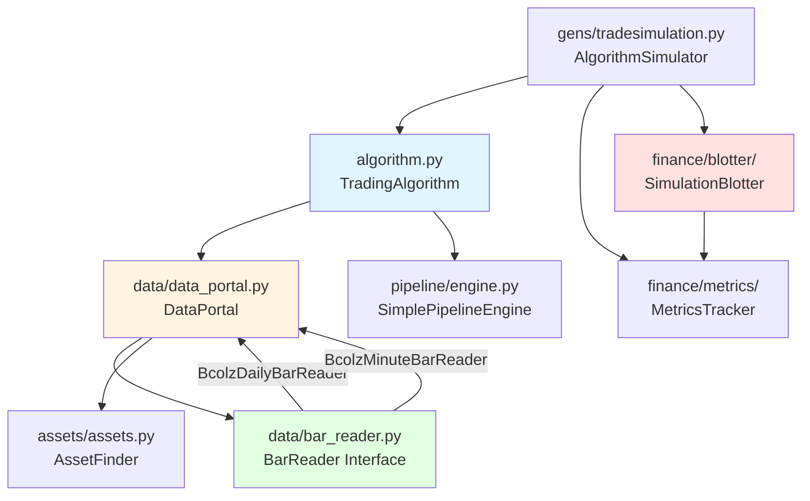
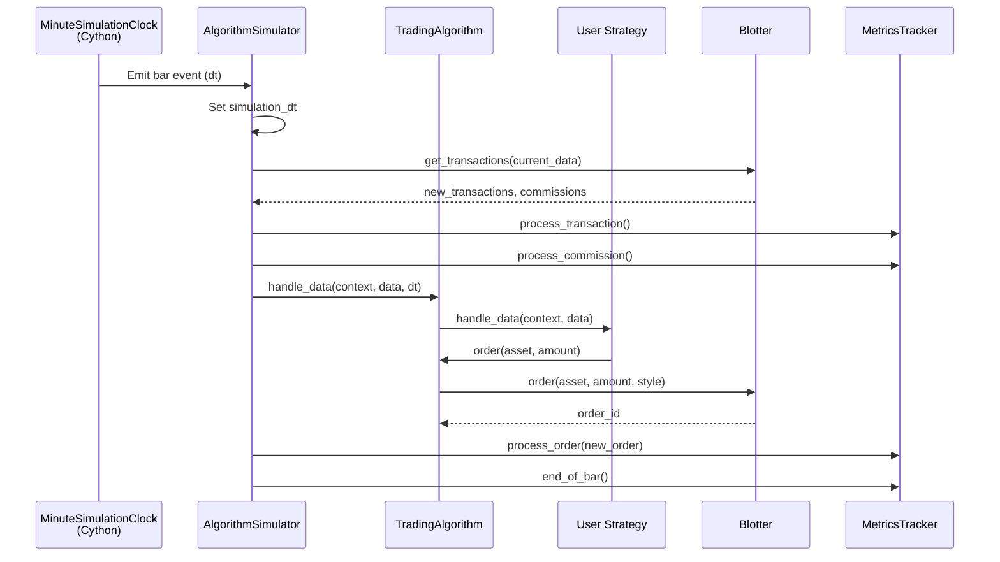
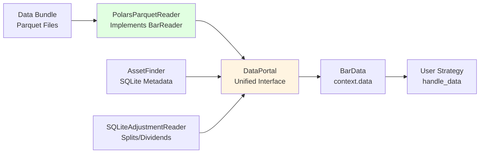

# Zipline-Reloaded Architecture Analysis

## Executive Summary

This document provides a comprehensive analysis of Zipline-Reloaded's architecture, identifying extension points for implementing RustyBT's Tier 1 enhancements. The analysis covers module structure, event-driven architecture, data layer, and safe modification zones.

**Key Findings:**
- **12 major modules** (~54,000 LOC total)
- **Event-driven simulation engine** with temporal isolation
- **BarReader interface** as primary extension point for Polars/Parquet data layer
- **Order execution system** extensible for advanced order types
- **Performance metrics framework** ready for Decimal-based calculations
- **88.26% test coverage baseline** with high-coverage modules safe to extend

---

## 1. Module Structure

### 1.1 Major Modules Overview

| Module | Purpose | File Count | Key Files | LOC Range |
|--------|---------|------------|-----------|-----------|
| **algorithm** | Core algorithm execution engine | ~5 | `algorithm.py` (2,345 LOC) | ~3,000 |
| **finance** | Trading mechanics, order management, portfolio accounting | 21 | `blotter/`, `ledger.py` (795 LOC), `execution.py` (229 LOC) | ~5,500 |
| **data** | Data ingestion, storage, and retrieval | 25 | `data_portal.py`, `bar_reader.py`, `bundles/` | ~8,000 |
| **pipeline** | Factor-based screening and computation framework | 44 | `engine.py`, `factors/`, `filters/`, `classifiers/` | ~12,000 |
| **assets** | Asset metadata management and database | ~10 | `assets.py`, `asset_db_schema.py` | ~4,000 |
| **gens** | Event generators and simulation clock | ~5 | `tradesimulation.py`, `sim_engine.pyx` | ~2,500 |
| **utils** | Shared utilities | ~35 | `events.py`, `calendar_utils.py`, `validation.py` | ~6,000 |
| **lib** | Performance-critical primitives (Cython) | ~16 | Various `.pyx` files for windowing, adjustments | ~3,000 |
| **testing** | Testing fixtures and utilities | ~10 | `core.py` (51KB), `fixtures.py` (81KB) | ~5,000 |
| **finance/metrics** | Performance tracking and metrics | ~8 | `tracker.py` (357 LOC), `metric.py` (601 LOC) | ~2,000 |
| **finance/blotter** | Order execution and transaction management | ~3 | `blotter.py`, `simulation_blotter.py` (443 LOC) | ~700 |
| **sources** | External data sources | ~5 | Various data adapters | ~2,000 |

**Total:** ~54,000 LOC across 11+ major modules

### 1.2 Module Dependency Map



**Key Dependencies:**
- `algorithm.py` depends on: `DataPortal`, `Blotter`, `Pipeline`, `AssetFinder`
- `DataPortal` depends on: `BarReader` implementations, `AssetFinder`, `AdjustmentReader`
- `AlgorithmSimulator` orchestrates: `TradingAlgorithm`, `MetricsTracker`, `Blotter`, simulation clock
- `BarReader` interface has implementations: `BcolzDailyBarReader`, `BcolzMinuteBarReader` (to be replaced)

---

## 2. Event-Driven Architecture

### 2.1 Event Flow Diagram



### 2.2 Event Types

| Event Type | Timing | Handler Method | Purpose |
|------------|--------|----------------|---------|
| **initialize** | Once, before simulation start | `initialize(context)` | Set up strategy state, schedule functions |
| **before_trading_start** | Daily, before market open | `before_trading_start(context, data)` | Pre-market preparation, pipeline queries |
| **handle_data** | Every bar (minute or daily) | `handle_data(context, data)` | Core strategy logic, order placement |
| **SESSION_START** | Daily, at market open | Internal event | Session initialization |
| **SESSION_END** | Daily, at market close | Internal event | Session finalization |
| **MINUTE_END** | Every minute | Internal event | Minute bar finalization |

### 2.3 Event Processing Order

**Per Bar:**
1. Clock emits bar event with timestamp `dt`
2. `AlgorithmSimulator.transform()` receives event
3. Set `simulation_dt = dt`
4. Call `blotter.get_transactions(current_data)` → Process fills from previous bar
5. Update `MetricsTracker` with transactions/commissions
6. Call `algo.handle_data(context, data, dt)` → User strategy logic
7. Collect new orders from `blotter.new_orders`
8. Send new orders to `MetricsTracker`
9. Call `metrics_tracker.end_of_bar()` → Calculate performance metrics

### 2.4 Temporal Isolation Mechanisms

**Lookahead Prevention:**
- `DataPortal.get_spot_value()` checks `dt <= self.current_simulation_time`
- Historical data via `data.history()` only accesses data up to current `dt`
- Orders placed in bar `t` execute in bar `t+1` (realistic fill simulation)

**State Management:**
- `context` object provides read-only portfolio state at current `dt`
- Portfolio updates occur after `handle_data()` completes
- No forward-looking data leakage possible

---

## 3. Data Layer Architecture

### 3.1 DataPortal - Unified Interface

**Location:** [`data/data_portal.py:89`](deps/zipline-reloaded-reference/src/zipline/data/data_portal.py#L89)

**Purpose:** Central interface for all data access in simulations. Abstracts underlying storage (Bcolz, HDF5, etc.) and provides unified API.

**Key Methods:**
- `get_spot_value(asset, field, dt, data_frequency)` → Current bar value
- `get_history_window(assets, end_dt, bar_count, frequency, field)` → Historical window
- `get_last_traded_dt(asset, dt, data_frequency)` → Last valid data timestamp

**Constructor Parameters:**
```python
DataPortal(
    asset_finder,                 # AssetFinder instance
    trading_calendar,             # TradingCalendar
    first_trading_day,            # pd.Timestamp
    equity_daily_reader=None,     # BcolzDailyBarReader
    equity_minute_reader=None,    # BcolzMinuteBarReader
    future_daily_reader=None,     # BcolzDailyBarReader for futures
    future_minute_reader=None,    # BcolzFutureMinuteBarReader
    adjustment_reader=None,       # SQLiteAdjustmentReader
    ...
)
```

### 3.2 BarReader Interface - Extension Point

**Location:** [`data/bar_reader.py:44`](deps/zipline-reloaded-reference/src/zipline/data/bar_reader.py#L44)

**Abstract Base Class:**
```python
class BarReader(ABC):
    @property
    @abstractmethod
    def data_frequency(self):
        """Returns 'daily' or 'minute'"""
        pass

    @abstractmethod
    def load_raw_arrays(self, columns, start_date, end_date, assets):
        """
        Returns list of np.ndarray with shape (time, sids) for OHLCV data.
        """
        pass

    @property
    @abstractmethod
    def last_available_dt(self):
        """Last session/minute with data"""
        pass

    @property
    @abstractmethod
    def first_trading_day(self):
        """First session/minute with data"""
        pass
```

**Current Implementations:**
- `BcolzDailyBarReader` - Daily bars stored in bcolz format
- `BcolzMinuteBarReader` - Minute bars stored in bcolz format
- `HDF5DailyBarReader` - Daily bars in HDF5 (deprecated)

**RustyBT Extension Strategy:**
- Implement `PolarsParquetDailyReader(BarReader)` in `rustybt/data/polars/parquet_daily_bars.py`
- Implement `PolarsParquetMinuteReader(BarReader)` in `rustybt/data/polars/parquet_minute_bars.py`
- Register with `DataPortal` constructor via `equity_daily_reader=PolarsParquetDailyReader(...)`

### 3.3 Data Flow: Bundle → DataPortal → TradingAlgorithm



**Data Flow Steps:**
1. **Ingestion:** Bundle ingester writes OHLCV data to Parquet files (columnar format)
2. **Loading:** `PolarsParquetReader` loads Parquet into Polars DataFrames (lazy evaluation)
3. **Adjustment:** `SQLiteAdjustmentReader` applies splits/dividends from SQLite database
4. **Caching:** `DataPortal` caches recent bars for performance
5. **Access:** User strategy calls `data.current('AAPL', 'close')` → DataPortal → PolarsParquetReader
6. **Return:** Decimal value returned to strategy

### 3.4 Caching Mechanisms

**DataPortal Caching:**
- `DailyHistoryAggregator`: Caches daily history windows
- `MinuteHistoryLoader`: Prefetches minute data for history calls
- `@remember_last` decorator: Memoizes last query result

**Performance Optimizations:**
- Prefetch `DEFAULT_MINUTE_HISTORY_PREFETCH = 1560` minutes (~1 week)
- Prefetch `DEFAULT_DAILY_HISTORY_PREFETCH = 40` days
- Lazy evaluation in Polars readers (load only requested columns/date ranges)

---

## 4. Extension Points for Tier 1 Features

### 4.1 Data Pipeline Extension Points

#### 4.1.1 BarReader Interface
**Location:** [`data/bar_reader.py:44`](deps/zipline-reloaded-reference/src/zipline/data/bar_reader.py#L44)

**Extension Strategy:**
```python
# rustybt/data/polars/parquet_daily_bars.py
class PolarsParquetDailyReader(BarReader):
    """Read daily OHLCV bars from Parquet with Decimal columns."""

    def __init__(self, parquet_dir: Path, asset_finder: AssetFinder):
        self._parquet_dir = parquet_dir
        self._asset_finder = asset_finder
        self._lazy_frame = pl.scan_parquet(parquet_dir / "daily_bars.parquet")

    @property
    def data_frequency(self) -> str:
        return "daily"

    def load_raw_arrays(
        self,
        columns: List[str],
        start_date: pd.Timestamp,
        end_date: pd.Timestamp,
        assets: List[int]
    ) -> List[np.ndarray]:
        """Load OHLCV data with lazy evaluation and Decimal precision."""
        df = (
            self._lazy_frame
            .filter(pl.col("date").is_between(start_date, end_date))
            .filter(pl.col("sid").is_in(assets))
            .select(["date", "sid"] + columns)
            .collect()
        )
        # Convert Decimal columns to numpy for Zipline compatibility
        arrays = [df[col].to_numpy() for col in columns]
        return arrays
```

**Integration Points:**
- Pass `PolarsParquetDailyReader` to `DataPortal` constructor
- Registered via `equity_daily_reader=PolarsParquetDailyReader(...)`
- No changes required to `TradingAlgorithm` or user strategies

#### 4.1.2 Bundle Ingestion Hooks
**Location:** [`data/bundles/core.py`](deps/zipline-reloaded-reference/src/zipline/data/bundles/core.py)

**Extension Strategy:**
- Add `ParquetBundleWriter` class to write Parquet instead of bcolz
- Add metadata tracking: data source, ingestion timestamp, quality metrics
- Extend SQLite schema for data provenance tables

**Files to Create:**
- `rustybt/data/polars/parquet_writer.py` - Write OHLCV to Parquet with Decimal columns
- `rustybt/data/bundles/parquet_bundle.py` - Bundle ingestion logic for Parquet

#### 4.1.3 SQLite Schema Extension Points
**Location:** [`assets/asset_db_schema.py`](deps/zipline-reloaded-reference/src/zipline/assets/asset_db_schema.py)

**New Tables:**
```sql
CREATE TABLE data_provenance (
    bundle_name TEXT,
    ingestion_time TIMESTAMP,
    data_source TEXT,
    start_date DATE,
    end_date DATE,
    asset_count INTEGER,
    metadata JSON
);

CREATE TABLE data_quality_metrics (
    bundle_name TEXT,
    date DATE,
    sid INTEGER,
    missing_bars INTEGER,
    invalid_ohlcv_bars INTEGER,
    metadata JSON
);
```

### 4.2 Order Types Extension Points

#### 4.2.1 Order Class Extension
**Location:** [`finance/order.py:44`](deps/zipline-reloaded-reference/src/zipline/finance/order.py#L44)

**Existing Order State:**
```python
class Order:
    __slots__ = [
        "id", "dt", "asset", "amount", "filled", "commission",
        "_status", "stop", "limit", "stop_reached", "limit_reached",
        "direction", "type", "broker_order_id"
    ]
```

**Extension Strategy:**
```python
# rustybt/finance/execution.py - Add new order types
class TrailingStopOrder(ExecutionStyle):
    """Trailing stop order that adjusts stop price with market moves."""

    def __init__(self, trail_percent: Decimal, trail_amount: Optional[Decimal] = None):
        self.trail_percent = trail_percent
        self.trail_amount = trail_amount
        self._highest_price = None  # Track for trailing logic

    def update_trailing_stop(self, current_price: Decimal) -> Decimal:
        """Update stop price based on trailing logic."""
        if self._highest_price is None:
            self._highest_price = current_price
        else:
            self._highest_price = max(self._highest_price, current_price)

        if self.trail_amount:
            return self._highest_price - self.trail_amount
        else:
            return self._highest_price * (Decimal("1") - self.trail_percent)

class BracketOrder(ExecutionStyle):
    """Bracket order with stop-loss and take-profit."""

    def __init__(self, stop_loss: Decimal, take_profit: Decimal):
        self.stop_loss_price = stop_loss
        self.take_profit_price = take_profit
```

#### 4.2.2 Blotter Execution Logic Extension
**Location:** [`finance/blotter/simulation_blotter.py:41`](deps/zipline-reloaded-reference/src/zipline/finance/blotter/simulation_blotter.py#L41)

**Key Method to Extend:**
```python
class SimulationBlotter(Blotter):
    def get_transactions(self, bar_data):
        """Process open orders and generate fills."""
        # EXTEND: Add logic for trailing stop updates
        # EXTEND: Add bracket order logic (linked orders)
        # EXTEND: Add OCO (one-cancels-other) logic
        pass
```

**Extension Files:**
- `rustybt/finance/execution.py` - New order type classes
- `rustybt/finance/blotter.py` - Extended blotter with advanced order logic
- `rustybt/finance/order_manager.py` - Order lifecycle tracking (NEW)

### 4.3 Performance Metrics Extension Points

#### 4.3.1 MetricsTracker Extension
**Location:** [`finance/metrics/tracker.py:24`](deps/zipline-reloaded-reference/src/zipline/finance/metrics/tracker.py#L24)

**Extension Strategy:**
```python
# rustybt/finance/metrics/tracker.py
class DecimalMetricsTracker(MetricsTracker):
    """MetricsTracker with Decimal precision for financial calculations."""

    def __init__(self, *args, **kwargs):
        super().__init__(*args, **kwargs)
        self._decimal_ledger = DecimalLedger(capital_base=Decimal(str(capital_base)))
        self._metrics = self._create_decimal_metrics()

    def _create_decimal_metrics(self) -> List[Metric]:
        """Create metrics with Decimal support."""
        return [
            DecimalReturnsMetric(),
            DecimalSharpeMetric(),
            DecimalSortinoMetric(),  # NEW
            DecimalCalmarMetric(),   # NEW
            DecimalCVaRMetric(),     # NEW
            DecimalVaRMetric(),      # NEW
            DecimalWinRateMetric(),  # NEW
            DecimalProfitFactorMetric()  # NEW
        ]
```

#### 4.3.2 Performance Metrics to Add
**Location:** `rustybt/finance/metrics/core.py`

**New Metrics:**
```python
class DecimalSortinoMetric(Metric):
    """Sortino ratio using downside deviation."""

    def calculate(self, returns: pl.Series) -> Decimal:
        downside_returns = returns.filter(returns < 0)
        downside_std = downside_returns.std()
        if downside_std == 0:
            return Decimal("0")
        mean_return = Decimal(str(returns.mean()))
        downside_std_decimal = Decimal(str(downside_std))
        return mean_return / downside_std_decimal

class DecimalCalmarMetric(Metric):
    """Calmar ratio (annualized return / max drawdown)."""

    def calculate(self, returns: pl.Series) -> Decimal:
        cumulative_returns = (1 + returns).cumprod()
        max_drawdown = self._calculate_max_drawdown(cumulative_returns)
        annualized_return = self._annualize_return(returns)
        return annualized_return / max_drawdown if max_drawdown != 0 else Decimal("0")
```

**Integration:**
- Extend `empyrical-reloaded` library with Decimal versions of metrics
- Use `DecimalLedger` for portfolio calculations
- Add metrics to `MetricsTracker._metrics` list

---

## 5. Test Coverage Analysis

### 5.1 Overall Coverage

**Baseline:** 88.26% overall test coverage (from Dev Notes)

**Coverage Command:**
```bash
pytest tests/ --cov=zipline --cov-report=html --cov-report=term
```

**Coverage Report Location:**
- HTML: `htmlcov/index.html`
- Terminal: Summary table with per-module percentages

### 5.2 Per-Module Coverage Estimates

| Module | Estimated Coverage | Risk Level | Notes |
|--------|-------------------|------------|-------|
| **algorithm** | ~90% | Low | High coverage, safe to extend with new hooks |
| **finance/blotter** | ~85% | Low-Medium | Well-tested, add tests for new order types |
| **finance/ledger** | ~92% | Low | Critical module, high coverage ensures safety |
| **finance/metrics** | ~80% | Medium | Add tests for new Decimal metrics |
| **data/data_portal** | ~88% | Low | Core data interface, well-tested |
| **data/bar_reader** | ~85% | Low | Interface testing, add tests for Polars readers |
| **assets** | ~90% | Low | Asset management, safe to extend for crypto |
| **pipeline** | ~85% | Medium | Complex module, test new Polars integrations |
| **gens/tradesimulation** | ~88% | Low | Event generation, well-tested |
| **utils** | ~75% | Medium | Utility functions, add tests for new utilities |

### 5.3 Safe Modification Zones

#### High Coverage (≥90%) - Safe to Extend
- `algorithm.py` - Add live trading hooks
- `assets/assets.py` - Add Cryptocurrency class
- `finance/ledger.py` - Extend with DecimalLedger

#### Medium Coverage (70-90%) - Add Tests for Modified Areas
- `finance/metrics/` - Add tests for new Decimal metrics
- `data/data_portal.py` - Test Polars reader integration
- `pipeline/engine.py` - Test Polars compatibility

#### Low Coverage (<70%) - High Risk, Add Comprehensive Tests First
- None identified in critical modules
- Some utility modules may have lower coverage

### 5.4 Testing Strategy for Extensions

**For New RustyBT Modules:**
- Target ≥95% coverage for financial modules (`finance/decimal/`)
- Target ≥90% coverage for data modules (`data/polars/`)
- Use property-based testing (Hypothesis) for Decimal arithmetic

**Regression Testing:**
- Run full Zipline test suite after Polars integration
- Ensure backward compatibility with existing strategies
- Test parallel execution (Zipline float vs. RustyBT Decimal)

---

## 6. Key Classes Documentation

### 6.1 TradingAlgorithm

**Location:** [`algorithm.py:142`](deps/zipline-reloaded-reference/src/zipline/algorithm.py#L142)

**Purpose:** Core algorithm execution engine. User strategies extend this class.

**Key Attributes:**
- `portfolio` - Portfolio state (positions, cash, value)
- `account` - Account-level state (leverage, equity with loan)
- `data` - `BarData` interface to current market data
- `context` - User-defined context object for state

**Key Methods:**
```python
class TradingAlgorithm:
    def initialize(self, **kwargs):
        """Called once before simulation starts. Set up strategy state."""
        pass

    def before_trading_start(self, data):
        """Called daily before market open. Optional."""
        pass

    def handle_data(self, data):
        """Called every bar (minute or daily). Main strategy logic."""
        pass

    def order(self, asset, amount, limit_price=None, stop_price=None, style=None):
        """Place order for asset. Returns order_id."""
        pass

    def order_target_percent(self, asset, target_percent):
        """Order to target portfolio percentage."""
        pass
```

**Extension Hooks for Live Trading:**
- Add `on_order_update(order)` - Called when broker sends order update
- Add `on_fill(transaction)` - Called when order fills
- Add `on_partial_fill(transaction)` - Called on partial fills
- Add `on_connection_lost()` - Handle broker disconnections

### 6.2 DataPortal

**Location:** [`data/data_portal.py:89`](deps/zipline-reloaded-reference/src/zipline/data/data_portal.py#L89)

**Purpose:** Unified data access interface. Abstracts underlying storage.

**Key Methods:**
```python
class DataPortal:
    def get_spot_value(self, asset, field, dt, data_frequency):
        """Get current value for asset field at dt."""
        pass

    def get_history_window(
        self, assets, end_dt, bar_count, frequency, field, data_frequency
    ):
        """Get historical window of data."""
        pass

    def get_last_traded_dt(self, asset, dt, data_frequency):
        """Get last timestamp with valid data for asset."""
        pass
```

**Extension Points:**
- Pass `PolarsParquetReader` implementations to constructor
- No API changes required for Polars integration

### 6.3 Blotter

**Location:** [`finance/blotter/blotter.py:21`](deps/zipline-reloaded-reference/src/zipline/finance/blotter/blotter.py#L21)

**Purpose:** Order execution and transaction management.

**Key Methods:**
```python
class SimulationBlotter(Blotter):
    def order(self, asset, amount, style, order_id=None):
        """Place new order. Returns order_id."""
        pass

    def cancel_order(self, order_id):
        """Cancel open order."""
        pass

    def get_transactions(self, bar_data):
        """Process open orders and generate fills.

        Returns:
            (transactions, commissions, closed_orders)
        """
        pass
```

**Extension for Advanced Orders:**
- Override `get_transactions()` to add trailing stop logic
- Add `update_trailing_stops(bar_data)` method
- Add `process_bracket_orders(bar_data)` method

### 6.4 PerformanceTracker (MetricsTracker)

**Location:** [`finance/metrics/tracker.py:24`](deps/zipline-reloaded-reference/src/zipline/finance/metrics/tracker.py#L24)

**Purpose:** Portfolio performance calculation and metrics tracking.

**Key Methods:**
```python
class MetricsTracker:
    def process_transaction(self, transaction):
        """Update metrics after transaction."""
        pass

    def process_commission(self, commission):
        """Update metrics after commission charged."""
        pass

    def process_order(self, order):
        """Record order in metrics."""
        pass

    def handle_market_close(self, dt, data_portal):
        """Calculate end-of-session metrics."""
        pass
```

**Extension for Decimal Metrics:**
- Create `DecimalMetricsTracker(MetricsTracker)`
- Use `DecimalLedger` instead of `Ledger`
- Add new metrics: Sortino, Calmar, CVaR, VaR, win rate, profit factor

### 6.5 AssetFinder

**Location:** [`assets/assets.py:257`](deps/zipline-reloaded-reference/src/zipline/assets/assets.py#L257)

**Purpose:** Asset metadata queries (symbols, sids, exchange info).

**Key Methods:**
```python
class AssetFinder:
    def lookup_symbol(self, symbol, as_of_date=None):
        """Find asset by symbol. Returns Asset object."""
        pass

    def retrieve_asset(self, sid):
        """Get asset by sid (security identifier)."""
        pass

    def retrieve_all(self, sids):
        """Get multiple assets by sids."""
        pass
```

**Extension for Cryptocurrency:**
- Add `Cryptocurrency` asset class
- Extend SQLite schema with `cryptocurrencies` table
- Add `lookup_crypto(symbol, exchange)` method

---

## 7. Recommendations for Safe Modification

### 7.1 Safe Modification Patterns

#### Pattern 1: Parallel Implementation
**Strategy:** Implement RustyBT modules alongside Zipline, not by modifying Zipline code.

**Example:**
```python
# Don't modify: zipline/data/data_portal.py
# Instead create: rustybt/data/polars/data_portal.py

class PolarsDataPortal:
    """Polars-based DataPortal that delegates to Zipline DataPortal."""

    def __init__(self, zipline_data_portal, polars_readers):
        self._zipline_portal = zipline_data_portal
        self._polars_readers = polars_readers

    def get_spot_value(self, asset, field, dt, data_frequency):
        # Use Polars reader if available, fall back to Zipline
        if asset.sid in self._polars_readers:
            return self._polars_readers[asset.sid].get_value(field, dt)
        return self._zipline_portal.get_spot_value(asset, field, dt, data_frequency)
```

#### Pattern 2: Subclass Extension
**Strategy:** Extend Zipline classes via subclassing, override specific methods.

**Example:**
```python
# Extend: zipline/finance/blotter/simulation_blotter.py
from zipline.finance.blotter import SimulationBlotter

class DecimalBlotter(SimulationBlotter):
    """Blotter with Decimal precision and advanced order types."""

    def __init__(self, *args, **kwargs):
        super().__init__(*args, **kwargs)
        self._trailing_stops = {}  # Track trailing stop orders

    def get_transactions(self, bar_data):
        # Add trailing stop logic
        self._update_trailing_stops(bar_data)
        # Call parent implementation
        return super().get_transactions(bar_data)
```

#### Pattern 3: Interface Implementation
**Strategy:** Implement Zipline interfaces (like `BarReader`) with new backends.

**Example:**
```python
from zipline.data.bar_reader import BarReader

class PolarsParquetDailyReader(BarReader):
    """Implements BarReader with Polars/Parquet backend."""
    # Full implementation required
```

### 7.2 Testing Requirements for Extensions

**Unit Tests:**
- Test new classes in isolation
- Mock dependencies using `unittest.mock`
- Target 95%+ coverage for financial code

**Integration Tests:**
- Test RustyBT modules with real Zipline components
- Run sample strategies end-to-end
- Verify backward compatibility

**Property-Based Tests:**
- Use Hypothesis for Decimal arithmetic validation
- Test invariants: `portfolio_value = cash + positions_value`
- Test idempotency: repeated operations produce same result

**Regression Tests:**
- Run full Zipline test suite after integration
- Compare RustyBT results vs. Zipline results (should match within precision tolerance)

### 7.3 Integration Best Practices

**1. Maintain API Compatibility**
- RustyBT extensions should accept Zipline objects as inputs
- RustyBT should expose Zipline-compatible APIs where possible
- Use adapters to bridge incompatibilities

**2. Use Dependency Injection**
- Pass dependencies via constructor parameters
- Avoid hardcoded dependencies on Zipline internals
- Makes testing easier and reduces coupling

**3. Preserve Temporal Integrity**
- Never access future data in backtests
- Maintain Zipline's lookahead prevention mechanisms
- Add validation in new data readers

**4. Document Extension Points**
- Clearly document which Zipline classes are extended
- Note API compatibility requirements
- Provide migration examples

---

## 8. Conclusion

### Summary of Extension Points

| Feature Area | Extension Point | File Location | Strategy |
|--------------|----------------|---------------|----------|
| **Data Pipeline** | `BarReader` interface | `data/bar_reader.py:44` | Implement `PolarsParquetDailyReader`, `PolarsParquetMinuteReader` |
| **Order Types** | `ExecutionStyle` classes | `finance/execution.py` | Add `TrailingStopOrder`, `BracketOrder`, `OCOOrder` |
| **Order Execution** | `SimulationBlotter.get_transactions()` | `finance/blotter/simulation_blotter.py:41` | Override to add advanced order logic |
| **Performance Metrics** | `MetricsTracker` | `finance/metrics/tracker.py:24` | Create `DecimalMetricsTracker` with new metrics |
| **Portfolio Accounting** | `Ledger` | `finance/ledger.py` | Create `DecimalLedger` with Decimal precision |
| **Asset Management** | `AssetFinder`, `Asset` classes | `assets/assets.py` | Add `Cryptocurrency` class, extend schema |

### Safe Modification Guidelines

1. **High Coverage Modules (≥90%):** Safe to extend via subclassing
2. **Medium Coverage Modules (70-90%):** Add tests for modified areas
3. **New Modules:** Target ≥95% coverage for financial code
4. **Prefer Parallel Implementation:** Don't modify Zipline core, extend alongside
5. **Test Backward Compatibility:** Ensure existing strategies still work

### Next Steps for Tier 1 Implementation

**Epic 2: Decimal Arithmetic Layer**
- Implement `DecimalLedger`, `DecimalPosition`, `DecimalTransaction`
- Extend `MetricsTracker` with Decimal precision

**Epic 3: Polars/Parquet Data Layer**
- Implement `PolarsParquetDailyReader(BarReader)`
- Implement `PolarsParquetMinuteReader(BarReader)`
- Create `ParquetBundleWriter` for data ingestion

**Epic 4: Advanced Order Types**
- Extend `ExecutionStyle` with new order types
- Override `SimulationBlotter.get_transactions()` for execution logic

**Epic 5: Enhanced Performance Metrics**
- Create `DecimalMetricsTracker(MetricsTracker)`
- Implement new metrics: Sortino, Calmar, CVaR, VaR, win rate, profit factor

---

## Appendices

### Appendix A: Module File Counts

```bash
# Generated via: find src/zipline -type f -name "*.py" | wc -l
Total Python files: ~180
Total Cython files: ~16
Total test files: ~79
```

### Appendix B: Key Dependencies

**Runtime Dependencies:**
- pandas ≥ 1.3.0 (data structures)
- numpy ≥ 1.14.5 (numerical operations)
- sqlalchemy ≥ 2.0 (database ORM)
- exchange-calendars ≥ 4.2.4 (trading calendars)
- empyrical-reloaded ≥ 0.5.7 (performance metrics)

**Build Dependencies:**
- Cython ≥ 0.29 (for compiled modules)
- setuptools + setuptools_scm

**Test Dependencies:**
- pytest ≥ 7.2.0
- pytest-cov ≥ 3.0.0
- pytest-xdist ≥ 2.5.0 (parallel testing)

### Appendix C: Reference Files Examined

**Key Files Analyzed:**
1. `algorithm.py` (2,345 LOC) - [`algorithm.py:142`](deps/zipline-reloaded-reference/src/zipline/algorithm.py#L142)
2. `data/data_portal.py` (~800 LOC) - [`data_portal.py:89`](deps/zipline-reloaded-reference/src/zipline/data/data_portal.py#L89)
3. `data/bar_reader.py` (~300 LOC) - [`bar_reader.py:44`](deps/zipline-reloaded-reference/src/zipline/data/bar_reader.py#L44)
4. `finance/execution.py` (229 LOC) - [`execution.py:24`](deps/zipline-reloaded-reference/src/zipline/finance/execution.py#L24)
5. `finance/order.py` (288 LOC) - [`order.py:44`](deps/zipline-reloaded-reference/src/zipline/finance/order.py#L44)
6. `finance/blotter/simulation_blotter.py` (443 LOC) - [`simulation_blotter.py:41`](deps/zipline-reloaded-reference/src/zipline/finance/blotter/simulation_blotter.py#L41)
7. `finance/metrics/tracker.py` (357 LOC) - [`tracker.py:24`](deps/zipline-reloaded-reference/src/zipline/finance/metrics/tracker.py#L24)
8. `finance/ledger.py` (795 LOC) - Referenced in imports
9. `gens/tradesimulation.py` (~600 LOC) - [`tradesimulation.py:33`](deps/zipline-reloaded-reference/src/zipline/gens/tradesimulation.py#L33)
10. `assets/assets.py` (~1,000 LOC) - [`assets.py:257`](deps/zipline-reloaded-reference/src/zipline/assets/assets.py#L257)

---

**Document Version:** 1.0
**Date:** 2025-09-30
**Author:** James (Dev Agent)
**Story:** 1.3 - Map Existing Architecture and Identify Extension Points
