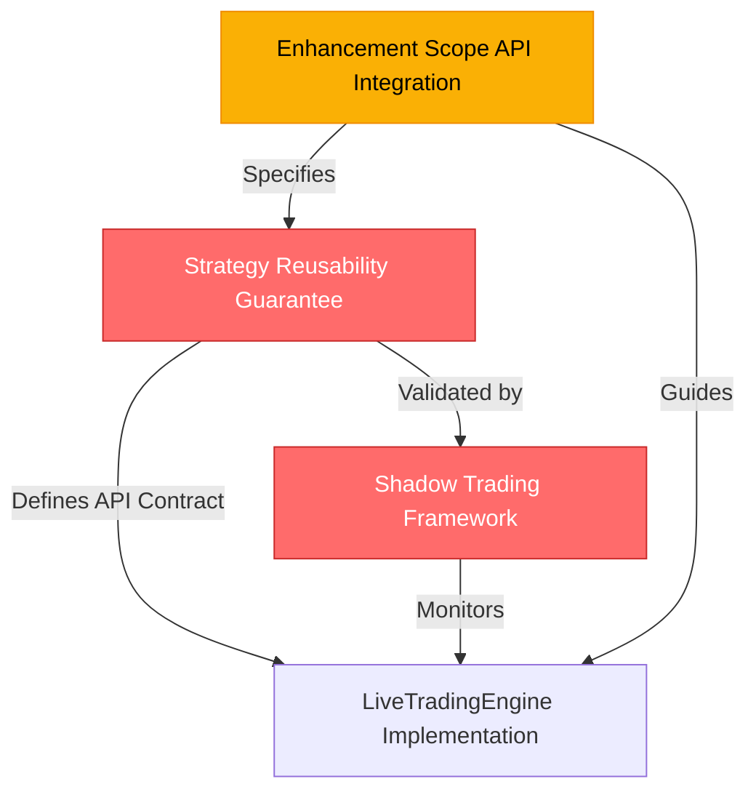

# Epic 6: Critical Architecture Documents Reference

**Date:** 2025-10-03
**Author:** Winston (Architect)
**Status:** ✅ Complete - Ready for Implementation

---

## Purpose

This document serves as a **central reference** for all critical architecture documents that **MUST** be read and understood before implementing Epic 6 (Live Trading Engine & Broker Integrations).

---

## 🚨 Critical Documents

### 1. Strategy Reusability Guarantee ⭐️ **MANDATORY**

**Document:** [strategy-reusability-guarantee.md](strategy-reusability-guarantee.md)

**What it defines:**
- **The fundamental contract:** Strategies written for backtest MUST run in live/paper trading without code changes
- TradingAlgorithm API contract (required methods: `initialize`, `handle_data`)
- Optional live trading hooks (`on_order_fill`, `on_order_cancel`, `on_order_reject`)
- Code examples showing same strategy in backtest, paper, and live modes

**Why it's critical:**
- **Validates Epic 6 design:** If strategies need rewrites for live trading, Epic 6 has failed
- **Enforces API compatibility:** LiveTradingEngine must call same lifecycle methods as backtest engine
- **Reduces risk:** Users can test in backtest, validate in paper, deploy to live with zero code changes

**Referenced in stories:**
- **Story 6.1** (AC10): "Strategy reusability guaranteed"
- **Story 6.2** (AC8): "Strategy reusability validated"
- **Story 6.7** (AC9, AC10): Tests validate same strategy works in backtest and paper trading

**Key sections:**
- [The Contract](strategy-reusability-guarantee.md#the-contract) - How same strategy runs in 3 modes
- [Mandatory Strategy API](strategy-reusability-guarantee.md#mandatory-strategy-api) - Required vs. optional methods
- [Validation Requirements](strategy-reusability-guarantee.md#validation-requirements) - >99% correlation tests

---

### 2. Shadow Trading Validation Framework ⭐️ **CRITICAL**

**Document:** [shadow-trading-summary.md](shadow-trading-summary.md)

**What it defines:**
- Architecture for continuous backtest-live alignment monitoring
- 4 components: ShadowBacktestEngine, SignalAlignmentValidator, ExecutionQualityTracker, AlignmentCircuitBreaker
- Production deployment workflow (backtest → paper → live)
- Alignment metrics schema and circuit breaker thresholds

**Why it's critical:**
- **Addresses edge protection gap:** Original design relied on one-time paper trading validation
- **Continuous monitoring:** Detects when live behavior diverges from backtest predictions
- **Prevents losses:** Circuit breaker halts trading before edge degradation compounds

**Referenced in stories:**
- **Story 6.1** (AC9): "Shadow trading architecture designed"
- **Story 6.7**: Paper trading should enable shadow_mode=True for validation
- **Story 6.12**: Complete implementation of shadow trading framework

**Key sections:**
- [Key Components](shadow-trading-summary.md#key-components) - Architecture overview
- [Production Deployment Workflow](shadow-trading-summary.md#production-deployment-workflow) - 4-phase approach
- [Alignment Metrics Schema](shadow-trading-summary.md#alignment-metrics-schema) - What gets tracked

---

### 3. Enhancement Scope - API Integration ⭐️ **IMPORTANT**

**Document:** [enhancement-scope-and-integration-strategy.md (API Integration section)](enhancement-scope-and-integration-strategy.md#api-integration)

**What it defines:**
- **Preserve:** Backtest API methods (`initialize`, `handle_data`, `before_trading_start`)
- **Extend:** Optional live trading hooks (`on_order_fill`, `on_order_cancel`, `on_order_reject`)
- **Add:** External integration APIs (Epic 9)
- Concrete code example showing MomentumStrategy in all 3 modes

**Why it's critical:**
- **Documents API evolution:** What changes vs. what stays the same
- **Clarifies "extend" vs. "replace":** Live hooks are additive, not replacements
- **Provides reference implementation:** Developers can copy the code example

**Referenced in stories:**
- **Story 6.1**: Tasks include "Define strategy API contract"
- **Story 6.2**: StrategyExecutor must support preserved API

**Key sections:**
- [API Integration](enhancement-scope-and-integration-strategy.md#api-integration) - Complete API strategy including code example, preserved methods, and optional extensions

---

## How These Documents Integrate



1. **Strategy Reusability Guarantee** defines what must be true
2. **Enhancement Scope** documents how to achieve it
3. **Shadow Trading Framework** validates it holds in production
4. **LiveTradingEngine** implements it

---

## Story-by-Story Reference Map

### Story 6.1: Design Live Trading Engine Architecture
**Must Read:**
- ✅ Strategy Reusability Guarantee (AC10)
- ✅ Shadow Trading Summary (AC9)
- ✅ Enhancement Scope API Integration

**Why:** Architecture design must ensure strategy reusability and include shadow trading components.

---

### Story 6.2: Implement Event-Driven Async Trading Engine Core
**Must Read:**
- ✅ Strategy Reusability Guarantee (AC8)
- ✅ Enhancement Scope API Integration

**Why:** StrategyExecutor must call TradingAlgorithm lifecycle methods identically to backtest engine.

---

### Story 6.7: Implement Paper Trading Mode
**Must Read:**
- ✅ Strategy Reusability Guarantee (AC9, AC10)
- ✅ Shadow Trading Summary (deployment workflow)

**Why:** Paper trading validates strategy reusability with >99% correlation tests. Should enable shadow mode.

---

### Story 6.12: Implement Shadow Trading Validation Framework
**Must Read:**
- ✅ Shadow Trading Summary (primary reference)
- ✅ Strategy Reusability Guarantee (explains why alignment is possible)

**Why:** This story implements the architecture defined in Shadow Trading Summary.

---

## Visual Story References

```
┌─────────────────────────────────────────────────────────────────┐
│                    Epic 6 Story Timeline                        │
├─────────────────────────────────────────────────────────────────┤
│                                                                 │
│  6.1: Design Architecture                                       │
│       📖 Strategy Reusability Guarantee                         │
│       📖 Shadow Trading Summary                                 │
│       📖 Enhancement Scope API                                  │
│                                                                 │
│  6.2: Implement Async Engine Core                              │
│       📖 Strategy Reusability Guarantee ← (StrategyExecutor)    │
│       📖 Enhancement Scope API                                  │
│                                                                 │
│  6.3-6.6: Infrastructure Stories                                │
│       (No critical doc dependencies)                            │
│                                                                 │
│  6.7: Implement Paper Trading Mode                              │
│       📖 Strategy Reusability Guarantee ← (>99% correlation)    │
│       📖 Shadow Trading Summary ← (enable shadow_mode)          │
│                                                                 │
│  6.8-6.11: Broker Integrations & Circuit Breakers              │
│       (No critical doc dependencies)                            │
│                                                                 │
│  6.12: Implement Shadow Trading Validation                      │
│       📖 Shadow Trading Summary ← (PRIMARY REFERENCE)           │
│       📖 Strategy Reusability Guarantee                         │
│                                                                 │
└─────────────────────────────────────────────────────────────────┘
```

---

## Implementation Checklist

Before starting any Epic 6 implementation:

- [ ] Read [strategy-reusability-guarantee.md](strategy-reusability-guarantee.md) in full
- [ ] Read [shadow-trading-summary.md](shadow-trading-summary.md) in full
- [ ] Read [enhancement-scope-and-integration-strategy.md (API section)](enhancement-scope-and-integration-strategy.md#api-integration)
- [ ] Understand which TradingAlgorithm methods are required vs. optional
- [ ] Understand the 4-phase production deployment workflow (backtest → paper → live)
- [ ] Understand alignment metrics and circuit breaker thresholds

---

## Quick Reference Table

| Document | Status | Lines of Code | Primary Audience | When to Read |
|----------|--------|---------------|------------------|--------------|
| [strategy-reusability-guarantee.md](strategy-reusability-guarantee.md) | ⭐️ MANDATORY | ~400 | All Epic 6 developers | Before Story 6.1 |
| [shadow-trading-summary.md](shadow-trading-summary.md) | ⭐️ CRITICAL | ~250 | Story 6.1, 6.12 developers | Before Story 6.1 |
| [enhancement-scope API section](enhancement-scope-and-integration-strategy.md#api-integration) | ⭐️ IMPORTANT | ~60 | Story 6.1, 6.2 developers | Before Story 6.1 |

---

## Files Updated to Reference These Documents

**Story Files:**
1. [6.1.design-live-trading-architecture.story.md](../stories/completed/6.1.design-live-trading-architecture.story.md)
2. [6.2.async-trading-engine-core.story.md](../stories/completed/6.2.async-trading-engine-core.story.md)
3. [6.7.paper-trading-mode.story.md](../stories/completed/6.7.paper-trading-mode.story.md)
4. [6.12.implement-shadow-trading-validation.story.md](../stories/completed/6.12.implement-shadow-trading-validation.story.md)

**Architecture Index:**
5. [index.md](index.md) - Added "Critical Architecture Documents" section at top

---

## Conclusion

These three documents form the **architectural foundation** for Epic 6:

1. **Strategy Reusability Guarantee** - The contract
2. **Shadow Trading Summary** - The validation framework
3. **Enhancement Scope API Integration** - The implementation guide

All Epic 6 stories reference these documents with 🚨 **CRITICAL ARCHITECTURE DOCUMENTS - MUST READ FIRST** sections in their Dev Notes.

**Status:** ✅ All story files updated with critical document references.
