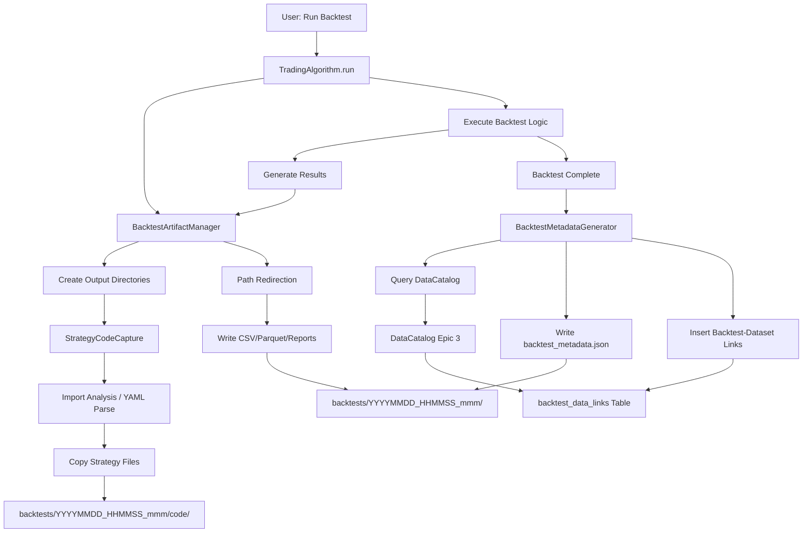

# Epic X3: Backtest Output Organization - Architecture

**Version:** 1.0
**Created:** 2025-10-18
**Status:** Design Approved
**Author:** Winston (Architect)
**Type:** Brownfield Enhancement Architecture

---

## Introduction

This document outlines the architectural approach for enhancing RustyBT with standardized backtest output organization. Its primary goal is to serve as the guiding architectural blueprint for AI-driven development of this feature while ensuring seamless integration with the existing system.

**Relationship to Existing Architecture:**
This document supplements existing project architecture by defining how new artifact management components will integrate with current backtest execution, data management, and reporting systems. The enhancement maintains full backward compatibility with existing workflows while establishing production-grade artifact organization.

### Existing Project Analysis

#### Current Project State

- **Primary Purpose:** Modern Python backtesting framework with financial-grade precision (Decimal arithmetic), multi-asset support (equities, crypto, futures), and advanced optimization capabilities
- **Current Tech Stack:** Python 3.12+, Polars/Parquet (data), SQLite (metadata), pytest (testing), uv (package management)
- **Architecture Style:** Event-driven backtesting engine with modular data adapters, extending Zipline-Reloaded architecture
- **Deployment Method:** Python package distributed via PyPI, executed locally via CLI or Jupyter notebooks

#### Available Documentation

- Tech Stack Documentation (docs/internal/architecture/tech-stack.md)
- Source Tree Architecture (docs/internal/architecture/source-tree.md)
- Data Catalog Architecture (docs/internal/architecture/data-catalog.md)
- Coding Standards (docs/internal/architecture/coding-standards.md)
- Epic 3 Data Architecture (implemented)
- Component Architecture (docs/internal/architecture/component-architecture.md)

#### Identified Constraints

- Must maintain backward compatibility with existing backtest execution APIs
- Must integrate with Epic 3's DataCatalog for dataset linkage
- Must work seamlessly in both CLI and Jupyter notebook environments
- Must not add >2% performance overhead to backtest execution
- Must follow existing coding standards (mypy strict, zero-mock enforcement, Decimal precision)
- File system must support millisecond-precision timestamps

### Change Log

| Change | Date | Version | Description | Author |
|--------|------|---------|-------------|--------|
| Initial architecture design | 2025-10-18 | 1.0 | Created brownfield architecture for Epic X3 | Winston (Architect) |

---

## Enhancement Scope and Integration Strategy

### Enhancement Overview

**Enhancement Type:** New Feature Addition (Backtest Artifact Management)
**Scope:** Implement production-grade backtest output organization with automatic code capture, metadata generation, and centralized storage
**Integration Impact:** Moderate - requires modifications to backtest execution pipeline, data adapters, and report generation systems

### Integration Approach

**Code Integration Strategy:**
- Hook into existing `TradingAlgorithm.run()` lifecycle without modifying core backtest logic
- Introduce new `BacktestArtifactManager` as dependency-injected component
- Modify result export methods to use artifact manager's path resolution
- Centralize path resolution logic to handle CLI vs Jupyter environments

**Database Integration:**
- Extend existing DataCatalog SQLite database (`backtest_data_links` table already exists from Epic 3)
- Add backtest run records to link datasets with backtest IDs
- No schema migrations required (table structure supports this use case)

**API Integration:**
- Expose `backtest.output_dir` attribute on `TradingAlgorithm` instances (read-only property)
- Maintain existing result export API signatures (transparent path redirection)
- No breaking changes to public API surface

**UI Integration:**
- N/A (this is a backend enhancement; Jupyter notebook users interact via filesystem)

### Compatibility Requirements

- **Existing API Compatibility:** All existing backtest scripts and notebooks run without modification; output redirection is transparent
- **Database Schema Compatibility:** Leverages existing `backtest_data_links` table from Epic 3 DataCatalog
- **UI/UX Consistency:** Backtest execution logs display backtest ID and output directory path (INFO level)
- **Performance Impact:** <2% overhead; directory creation <100ms, code capture <5s, metadata generation <1s

---

## Tech Stack

### Existing Technology Stack

| Category | Current Technology | Version | Usage in Enhancement | Notes |
|----------|-------------------|---------|---------------------|-------|
| **Language** | Python | 3.12+ | Primary implementation language | Modern features: type hints, ast module, pathlib |
| **Data Management** | Polars | 1.x | Not directly used in enhancement | Existing data pipeline unchanged |
| **Database** | SQLite | 3.x | Extended for backtest metadata linkage | Existing DataCatalog database |
| **ORM** | SQLAlchemy | >= 2.0 | Database operations for backtest linkage | Existing infrastructure |
| **Testing** | pytest | >= 7.2.0 | Unit/integration/property tests | Existing test framework |
| **Type Checking** | mypy | >= 1.10.0 | Strict mode enforcement | Existing CI/CD |
| **Package Manager** | uv | 0.5.x+ | Dependency management | Existing workflow |
| **Logging** | structlog | Latest | Structured logging for artifact operations | Existing logging framework |

### New Technology Additions

| Technology | Version | Purpose | Rationale | Integration Method |
|------------|---------|---------|-----------|-------------------|
| **PyYAML** | 6.0+ | Parse optional `strategy.yaml` | Standard YAML parser, widely used | Add to pyproject.toml dependencies |
| **ast** (stdlib) | stdlib | Import analysis for code capture | Built-in, no external dependency | Direct import |
| **threading.Lock** (stdlib) | stdlib | Thread-safe ID generation | Built-in concurrency primitive | Direct import |
| **shutil.copy2** (stdlib) | stdlib | File copying with metadata preservation | Built-in, preserves timestamps | Direct import |

**Note:** Only PyYAML is a new external dependency; all other additions leverage Python standard library.

---

## Data Models and Schema Changes

### New Data Models

#### BacktestArtifactManager

**Purpose:** Manages creation and organization of backtest output directories

**Integration:** Instantiated during `TradingAlgorithm.run()` initialization, injected into result export pipeline

**Key Attributes:**
- `backtest_id: str` - Unique timestamp-based identifier (YYYYMMDD_HHMMSS_mmm)
- `output_dir: Path` - Root directory for this backtest run (`backtests/{backtest_id}/`)
- `results_dir: Path` - Results subdirectory (`backtests/{backtest_id}/results/`)
- `code_dir: Path` - Code capture subdirectory (`backtests/{backtest_id}/code/`)
- `metadata_dir: Path` - Metadata subdirectory (`backtests/{backtest_id}/metadata/`)
- `base_dir: Path` - Configurable base directory (default: `backtests/`)

**Relationships:**
- **With Existing:** Referenced by `TradingAlgorithm` instance; interacts with existing result export methods
- **With New:** Coordinates with `StrategyCodeCapture` for code copying

#### StrategyCodeCapture

**Purpose:** Detects and copies strategy code files via import analysis or YAML manifest

**Integration:** Invoked by `BacktestArtifactManager` during backtest initialization

**Key Attributes:**
- `entry_point: Path` - Strategy file path (main script or notebook)
- `captured_files: List[Path]` - List of detected/copied strategy files
- `capture_mode: str` - "import_analysis" or "strategy_yaml"
- `strategy_root: Path` - Root directory for resolving relative paths

**Relationships:**
- **With Existing:** Uses Python `ast` module and `importlib` for import analysis; respects `sys.stdlib_module_names` and `site-packages`
- **With New:** Provides file list to `BacktestMetadataGenerator`

#### BacktestMetadataGenerator

**Purpose:** Generates `backtest_metadata.json` with provenance information

**Integration:** Invoked by `BacktestArtifactManager` at backtest completion

**Key Attributes:**
- `backtest_id: str` - Backtest identifier
- `timestamp: str` - ISO8601 timestamp
- `framework_version: str` - RustyBT version
- `python_version: str` - Python interpreter version
- `strategy_entry_point: str` - Strategy file path
- `captured_files: List[str]` - List of captured code files
- `data_bundle_info: dict` - Bundle name and dataset IDs (from DataCatalog)

**Relationships:**
- **With Existing:** Queries DataCatalog for dataset IDs associated with backtest run
- **With New:** Receives captured file list from `StrategyCodeCapture`

### Schema Integration Strategy

**Database Changes Required:**
- **New Tables:** None (leverages existing `backtest_data_links` table)
- **Modified Tables:** None (Epic 3's `backtest_data_links` table already supports this use case)
- **New Indexes:** None required (existing indexes on `backtest_id` and `dataset_id` sufficient)
- **Migration Strategy:** No migration needed; extend existing table usage

**Existing `backtest_data_links` Table Schema (from Epic 3):**
```sql
CREATE TABLE backtest_data_links (
    link_id INTEGER PRIMARY KEY AUTOINCREMENT,
    backtest_id TEXT NOT NULL,                -- Our timestamped backtest ID
    dataset_id TEXT NOT NULL,
    cached_at INTEGER NOT NULL,               -- Unix timestamp
    cache_key TEXT NOT NULL,
    FOREIGN KEY(dataset_id) REFERENCES datasets(dataset_id)
);
```

**Backward Compatibility:**
- Existing backtest runs (pre-Epic X3) won't have entries in `backtest_data_links` - system gracefully handles missing linkage
- New backtest runs will automatically populate linkage records
- DataCatalog queries remain unchanged (existing Epic 3 API)

---

## Component Architecture

### New Components

#### BacktestArtifactManager

**Responsibility:** Create and manage backtest output directory structure; coordinate result file redirection

**Integration Points:**
- `TradingAlgorithm.run()` - Instantiated during backtest initialization
- Result export methods (CSV, Parquet, report generation) - Provides output path resolution
- `StrategyCodeCapture` - Triggers code capture during initialization
- `BacktestMetadataGenerator` - Triggers metadata generation at completion

**Key Interfaces:**
- `__init__(base_dir: Path, strategy_entry_point: Path) -> None` - Initialize with configuration
- `create_output_structure() -> None` - Create timestamped directory tree
- `get_output_path(filename: str, subdirectory: str = "results") -> Path` - Resolve output file paths
- `capture_strategy_code() -> List[Path]` - Trigger code capture process
- `generate_metadata(data_catalog: DataCatalog) -> None` - Generate metadata JSON

**Dependencies:**
- **Existing Components:** Configuration system (for `base_dir`), logging framework
- **New Components:** `StrategyCodeCapture`, `BacktestMetadataGenerator`

**Technology Stack:** Python 3.12+, pathlib, threading.Lock (for ID generation), structlog

#### StrategyCodeCapture

**Responsibility:** Detect non-framework code via import analysis or YAML manifest; copy files preserving structure

**Integration Points:**
- `BacktestArtifactManager` - Invoked during backtest initialization
- File system - Reads strategy files and writes to code directory
- `importlib.util.find_spec()` - Resolves module paths
- Python `ast` module - Parses import statements

**Key Interfaces:**
- `__init__(entry_point: Path, code_dir: Path, capture_mode: str) -> None` - Initialize capture configuration
- `detect_strategy_files() -> List[Path]` - Detect files via import analysis or YAML
- `copy_files(files: List[Path]) -> None` - Copy files preserving directory structure
- `_parse_imports(file_path: Path) -> List[str]` - Extract import statements from file
- `_resolve_module_path(module_name: str) -> Optional[Path]` - Resolve module to file path
- `_is_framework_module(module_name: str) -> bool` - Filter out framework/stdlib/site-packages

**Dependencies:**
- **Existing Components:** None (uses standard library)
- **New Components:** None (standalone component)

**Technology Stack:** Python 3.12+ (ast module, importlib, pathlib, shutil.copy2), PyYAML (for optional strategy.yaml)

#### BacktestMetadataGenerator

**Responsibility:** Generate `backtest_metadata.json` with complete provenance information

**Integration Points:**
- `BacktestArtifactManager` - Invoked at backtest completion
- DataCatalog (Epic 3) - Queries for dataset IDs associated with backtest
- `rustybt.version` module - Retrieves framework version
- `sys.version` - Retrieves Python version

**Key Interfaces:**
- `__init__(backtest_id: str, metadata_dir: Path) -> None` - Initialize with backtest context
- `generate(strategy_entry_point: Path, captured_files: List[Path], data_catalog: Optional[DataCatalog]) -> None` - Generate and write metadata JSON
- `_query_data_catalog(data_catalog: DataCatalog) -> dict` - Retrieve dataset information
- `_format_metadata() -> dict` - Format metadata dictionary
- `_write_json(metadata: dict) -> None` - Write pretty-printed JSON

**Dependencies:**
- **Existing Components:** DataCatalog (optional - graceful degradation if unavailable), version module
- **New Components:** Receives data from `StrategyCodeCapture`

**Technology Stack:** Python 3.12+ (json module, sys), SQLAlchemy (for DataCatalog queries)

### Component Interaction Diagram



---

## Source Tree

### Existing Project Structure (Relevant Parts)

```plaintext
rustybt/
├── algorithm.py                      # TradingAlgorithm class (will be extended)
├── data/
│   ├── polars/
│   │   ├── catalog.py                # DataCatalog (Epic 3 - will be queried)
│   │   └── ...
│   └── adapters/
│       ├── csv_adapter.py            # Will be fixed for bundle path resolution
│       ├── ccxt_adapter.py           # Will be fixed for bundle path resolution
│       └── yfinance_adapter.py       # Will be fixed for bundle path resolution
├── analytics/
│   └── reports.py                    # Report generation (will use path redirection)
└── ...
```

### New File Organization

```plaintext
rustybt/
├── algorithm.py                      # Extended with BacktestArtifactManager integration
├── backtest/                         # NEW: Backtest artifact management
│   ├── __init__.py                   # Package exports
│   ├── artifact_manager.py           # NEW: BacktestArtifactManager class
│   ├── code_capture.py               # NEW: StrategyCodeCapture class
│   └── metadata_generator.py         # NEW: BacktestMetadataGenerator class
├── data/
│   ├── polars/
│   │   ├── catalog.py                # Existing (queried for dataset linkage)
│   │   └── ...
│   ├── adapters/
│   │   ├── csv_adapter.py            # Modified: fix path resolution
│   │   ├── ccxt_adapter.py           # Modified: fix path resolution
│   │   └── yfinance_adapter.py       # Modified: fix path resolution
│   └── bundles/
│       └── csvdir.py                 # Modified: centralize bundle path resolution
├── analytics/
│   └── reports.py                    # Modified: use artifact manager paths
├── utils/
│   └── config.py                     # Extended: add backtest_output config section
└── ...
```

### Integration Guidelines

**File Naming:** Follow existing snake_case convention (e.g., `artifact_manager.py`, `code_capture.py`)

**Folder Organization:** New `rustybt/backtest/` module for artifact management components (cohesive grouping)

**Import/Export Patterns:**
```python
# In rustybt/backtest/__init__.py
from .artifact_manager import BacktestArtifactManager
from .code_capture import StrategyCodeCapture
from .metadata_generator import BacktestMetadataGenerator

__all__ = [
    'BacktestArtifactManager',
    'StrategyCodeCapture',
    'BacktestMetadataGenerator',
]

# Usage in rustybt/algorithm.py
from rustybt.backtest import BacktestArtifactManager
```

---

## Infrastructure and Deployment Integration

### Existing Infrastructure

**Current Deployment:** Python package distributed via PyPI; users install with `uv add rustybt` or `pip install rustybt`

**Infrastructure Tools:** GitHub Actions (CI/CD), pytest (testing), mypy (type checking), ruff (linting), uv (package management)

**Environments:** Development (local), Testing (CI), Production (user machines)

### Enhancement Deployment Strategy

**Deployment Approach:** Standard Python package update; enhancement ships in next minor version (e.g., 0.6.0)

**Infrastructure Changes:**
- Add PyYAML to `pyproject.toml` dependencies
- Update CI/CD to test code capture functionality (multi-file strategy fixtures)
- Add integration tests for Jupyter notebook environment (path resolution)

**Pipeline Integration:**
- Existing pytest suite extended with new test modules
- Existing mypy strict mode enforced on new modules
- Existing ruff linting applied to new code
- No infrastructure-level changes required

### Rollback Strategy

**Rollback Method:** Configuration flag `backtest_output.enabled = false` to disable feature

**Risk Mitigation:**
- Comprehensive integration tests with all example notebooks before release
- Feature flag allows gradual rollout or instant rollback if issues discovered
- Existing backtest outputs remain in current directory if feature disabled

**Monitoring:**
- Track backtest execution time (ensure <2% overhead)
- Monitor disk usage for `backtests/` directory (log warnings if exceeds configurable threshold)
- Log artifact creation success/failure rates (structlog INFO level)

---

## Coding Standards

### Existing Standards Compliance

**Code Style:** black (line length: 100), ruff linting

**Linting Rules:** mypy --strict mode, zero-mock enforcement (mandatory)

**Testing Patterns:** pytest with property-based tests (hypothesis), ≥90% coverage, no mocking of production code

**Documentation Style:** Google-style docstrings, Sphinx-compatible, 100% public API coverage

### Enhancement-Specific Standards

- **Backtest ID Format:** YYYYMMDD_HHMMSS_mmm (enforced via regex validation in tests)
- **Path Resolution:** All paths use `pathlib.Path` (no string concatenation)
- **Error Handling:** Specific exceptions (`ArtifactManagerError`, `CodeCaptureError`, `MetadataGenerationError`)
- **Logging:** structlog with consistent field names (`backtest_id`, `output_dir`, `captured_files`)
- **Thread Safety:** `threading.Lock()` around ID generation (concurrent backtest support)

### Critical Integration Rules

**Existing API Compatibility:**
- `TradingAlgorithm.run()` signature unchanged
- Result export methods (e.g., `to_csv()`, `to_parquet()`) signatures unchanged
- Path redirection is transparent (users don't need to modify code)

**Database Integration:**
- Use SQLAlchemy ORM for `backtest_data_links` inserts (consistent with Epic 3)
- Graceful degradation if DataCatalog unavailable (log warning, skip linkage)

**Error Handling:**
```python
try:
    artifact_manager.create_output_structure()
except PermissionError as e:
    logger.error("output_directory_creation_failed", error=str(e), base_dir=base_dir)
    raise ArtifactManagerError(f"Cannot create output directory: {e}") from e
```

**Logging Consistency:**
```python
logger.info(
    "backtest_started",
    backtest_id=backtest_id,
    output_dir=str(output_dir),
    strategy_entry_point=str(strategy_entry_point)
)
```

---

## Testing Strategy

### Integration with Existing Tests

**Existing Test Framework:** pytest ≥ 7.2.0, pytest-cov ≥ 3.0.0, pytest-xdist ≥ 2.5.0 (parallel testing)

**Test Organization:** `tests/backtest/` mirrors `rustybt/backtest/` structure

**Coverage Requirements:** ≥90% overall, ≥95% for new artifact management modules

### New Testing Requirements

#### Unit Tests for New Components

**Framework:** pytest

**Location:** `tests/backtest/test_artifact_manager.py`, `tests/backtest/test_code_capture.py`, `tests/backtest/test_metadata_generator.py`

**Coverage Target:** ≥95%

**Integration with Existing:** Uses existing pytest fixtures for temporary directories

**Example Tests:**
```python
# tests/backtest/test_artifact_manager.py
def test_backtest_id_generation_format():
    """Backtest ID must match YYYYMMDD_HHMMSS_mmm format."""
    manager = BacktestArtifactManager(base_dir=Path("/tmp/backtests"))
    assert re.match(r'^\d{8}_\d{6}_\d{3}$', manager.backtest_id)

def test_directory_structure_creation(tmp_path):
    """Output directory must contain results/, code/, metadata/ subdirectories."""
    manager = BacktestArtifactManager(base_dir=tmp_path)
    manager.create_output_structure()

    assert (manager.output_dir / "results").exists()
    assert (manager.output_dir / "code").exists()
    assert (manager.output_dir / "metadata").exists()

def test_concurrent_backtest_id_uniqueness():
    """Concurrent backtests must generate unique IDs."""
    ids = set()
    def generate_id():
        manager = BacktestArtifactManager(base_dir=Path("/tmp"))
        ids.add(manager.backtest_id)

    threads = [threading.Thread(target=generate_id) for _ in range(100)]
    for t in threads:
        t.start()
    for t in threads:
        t.join()

    assert len(ids) == 100  # All IDs unique
```

```python
# tests/backtest/test_code_capture.py
def test_import_analysis_detects_local_modules(tmp_path):
    """Import analysis must detect local modules, exclude framework/stdlib."""
    strategy_file = tmp_path / "strategy.py"
    helper_file = tmp_path / "utils" / "indicators.py"
    helper_file.parent.mkdir()

    strategy_file.write_text("""
import sys
import polars as pl
from rustybt import TradingAlgorithm
from utils.indicators import compute_sma
""")
    helper_file.write_text("def compute_sma(data, window): pass")

    capture = StrategyCodeCapture(entry_point=strategy_file, code_dir=tmp_path / "code")
    files = capture.detect_strategy_files()

    assert strategy_file in files
    assert helper_file in files
    assert len(files) == 2  # Only strategy + helper, no stdlib/framework

def test_strategy_yaml_manifest_parsing(tmp_path):
    """strategy.yaml must override import analysis."""
    strategy_file = tmp_path / "strategy.py"
    config_file = tmp_path / "config.json"
    yaml_file = tmp_path / "strategy.yaml"

    yaml_file.write_text("""
files:
  - strategy.py
  - config.json
""")

    capture = StrategyCodeCapture(entry_point=strategy_file, code_dir=tmp_path / "code")
    files = capture.detect_strategy_files()

    assert strategy_file in files
    assert config_file in files
```

```python
# tests/backtest/test_metadata_generator.py
def test_metadata_json_format(tmp_path):
    """Metadata JSON must include all required fields and be pretty-printed."""
    metadata_dir = tmp_path / "metadata"
    metadata_dir.mkdir()

    generator = BacktestMetadataGenerator(
        backtest_id="20251018_143527_123",
        metadata_dir=metadata_dir
    )
    generator.generate(
        strategy_entry_point=Path("/path/to/strategy.py"),
        captured_files=[Path("strategy.py"), Path("utils/indicators.py")],
        data_catalog=None  # Test without catalog
    )

    metadata_file = metadata_dir / "backtest_metadata.json"
    assert metadata_file.exists()

    metadata = json.loads(metadata_file.read_text())
    assert metadata["backtest_id"] == "20251018_143527_123"
    assert "timestamp" in metadata
    assert "framework_version" in metadata
    assert "python_version" in metadata
    assert metadata["captured_files"] == ["strategy.py", "utils/indicators.py"]

    # Verify pretty-printing (check for indentation)
    assert "  " in metadata_file.read_text()  # Indented JSON
```

#### Integration Tests

**Scope:** Full backtest run with artifact capture, path redirection, metadata generation

**Existing System Verification:** Run example notebooks, verify outputs in new locations with correct content

**New Feature Testing:** Test code capture, metadata accuracy, DataCatalog linkage

**Example Integration Test:**
```python
@pytest.mark.integration
def test_full_backtest_with_artifact_capture(tmp_path):
    """Complete backtest run must create organized output directory."""
    # Create simple strategy
    strategy_file = tmp_path / "strategy.py"
    strategy_file.write_text("""
from rustybt import TradingAlgorithm

class MyStrategy(TradingAlgorithm):
    def initialize(self, context):
        self.asset = self.symbol('AAPL')

    def handle_data(self, context, data):
        self.order(self.asset, 100)
""")

    # Run backtest with artifact management enabled
    config = {"backtest_output": {"enabled": True, "base_dir": str(tmp_path / "backtests")}}
    backtest = run_algorithm(
        strategy_file=strategy_file,
        start="2023-01-01",
        end="2023-12-31",
        config=config
    )

    # Verify output structure
    output_dir = backtest.output_dir
    assert output_dir.exists()
    assert (output_dir / "results" / "backtest_results.csv").exists()
    assert (output_dir / "results" / "backtest_results.parquet").exists()
    assert (output_dir / "code" / "strategy.py").exists()
    assert (output_dir / "metadata" / "backtest_metadata.json").exists()

    # Verify metadata accuracy
    metadata = json.loads((output_dir / "metadata" / "backtest_metadata.json").read_text())
    assert metadata["strategy_entry_point"] == str(strategy_file)
    assert "strategy.py" in metadata["captured_files"]
```

#### Regression Testing

**Existing Feature Verification:** All example notebooks (`01_getting_started.ipynb` through `10_full_workflow.ipynb`) must run successfully

**Automated Regression Suite:**
```python
@pytest.mark.regression
@pytest.mark.parametrize("notebook", [
    "01_getting_started.ipynb",
    "02_data_ingestion.ipynb",
    # ... all example notebooks
    "10_full_workflow.ipynb",
])
def test_notebook_execution_with_artifact_management(notebook):
    """All example notebooks must execute successfully with artifact management enabled."""
    result = execute_notebook(f"docs/examples/notebooks/{notebook}")
    assert result.exit_code == 0
    assert result.has_errors == False
```

**Manual Testing Requirements:**
- Jupyter notebook execution in different environments (JupyterLab, VSCode, Google Colab)
- CLI execution on Windows, macOS, Linux
- Concurrent backtest execution (verify thread safety)

---

## Security Integration

### Existing Security Measures

**Authentication:** N/A (local execution framework)

**Authorization:** File system permissions (backtest outputs owned by executing user)

**Data Protection:** No PII stored in backtest artifacts (OHLCV data and strategy code only)

**Security Tools:** truffleHog (secrets detection in CI/CD), pip-audit (dependency vulnerability scanning)

### Enhancement Security Requirements

**New Security Measures:**
- Validate `base_dir` configuration to prevent directory traversal (e.g., reject paths with `..`)
- Ensure `strategy.yaml` parsing is safe (use `safe_load()`, not `load()`)
- Sanitize file paths in metadata JSON to prevent XSS if displayed in web UI (future-proofing)

**Integration Points:**
- File system permissions: `backtests/` directory inherits executing user's permissions
- Path validation: `artifact_manager._validate_base_dir()` rejects malicious paths

**Compliance Requirements:** None (local execution framework; no regulatory compliance needed)

### Security Testing

**Existing Security Tests:** Secrets detection (truffleHog), dependency scanning (pip-audit weekly)

**New Security Test Requirements:**
```python
def test_base_dir_validation_rejects_traversal():
    """Base directory validation must reject directory traversal attempts."""
    with pytest.raises(ValueError, match="Invalid base directory"):
        BacktestArtifactManager(base_dir=Path("../../etc/passwd"))

def test_strategy_yaml_safe_load():
    """strategy.yaml parsing must use safe_load to prevent code injection."""
    malicious_yaml = Path("/tmp/malicious.yaml")
    malicious_yaml.write_text("!!python/object/apply:os.system ['rm -rf /']")

    capture = StrategyCodeCapture(entry_point=Path("/tmp/strategy.py"), code_dir=Path("/tmp/code"))
    # Should not execute malicious code, should raise error or ignore
    with pytest.raises(yaml.YAMLError):
        capture._parse_strategy_yaml(malicious_yaml)
```

**Penetration Testing:** Not required (local execution framework with no network exposure)

---

## Next Steps

### Story Manager Handoff

**Reference Documents:**
- Epic X3 PRD: `docs/internal/prd/epic-X3-backtest-output-organization.md`
- Epic X3 Architecture (this document): `docs/internal/architecture/epic-X3-backtest-output-organization.md`

**Key Integration Requirements:**
- Integrate with `TradingAlgorithm.run()` lifecycle hooks (initialization and completion)
- Leverage Epic 3's DataCatalog `backtest_data_links` table (no schema changes required)
- Maintain backward compatibility with existing result export APIs
- Work seamlessly in CLI and Jupyter notebook environments

**Existing System Constraints:**
- Must follow existing coding standards (mypy strict, zero-mock enforcement, Decimal precision)
- Must not add >2% performance overhead to backtest execution
- Must use existing logging framework (structlog) and test framework (pytest)
- Must integrate with existing CI/CD pipeline (GitHub Actions)

**First Story to Implement:**
Story X3.1: Create Backtest Output Directory Management

**Clear Integration Checkpoints:**
1. After Story X3.1: Verify directory creation doesn't break existing backtests (regression test suite)
2. After Story X3.2: Verify all example notebooks produce outputs in new location (integration tests)
3. After Story X3.3: Verify multi-file strategies captured correctly (test with complex strategy fixtures)
4. After Story X3.6: Verify no `csvdir_data/` folders created in notebook directories (regression test)
5. After Story X3.7: Verify DataCatalog linkage working (query backtest_data_links table in tests)

**Emphasis on Maintaining Existing System Integrity:**
- Each story includes Integration Verification criteria to ensure existing functionality unchanged
- Comprehensive regression test suite runs after each story
- Feature flag (`backtest_output.enabled`) allows instant rollback if issues discovered
- Performance benchmarks enforce <2% overhead requirement

### Developer Handoff

**Reference Documents:**
- Epic X3 Architecture (this document)
- Existing Coding Standards: `docs/internal/architecture/coding-standards.md`
- Existing Source Tree: `docs/internal/architecture/source-tree.md`
- Data Catalog Architecture: `docs/internal/architecture/data-catalog.md`

**Integration Requirements:**
- Hook into `TradingAlgorithm.run()` without modifying core backtest logic (use dependency injection)
- Query DataCatalog using existing SQLAlchemy ORM patterns (see `rustybt/data/polars/catalog.py`)
- Follow existing path resolution patterns in data adapters (see `rustybt/data/adapters/`)
- Use existing configuration system for `backtest_output` settings (see `rustybt/utils/config.py`)

**Key Technical Decisions:**
- Backtest ID format: YYYYMMDD_HHMMSS_mmm (millisecond precision timestamp)
- Thread-safe ID generation: `threading.Lock()` around `datetime.now()` call
- Code capture: Python `ast` module for import analysis, PyYAML for optional manifest
- File copying: `shutil.copy2()` to preserve timestamps
- Metadata format: Pretty-printed JSON (`indent=2`) for human readability

**Existing System Compatibility Requirements:**
- **API Compatibility:** No changes to `TradingAlgorithm.run()` signature or result export method signatures
- **Performance:** <100ms directory creation, <5s code capture, <1s metadata generation, <2% total overhead
- **Error Handling:** Graceful degradation (warn but don't fail if code capture fails, DataCatalog unavailable, etc.)
- **Testing:** ≥95% coverage for new modules, all example notebooks must pass regression tests

**Clear Sequencing of Implementation:**
1. **Week 1:** Story X3.1 (directory management), Story X3.2 (output redirection)
   - Minimize risk: Start with directory creation and path redirection (no code capture yet)
   - Integration checkpoint: Verify existing notebooks work with new output location
2. **Week 2:** Story X3.3 (import analysis), Story X3.4 (YAML support)
   - Build on stable foundation: Add code capture after output redirection proven stable
   - Integration checkpoint: Verify multi-file strategies captured correctly
3. **Week 3:** Story X3.5 (metadata), Story X3.7 (DataCatalog linkage)
   - Add provenance tracking: Metadata and database integration
   - Integration checkpoint: Verify metadata accuracy and DataCatalog queries
4. **Week 4:** Story X3.6 (data adapter fixes), integration testing, documentation
   - Fix Jupyter notebook data download issue
   - Final integration checkpoint: Full regression test suite + performance benchmarks

---

## Architecture Decision Records

### ADR-001: Timestamp-Based Backtest IDs vs UUIDs

**Status:** Accepted

**Context:** Need unique identifiers for backtest runs. Options: UUIDs (universally unique, random) vs timestamps (human-readable, chronological).

**Decision:** Use millisecond-precision timestamps (`YYYYMMDD_HHMMSS_mmm`) as backtest IDs.

**Rationale:**
- Human-readable and sortable chronologically (users can easily find recent runs)
- Easier to reference in documentation and logs
- Sufficient uniqueness for single-machine execution (millisecond precision + thread lock)
- Cons: Potential collision in distributed scenarios (mitigated by thread-safe generation)

**Consequences:**
- ✅ User-friendly directory names (e.g., `backtests/20251018_143527_123/`)
- ✅ Natural sorting by creation time
- ❌ Not suitable for distributed backtest execution (future consideration)
- ❌ Timezone dependency (use UTC to avoid ambiguity)

### ADR-002: File Copying vs Git Integration for Code Capture

**Status:** Accepted

**Context:** Need to capture exact strategy code that produced backtest results. Options: file copying vs git snapshots.

**Decision:** Copy strategy files to `backtests/{backtest_id}/code/` using `shutil.copy2()`.

**Rationale:**
- Works for users without git repositories
- Simpler implementation (no git dependencies)
- Captures exact execution state, even with uncommitted changes
- Cons: More disk space usage (mitigated by user-managed deletion)

**Consequences:**
- ✅ Zero configuration for non-git users
- ✅ Captures uncommitted changes and ad-hoc modifications
- ✅ No git dependencies in framework
- ❌ Higher disk usage (duplicate code files)
- ❌ No built-in deduplication (future: content-addressable storage)

### ADR-003: Import Analysis vs Manual File Specification

**Status:** Accepted

**Context:** Need to detect which files constitute a strategy project. Options: automatic import analysis vs require users to specify files.

**Decision:** Automatic import analysis by default, with optional `strategy.yaml` for explicit control.

**Rationale:**
- Zero configuration for 90% of users (simple strategies with standard imports)
- Power users can override with `strategy.yaml` for complex projects
- Balances ease-of-use with flexibility

**Consequences:**
- ✅ Zero configuration for typical use cases
- ✅ Flexibility for complex projects
- ⚠️ Import analysis may miss dynamically loaded code (mitigated by `strategy.yaml` option)
- ⚠️ Requires robust import parsing (use Python `ast` module, not regex)

---

## Appendix: Example Output Structure

### Complete Backtest Output Directory

```
backtests/20251018_143527_123/
├── results/
│   ├── backtest_results.csv               # 376 KB
│   ├── backtest_results.parquet           # 85 KB
│   ├── summary_statistics.csv             # 167 bytes
│   ├── optimization_results.csv           # 652 bytes (if optimization run)
│   └── reports/
│       ├── basic_report.html              # 440 KB
│       ├── advanced_report.html           # 558 KB
│       └── basic_report.pdf               # 65 KB (if PDF generation enabled)
├── code/
│   ├── my_strategy.py                     # User's strategy file
│   ├── utils/
│   │   ├── indicators.py                  # Custom indicators
│   │   └── risk_management.py             # Risk management helpers
│   └── config/
│       └── strategy_config.json           # Strategy configuration
└── metadata/
    └── backtest_metadata.json             # Provenance metadata

# backtest_metadata.json contents:
{
  "backtest_id": "20251018_143527_123",
  "timestamp": "2025-10-18T14:35:27.123Z",
  "framework_version": "0.6.0",
  "python_version": "3.12.1 (main, Jan  1 2025, 00:00:00)",
  "strategy_entry_point": "/Users/researcher/strategies/my_strategy.py",
  "captured_files": [
    "my_strategy.py",
    "utils/indicators.py",
    "utils/risk_management.py",
    "config/strategy_config.json"
  ],
  "data_bundle_info": {
    "bundle_name": "yfinance_bundle",
    "dataset_ids": [
      "uuid-dataset-abc123",
      "uuid-dataset-def456"
    ]
  }
}
```

---

**Document Status:** ✅ Design Complete - Ready for Implementation
