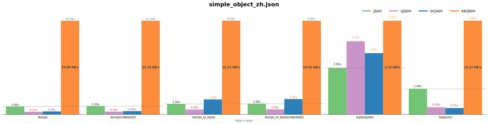
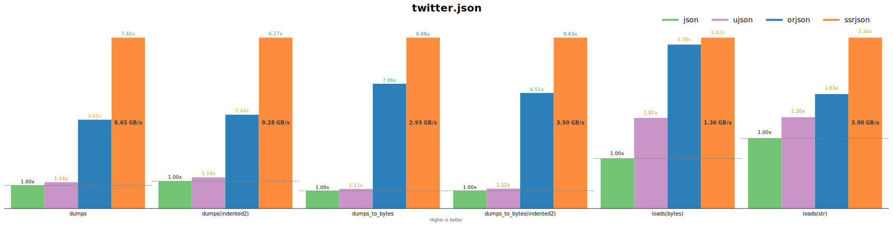
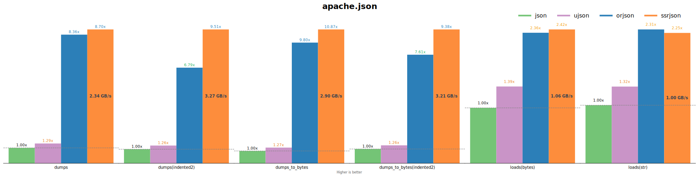
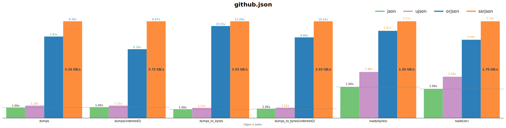
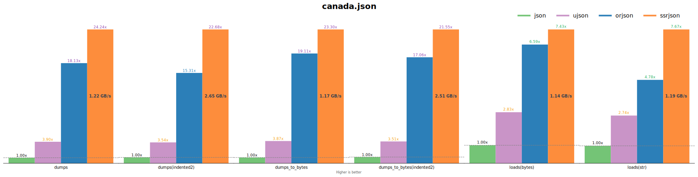
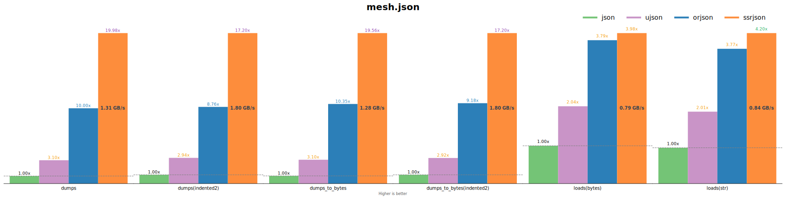

<div align="center">

# **ssrJSON**

[](https://pypi.org/project/ssrjson/) [](https://pypi.org/project/ssrjson/) [](https://codecov.io/gh/Antares0982/ssrJSON)

A SIMD boosted high-performance and correct Python JSON parsing library that fully leverages modern processor capabilities.

</div>

## Introduction

ssrJSON is a Python JSON library that leverages modern hardware capabilities to achieve peak performance, implemented primarily in C with some components written in C++. It offers a fully compatible interface to Python’s standard `json` module, making it a seamless drop-in replacement, while providing exceptional performance for JSON encoding and decoding.

### How Fast is ssrJSON?

TL;DR: ssrJSON is faster than or nearly as fast as [orjson](https://github.com/ijl/orjson) (which announces itself as the fastest Python library for JSON) on most benchmark cases.

ssrJSON is the first JSON parsing library that handles non-ASCII `str` object directly using SIMD without any translation between `str` and it's UTF-8 encoding. Other third-party Python JSON libraries are slow when handling non-ASCII strings [without UTF-8 cache](https://github.com/ijl/orjson/issues/586). ([simple_object_zh.json](https://github.com/Nambers/ssrJSON-benchmark/blob/9207eb70c972200cec44ea3538773590b59b01ad/src/ssrjson_benchmark/_files/simple_object_zh.json))



Real-world non-ASCII case ([twitter.json](https://github.com/Nambers/ssrJSON-benchmark/blob/9207eb70c972200cec44ea3538773590b59b01ad/src/ssrjson_benchmark/_files/twitter.json)):



ASCII case I ([apache.json](https://github.com/Nambers/ssrJSON-benchmark/blob/9207eb70c972200cec44ea3538773590b59b01ad/src/ssrjson_benchmark/_files/apache.json)):



ASCII case II ([github.json](https://github.com/Nambers/ssrJSON-benchmark/blob/9207eb70c972200cec44ea3538773590b59b01ad/src/ssrjson_benchmark/_files/github.json)):



Floats ([canada.json](https://github.com/Nambers/ssrJSON-benchmark/blob/9207eb70c972200cec44ea3538773590b59b01ad/src/ssrjson_benchmark/_files/canada.json)):



Numbers ([mesh.json](https://github.com/Nambers/ssrJSON-benchmark/blob/9207eb70c972200cec44ea3538773590b59b01ad/src/ssrjson_benchmark/_files/mesh.json)):



`ssrjson.dumps()` is about 4x-25x as fast as `json.dumps()` (Python3.14, x86-64, AVX2). `ssrjson.loads()` is about 2x-8x as fast as `json.loads()` for `str` input and is about 2x-8x as fast as `json.loads()` for `bytes` input (Python3.14, x86-64, AVX2). ssrJSON also provides `ssrjson.dumps_to_bytes()`, which encode Python objects directly to `bytes` object using SIMD instructions, similar to `orjson.dumps` but without calling slow CPython functions to do the UTF-8 encoding. Typically, ssrJSON is capable of processing non-ASCII strings directly without invoking any slow CPython UTF-8 encoding and decoding interfaces, eliminating the need for intermediate representations. Furthermore, the underlying implementation leverages SIMD acceleration to optimize this process. Details of benchmarking can be found in the [benchmark repository](https://github.com/Nambers/ssrJSON-benchmark). If you wish to run the benchmark tests yourself, you can execute the following commands:

```bash
pip install ssrjson-benchmark
python -m ssrjson_benchmark
```

This will generate a PDF report of the results. If you choose to, you may submit this report to the benchmark repository, allowing others to view the performance metrics of ssrJSON on your device.

### Design Goal

The design goal of ssrJSON is to provide a straightforward and highly compatible approach to replace the inherently slower Python standard JSON encoding and decoding implementation with a significantly more efficient and high-performance alternative. If your module exclusively utilizes `dumps` and `loads`, you can replace the current JSON implementation by importing ssrJSON as `import ssrjson as json`. To facilitate this, ssrJSON maintains compatibility with the argument formats of `json.dumps` and `json.loads`; however, it does not guarantee identical results to the standard JSON module, as many features are either intentionally omitted or not yet supported. For further information, please refer to the section [Features](#Features).

### Implementation Details

#### Encoding

The encoding performance of JSON libraries is not significantly limited by CPython, resulting in a very high potential maximum. During string encoding, ssrJSON extensively utilizes SIMD instructions to accelerate copying and conversion operations. The implementation of `dumps_to_bytes` also tackles challenges related to UTF-8 encoding. ssrJSON includes a comprehensive UTF-8 encoding algorithm optimized for all supported SIMD features as well as Python’s internal string representation format (PyCompactUnicodeObject). For floating-point number encoding, ssrJSON employs a slightly modified version of the [DragonBox](https://github.com/jk-jeon/dragonbox) algorithm, well-known for its high-performance floating-point conversions. When encoding integers, ssrJSON adapts the integer encoding approach from [yyjson](https://github.com/ibireme/yyjson), a highly optimized C-language JSON parsing library.

#### Decoding

The main performance bottleneck in JSON decoding is the speed of creating Python objects. To address this, ssrJSON adopts the short-key caching mechanism from orjson, which greatly reduces the overhead of creating Python string objects. For string handling, when the input is a `str` type, ssrJSON applies SIMD optimizations similar to those used in encoding, speeding up the decoding process. For `bytes` inputs, ssrJSON uses a customized version of yyjson’s string decoding algorithm. Beyond string handling, ssrJSON extensively leverages yyjson’s codebase, including its numeric decoding algorithms and core decoding logic.

### Current Status

ssrJSON is currently operational, although some potentially useful features have yet to be implemented. The development of ssrJSON is still actively ongoing, and your code contributions are highly appreciated.

## How To Install

Pre-built wheels are available on PyPI.

```
pip install ssrjson
```

Note: ssrJSON requires at least SSE4.2 on x86-64 ([x86-64-v2](https://en.wikipedia.org/wiki/X86-64#Microarchitecture_levels:~:text=their%20encryption%20extensions.-,Microarchitecture%20levels,-%5Bedit%5D)), or aarch64. 32-bit platforms are not supported. ssrJSON does not work with Python implementations other than CPython. Currently supported CPython versions are 3.10, 3.11, 3.12, 3.13, 3.14, 3.15. For Python >= 3.15, you need to build it from source.

### Build From Source

Since ssrJSON utilizes Clang's vector extensions, it requires compilation with Clang and cannot be compiled in GCC or pure MSVC environments. On Windows, `clang-cl` can be used for this purpose. Build can be easily done by the following commands (make sure CMake, Clang and Python are already installed)

```bash
# On Linux:
# export CC=clang
# export CXX=clang++
mkdir build
cmake -S . -B build  # On Windows, configure with `cmake -T ClangCL`
cmake --build build
```

## Usage

### Basic

```python
>>> import ssrjson
>>> ssrjson.dumps({"key": "value"})
'{"key":"value"}'
>>> ssrjson.loads('{"key":"value"}')
{'key': 'value'}
>>> ssrjson.dumps_to_bytes({"key": "value"})
b'{"key":"value"}'
>>> ssrjson.loads(b'{"key":"value"}')
{'key': 'value'}
```

### Indent

ssrJSON only supports encoding with indent = 2, 4 or no indent (indent=0). When indent is used, a space is inserted between each key and value.

```python
>>> import ssrjson
>>> ssrjson.dumps({"a": "b", "c": {"d": True}, "e": [1, 2]})
'{"a":"b","c":{"d":true},"e":[1,2]}'
>>> print(ssrjson.dumps({"a": "b", "c": {"d": True}, "e": [1, 2]}, indent=2))
{
  "a": "b",
  "c": {
    "d": true
  },
  "e": [
    1,
    2
  ]
}
>>> print(ssrjson.dumps({"a": "b", "c": {"d": True}, "e": [1, 2]}, indent=4))
{
    "a": "b",
    "c": {
        "d": true
    },
    "e": [
        1,
        2
    ]
}
>>> ssrjson.dumps({"a": "b", "c": {"d": True}, "e": [1, 2]}, indent=3)
Traceback (most recent call last):
  File "<python-input>", line 1, in <module>
    ssrjson.dumps({"a": "b", "c": {"d": True}, "e": [1, 2]}, indent=3)
    ~~~~~~~~~~~~~^^^^^^^^^^^^^^^^^^^^^^^^^^^^^^^^^^^^^^^^^^^^^^^^^^^^^
ValueError: indent must be 0, 2, or 4
```

### Other Arguments Supported by Python's json

Arguments like `ensure_ascii`, `parse_float` provided by `json` can be recognized but ignored *by design*.

The functionality of `object_hook` in `json.loads` will be supported in future.

## Features

Generally, `ssrjson.dumps` behaves like `json.dumps` with `ensure_ascii=False`, and `ssrjson.loads` behaves like `json.loads`. Below we explain some feature details of ssrJSON, which might be different from `json` module or other third-party JSON libraries.

### Strings

Code points within the range `[0xd800, 0xdfff]` cannot be represented in UTF-8 encoding, and the standard JSON specification typically prohibits the presence of such characters. However, since Python's `str` type is not encoded in UTF-8, ssrJSON aims to maintain compatibility with the Python json module's behavior, while other third-party Python JSON libraries may complain about this. In contrast, for the `dumps_to_bytes` function, which encodes output in UTF-8, the inclusion of these characters in the input is considered invalid.

```python
>>> s = chr(0xd800)
>>> (json.dumps(s, ensure_ascii=False) == '"' + s + '"', json.dumps(s, ensure_ascii=False))
(True, '"\ud800"')
>>> (ssrjson.dumps(s) == '"' + s + '"', ssrjson.dumps(s))
(True, '"\ud800"')
>>> ssrjson.dumps_to_bytes(s)
Traceback (most recent call last):
  File "<python-input>", line 1, in <module>
    ssrjson.dumps_to_bytes(s)
    ~~~~~~~~~~~~~~~~~~~~~~^^^
ssrjson.JSONEncodeError: Cannot encode unicode character in range [0xd800, 0xdfff] to utf-8
>>> json.loads(json.dumps(s, ensure_ascii=False)) == s
True
>>> ssrjson.loads(ssrjson.dumps(s)) == s
True
```

### Integers

`ssrjson.dumps` can only handle integers that can be expressed by either `uint64_t` or `int64_t` in C.

```python
>>> ssrjson.dumps(-(1<<63)-1)
Traceback (most recent call last):
  File "<python-input>", line 1, in <module>
    ssrjson.dumps(-(1<<63)-1)
    ~~~~~~~~~~~~~^^^^^^^^^^^^
ssrjson.JSONEncodeError: convert value to long long failed
>>> ssrjson.dumps(-(1<<63))
'-9223372036854775808'
>>> ssrjson.dumps((1<<64)-1)
'18446744073709551615'
>>> ssrjson.dumps(1<<64)
Traceback (most recent call last):
  File "<python-input>", line 1, in <module>
    ssrjson.dumps(1<<64)
    ~~~~~~~~~~~~~^^^^^^^
ssrjson.JSONEncodeError: convert value to unsigned long long failed
```

`ssrjson.loads` treats overflow integers as `float` objects.

```python
>>> ssrjson.loads('-9223372036854775809')  # -(1<<63)-1
-9.223372036854776e+18
>>> ssrjson.loads('-9223372036854775808')  # -(1<<63)
-9223372036854775808
>>> ssrjson.loads('18446744073709551615')  # (1<<64)-1
18446744073709551615
>>> ssrjson.loads('18446744073709551616')  # 1<<64
1.8446744073709552e+19
```

### Floats

For floating-point encoding, ssrJSON employs a slightly modified version of the [Dragonbox](https://github.com/jk-jeon/dragonbox) algorithm. Dragonbox is a highly efficient algorithm for converting floating-point to strings, typically producing output in scientific notation. ssrJSON has partially adapted this algorithm to enhance readability by outputting a more user-friendly format when no exponent is present.

Encoding and decoding `math.inf` are supported. `ssrjson.dumps` outputs the same result as `json.dumps`. The input of `ssrjson.loads` should be `"infinity"` with lower or upper cases (for each character), and cannot be `"inf"`.

```python
>>> json.dumps(math.inf)
'Infinity'
>>> ssrjson.dumps(math.inf)
'Infinity'
>>> ssrjson.loads("[infinity, Infinity, InFiNiTy, INFINITY]")
[inf, inf, inf, inf]
```

The case of `math.nan` is similar.

```python
>>> json.dumps(math.nan)
'NaN'
>>> ssrjson.dumps(math.nan)
'NaN'
>>> ssrjson.loads("[nan, Nan, NaN, NAN]")
[nan, nan, nan, nan]
```

## Limitations

Please note that ssrJSON is currently in the **beta stage** of development.

Several commonly used features are still under development, including serialization of subclasses of `str`, the `object_hook` functionality, and correct error location reporting during decoding. Additionally, ssrJSON will not support encoding or decoding of third-party data structures.

## Contributing

Contributions are welcome! Please open issues or submit pull requests for bug fixes, performance improvements, or new features. There will soon be a development documentation.

## License

This project is licensed under the MIT License. Licenses of other repositories are under [licenses](licenses) directory.

## Acknowledgments

We would like to express our gratitude to the outstanding libraries and their authors:

- [CPython](https://github.com/python/cpython)
- [yyjson](https://github.com/ibireme/yyjson): ssrJSON draws extensively from yyjson’s highly optimized implementations, including the core decoding logic, the decoding of bytes objects, the integer encoding and number decoding routines.
- [orjson](https://github.com/ijl/orjson): ssrJSON references parts of orjson’s SIMD-based ASCII string encoding and decoding algorithms, as well as the key caching mechanism. Additionally, ssrJSON utilizes orjson’s pytest framework for testing purposes.
- [Dragonbox](https://github.com/jk-jeon/dragonbox): ssrJSON employs Dragonbox for high-performance floating-point encoding.
- [xxHash](https://github.com/Cyan4973/xxHash): ssrJSON leverages xxHash to efficiently compute hash values for key caching.

