# TDD Workflow Diagram

```mermaid
graph TB
    Start([PRD Input]) --> Phase1[Phase 1: Analysis & Specification]
    
    Phase1 --> A1[Parse PRD Requirements]
    A1 --> A2[Identify Ambiguities & Gaps]
    A2 --> A3{Clarification Needed?}
    A3 -->|Yes| A4[Request Clarification]
    A4 --> A1
    A3 -->|No| A5[Define Success Criteria]
    A5 --> A6[Identify Technical Constraints]
    A6 --> A7[Create Technical Specification Doc]
    A7 --> CheckpointA{Review Checkpoint}
    CheckpointA -->|Issues Found| A1
    CheckpointA -->|Approved| Phase2
    
    Phase2[Phase 2: Architecture & Design] --> B1[Design System Architecture]
    B1 --> B2[Define Data Models/Schemas]
    B2 --> B3[Design Module Structure]
    B3 --> B4[Define APIs/Interfaces]
    B4 --> B5[Plan Dependencies]
    B5 --> B6[Create Test Strategy]
    B6 --> B7[Document Architecture Decisions]
    B7 --> CheckpointB{Review Checkpoint}
    CheckpointB -->|Issues Found| B1
    CheckpointB -->|Approved| Phase3
    
    Phase3[Phase 3: Scaffolding] --> C1[Create Project Structure]
    C1 --> C2[Setup Dependencies/Requirements]
    C2 --> C3[Initialize Test Framework]
    C3 --> C4[Setup Configuration Management]
    C4 --> C5[Create Module Skeletons]
    C5 --> C6[Setup Logging/Error Handling]
    C6 --> CheckpointC{Verify Setup}
    CheckpointC -->|Issues| C1
    CheckpointC -->|OK| Phase4
    
    Phase4[Phase 4: TDD Implementation] --> D1[Select Next Module]
    D1 --> D2[Write Unit Tests First]
    D2 --> D3[Verify Tests Fail Correctly]
    D3 --> D4[Implement Minimum Code]
    D4 --> D5[Run Tests]
    D5 --> D6{Tests Pass?}
    D6 -->|No| D7[Debug & Fix]
    D7 --> D5
    D6 -->|Yes| D8[Refactor Code]
    D8 --> D9[Run Tests Again]
    D9 --> D10{Tests Still Pass?}
    D10 -->|No| D8
    D10 -->|Yes| D11[Document Module]
    D11 --> D12{More Modules?}
    D12 -->|Yes| D1
    D12 -->|No| Phase5
    
    Phase5[Phase 5: Integration] --> E1[Write Integration Tests]
    E1 --> E2[Connect Modules]
    E2 --> E3[Run Integration Tests]
    E3 --> E4{Tests Pass?}
    E4 -->|No| E5[Fix Integration Issues]
    E5 --> E3
    E4 -->|Yes| E6[Write E2E Tests]
    E6 --> E7[Run E2E Tests]
    E7 --> E8{Tests Pass?}
    E8 -->|No| E9[Fix E2E Issues]
    E9 --> E7
    E8 -->|Yes| Phase6
    
    Phase6[Phase 6: Validation & Quality] --> F1[Run Full Test Suite]
    F1 --> F2[Code Quality Check]
    F2 --> F3[Security Scan]
    F3 --> F4[Performance Profiling]
    F4 --> F5[Documentation Review]
    F5 --> F6[PRD Compliance Check]
    F6 --> F7{Quality Gates Pass?}
    F7 -->|No| F8[Address Issues]
    F8 --> F1
    F7 -->|Yes| Phase7
    
    Phase7[Phase 7: Finalization] --> G1[Create Deployment Guide]
    G1 --> G2[Write User Documentation]
    G2 --> G3[Generate API Documentation]
    G3 --> G4[Create Runbook]
    G4 --> G5[Package Application]
    G5 --> Done([Complete Application])
    
    style Phase1 fill:#e1f5ff
    style Phase2 fill:#e1f5ff
    style Phase3 fill:#fff4e1
    style Phase4 fill:#e8f5e9
    style Phase5 fill:#e8f5e9
    style Phase6 fill:#fff3e0
    style Phase7 fill:#f3e5f5
    style CheckpointA fill:#ffcdd2
    style CheckpointB fill:#ffcdd2
    style CheckpointC fill:#ffcdd2
```



## LLM Development Workflow - Quick Reference

### TL;DR

**Core Philosophy:** Test-Driven Development (TDD) with incremental verification and explicit state management.

**7 Phases:**
1. Analysis → Technical Spec
2. Design → Architecture
3. Scaffolding → Project Structure
4. Implementation → TDD Loop (Tests → Code → Refactor)
5. Integration → Connect Modules
6. Validation → Quality Gates
7. Finalization → Documentation & Deployment

**Key Principle:** Never write implementation code before tests.

---

### Critical Decisions & Rationale

#### Why TDD is Mandatory for LLMs

**Decision:** All implementation MUST follow Test-Driven Development.

**Rationale:**
1. **Eliminates Ambiguity:** Tests are executable specifications
2. **Immediate Feedback:** LLM knows immediately if code is correct
3. **Prevents Drift:** Tests keep LLM focused on requirements
4. **Enables Refactoring:** Tests catch regressions
5. **Documentation:** Tests show how code should be used

**Alternative Considered:** Write code first, test later
**Why Rejected:** LLMs often over-engineer or deviate from requirements without tests guiding them

#### Why Phased Approach

**Decision:** Split development into 7 distinct phases with checkpoints.

**Rationale:**
1. **Context Window Management:** Phases fit within LLM context limits
2. **Incremental Validation:** Catch errors early before they compound
3. **Resumability:** Can pause and resume at phase boundaries
4. **Clear Progress Tracking:** Know exactly where you are
5. **Reduces Cognitive Load:** Focus on one phase at a time

**Alternative Considered:** Continuous flow without phases
**Why Rejected:** LLMs lose context and drift from requirements in long sessions

#### Why Write All Tests Before Any Implementation

**Decision:** For each module, write ALL tests before ANY implementation.

**Rationale:**
1. **Comprehensive Coverage:** Ensures all cases considered upfront
2. **Prevents Test Fitting:** Can't write tests that just match current implementation
3. **Forces Interface Design:** Must think through API before implementation
4. **Red-Green-Refactor:** Proper TDD cycle requires failing tests first

**Alternative Considered:** Write one test at a time
**Why Rejected:** LLMs forget edge cases if not written upfront

#### Why Explicit State Management

**Decision:** Maintain explicit state files throughout workflow.

**Rationale:**
1. **Stateless LLMs:** LLMs don't remember across sessions
2. **Resumability:** Can continue after interruption
3. **Progress Tracking:** Know what's done and what's left
4. **Team Coordination:** Multiple LLMs or humans can collaborate
5. **Audit Trail:** Track decisions and progress

**Alternative Considered:** Rely on conversation context
**Why Rejected:** Context is lost between sessions, not persistent

#### Why Quality Gates

**Decision:** Mandatory quality checks before completion.

**Rationale:**
1. **Production Readiness:** Ensures code meets standards
2. **Prevents Shortcuts:** LLMs can't skip quality for speed
3. **Security:** Catches vulnerabilities before deployment
4. **Documentation:** Ensures maintainability
5. **Requirements Traceability:** Verifies all requirements met

**Alternative Considered:** Manual review only
**Why Rejected:** Automated checks are faster and more consistent

---

### Phase Decision Tree

```
START
  │
  ├─ Do you understand WHAT to build?
  │  ├─ NO → Phase 1: Analysis
  │  └─ YES ↓
  │
  ├─ Do you know HOW to build it?
  │  ├─ NO → Phase 2: Design
  │  └─ YES ↓
  │
  ├─ Is project structure ready?
  │  ├─ NO → Phase 3: Scaffolding
  │  └─ YES ↓
  │
  ├─ Is code implemented with tests?
  │  ├─ NO → Phase 4: Implementation (TDD)
  │  └─ YES ↓
  │
  ├─ Do modules work together?
  │  ├─ NO → Phase 5: Integration
  │  └─ YES ↓
  │
  ├─ Is quality production-ready?
  │  ├─ NO → Phase 6: Validation
  │  └─ YES ↓
  │
  ├─ Is documentation complete?
  │  ├─ NO → Phase 7: Finalization
  │  └─ YES → DONE
```

---

### Common Pitfalls & Solutions

#### Pitfall 1: Skipping Tests
**Symptom:** "I'll just write the implementation quickly"
**Impact:** Bugs, over-engineering, scope creep
**Solution:** NEVER skip tests. TDD is non-negotiable.

#### Pitfall 2: Testing After Implementation
**Symptom:** "Let me finish the code then add tests"
**Impact:** Tests become validation of current code, not specification
**Solution:** Write ALL tests first. Verify they fail. Then implement.

#### Pitfall 3: Proceeding Without Checkpoint Approval
**Symptom:** "The design is mostly done, let's start coding"
**Impact:** Build on shaky foundation, rework later
**Solution:** Complete checkpoint validation before next phase.

#### Pitfall 4: Not Managing State
**Symptom:** "Where did we leave off?"
**Impact:** Lost progress, duplicate work, confusion
**Solution:** Update state file after every significant step.

#### Pitfall 5: Ignoring Quality Gates
**Symptom:** "The code works, that's good enough"
**Impact:** Technical debt, security issues, maintenance problems
**Solution:** All quality gates must pass. No exceptions.

#### Pitfall 6: Over-Engineering
**Symptom:** "Let me add this extra feature..."
**Impact:** Scope creep, complexity, slower delivery
**Solution:** Stick to requirements. TDD prevents over-engineering.

#### Pitfall 7: Unclear Requirements
**Symptom:** "I'll just assume..."
**Impact:** Wrong implementation, rework
**Solution:** Phase 1 must resolve ALL ambiguities before proceeding.

---

### MCP Integration Points

#### When to Call MCP Tools

**Phase Start:**
```typescript
callMCP("start_phase", { phase: "implementation" })
```

**Checkpoint Validation:**
```typescript
callMCP("run_checkpoint", { checkpoint: "B" })
```

**Module Completion:**
```typescript
callMCP("implement_module", {
  module: "user_service",
  write_tests: true,
  implement: true,
  run_tests: true
})
```

**Quality Check:**
```typescript
callMCP("run_quality_check", {
  checks: ["tests", "linting", "security"]
})
```

**Progress Query:**
```typescript
callMCP("get_next_task")
// Returns: { type: "implement_module", module: "task_service" }
```

---

### Quality Criteria Quick Reference

#### Phase 1: Analysis
- [ ] All requirements have unique IDs
- [ ] All ambiguities resolved or documented
- [ ] All requirements have success criteria
- [ ] All constraints identified

#### Phase 2: Design
- [ ] Architecture diagram complete
- [ ] All modules identified
- [ ] All interfaces defined with types
- [ ] No circular dependencies
- [ ] All dependencies justified

#### Phase 3: Scaffolding
- [ ] Directory structure matches design
- [ ] All dependencies installed
- [ ] Tests discoverable
- [ ] Imports work

#### Phase 4: Implementation
- [ ] Tests written BEFORE implementation
- [ ] All tests pass
- [ ] Coverage ≥ 80% per module
- [ ] Code documented

#### Phase 5: Integration
- [ ] Integration tests pass
- [ ] E2E tests pass
- [ ] All modules connected

#### Phase 6: Validation
- [ ] All tests pass (100%)
- [ ] Coverage ≥ 80% overall
- [ ] Linting passes
- [ ] Type checking passes
- [ ] Security scan clean
- [ ] Performance within spec
- [ ] All requirements implemented

#### Phase 7: Finalization
- [ ] Deployment guide written
- [ ] API documentation generated
- [ ] User guide complete
- [ ] Package created

---

### Minimum Viable Workflow

For **small projects** (<500 lines), you can use simplified workflow:

1. **Mini-Analysis:** Quick spec (30 min)
2. **Mini-Design:** Simple architecture (30 min)
3. **TDD Implementation:** Write tests → implement (main effort)
4. **Quick Validation:** Run quality checks (30 min)
5. **Basic Documentation:** README + docstrings (30 min)

**Still mandatory:**
- TDD (tests before code)
- Quality checks (linting, tests, security)
- Basic documentation

**Can skip:**
- Formal checkpoints
- Extensive ADRs
- Detailed state management

---

### Scaling Guidelines

#### Small Project (<500 lines)
- Use simplified workflow
- 1-2 day timeline
- Focus on core TDD cycle

#### Medium Project (500-5000 lines)
- Use full workflow
- 1-2 week timeline
- All 7 phases with checkpoints

#### Large Project (>5000 lines)
- Use full workflow with enhanced rigor
- Multi-week timeline
- Consider sub-projects with separate workflows
- Add architectural reviews
- Increase integration testing

---

### Testing Strategy Quick Reference

#### Unit Tests (80% of effort)
- Test individual functions/methods
- Mock all dependencies
- Focus on business logic
- One assertion per test preferred
- Use AAA pattern (Arrange-Act-Assert)

**Example:**
```python
def test_create_user_with_valid_email():
    # Arrange
    repo = MockUserRepository()
    service = UserService(repo)
    
    # Act
    user = service.create_user("valid@email.com", "SecurePass1!")
    
    # Assert
    assert user.email == "valid@email.com"
```

#### Integration Tests (15% of effort)
- Test multiple components together
- Use test database
- Test data flow
- Test error propagation

**Example:**
```python
async def test_user_registration_flow(db_session):
    # Test service + repository + database
    repo = UserRepository(db_session)
    service = UserService(repo)
    
    user = service.create_user("test@example.com", "Pass123!")
    
    # Verify persisted to database
    found = repo.find_by_email("test@example.com")
    assert found is not None
```

#### E2E Tests (5% of effort)
- Test from user perspective
- Full stack including API
- Realistic workflows
- Verify external contracts

**Example:**
```python
def test_complete_user_workflow(api_client):
    # Register
    response = api_client.post("/users", json={...})
    
    # Login
    response = api_client.post("/auth/login", json={...})
    token = response.json()["token"]
    
    # Use API
    response = api_client.get("/tasks", headers={"Authorization": f"Bearer {token}"})
```

---

### Checklist: Ready to Move to Next Phase?

#### After Phase 1 (Analysis)
- [ ] I can explain every requirement clearly
- [ ] I know exactly what success looks like
- [ ] I have resolved all critical ambiguities
- [ ] I understand all constraints

#### After Phase 2 (Design)
- [ ] I can draw the architecture from memory
- [ ] I know all module responsibilities
- [ ] I can explain every interface
- [ ] I have no circular dependencies

#### After Phase 3 (Scaffolding)
- [ ] `pytest --collect-only` works
- [ ] All imports resolve correctly
- [ ] Dependencies installed without conflicts
- [ ] I can run a simple test

#### After Phase 4 (Implementation)
- [ ] All tests pass
- [ ] Coverage ≥ 80%
- [ ] All modules implemented
- [ ] Code documented

#### After Phase 5 (Integration)
- [ ] All integration tests pass
- [ ] All E2E tests pass
- [ ] Modules communicate correctly

#### After Phase 6 (Validation)
- [ ] All quality gates passed
- [ ] All requirements verified
- [ ] No security issues
- [ ] Performance acceptable

#### After Phase 7 (Finalization)
- [ ] I can deploy this
- [ ] Documentation complete
- [ ] I can hand this off

---

### Critical Success Factors

1. **Discipline:** Follow TDD strictly, no shortcuts
2. **Validation:** Use checkpoints, don't skip
3. **Documentation:** Write as you go, not at the end
4. **Quality:** Meet quality gates, no exceptions
5. **State:** Track progress explicitly
6. **Incremental:** Small steps with verification
7. **Requirements:** Always trace back to PRD

---

### One-Page Cheat Sheet

```
┌─────────────────────────────────────────────────┐
│           LLM DEVELOPMENT WORKFLOW              │
├─────────────────────────────────────────────────┤
│                                                 │
│  GOLDEN RULE: Write Tests Before Code          │
│                                                 │
│  PHASES:                                        │
│  1. Analysis    → Technical Spec                │
│  2. Design      → Architecture                  │
│  3. Scaffolding → Project Structure             │
│  4. TDD         → Tests → Code → Refactor       │
│  5. Integration → Connect Modules               │
│  6. Validation  → Quality Gates                 │
│  7. Finalization → Documentation                │
│                                                 │
│  QUALITY GATES:                                 │
│  ✓ Tests: 100% pass, ≥80% coverage             │
│  ✓ Linting: All checks pass                    │
│  ✓ Security: Zero vulnerabilities               │
│  ✓ Performance: Within specifications           │
│  ✓ Documentation: Complete & accurate           │
│  ✓ PRD Compliance: All requirements met         │
│                                                 │
│  TDD CYCLE (Repeat Per Module):                 │
│  1. Write ALL tests first                       │
│  2. Verify tests FAIL correctly                 │
│  3. Write MINIMUM code to pass                  │
│  4. Run tests → must PASS                       │
│  5. Refactor (keeping tests passing)            │
│  6. Document                                    │
│                                                 │
│  NEVER:                                         │
│  ✗ Skip tests                                   │
│  ✗ Write code before tests                      │
│  ✗ Proceed without checkpoint approval          │
│  ✗ Ignore quality gates                         │
│  ✗ Make assumptions without documenting         │
│                                                 │
└─────────────────────────────────────────────────┘
```

---

### Conclusion

This workflow transforms chaotic LLM coding into disciplined, test-driven software engineering. The key insight: **LLMs excel when given clear structure and validation at every step.**

**Remember:** Every shortcut taken compounds. Follow the workflow rigorously for production-ready code.
